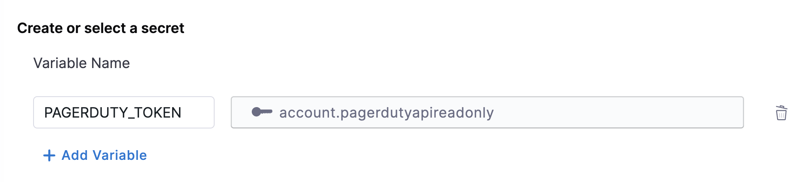
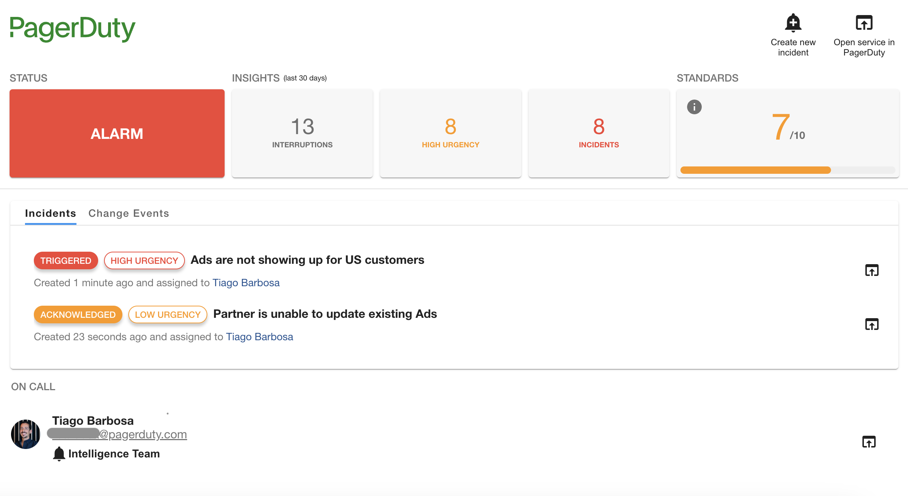

| Plugin details |                                                                                |
| -------------- | ------------------------------------------------------------------------------ |
| **Created by** | Spotify                                                                        |
| **Category**   | Monitoring                                                                     |
| **Source**     | [GitHub](https://github.com/PagerDuty/backstage-plugin) |
| **Type**       | Open-source plugin                                                             |

## Configuration

### Application configuration YAML

_No action required_

This plugin requires a backend proxy configuration to make calls to PagerDuty with authentication. The following configuration is set by default and you do not need to change anything:

```yaml
proxy:
  "/pagerduty":
    target: https://api.pagerduty.com
    pathRewrite:
      "api/proxy/pagerduty/?": "/"
    headers:
      Authorization: Token token=${PAGERDUTY_TOKEN}
```

### Secrets

Since the `PAGERDUTY_TOKEN` variable is used in the application configuration, you must generate a PagerDuty API key and set it as the value of `PAGERDUTY_TOKEN`. For instructions on how to create a PagerDuty API integration, [read the instructions](https://pagerduty.github.io/backstage-plugin-docs/getting-started/pagerduty/#generate-a-general-access-rest-api-token).



### Delegate proxy

_No action required_

This plugin does not require a delegate proxy to be set up because PagerDuty is publicly accessible.

## Layout

This plugin exports a UI card that you can show on the **Overview** tab of a service or any other layout page. Go to **Admin** > **Layout**, select **Service** in the dropdown menu, and then add the following in the **Overview** section:

```yaml
- component: EntityPagerDutyCard
```

You can also make the card appear conditionally for services (only if PagerDuty is configured for the service) by replacing the card with a switch case, as follows:

```yaml
- component: EntitySwitch
  specs:
    cases:
      - if: isPagerDutyAvailable
        content:
          component: EntityPagerDutyCard
```



## Annotations

To configure the plugin for a service in the software catalog, set one of the following annotations in its `catalog-info.yaml` definition file.

The following configuration is recommended:

```yaml
metadata:
  annotations:
    pagerduty.com/integration-key: [INTEGRATION_KEY]
```

The following configuration is an alternative:

```yaml
metadata:
  annotations:
    pagerduty.com/service-id: [SERVICE_ID]
```

[Read more](https://pagerduty.github.io/backstage-plugin-docs/getting-started/backstage/#annotating-entities)

## Support

The plugin is currently owned by PagerDuty and managed in the [PagerDuty repository](https://github.com/PagerDuty/backstage-plugin) as an open-source project. Create a GitHub issue to report bugs or suggest new features for the plugin.
