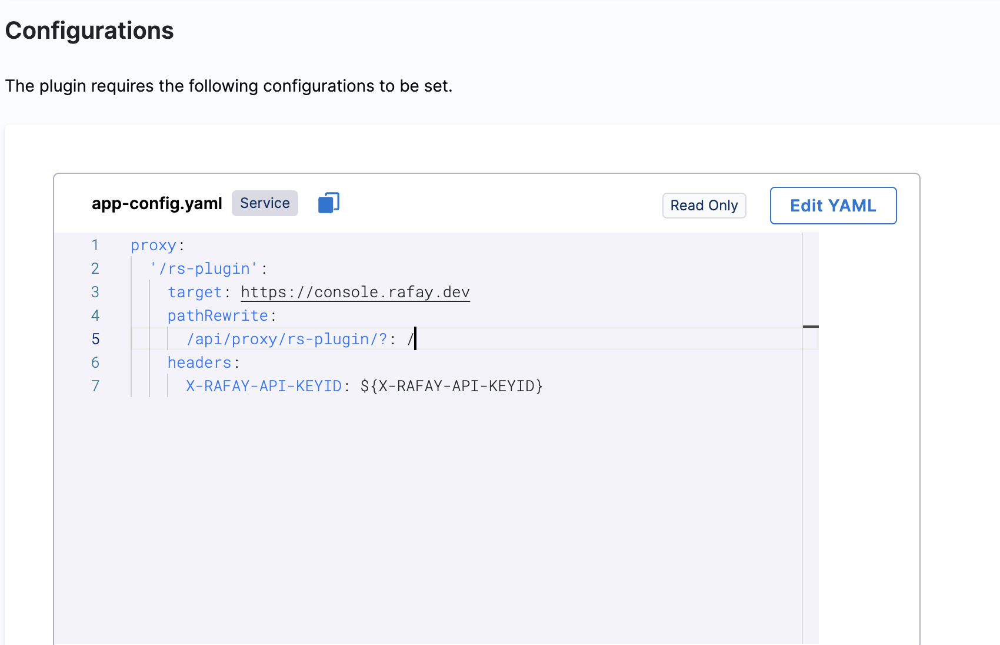

| Plugin details |                                                                                 |
| -------------- | ------------------------------------------------------------------------------- |
| **Created by** | Rafay Systems                                                                         |
| **Category**   | Monitoring                                                                      |
| **Source**     | [GitHub](https://docs.rafay.co/backstage/overview/#backstage-plugin) |
| **Type**       | Open-source plugin                                                              |

## Configuration

### Application configuration YAML


```yaml
proxy:
  '/rs-plugin':
    target: <rafay_console_url>
    pathRewrite:
      /api/proxy/rs-plugin/?: /
    headers:
      X-RAFAY-API-KEYID: ${X-RAFAY-API-KEYID}
```

In the above YAML, replace `<rafay_console_url>` with the real console url eg.,`https://console.rafay.dev` .



### Secrets

Since the `X-RAFAY-API-KEYID` variable is used in the application configuration, you must generate a RAFAY API key and set it as the value of variable `X-RAFAY-API-KEYID`. For information about how to generate a API key, go to the [instructions](https://docs.rafay.co/security/rbac/users/#api-keys).


### Delegate proxy

If the target cluster is on a private network, ensure that you include the host portion of the cluster's base URL in this section. If the cluster is not on a private network, skip this section.

After adding the host, you can select one or more delegates that have access to the host. If you leave the delegate selectors field empty, it is assumed that all delegates in the account have access to the host/cluster.

:::note

When adding the host, include only the host name. Remove the protocol (HTTP/HTTPS) and any port number associated with it.

:::


## Layout

This plugin exports new cards under overview tab for a service or for any other layout page. These are auto-ingested and you can view them under **Admin** > **Layout**, select **Service** in the dropdown menu. 

```yaml
        - component: EntitySwitch
          specs:
            cases:
              - if: isRafayPluginEntityTypeNamespace
                content:
                  component: EntityNamespaceInfo
                  specs:
                    gridProps:
                      md: 6
        - component: EntitySwitch
          specs:
            cases:
              - if: isRafayPluginEntityTypeNamespace
                content:
                  component: EntityNamespacePodList
                  specs:
                    gridProps:
                      md: 6
        - component: EntitySwitch
          specs:
            cases:
              - if: isRafayPluginEntityTypeWorkload
                content:
                  component: EntityWorkloadInfo
                  specs:
                    gridProps:
                      md: 6
        - component: EntitySwitch
          specs:
            cases:
              - if: isRafayPluginEntityTypeWorkload
                content:
                  component: EntityWorkloadPodList
                  specs:
                    gridProps:
                      md: 6
        - component: EntitySwitch
          specs:
            cases:
              - if: isRafayPluginEntityTypeCluster
                content:
                  component: EntityClusterInfo
                  specs:
                    gridProps:
                      md: 6
        - component: EntitySwitch
          specs:
            cases:
              - if: isRafayPluginEntityTypeCluster
                content:
                  component: EntityClusterNamespaceList
                  specs:
                    gridProps:
                      md: 6
        - component: EntitySwitch
          specs:
            cases:
              - if: isRafayPluginEntityTypeCluster
                content:
                  component: EntityClusterPodList
                  specs:
                    gridProps:
                      md: 6
```


## Support

The plugin is owned by Rafay Systems and managed in the public [npm package](https://www.npmjs.com/package/@rafaysystems/backstage-plugin-rafay/v/0.1.9?activeTab=code). Reach out to [Rafay Systems](https://docs.rafay.co/) to report bugs or suggest new features for the plugin.
