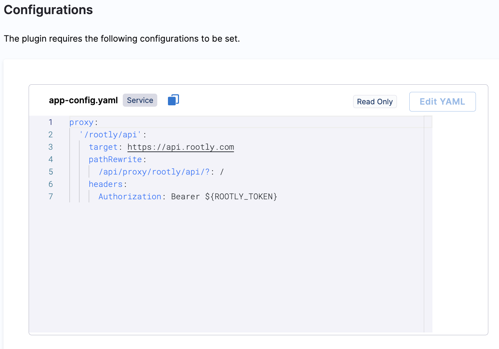
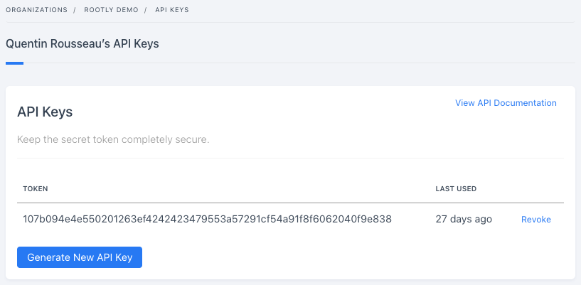

| Plugin details |                                                                                |
| -------------- | ------------------------------------------------------------------------------ |
| **Created by** | [rootly](https://rootly.com/)                                                      |
| **Category**   | Monitoring                                                                        |
| **Source**     | [GitHub](https://github.com/rootlyhq/backstage-plugin) |
| **Type**       | Open-source plugin                                                             |


## Configuration

### Application configuration YAML

- Under the **Plugins** tab in **Admin**, go to `app-config.yaml` and **Edit YAML** to configure the proxy endpoint and allow the frontend to authenticate with Rootly without exposing your API key to users.



### Secrets

### Creating an Rootly API key

Because of the features provided by the plugin, an API key with full access to your Rootly domain is required.

- Read access on services is needed to list services, write access to link entities to services.
- Read access on incidents needed to list incidents.

1. Go to **Profile** -> **Manage API Keys**.

2. Click on **Generate New API Key** button.

3. Copy the key.




## Layout

This plugin exports a page, a tab and a UI card that you can show on the **Overview** tab of a service or any other layout page.  The following configuration is set by default in **Layout** under **Admin** for **Service** and you do not need to change anything:

```yaml
- component: RootlyOverviewCard
          specs:
            gridProps:
              md: 6
- name: RootlyIncidentsPage
    path: /rootly
    title: Rootly
    contents:
    - component: RootlyIncidentsPage
```


## Annotations

To configure the plugin for a service in the software catalog, set one of the following annotations in its `catalog-info.yaml` definition file.

The following configuration is recommended:

```yaml
rootly.com/service-id: 7a328a08-6701-445e-a1ad-ca2fb913ed1e # Use service-id or service-slug. Not both.
rootly.com/service-slug: elasticsearch-staging # Use service-id or service-slug. Not both.
rootly.com/service-auto-import: enabled # This will auto import the entity as a rootly service if we don't find any.
```

[Read more](https://github.com/rootlyhq/backstage-plugin?tab=readme-ov-file#annotations)

## Support

The plugin is owned by Rootly and managed in the [repository](https://github.com/rootlyhq/backstage-plugin) as an open-source project. Create a GitHub issue to report bugs or suggest new features for the plugin.
