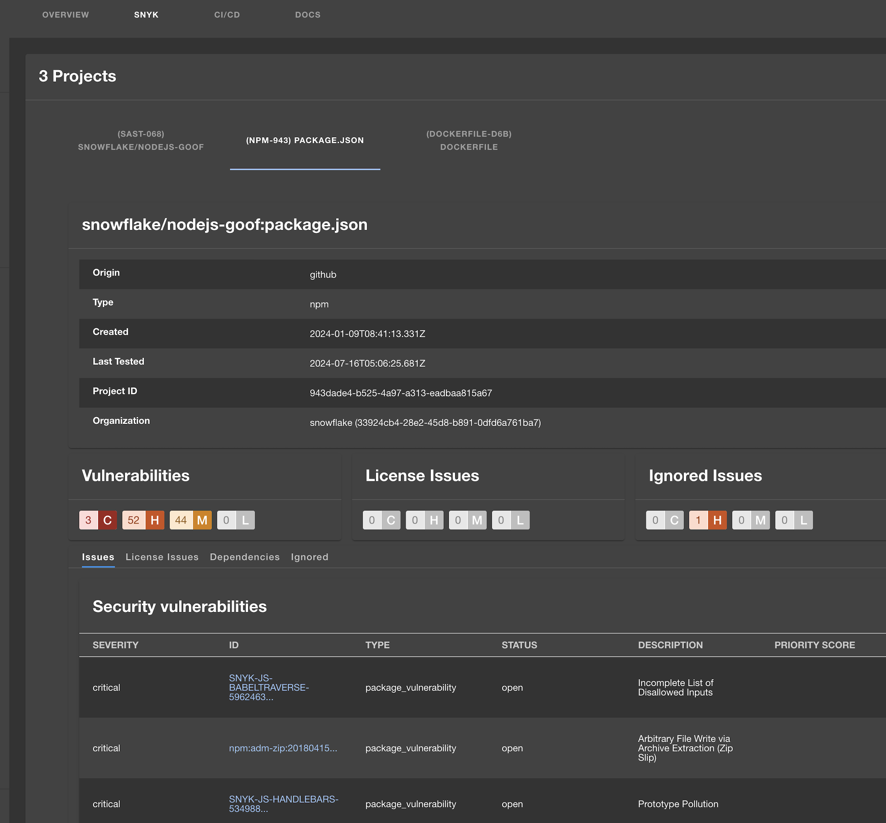

| Plugin details |                                                                                |
| -------------- | ------------------------------------------------------------------------------ |
| **Created by** | [Snyk Tech Services ](https://snyk.io/)                                                      |
| **Category**   | Security                                                                        |
| **Source**     | [GitHub](https://github.com/snyk-tech-services/backstage-plugin-snyk/tree/main) |
| **Type**       | Open-source plugin                                                             |


## Configuration

### Application configuration YAML

_No action required_

This plugin requires a backend proxy configuration to make calls to Snyk with authentication. The following configuration is set by default and you do not need to change anything:

```yaml
proxy:
  endpoints:
    '/snyk':
      target: https://api.snyk.io/
      pathRewrite:
        api/proxy/snyk/?: /
      headers:
        User-Agent: tech-services/backstage-plugin/1.x
        Authorization: ${SNYK_TOKEN}
```

### Secrets

- Obtain your Snyk token (a service account with Viewer permission at your group level is preferred) 

- **Create secret in Harness** to store API token, click on “New Secret Text” and enter values as shown below.


### Delegate proxy

- If Snyk is behind a firewall, `snyk.mycompany.io` will not be accessible from outside, so a delegate proxy has to be selected. Please ensure you have [Harness Delegate installed](https://developer.harness.io/docs/platform/delegates/install-delegates/overview) for the same. 

## Layout

_No action required_

This plugin exports a UI card that you can show on the **Overview** tab of a service or any other layout page as well as a tab.  The following configuration is set by default in **Layout** under **Admin** for **Service** and you do not need to change anything:

```yaml
...
- component: EntitySnykContent
...

- component: EntitySwitch
  specs:
    cases:
      - if: isSnykAvailable
        content:
          component: SnykOverview

```



## Annotations

To configure the plugin for a service in the software catalog, set one of the following annotations in its `catalog-info.yaml` definition file.

1. Add one of the following annotations to your entities:

- `snyk.io/org-id`: The ID of the Snyk organization where your project is located. You can find the ID in the Organization Settings in the Snyk dashboard.
- `snyk.io/org-ids`: Specify one or more Snyk organization IDs, comma-separated. This will try to find any targets or projects in any of the organizations. snyk.io/org-id is ignored when this annotation is set.

2. Then add one or more of the following annotations to your entities:

- `snyk.io/target-id`: Specify a single target by name or ID. Using the target ID will avoid an API call and be faster. Use this [API endpoint](https://apidocs.snyk.io/?version=2023-06-19%7Ebeta#get-/orgs/-org_id-/targets) to get the Target IDs.
- `snyk.io/targets`: Specify one or more targets by name or ID. Using the target ID will avoid an API call and be faster. Use this [API endpoint](https://apidocs.snyk.io/?version=2023-06-19%7Ebeta#get-/orgs/-org_id-/targets) to get the Target IDs.
- `snyk.io/project-ids`: The project ID (see slug in URL or ID in project settings). If there are multiple projects (e.g., multiple package.json or pom files), add them comma-separated.
- `snyk.io/exclude-project-ids`: Exclude specific projects you might not want.

```yaml
...
metadata:
  name: goof
  description: Goof
  annotations:
    snyk.io/org-id: 361fd3c0-41d4-4ea4-ba77-09bb17890967
    snyk.io/targets: Snyk Demo/java-goof,508d2263-ea8a-4e42-bc9d-844de21f4172
    snyk.io/target-id: aarlaud-snyk/github-stats
    snyk.io/project-ids: 7439e322-f9c1-4c42-8367-002b33b9d946,db066cb9-b373-46da-b918-b49b541e0d63
    snyk.io/exclude-project-ids: 4737fc9c-3894-40ba-9dc5-aa8ae658c9f6,38e02916-0cf7-4927-ba98-06afae9fef36
...
```

[More Examples can be found here](https://github.com/snyk-tech-services/backstage-plugin-snyk/tree/develop/test/fixtures)

## Support

The plugin is owned by [Snyk Tech Services](https://snyk.io/) and managed in the [Backstage repository](https://github.com/snyk-tech-services/backstage-plugin-snyk) as an open-source project. Create a GitHub issue to report bugs or suggest new features for the plugin.
