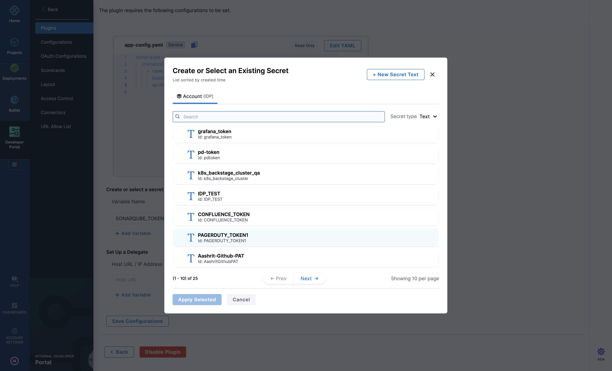

| Plugin details |                                                                                |
| -------------- | ------------------------------------------------------------------------------ |
| **Created by** | [SDA SE](https://sda.se/)                                                      |
| **Category**   | Quality                                                                        |
| **Source**     | [GitHub](https://github.com/backstage/community-plugins/tree/main/workspaces/sonarqube/plugins/sonarqube#sonarqube-plugin) |
| **Type**       | Open-source plugin                                                             |


## Configuration

### Application configuration YAML

- Under the **Plugins** tab in **Admin**, go to `app-config.yaml` and **Edit YAML** to configure your SonarQube instance in the **target** field.


### Secrets

- Go to SonarQube, "eg: `https://sonar.your-comapny-name.io/account/security`", for generating a new token, **Enter Token Name** and choose **User Token** in **Select Token Type**. 


- **Create secret in Harness** to store API token, click on “New Secret Text” and enter values as shown below.



### Delegate proxy

- If SonarQube is deployed on-prem, `sonar.mycompany.com` will not be accessible from outside, so a delegate proxy has to be selected. Please ensure you have [Harness Delegate installed](https://developer.harness.io/docs/platform/delegates/install-delegates/overview) for the same. 


## Layout

This plugin exports a UI card that you can show on the **Overview** tab of a service or any other layout page.  The following configuration is set by default in **Layout** under **Admin** for **Service** and you do not need to change anything:

```yaml
- component: EntitySonarQubeCard
          specs:
            gridProps:
              md: 6
```


## Annotations

To configure the plugin for a service in the software catalog, set one of the following annotations in its `catalog-info.yaml` definition file.

The following configuration is recommended:

```yaml
metadata:
  annotations:
    sonarqube.org/project-key: <instance-name>/<project-key>
```

[Read more](https://github.com/backstage/community-plugins/tree/main/workspaces/sonarqube/plugins/sonarqube#sonarqube-plugin)

## Support

The plugin is owned by SDA SE and managed in the [Backstage repository](https://github.com/backstage/community-plugins/tree/main/workspaces/sonarqube/plugins) as an open-source project. Create a GitHub issue to report bugs or suggest new features for the plugin.
