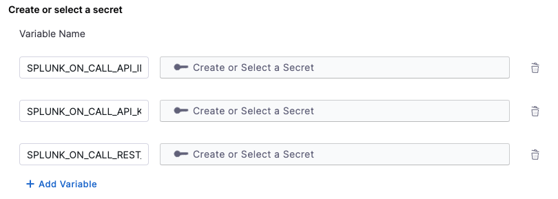
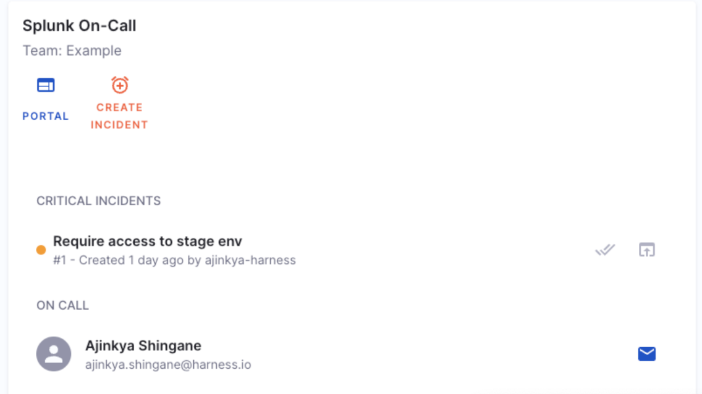

| Plugin details |                                                                                |
| -------------- | ------------------------------------------------------------------------------ |
| **Created by** | Splunk On-Call                                                                 |
| **Category**   | Monitoring                                                                     |
| **Source**     | [GitHub](https://github.com/backstage/community-plugins/tree/main/workspaces/splunk/plugins/splunk-on-call#splunk-on-call) |
| **Type**       | Open-source plugin                                                             |

## Configuration

### Application configuration YAML

_No action required_

This plugin requires a backend proxy configuration to make calls to PagerDuty with authentication. The following configuration is set by default and you do not need to change anything:

```YAML
proxy:
endpoints:
  '/splunk-on-call':
    target: https://api.victorops.com/api-public
    pathRewrite:
      api/proxy/splunk-on-call/?: /
    headers:
      X-VO-Api-Id: ${SPLUNK_ON_CALL_API_ID}
      X-VO-Api-Key: ${SPLUNK_ON_CALL_API_KEY}
    # prohibit the `/splunk-on-call` proxy endpoint from servicing non-GET requests
    allowedMethods: ['GET']
splunkOnCall:
  eventsRestEndpoint: ${SPLUNK_ON_CALL_REST_ENDPOINT}
```

### Secrets

Since the `SPLUNK_ON_CALL_API_ID` and `SPLUNK_ON_CALL_API_KEY` variable is used in the application configuration, you must generate a Splunk API key and add the secrets. For instructions on how to create a  API ID and an API Key, [read the instructions](https://help.victorops.com/knowledge-base/api/). You also need to provide a REST Endpoint as `SPLUNK_ON_CALL_REST_ENDPOINT` , to enable the REST Endpoint integration, go on https://portal.victorops.com/ inside Integrations > 3rd Party Integrations > REST – Generic. You can now copy the URL to notify: `<SPLUNK_ON_CALL_REST_ENDPOINT>/$routing_key`




- To be able to use the REST Endpoint seen above, you must have created a routing key with the same name as the provided team.

- You can create a new routing key on https://portal.victorops.com/ by going to Settings > Routing Keys.

- You can read [Create & Manage Alert Routing Keys](https://help.victorops.com/knowledge-base/routing-keys/#routing-key-tips-tricks) for further information.

### Delegate proxy

_No action required_

This plugin does not require a delegate proxy to be set up because Splunk On-call endpoint is publicly accessible though the routing keys.  

## Layout

_No action required_

This plugin exports a UI card that you can show on the **Overview** tab of a service or any other layout page. Go to **Admin** > **Layout**, select **Service** in the dropdown menu, and you'll find following in the **Overview** section:

```yaml
- component: EntitySplunkOnCallCard
```

You can also make the card appear conditionally for services (only if PagerDuty is configured for the service) by replacing the card with a switch case, as follows:

```yaml
- component: EntitySwitch
  specs:
    cases:
      - if: isSplunkOnCallAvailable
        content:
          component: EntitySplunkOnCallCard
```



## Annotations

The information displayed for each entity is based on either an associated team name or an associated routing key.

To use this plugin for an entity, the entity must be labeled with either a `splunk.com/on-call-team` or a `splunk.com/on-call-routing-key` annotation.

To configure the plugin for a service in the software catalog, set one of the following annotations in its `catalog-info.yaml` definition file.

For example, by specifying a `splunk.com/on-call-team`, the plugin displays Splunk On-Call data associated with the specified team:

```YAML
annotations:
  splunk.com/on-call-team: <SPLUNK_ON_CALL_TEAM_NAME>
```

Alternatively, by specifying a `splunk.com/on-call-routing-key`, the plugin displays Splunk On-Call data associated with each of the teams associated with the specified routing key:

```YAML
annotations:
  splunk.com/on-call-routing-key: <SPLUNK_ON_CALL_ROUTING_KEY>
```

## Support

The plugin is currently owned by Backstage community and managed in the [Community Plugins](https://github.com/backstage/community-plugins/tree/main/workspaces/splunk/plugins/splunk-on-call#splunk-on-call) as an open-source project. Create a GitHub issue to report bugs or suggest new features for the plugin.
