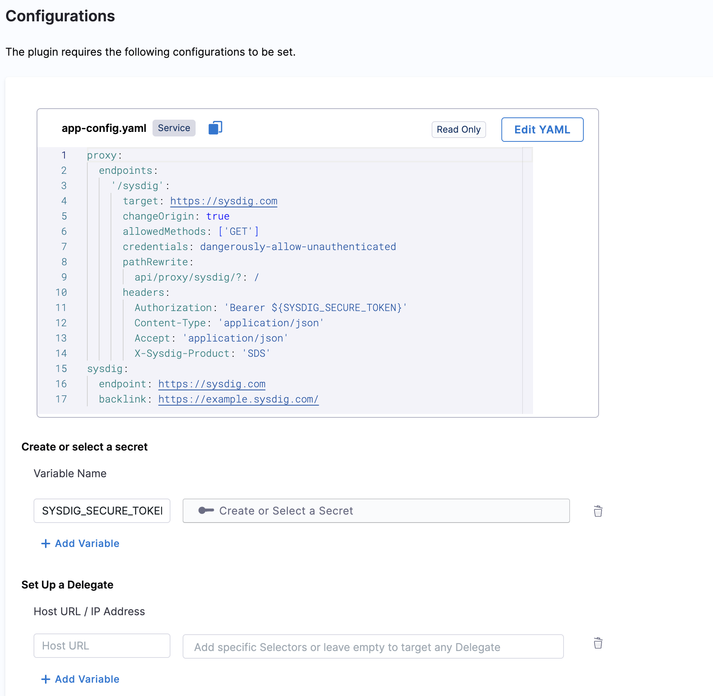
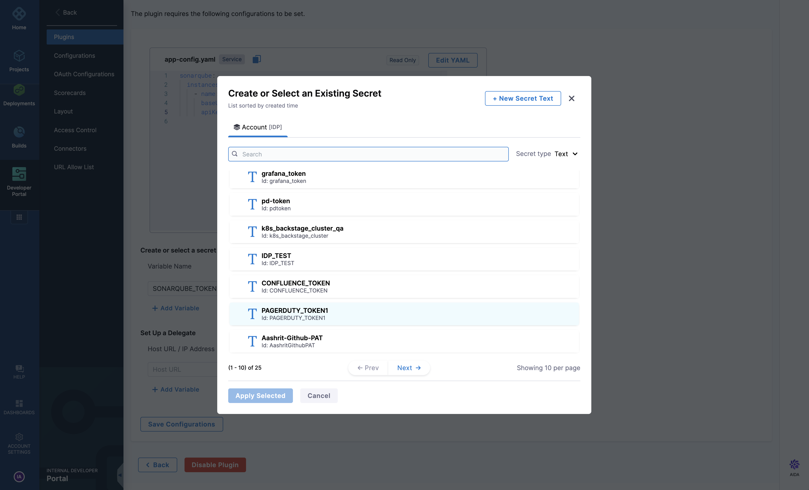
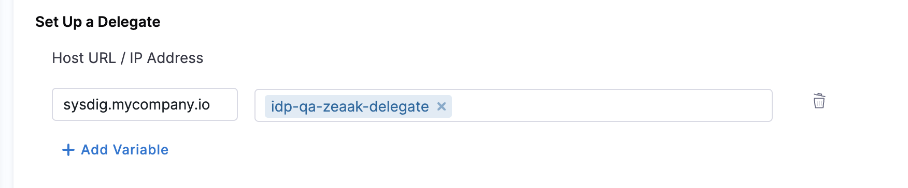
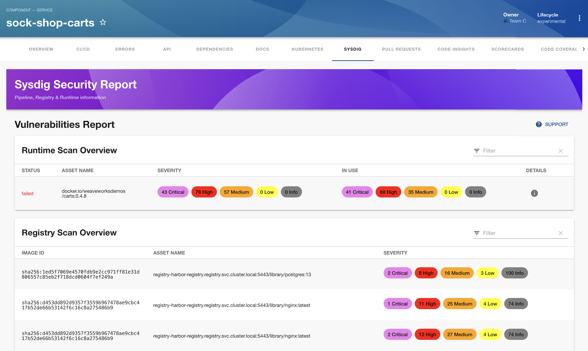
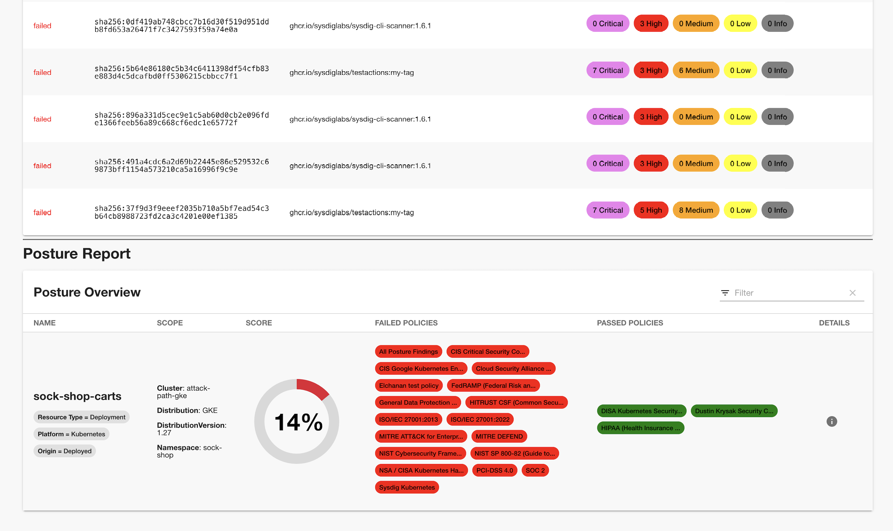

| Plugin details |                                                                                |
| -------------- | ------------------------------------------------------------------------------ |
| **Created by** | [Sysdig](https://sysdig.com/)                                                  |
| **Category**   | Security                                                                       |
| **Source**     | [GitHub](https://github.com/sysdiglabs/backstage-plugin-sysdig)                |
| **Type**       | Open-source plugin                                                             |


## Configuration

### Application configuration YAML

- Under the **Plugins** tab in **Admin**, go to `app-config.yaml` and **Edit YAML** to configure your [Sysdig Secure Endpoint (region for SaaS)](https://docs.sysdig.com/en/docs/administration/saas-regions-and-ip-ranges/) in the **target** field.



### Secrets

- **Create secret in Harness** to store API token, click on “New Secret Text” and enter values to your Sysdig Secure API Token to set `SYSDIG_SECURE_TOKEN` as shown below.



### Delegate proxy

- If your Sysdig instance is behind a firewall, e.g.,`sysdig.mycompany.com` will not be accessible directly from Harness SaaS clusters, a delegate proxy has to be setup. Please ensure you have [Harness Delegate installed](https://developer.harness.io/docs/platform/delegates/install-delegates/overview) for the same. 



## Layout

This plugin exports a tab that you can show under the **Sysdig** tab for  a service. The following configuration is set by default in **Layout** under **Admin** for **Catalog Entities -> Service** and you do not need to change anything:

```YAML
- name: Sysdig
  path: /sysdig
  title: Sysdig
  contents:
    - component: SysdigPage
```




## Annotations

To configure the plugin for a service in the software catalog, set one of the following annotations in its `catalog-info.yaml` definition file.

Be aware that not all annotations mentioned below are needed, the different reports may or may not work depending on which information is provided. For example, to get Registry scanning results, you will need to annotate the corresponding services with registry data.

```YAML
## Example catalog-info.yaml
apiVersion: backstage.io/v1alpha1
kind: Component
metadata:
  name: sock-shop-carts
  annotations:
    # VM Runtime
    sysdigcloud.com/kubernetes-cluster-name: sock-shop-cluster
    sysdigcloud.com/kubernetes-namespace-name: sock-shop
    sysdigcloud.com/kubernetes-workload-name: sock-shop-carts
    sysdigcloud.com/kubernetes-workload-type: deployment

    # VM Registry
    sysdigcloud.com/registry-vendor: harbor
    sysdigcloud.com/registry-name: registry-harbor-registry.registry.svc.cluster.local:5443

    # VM Pipeline
    sysdigcloud.com/image-freetext: ghcr.io/sysdiglabs
    
    # Posture
    sysdigcloud.com/resource-name: sock-shop-carts
    sysdigcloud.com/resource-type: "Deployment"
  description: |
    This is the Sock shop service that keeps track of socks pairs to be purchased.
spec:
  type: service
  lifecycle: experimental
  owner: team-c
  system: sock-shop
  dependsOn:
    - component:default/sock-shop-carts-db
```

[Read more](https://github.com/sysdiglabs/backstage-plugin-sysdig/blob/main/src/lib/annotations.ts)

## Support

The plugin is owned by Sysdig and managed in the [Backstage repository](https://github.com/sysdiglabs/backstage-plugin-sysdig) as an open-source project. Create a GitHub issue to report bugs or suggest new features for the plugin.
