<DocsTag  backgroundColor= "#cbe2f9" text="Tutorial"  textColor="#0b5cad"  />

:::info

This feature is in **BETA** and is available behind the feature flag `IDP_ENABLE_CUSTOM_PLUGINS`. If you want to try out this feature, please reach out to the IDP team. We would love to work with you and take feedback.

:::

<DocVideo src="https://www.youtube.com/embed/6ab9xQY7kSE?si=zbG2ZUnZZQNJrlfS"/>

## Introduction

In IDP we allow addition of, backstage frontend plugins, created by you as a custom plugin. Following are the step-by-step instructions to add your custom plugins in IDP.

1. Go to **Plugins** under **Admin** section.
2. Now you could find the **Custom Plugins** tab on the **Plugins** page.
3. Start by creating a **New Custom Plugin**

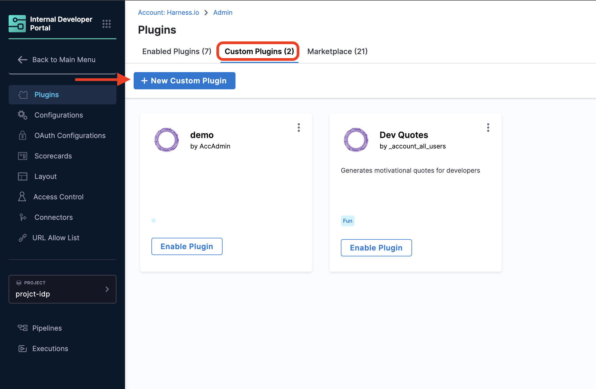

:::info

As the feature is in beta we don't have proper error handling in place yet, so for all the steps below please make sure all your entires are correct for the plugin.

:::


## Add/Upload a New Plugin

import Tabs from '@theme/Tabs';
import TabItem from '@theme/TabItem';

<Tabs>
<TabItem value="NPM Library">

4. Now add the URL for your plugin **public** npm package.

eg,. `https://www.npmjs.com/package/@parsifal-m/plugin-dev-quotes-homepage`, `https://www.npmjs.com/package/backstage-plugin-should-i-deploy`

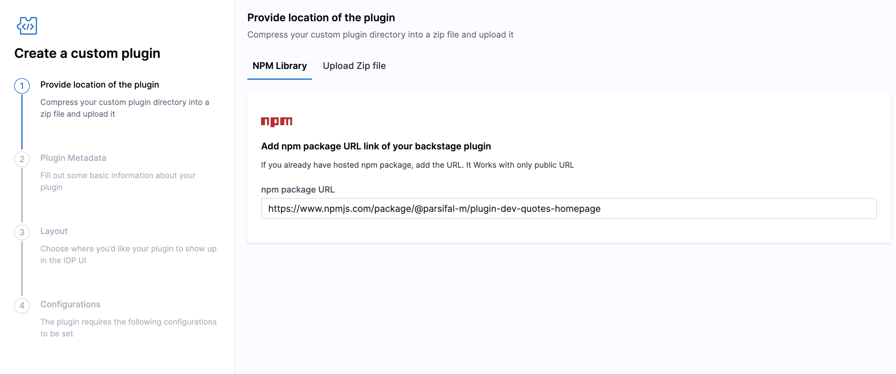

</TabItem>
<TabItem value="Upload Zip file">

4. You can as well pack your backstage frontend plugins using **[yarn pack](https://classic.yarnpkg.com/lang/en/docs/cli/pack/#toc-yarn-pack)** and upload the resulting `package.tgz` file

:::warning

Only files packaged using `yarn pack` is to be used while uploading the zip file. 

:::

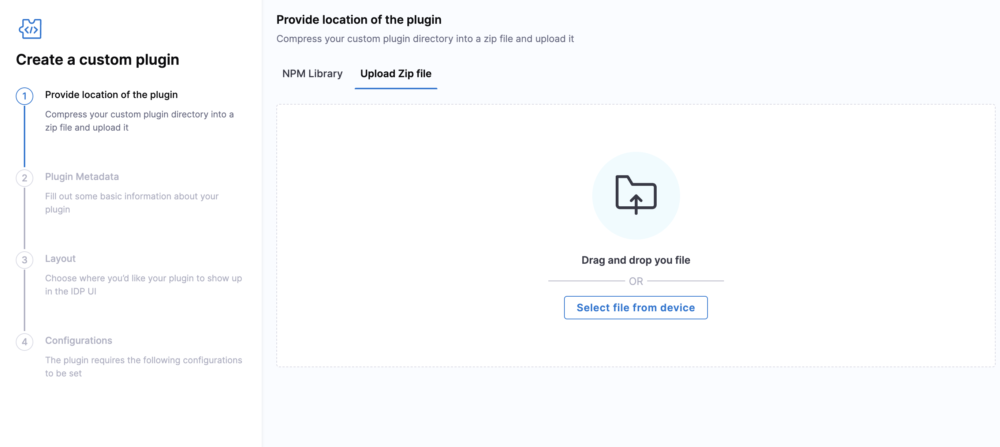

<details open>
<summary>How to create and pack your front end Plugin</summary>
    
1. Install backstage following this [documentation](https://backstage.io/docs/getting-started/#create-your-backstage-app) 
2. Give your app a name.
3. Now `cd <your-app-name>`.
4. Now create a scaffolder for frontend plugin using `yarn new --select plugin`
5. You now have a plugin with the following folder structure.

```sh
new-plugin/
    dev/
        index.ts
    node_modules/
    src/
        components/
            ExampleComponent/
                ExampleComponent.test.tsx
                ExampleComponent.tsx
                index.ts
            ExampleFetchComponent/
                ExampleFetchComponent.test.tsx
                ExampleFetchComponent.tsx
                index.ts
        index.ts
        plugin.test.ts
        plugin.ts
        routes.ts
        setupTests.ts
    .eslintrc.js
    package.json
    README.md
```

6. Follow the steps mentioned [here](https://backstage.io/docs/plugins/plugin-development) to build on top of it. 
7. Once you have the plugin ready, run `yarn tsc` at the root of the backstage app.
8. **Now cd into your plugin directory and run `yarn build` followed by `yarn pack`. You'll have a `package.tgz` file generated, this file could be used to upload your plugin into IDP.** 

Make sure you have the `dist` folder generated after you do `yarn pack` without that the package can't be read by IDP when uploaded. The `yarn pack` command looks something like this.

```sh
dev % yarn build
dev % yarn pack 
➤ YN0036: Calling the "prepack" lifecycle script
➤ YN0000: LICENSE
➤ YN0000: README.md
➤ YN0000: dist/index.d.ts
➤ YN0000: dist/index.esm.js
➤ YN0000: dist/index.esm.js.map
➤ YN0000: package.json
➤ YN0036: Calling the "postpack" lifecycle script
➤ YN0000: Package archive generated in /Users/deba/Documents/backstage-dev-quotes/package.tgz
➤ YN0000: Done in 2s 341ms
```

Unzip the `package.tgz` and check for the **dist** folder before you try uploading it into Harness. The unzipped folder for the above given example plugin folder structure would look something like this:

```sh
new-plugin/
    dev/
        index.ts
    node_modules/
    dist/
        index.d.ts
        index.esm.js
        index.esm.js.map
    src/
        components/
            ExampleComponent/
                ExampleComponent.test.tsx
                ExampleComponent.tsx
                index.ts
            ExampleFetchComponent/
                ExampleFetchComponent.test.tsx
                ExampleFetchComponent.tsx
                index.ts
        index.ts
        plugin.test.ts
        plugin.ts
        routes.ts
        setupTests.ts
    .eslintrc.js
    package.json
    README.md
```

</details>

</TabItem>
</Tabs>

## Plugin Metadata

5. Now Click Next and start adding the **Plugin Metadata**. You have to fill the following fields 
    
    - **Plugin Name** : Add a name for your Plugin
    - **Package name** : This will be same as your plugin package present in your plugin's `package.json` file. Make sure the name is exactly similar to what's mentioned in the `package.json` including `@`, e.g.: `@parsifal-m/plugin-dev-quotes-homepage`
    - **Description** : Add an apt description for your plugin, especially the function of the plugin.
    - **Category** : Add an functional category for your plugin like `Monitoring`, `Observability`, `CI/CD` etc.
    - **Created By** : Add the [User Group](https://developer.harness.io/docs/platform/role-based-access-control/add-user-groups/#built-in-user-groups) you belong to from the dropdown. 
    - **Plugin applies to entity** : Add the software components to which your plugin applies to usually it's **Service**. 
    - **Add Plugin Screenshots (optional)** : Not available yet
    - **Additional fields** : Fill it as shown in the image below. 
    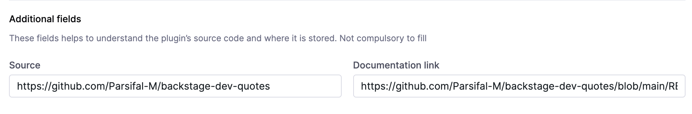

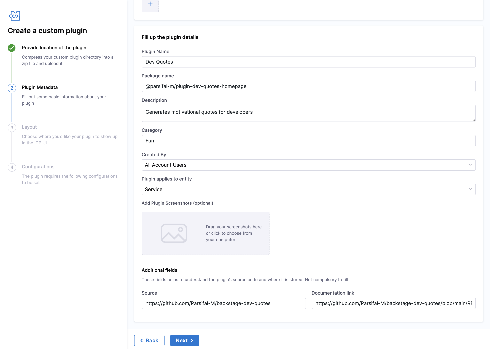

## Layout

6. Now click next and Add **Layout** for your plugin. You have 3 categories in this and the layout is sourced from `packages/app/src/components/Catalog/EntityPage.tsx`. Below are the examples.

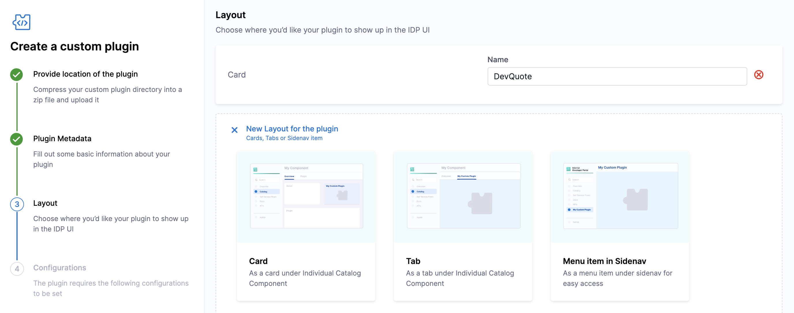

- **Card**: Here's an [example](https://github.com/harness/backstage-plugins/blob/cd70f9c03ed52917d8f409c2ceb7b7fc874c97de/packages/app/src/components/catalog/EntityPage.tsx#L192) `EntityLinksCard` of Links card on **Overview** page.

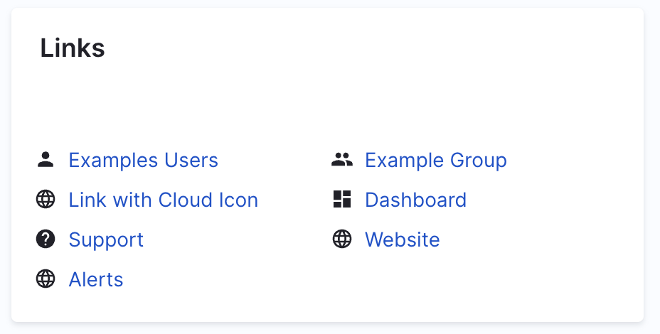

- **Tab**: Here's an [example](https://github.com/harness/backstage-plugins/blob/cd70f9c03ed52917d8f409c2ceb7b7fc874c97de/packages/app/src/components/catalog/EntityPage.tsx#L87) `EntityHarnessCiCdContent` of Harness CI/CD tab. 

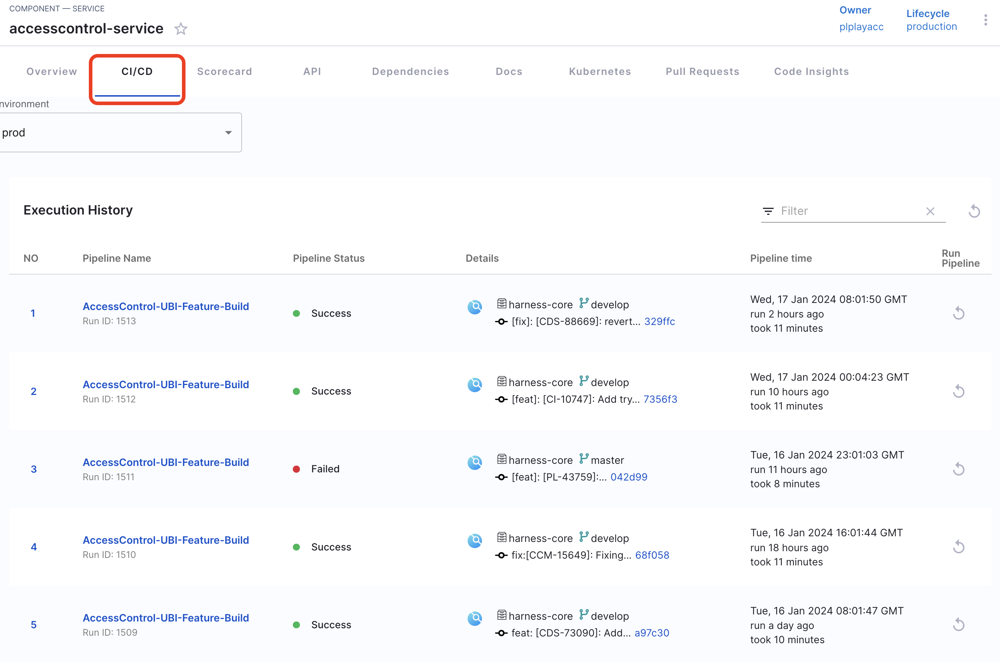

- **Menu Item in SideNav**: Here's an example of TODO plugin in side nav. 
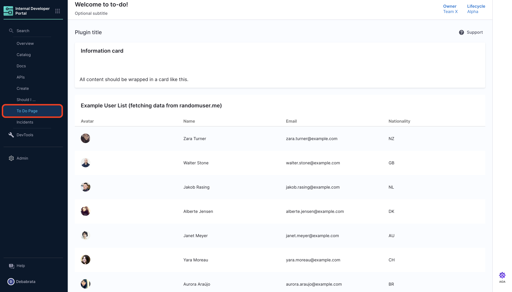

- **Conditional**: Here's an [example](https://github.com/harness/backstage-plugins/blob/cd70f9c03ed52917d8f409c2ceb7b7fc874c97de/packages/app/src/components/catalog/EntityPage.tsx#L86C33-L86C33) of the Harness CI/CD plugin, also conditional is required if you want to check for the annotations in `catalog-info.yaml` in case of absence of adequate annotation required the plugin won't show up for the particular software component. 

## Configurations

7. Now Click Next and go to the Configurations Page by default configuration is disabled.

8. If your plugin doesn't require any configuration settings like **Proxy** or authentication for **API** you can go ahead and enable the plugin directly. 

9. If you require `app-config.yaml` for your plugin, then **enable configuration**. 

10. Now add the proxy part here, as given below in the example,

```YAML
proxy:
    endpoints: 
        /mynewplugin:
        target: https://somerandomapi.com/api/v2
        pathRewrite:
            /api/proxy/mynewplugin/?: /
        headers:
            Authorization: "Api-Token ${SECRET_TOKEN}"
```

Suppose this is the proxy configuration we define in our frontend proxy plugin:

```YAML
endpoints:
    /github-api:
        target: https://api.github.com
        pathRewrite:
            /api/proxy/github-api/?: /
        headers:
            Authorization: token ${PROXY_GITHUB_TOKEN}
```
This configuration creates a proxy endpoint in IDP.
- `target` defines the destination server where the request will be proxies.
- `pathRewrite` is used to remove or replace parts of the path in the request URL.
When a request is made to `https://idp.harness.io/{ACCOUNT_ID}/idp/api/proxy/github-api/<path>`, the following happens:
1. The target setting modifies the base URL, transforming `https://idp.harness.io/{ACCOUNT_ID}/idp/api/proxy/github-api/<path>` into `https://api.github.com/api/proxy/github-api/<path>`.
2. `pathRewrite` replaces `/api/proxy/github-api/` with `/`, so the URL transforms from `https://api.github.com/api/proxy/github-api/<path>` to `https://api.github.com/<path>`.

11. Now in the above proxy authorization is added as a variable `SECRET_TOKEN` and the secret is stored in Harness Secret manager. 

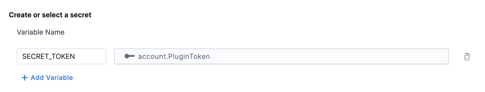

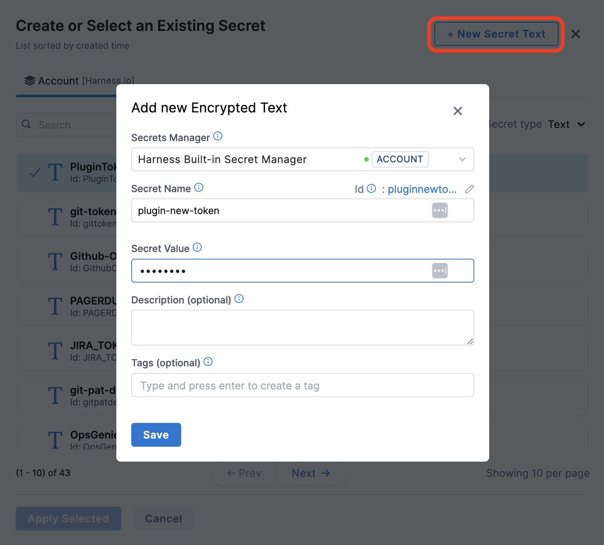

12. You can as well access any private URLs/PORT if required by your plugin and that is behind any firewalls using [Harness Delegate](https://developer.harness.io/docs/platform/delegates/delegate-concepts/delegate-overview/#install-a-delegate).

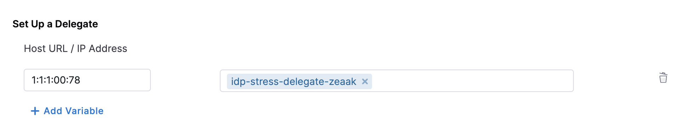

13. Now Enable the Plugin.

:::info

Once you enable the Plugin it will approximately take around 30 minutes for the plugin to be enabled as we rebuild the IDP image with your plugin. 

:::

14. Once the plugin is Enabled, to add it in your Sidenav as shown in the image go to the **Layout** under **Admin**.


15. For **card based plugin** update for **Service** under the `overview` and add the `components` for the custom plugin under `contents` as shown below.

```YAML
page:
  name: EntityLayout
  tabs:
    - name: Overview
      path: /
      title: Overview
      contents:
        - component: EntityOrphanWarning
        - component: EntityProcessingErrorsPanel
        - component: EntityAboutCard
          specs:
            props:
              variant: gridItem
            gridProps:
              md: 6
```
- For **tab** based plugin you can update the `component` name under **Service** or any other pages. 

- For **Full Page Plugin** Under the **Sidenav** configuration, add the plugin name as a `SidebarItem` with reference to your plugin `to: component name` under `props`. Read more about [Configuring Layout of IDP Catalog pages](Configuring Layout of IDP Catalog pages). 

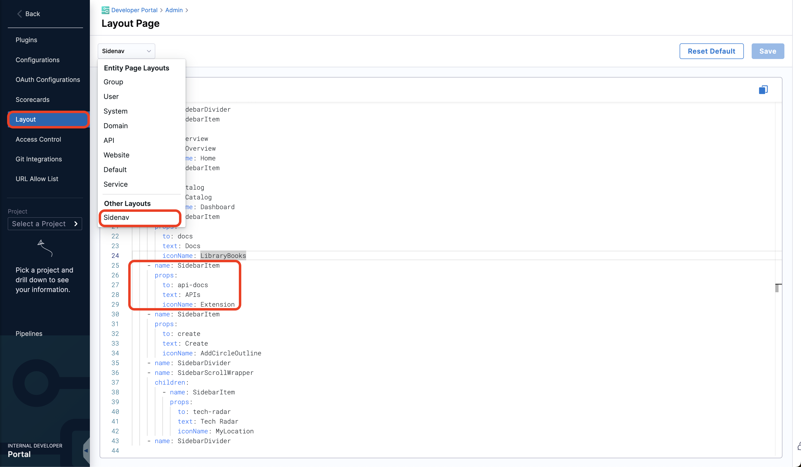


## Edit/Delete Plugin

Once your Plugin is enabled you can find the plugin under Enabled Plugin tab as well as under Custom Plugin tab with `Enabled` tag, but you can edit or delete plugin only under custom plugins tab. Now click on the 3 dots at top of the Plugin card to edit or delete plugin. 

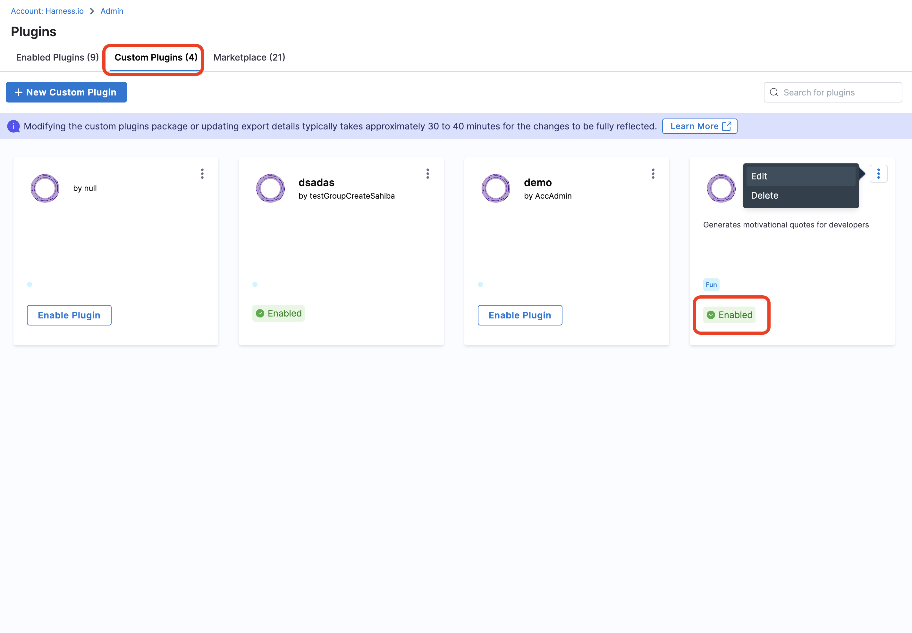