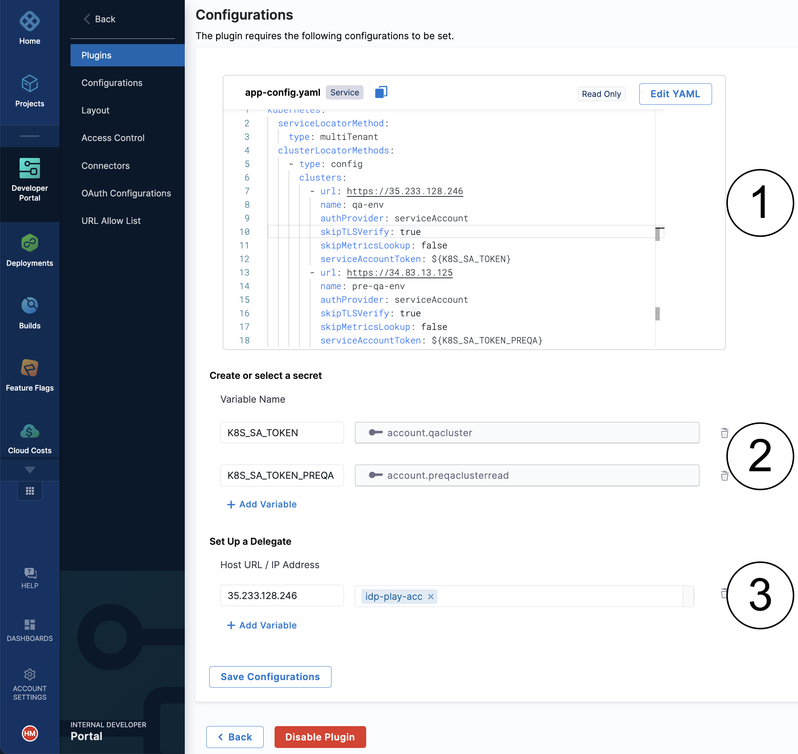

Harness IDP is built on top of the [Backstage plugin architecture](https://backstage.io/docs/plugins/) and supports a curated list of plugins. Plugins are often used to show additional metadata about a software component on the software catalog. For example, plugins show information about CI/CD pipelines, alerts, incidents, and project status. The curated list of plugins is a subset of publicly available [Backstage plugins](https://backstage.io/plugins). We are constantly adding new plugins from the marketplace and building new plugins of our own. Coming later this year, you will have the option to build a custom plugin and make IDP even more personal for your organization.

## Configuration

A typical plugin in IDP is configured using the options described in this section.

### Application configuration YAML

An application configuration is a YAML-driven way of configuring a plugin's behavior, and it is stored in a file named app-config.yaml. The application configuration file is mostly used to define how a frontend-only plugin makes authenticated calls to a third-party provider. Most plugins _do not require you to change anything_ in their configuration files.

### Secrets

A plugin configuration allows you to define variables whose values are secrets. The variables can be used in the application configuration YAML file. The secret is usually an API key for the third-party provider that the plugin supports. Any secret variable defined as `${}` in the application configuration YAML file must have a corresponding secret value defined. The secrets configured in IDP are stored in the Harness platform's built-in secret manager.

:::note
The secret variables in IDP must be globally unique across all plugins. This requirement ensures that you can reuse one plugin's secret variable in another plugin's configuration. However, we recommend redefining variables that are required by a plugin for the benefit of other users.
:::

### (Optional) Delegate proxy

Plugins that support publicly-accessible third-party providers can connect with the provider directly. However, some plugins, such as the Kubernetes plugin, require access to systems that are hosted in your private network. Such plugins require [Harness delegates](/docs/first-gen/firstgen-platform/account/manage-delegates/delegate-installation), which serve as an HTTP proxy to connect to services running in your private network. In the configuration of the plugin, you can specify a host or IP address and choose which delegate to use when making requests.

## FAQs

**What plugins are available in Harness IDP?**

See the [list of curated plugins](/docs/category/available-plugins).

**A plugin is available in the Backstage marketplace but not in Harness IDP. Can we file a request to add the plugin to IDP?**

We are happy to expand our curated plugins list as requested by our customers. Let us know about the plugin and we'll be happy to make it available for you.

**We are looking for a plugin that is not present in the Backstage marketplace. What are our options?**

1. Go to [plugin ideas](https://github.com/backstage/backstage/issues?q=is%3Aopen+is%3Aissue+label%3Aplugin) by the Backstage community and check whether a request already exists. If not, you can [create one](https://github.com/backstage/backstage/issues/new?assignees=&labels=plugin&projects=&template=plugin.yaml&title=%F0%9F%94%8C+Plugin%3A+%3Ctitle%3E).
2. You can build a new Backstage plugin and publish it on the marketplace. Start [here](https://backstage.io/docs/plugins/create-a-plugin) and search for "how to create a Backstage plugin".
3. (Coming soon) You can build a custom plugin and use it in Harness IDP, without making the source public.
