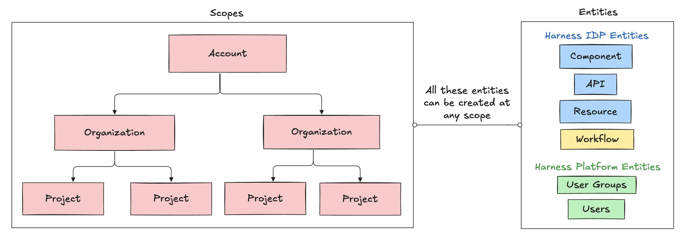

**IDP 2.0** introduces granular RBAC across different IDP resources like Catalog, Workflows, etc., which means you can now control who can view or edit your IDP resources. **Role-based access control (RBAC)** lets you define who can access your resources and what actions they can perform on them. With this, Harness IDP introduces **scope-aware permissions** aligned with Harness Projects, Organizations, and Account.

To learn more about the entities, permissions, and different scopes we've introduced with IDP 2.0, please refer to the [Data Model](/docs/internal-developer-portal/catalog/data-model.md) here. To learn more about configuring Harness RBAC, visit [Configure RBAC in Harness](https://developer.harness.io/docs/platform/role-based-access-control/rbac-in-harness#configure-rbac-in-harness).

## Scopes

IDP 2.0 follows a three-level hierarchical structure. The three levels, or scopes, are **Account**, **Organization**, and **Project**. IDP resources can be explicitly created at any of these scopes. Learn more about the [Harness platform hierarchy](https://developer.harness.io/docs/platform/get-started/key-concepts/#account).

You can configure permissions at each scope. This helps delegate responsibilities across teams and enables efficient organization and management of resources by providing granular access control that is flexible, scalable, and easy to manage.

### Account Scope

The **Account Scope** is the highest level. It represents your Harness account and encompasses all resources within your subscription. Resources created at the account scope are accessible platform-wide. Permissions for resources created at this level can be configured using granular RBAC and shared across user groups.

### Organization Scope

The **Organization Scope** includes related projects, resources, and users within a specific domain or business unit. It provides a way to create and manage resources specific to a particular organization, separate from other areas within the account. Resources created at the organization scope are scoped to the org that owns them but can also be shared using granular RBAC.

### Project Scope

The **Project Scope** includes resources for a specific team or initiative. It enables the creation and management of resources specific to a particular project, distinct from the broader organization and account. Resources created at this scope are only accessible within that project and are scoped to the teams that own them.

## Permissions & Resources

All IDP resources can exist at different scopes, but their permissions and access levels depend on the RBAC settings you apply. With granular RBAC, you can use predefined roles or define custom roles with specific permissions and organize them into reusable resource groups. These permissions are fully aligned with the existing Harness RBAC framework.

With IDP 2.0, you can create resources at any scope: **Account**, **Org**, or **Project**. Here's how resources, permissions, and scopes are linked in IDP 2.0:

| **Resource**   | **Permissions**                                                           | **Account Scope** | **Org Scope** | **Project Scope** | **Notes**                                                                                          |
| -------------- | ------------------------------------------------------------------------- | ----------------- | ------------- | ----------------- | -------------------------------------------------------------------------------------------------- |
| **Catalog**    | <ul><li>View</li><li>Create/Edit</li><li>Delete</li></ul>                 | ✅                 | ✅             | ✅                 | Core catalog entities (**Component, API, Resource**) can be created and managed across all scopes. |
| **Workflows**  | <ul><li>View</li><li>Create/Edit</li><li>Delete</li><li>Execute</li></ul> | ✅                 | ✅             | ✅                 | Workflows can be created, managed, and executed across all scopes.                                 |
| **Scorecards** | <ul><li>View</li><li>Create/Edit</li><li>Delete</li></ul>                 | ✅                 | ❌             | ❌                 | Supported only at the Account scope currently. Org/Project support is planned.                     |
| **Layouts**    | <ul><li>View</li><li>Create/Edit</li></ul>                                | ✅                 | ❌             | ❌                 | Supported only at the Account scope. Org/Project scope support is planned.                         |
| **Plugins**    | <ul><li>View</li><li>Create/Edit</li><li>Toggle</li><li>Delete</li></ul>  | ✅                 | ❌             | ❌                 | Plugins can be created and configured only at the Account scope.                                   |

You can configure RBAC for each resource with different permissions and create reusable resource groups to apply those permissions. Learn more about [Platform RBAC](https://developer.harness.io/docs/platform/role-based-access-control/rbac-in-harness/).

## RBAC Components

IDP 2.0 utilizes Platform Hierarchy and RBAC to provide fine-grained control over IDP resources. There are three [key components](https://developer.harness.io/docs/platform/role-based-access-control/rbac-in-harness/#rbac-components) for Harness RBAC:

* **Principals** – Entities that take action within the system. Includes users, user groups, and service accounts.
* **Resource Groups** – Define which objects can be acted upon (e.g., organizations, projects, pipelines, connectors, users, etc.).
* **Roles** – Define what actions can be taken on those objects (e.g., view, create, edit, delete).

As IDP 2.0 introduces granular control over resources, you can assign [roles (with specific permissions) and resource groups (with specific access)](https://developer.harness.io/docs/platform/role-based-access-control/rbac-in-harness/#role-binding) to principals.

### Principals: User Groups & Users

In Harness IDP, **principals** refer to entities that take action in the system — namely, **User Groups** and **Users**. You assign permissions and access to IDP resources via roles and resource groups applied to these principals.

Permissions define **what actions** a principal can take.
Access defines **which objects** they can act on.

All user groups and users are also registered as Catalog entities, and can be viewed within the Catalog.

**Principals** include:

* [**Users**](https://developer.harness.io/docs/platform/role-based-access-control/add-users): Individual users in Harness. A user can belong to multiple user groups. Roles and resource groups can be assigned directly to users, or inherited from their user groups. Learn more about [managing users](https://developer.harness.io/docs/platform/role-based-access-control/add-users).

* [**User Groups**](https://developer.harness.io/docs/platform/role-based-access-control/add-user-groups): Groups containing multiple users. Permissions and access applied to the group are inherited by all members. You can create user groups at any scope. Learn more about [creating user groups](https://developer.harness.io/docs/platform/role-based-access-control/add-user-groups).

### Resource Groups

A **resource group** is a collection of Harness resources a principal can access. These are **scope-specific**, and can be created at the **Account**, **Organization**, or **Project** level.

For example, a group created at the project level will only be available within that project. Resource groups are always assigned alongside roles.

* **Roles** = define actions (permissions)
* **Resource Groups** = define scope (access)

You can include:

* **All Resources** (all items of a specific type)
* **Named Resources** (specific instances)

#### IDP Resource Groups
For IDP, resource groups can include:
* Catalog
* Workflow
* Layouts
* Scorecards
* Integrations
* Plugins
* Advanced Configuration

You can select which resources to include in a group based on the role you want to assign. Harness provides built-in resource groups at every scope, but you can also create custom ones. [Learn more about resource groups](https://developer.harness.io/docs/platform/role-based-access-control/add-resource-groups).

#### Resource Group Scope
Each group also includes **Resource Scope options** that control sub-level access.
For example, a group created at the **Org level** can provide access to:

* All projects within that Org
* Or only selected projects

Note: If a resource group is created at the **Project level**, you **cannot** select Org or Account scopes for it. Learn more about [Scopes and Refinement](https://developer.harness.io/docs/platform/role-based-access-control/add-resource-groups/#scopes-and-refinement).

### Roles

**Roles** are sets of [permissions](https://developer.harness.io/docs/platform/role-based-access-control/permissions-reference) that allow or restrict specific operations on resources. They are applied **along with resource groups** to create effective RBAC policies.

Harness offers predefined roles, and you can also create [custom roles](https://developer.harness.io/docs/platform/role-based-access-control/add-manage-roles#create-a-role) to enforce fine-grained access control. Roles are **scope-specific** and can be created at any scope.

#### IDP Admin Role

Harness IDP provides a predefined role called **IDP Admin**, which grants full permissions across all resources and scopes.

## RBAC Workflow in Harness IDP

To configure RBAC in Harness IDP, follow these steps:

1. Go to your administrative settings and select the desired scope (Account, Org, or Project). Choose the specific Organization or Project where you want to configure RBAC, and navigate to its respective settings.
2. [Create roles](https://developer.harness.io/docs/platform/role-based-access-control/add-manage-roles) with appropriate permissions.
3. [Create resource groups](https://developer.harness.io/docs/platform/role-based-access-control/add-resource-groups) for targeted access control.
4. [Create user groups](https://developer.harness.io/docs/platform/role-based-access-control/add-user-groups) and [add users](https://developer.harness.io/docs/platform/role-based-access-control/add-users).
5. [Assign roles and resource groups](https://developer.harness.io/docs/platform/role-based-access-control/rbac-in-harness#role-binding) to the users or user groups.
6. [Configure authentication](https://developer.harness.io/docs/platform/authentication/authentication-overview), if not already done.

