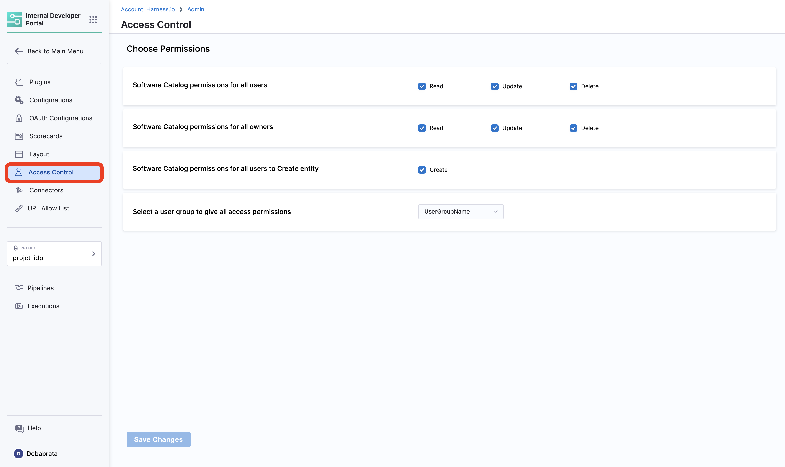
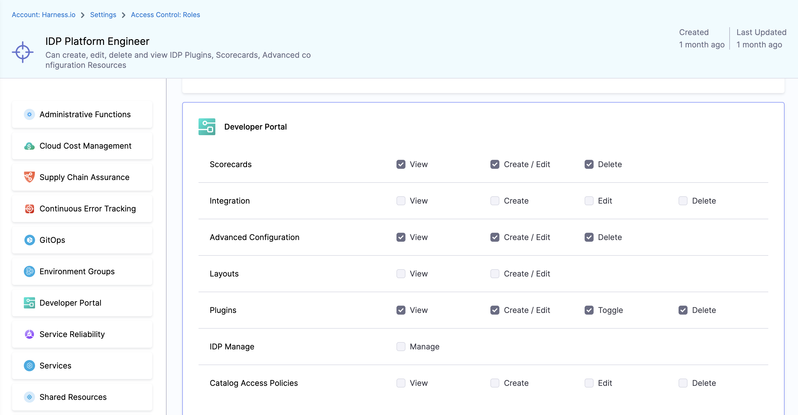
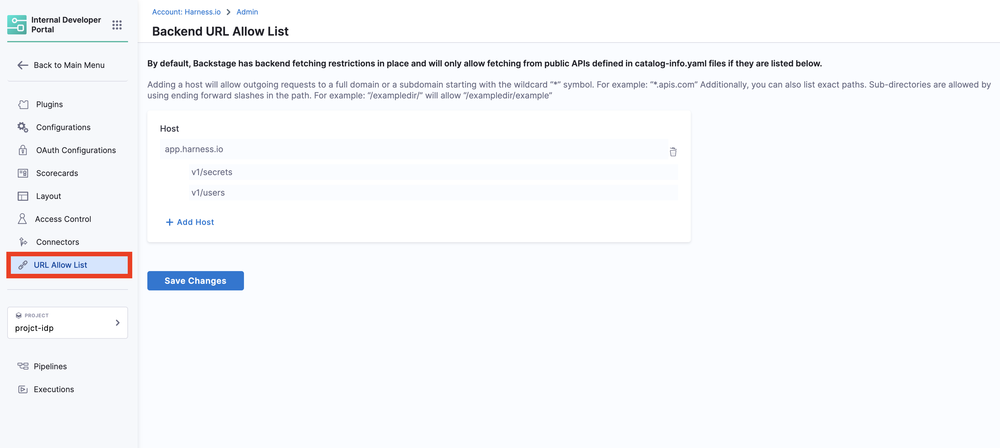

import Tabs from '@theme/Tabs';
import TabItem from '@theme/TabItem';

<Tabs queryString="version">
<TabItem value="IDP 2.0 (New)" label="IDP 2.0 (New)">

:::tip For IDP 2.0 Customers
If you're using Harness IDP 2.0, please ensure you have reviewed the [IDP 2.0 Overview guide](/docs/internal-developer-portal/idp-2o-overview/2-0-overview-and-upgrade-path.md) and are familiar with the key steps for [upgrading to IDP 2.0](/docs/internal-developer-portal/idp-2o-overview/migrating-idp-2o.md). To enable IDP 2.0, you must raise a support ticket to activate the `IDP_2_0` feature flag for your account.
:::

**IDP 2.0** introduces granular RBAC across different IDP resources like Catalog, Workflows, etc., which means you can now control who can view or edit your IDP resources. **Role-based access control (RBAC)** lets you define who can access your resources and what actions they can perform on them. With this, Harness IDP introduces **scope-aware permissions** aligned with Harness Projects, Organizations, and Account.

To learn more about the entities, permissions, and different scopes we've introduced with IDP 2.0, please refer to the [Data Model](/docs/internal-developer-portal/catalog/data-model.md) here. To learn more about configuring Harness RBAC, visit [Configure RBAC in Harness](https://developer.harness.io/docs/platform/role-based-access-control/rbac-in-harness#configure-rbac-in-harness).


## Scopes

IDP 2.0 follows a three-level hierarchical structure. The three levels, or scopes, are **Account**, **Organization**, and **Project**. IDP resources can be explicitly created at any of these scopes. Learn more about the [Harness platform hierarchy](https://developer.harness.io/docs/platform/get-started/key-concepts/#account).

You can configure permissions at each scope. This helps delegate responsibilities across teams and enables efficient organization and management of resources by providing granular access control that is flexible, scalable, and easy to manage.

### Account Scope

The **Account Scope** is the highest level. It represents your Harness account and encompasses all resources within your subscription. Resources created at the account scope are accessible platform-wide. Permissions for resources created at this level can be configured using granular RBAC and shared across user groups.


### Organization Scope

The **Organization Scope** includes related projects, resources, and users within a specific domain or business unit. It provides a way to create and manage resources specific to a particular organization, separate from other areas within the account. Resources created at the organization scope are scoped to the org that owns them but can also be shared using granular RBAC.


### Project Scope

The **Project Scope** includes resources for a specific team or initiative. It enables the creation and management of resources specific to a particular project, distinct from the broader organization and account. Resources created at this scope are only accessible within that project and are scoped to the teams that own them.


## Permissions & Resources

All IDP resources can exist at different scopes, but their permissions and access levels depend on the RBAC settings you apply. With granular RBAC, you can use predefined roles or define custom roles with specific permissions and organize them into reusable resource groups. These permissions are fully aligned with the existing Harness RBAC framework.

With IDP 2.0, you can create resources at any scope: **Account**, **Org**, or **Project**. Here's how resources, permissions, and scopes are linked in IDP 2.0:

| **Resource**   | **Permissions**                                                           | **Account Scope** | **Org Scope** | **Project Scope** | **Notes**                                                                                          |
| -------------- | ------------------------------------------------------------------------- | ----------------- | ------------- | ----------------- | -------------------------------------------------------------------------------------------------- |
| **Catalog**    | <ul><li>View</li><li>Create/Edit</li><li>Delete</li></ul>                 | ✅                 | ✅             | ✅                 | Core catalog entities (**Component, API, Resource**) can be created and managed across all scopes. |
| **Workflows**  | <ul><li>View</li><li>Create/Edit</li><li>Delete</li><li>Execute</li></ul> | ✅                 | ✅             | ✅                 | Workflows can be created, managed, and executed across all scopes.                                 |
| **Scorecards** | <ul><li>View</li><li>Create/Edit</li><li>Delete</li></ul>                 | ✅                 | ❌             | ❌                 | Supported only at the Account scope currently. Org/Project support is planned.                     |
| **Layouts**    | <ul><li>View</li><li>Create/Edit</li></ul>                                | ✅                 | ❌             | ❌                 | Supported only at the Account scope. Org/Project scope support is planned.                         |
| **Plugins**    | <ul><li>View</li><li>Create/Edit</li><li>Toggle</li><li>Delete</li></ul>  | ✅                 | ❌             | ❌                 | Plugins can be created and configured only at the Account scope.                                   |

You can configure RBAC for each resource with different permissions and create reusable resource groups to apply those permissions. Learn more about [Platform RBAC](https://developer.harness.io/docs/platform/role-based-access-control/rbac-in-harness/).


## RBAC Components

IDP 2.0 utilizes Platform Hierarchy and RBAC to provide fine-grained control over IDP resources. There are three [key components](https://developer.harness.io/docs/platform/role-based-access-control/rbac-in-harness/#rbac-components) for Harness RBAC:

* **Principals** – Entities that take action within the system. Includes users, user groups, and service accounts.
* **Resource Groups** – Define which objects can be acted upon (e.g., organizations, projects, pipelines, connectors, users, etc.).
* **Roles** – Define what actions can be taken on those objects (e.g., view, create, edit, delete).

As IDP 2.0 introduces granular control over resources, you can assign [roles (with specific permissions) and resource groups (with specific access)](https://developer.harness.io/docs/platform/role-based-access-control/rbac-in-harness/#role-binding) to principals.


### Principals: User Groups & Users

In Harness IDP, **principals** refer to entities that take action in the system — namely, **User Groups** and **Users**. You assign permissions and access to IDP resources via roles and resource groups applied to these principals.

Permissions define **what actions** a principal can take.
Access defines **which objects** they can act on.

All user groups and users are also registered as Catalog entities, and can be viewed within the Catalog.

**Principals** include:

* [**Users**](https://developer.harness.io/docs/platform/role-based-access-control/add-users): Individual users in Harness. A user can belong to multiple user groups. Roles and resource groups can be assigned directly to users, or inherited from their user groups. Learn more about [managing users](https://developer.harness.io/docs/platform/role-based-access-control/add-users).

* [**User Groups**](https://developer.harness.io/docs/platform/role-based-access-control/add-user-groups): Groups containing multiple users. Permissions and access applied to the group are inherited by all members. You can create user groups at any scope. Learn more about [creating user groups](https://developer.harness.io/docs/platform/role-based-access-control/add-user-groups).


### Resource Groups

A **resource group** is a collection of Harness resources a principal can access. These are **scope-specific**, and can be created at the **Account**, **Organization**, or **Project** level.

For example, a group created at the project level will only be available within that project. Resource groups are always assigned alongside roles.

* **Roles** = define actions (permissions)
* **Resource Groups** = define scope (access)

You can include:

* **All Resources** (all items of a specific type)
* **Named Resources** (specific instances)

#### IDP Resource Groups
For IDP, resource groups can include:
* Catalog
* Workflow
* Layouts
* Scorecards
* Integrations
* Plugins
* Advanced Configuration


You can select which resources to include in a group based on the role you want to assign. Harness provides built-in resource groups at every scope, but you can also create custom ones. [Learn more about resource groups](https://developer.harness.io/docs/platform/role-based-access-control/add-resource-groups).

#### Resource Group Scope
Each group also includes **Resource Scope options** that control sub-level access.
For example, a group created at the **Org level** can provide access to:

* All projects within that Org
* Or only selected projects

Note: If a resource group is created at the **Project level**, you **cannot** select Org or Account scopes for it. Learn more about [Scopes and Refinement](https://developer.harness.io/docs/platform/role-based-access-control/add-resource-groups/#scopes-and-refinement).


### Roles

**Roles** are sets of [permissions](https://developer.harness.io/docs/platform/role-based-access-control/permissions-reference) that allow or restrict specific operations on resources. They are applied **along with resource groups** to create effective RBAC policies.

Harness offers predefined roles, and you can also create [custom roles](https://developer.harness.io/docs/platform/role-based-access-control/add-manage-roles#create-a-role) to enforce fine-grained access control. Roles are **scope-specific** and can be created at any scope.

#### IDP Admin Role

Harness IDP provides a predefined role called **IDP Admin**, which grants full permissions across all resources and scopes.


## RBAC Workflow in Harness IDP

To configure RBAC in Harness IDP, follow these steps:

1. Go to your administrative settings and select the desired scope (Account, Org, or Project). Choose the specific Organization or Project where you want to configure RBAC, and navigate to its respective settings.

2. [Create roles](https://developer.harness.io/docs/platform/role-based-access-control/add-manage-roles) with appropriate permissions.
3. [Create resource groups](https://developer.harness.io/docs/platform/role-based-access-control/add-resource-groups) for targeted access control.
4. [Create user groups](https://developer.harness.io/docs/platform/role-based-access-control/add-user-groups) and [add users](https://developer.harness.io/docs/platform/role-based-access-control/add-users).
5. [Assign roles and resource groups](https://developer.harness.io/docs/platform/role-based-access-control/rbac-in-harness#role-binding) to the users or user groups.
6. [Configure authentication](https://developer.harness.io/docs/platform/authentication/authentication-overview), if not already done.

</TabItem>
<TabItem value="IDP 1.0" label="IDP 1.0">
Role-based access control ([RBAC](https://www.harness.io/blog/rbac)) lets you control who can access your resources and what actions they can perform on the resources. 

## Access Control for Software Catalog

### Edit Access

Every entity in the Software Catalog has a corresponding [`catalog-info.yaml` definition file](https://developer.harness.io/docs/internal-developer-portal/catalog/register-software-component) stored in one of your Git repositories. You can restrict the edit access of the component definition by controlling who has access to the corresponding git repository. Ideally the YAML should live in the same repository as the code base so that the owners working on the application can keep their Catalog YAML up to date.

### View Access

Catalog is central to Harness IDP, and each and every user having access to your account can view the catalog entities. However, you can control the ability to delete the components using the **Catalog Access Policies** as described below.

### Catalog Access Policies

These policies can be used to determine the access on Catalog components based on the Owners. These are available under **Access Control** in side **IDP ADMIN** section.



#### Use cases:

1. In case you want to restrict the creation and management of workflows for a specific user group, you can do so by selecting the specific user group name from the dropdown followed by the disabling the **Create** under **Software Catalog permissions for all users to Create entity**.


### Hide Catalog Entities

Catalog Entities can be hidden from the users, except for the owner user-group by using either one of the `hidden`,`secrets` or `private` tag as shown in the example below.

```YAML
apiVersion: backstage.io/v1alpha1
kind: Component
metadata:
  name: my-new-service
  description: Description of my new service
  tags:
    - hidden
spec:
  type: service
  lifecycle: production
  owner: team-a
```

## Access Control for Self Service Workflows

### View Access

Every user in the account has view access to all the Workflows in IDP. There is an upcoming [feature request](https://developer.harness.io/roadmap/#idp) to remove view access if the user does not have view access of the pipelines configured in the Workflow definition. Although even if the user can view workflows, they will not be able to execute them if they do not have access to the pipeline as described below.

### Execute Access

The permission to execute [IDP Self Service Workflows](https://developer.harness.io/docs/internal-developer-portal/flows/service-onboarding-pipelines) is inherited from the [access to the pipeline](https://developer.harness.io/docs/platform/role-based-access-control/rbac-in-harness/#rbac-workflow-examples) used to configure them. If a user has permissions to `Run` a pipeline then only they can trigger the corresponding IDP Workflow.

### Edit Access

Workflows being a catalog entity has a corresponding `workflow.yaml` or `template.yaml` definition file as well stored in one of your Git repositories. You can restrict the edit access of the workflow definition by controlling who has access to the corresponding Git repository.

### Hide Workflows

You can hide the workflows, suggested using while the workflow is in development phase, by using the same tags used to [hide catalog entities](/docs/internal-developer-portal/rbac/scopes.md#hide-catalog-entities). 

## Managing Pipelines RBAC for Workflows

While creating a Workflow for new service or developer onboarding, that use Harness Pipeline as an orchestrator, you often want everyone added to your account to have the ability to execute the Workflow i.e., run the Harness Pipeline. You also don't want to add every single user individually, especially if you have thousands of users. Using the "Assign Role Bindings" option under **Project Settings → Access Control → User Group** page, you can assign the **[Pipeline Executor role](https://developer.harness.io/docs/platform/role-based-access-control/add-manage-roles/#roles-and-resource-groups-work-together)** to everyone by using default user groups such as All Account Users or All Organization Users, without granting elevated permissions like Pipeline Edit or Pipeline Delete.

If you want to give Pipeline Execute permission only to specific pipelines within your project, you can create a [Resource Group](https://developer.harness.io/docs/platform/role-based-access-control/add-resource-groups/) and assign the role binding only to the Resource Group, rather than all resources.

Here's a video tutorial on the Pipelines RBAC. 

<DocVideo src="https://www.youtube.com/embed/ySVEGtQ2uWU?si=fRL2SeYEP4W4ftqt" />


## Platform Level RBAC 

To do this Harness provides a logical structure comprising of **Account**, **Organization** and **Project** that naturally aligns with how most organizations are structured and **Harness IDP is an Account Level module**.

1. **Account:** Account is the topmost entity that can exercise control and has visibility over the entire platform. It is your Harness account and it encompasses all the resources within your Harness subscription. It provides a way to manage billing, user authentication, and global settings for all the organizations and projects within the account. Users with account-level permissions can manage the account-level settings, including billing, subscription, and SSO configuration. Resources, such as connectors, created at the account scope are available for use in all the organizations and projects within that account.

Before configuring RBAC in Harness IDP, you should have an understanding of:

1. [Role-based access control (RBAC) in Harness](https://developer.harness.io/docs/platform/role-based-access-control/rbac-in-harness)
2. [User and Role Management in the Harness Software Delivery Platform](https://harness.io/blog/continuous-delivery/user-role-management/)

In Harness, RBAC policies are defined using:

1. **Role** – A Role is a set of permissions that allow or deny specific operations on a specific set of resources.

2. **Resource Group** – A Resource Group is a grouping of resources that are managed by the same set of users using the same set of access control policies. Resource Groups can be of two types:

   1. **All Resources** – Groups all resources of a given type.

   2. **Named Resources** – Groups together a specific set of individual resources.

When a **User** or a **User Group** is associated with a **Role** and a **Resource Group**, it provides them the permission as defined in the role to the resources as grouped together in the resource group. You need [these permissions](https://developer.harness.io/docs/platform/role-based-access-control/rbac-in-harness/#required-permissions) to set up RBAC in IDP.


## Roles

Roles are sets of [permissions](https://developer.harness.io/docs/platform/role-based-access-control/permissions-reference) that allow or deny specific operations on objects (resources). Roles are applied together with resource groups to create a complete set of permissions and access.

Harness IDP includes two built-in roles, and you can [create your own custom roles](https://developer.harness.io/docs/platform/role-based-access-control/add-manage-roles/#create-a-role), which are useful for limited and fine-grained access control.

Roles are scope-specific and can be created at only account [scope](https://developer.harness.io/docs/platform/role-based-access-control/rbac-in-harness#permissions-hierarchy-scopes) in Harness IDP.

The two built-in roles are:

### 1. IDP Admin

This role can create, edit, delete and view **all IDP Resources**.


### 2. IDP Platform Engineer [Deprecated]
:::info
This role has been deprecated and is no longer supported.
All associated permissions and resources will continue to exist.
We highly recommend using the **"IDP Admin"** role or creating your own custom roles tailored to your needs.
:::

This role can create, edit, delete and view IDP Plugins, Scorecards, Advanced configuration Resources.



## Available Permissions

### 1. Scorecards

Permissions related to [Scorecards](https://developer.harness.io/docs/category/scorecards), [Checks and Datasources](https://developer.harness.io/docs/internal-developer-portal/scorecards/checks-datasources)


#### 1. View

View Scorecards, Checks and default Datasources

#### 2. Create / Edit

[Create or Edit scorecards](../scorecards/scorecard), as well as add custom checks using datasources.

#### 3. Delete

Delete Scorecards and Checks

### 2. Integration

Permissions related to integrations, like git providers based connectors, in IDP


#### 1. View

View all the connectors setup

#### 2. Create

Create new connectors

#### 3. Edit

Edit the already present connectors, like update the secrets.

#### 4. Delete

Delete IDP Integrations

### 3. Advanced Configuration

Permissions for OAuth and URL Allow List




#### 1. View

View OAuth configured and URL Allow list

#### 2. Create / Edit

Create or Edit Advanced Configurations

#### 3. Delete

Delete IDP Advanced Configurations

### 4. Layouts

Permissions for [Layout Page](https://developer.harness.io/docs/internal-developer-portal/layout-and-appearance/catalog)

#### 1. View

View IDP Layout Configurations

#### 2. Create / Edit

[Add or Edit](http://developer.harness.io/docs/internal-developer-portal/layout-and-appearance/catalog) IDP Layout Configurations

### 5. Plugins

Permissions for [Plugins](https://developer.harness.io/docs/category/plugins)

#### 1. View

View installed and available plugins

#### 2. Create / Edit

Create a custom plugin or Edit configuration of installed IDP plugins

#### 3. Toggle

Enable or Disable an IDP Plugin

#### 4. Delete

Delete a Plugin

</TabItem>
</Tabs>

