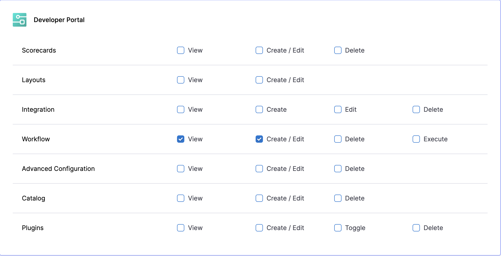

:::info For IDP 1.0 Customers
This RBAC guide is applicable **only to IDP 2.0 customers**, as the RBAC Harness platform hierarchy is available exclusively in IDP 2.0.
* To learn how to upgrade, refer to the [IDP 2.0 Upgrade Guide](/docs/internal-developer-portal/idp-2o-overview/migrating-idp-2o.md).
* If you're using **IDP 1.0** and want to implement access control, please refer to the [Access Control Guide for IDP 1.0](#permissions--resource-scopes).
:::

With the release of **Granular RBAC in IDP 2.0**, you can now control access to **Workflows** in your Harness IDP. This means you can restrict who can **create** and **execute** Workflows across your IDP setup. Workflows can be created at all available scopes: **Account**, **Organization**, or **Project**.
To learn more about permissions and scopes, visit the [IDP 2.0 Data Model](/docs/internal-developer-portal/catalog/data-model.md).

:::tip For IDP 2.0 Customers
If you're using Harness IDP 2.0, please ensure you have reviewed the [IDP 2.0 Overview guide](/docs/internal-developer-portal/idp-2o-overview/2-0-overview-and-upgrade-path.md) and are familiar with the key steps for [upgrading to IDP 2.0](/docs/internal-developer-portal/idp-2o-overview/migrating-idp-2o.md). To enable IDP 2.0, you must raise a support ticket to activate the `IDP_2_0` feature flag for your account.
:::

## RBAC Workflow in Harness IDP

Before configuring RBAC for Workflows, ensure you’ve reviewed the [Scopes](/docs/internal-developer-portal/rbac/scopes#scopes), [Permissions](/docs/internal-developer-portal/rbac/scopes#permissions--resources), and [RBAC Components](/docs/internal-developer-portal/rbac/scopes#rbac-components).

Here’s the step-by-step workflow for configuring RBAC in Harness IDP:

1. Go to your administrative settings and select the scope (**Account**, **Org**, or **Project**) where you want to configure RBAC for Workflows.
2. [Create roles with the required permissions](https://developer.harness.io/docs/platform/role-based-access-control/add-manage-roles).
   *For example: If you want to configure RBAC for Workflow creation, ensure the role includes the **Create/Edit (Workflow)** permission.*
3. [Create resource groups](https://developer.harness.io/docs/platform/role-based-access-control/add-resource-groups) to apply RBAC to a specific set of resources for the principal.
   *For example: To control Workflow access, ensure the **Workflow** resource is added to the resource group.*
4. [Create user groups](https://developer.harness.io/docs/platform/role-based-access-control/add-user-groups) and [add users](https://developer.harness.io/docs/platform/role-based-access-control/add-users).
5. [Assign roles and resource groups](https://developer.harness.io/docs/platform/role-based-access-control/rbac-in-harness#role-binding) to the user groups or users.
6. If not already configured, [set up authentication](https://developer.harness.io/docs/platform/authentication/authentication-overview).

## Permissions for Workflows

The following permissions can be configured for Workflows when creating a custom role:

| **Permission**  | **Description**                                                        |
| --------------- | ---------------------------------------------------------------------- |
| **Create/Edit** | Allows users to create Workflows and modify their configurations.      |
| **View**        | Allows users to view Workflows but not create, modify, or delete them. |
| **Delete**      | Allows users to delete Workflows.                                      |
| **Execute**     | Allows users to execute Workflows.                                     |

These permissions can be configured when [creating or modifying a custom role](https://developer.harness.io/docs/platform/role-based-access-control/add-manage-roles). Choose the permissions that best suit the access level you want to grant.
To learn more, see [Manage Roles](https://developer.harness.io/docs/platform/role-based-access-control/add-manage-roles).

## Workflow RBAC Example

You can access **Administrative Settings** from your Harness UI directly using the sidenavbar. 

<DocVideo src="https://app.tango.us/app/embed/1dcbc9e9-70f4-49e7-bbec-6a2c94c97ae7" title="Create the IDP Catalog Create Role" />

### Configure RBAC for Project-Level Workflow Execution

This example walks through configuring RBAC to allow users to **execute Workflows at a specific project level**.

The configuration includes:

* **Custom Role:** `IDP Workflow Execute`
* **Custom Resource Group:** `All Workflow Execute Resources`
* **Custom User Group:** `Workflow Execute Users`

The **All Workflow Execute Resources** group exists at the **project scope** and grants **Execute** access to all Workflows within that project. The `IDP Workflow Execute` role includes the **Execute** permission for Workflows.

---

#### Step 1: Create the IDP Workflow Execute Role

1. In Harness, navigate to the project where you want to configure RBAC.
2. Go to **Project Settings** → **Roles** under the **Access Control** category.
3. Click **New Role** to create a new role.
4. Name the role **IDP Workflow Execute**. (Description and tags are optional.)
5. Click **Save**.
6. Under **Developer Portal** → **Workflow**, select the **Execute** permission.
7. Click **Apply Changes**.

> Learn more about role creation and permissions: [Manage Roles](https://developer.harness.io/docs/platform/role-based-access-control/add-manage-roles) | [Permissions Reference](https://developer.harness.io/docs/platform/role-based-access-control/permissions-reference/)

---

#### Step 2: Create a custom Resource Group

1. In the same project, go to **Project Settings** → **Resource Groups** under **Access Control**.
2. Click **New Resource Group**.
3. Name the group **All Workflow Execute Resources**. (Select a color; description and tags are optional.)
4. Click **Save**.
5. For **Resource Scope**, select **Project only**.
   *(This restricts access to resources within this project only.)*
6. Under **Resources**, select **Specified**, then choose **Workflow**.
7. Click **Save**.

> If you need to allow Workflow execution at a higher scope (Org or Account), configure the role, resource group, and user group at that higher scope.
> Learn more: [Manage Resource Groups](https://developer.harness.io/docs/platform/role-based-access-control/add-resource-groups)

---

#### Step 3: Create the Workflow Execute Users User Group

1. In the same project, go to **Project Settings** → **User Groups** under **Access Control**.
2. Click **New User Group**.
3. Name the group **Workflow Execute Users**. (Description and tags are optional.)
4. Under **Add Users**, select the users to include.
5. Click **Save**.

> Learn more: [Manage User Groups](https://developer.harness.io/docs/platform/role-based-access-control/add-user-groups) | [Manage Users](https://developer.harness.io/docs/platform/role-based-access-control/add-users)

---

#### Step 4: Assign the Role and Resource Group to the User Group

1. In the same project, go to **Project Settings** → **User Groups**.
2. Find the **Workflow Execute Users** group and click **Manage Roles**.
3. Under **Role Bindings**, click **Add**.
4. For **Role**, select **IDP Workflow Execute**.
5. For **Resource Groups**, select **All Workflow Execute Resources**.
6. Click **Apply**.

> Learn more: [Role Binding](https://developer.harness.io/docs/platform/role-based-access-control/rbac-in-harness/#role-binding)

---

This configuration grants members of the **Workflow Execute Users** group the ability to **execute Workflows** within the selected **project scope** only. To extend this capability across projects or orgs, configure the role and resource group at the appropriate higher scope (Org or Account).