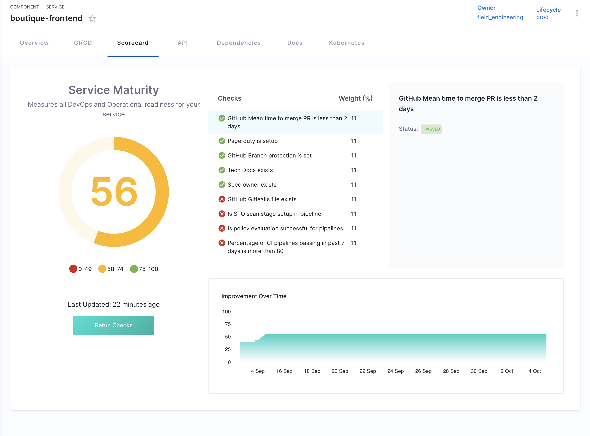

# Introduction to Scorecards

A **Scorecard** in Harness IDP is a set of automated checks applied to software components such as services, libraries, or infrastructure. These checks help teams:

- Enforce engineering standards
- Track maturity or readiness
- Measure compliance and adoption
- Surface gaps in critical areas (e.g., security, reliability, observability)

Overall scorecards play a pivotal role in ensuring software components are developed and utilized while adhering to organizational and industry standards. They provide a quantifiable measure of software maturity and adherence to best practices, thereby aiding developers in enhancing quality and assisting teams in making informed decisions regarding software adoption.

## Scorecard Usage Requirements

Before creating or evaluating Scorecards, the following conditions must be met:

### Component registration in the Software Catalog

Scorecards only apply to components that are registered in the **Harness Software Catalog**. This means:

* The component must have a valid `catalog-info.yaml` descriptor.
* It must be ingested into the Catalog either via auto-discovery or manual registration.
* The component should be of a supported entity type such as `Component`, `Service`, or `Resource`.

Without catalog registration, the Scorecard system cannot associate checks or evaluations with the component.

### Required permissions in IDP

Access to Scorecard functionality is controlled by role-based permissions within Harness IDP. Depending on the user’s responsibilities, the following permissions may be required:

* **Create and edit Scorecards** – typically assigned to platform engineers or administrators responsible for governance and standards.
* **View Scorecard results** – required for developers and team leads to monitor and improve their components.
* **Access data sources** – necessary for defining or customizing checks that rely on external systems (e.g., Git repositories, CI/CD pipelines, monitoring tools).

Lack of appropriate permissions may restrict a user’s ability to create Scorecards, edit checks, or view evaluation results.

## Who Uses Scorecards

Scorecards are used by both platform engineering teams and development teams, with distinct roles and responsibilities.

### Platform teams

Platform teams are typically responsible for the creation and governance of Scorecards. Their responsibilities include:

* Defining Scorecards that align with engineering standards and compliance requirements.
* Creating and managing reusable checks to measure specific criteria (e.g., security, documentation, reliability).
* Configuring data sources and visibility settings.
* Assigning Scorecards to teams, service types, or domains to drive consistency across the organization.

### Developer teams

Development teams consume Scorecards as part of their day-to-day workflows. Their responsibilities include:

* Viewing Scorecard evaluations associated with their services.
* Investigating failed checks and understanding why a component does not meet certain standards.
* Making improvements to pass checks and improve overall service quality.
* Using Scorecards as continuous feedback mechanisms during development, onboarding, or compliance reviews.

Scorecards provide a scalable way to surface actionable insights without requiring manual review processes, helping teams improve service maturity and consistency across environments.

