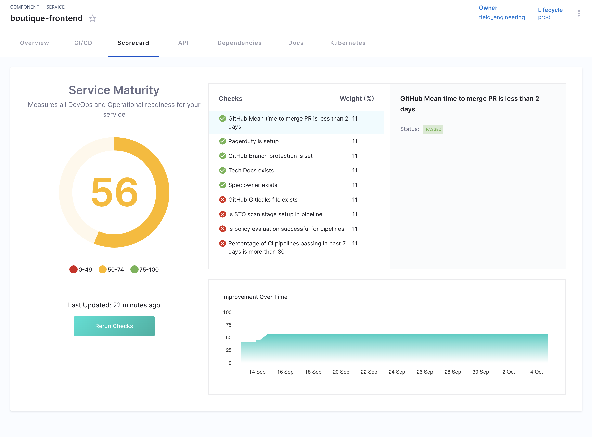

# Scorecards Overview

This document covers the key building blocks of a Scorecard in Harness IDP. A Scorecard is made up of checks. Each check looks at a specific detail about a component—like whether a pipeline passes regularly, or whether required metadata exists. To do this, checks pull data from systems like GitHub, Jenkins, or the IDP Catalog.

A **Scorecard** in Harness IDP is a set of automated checks applied to software components such as services, libraries, or infrastructure. These checks help teams:

- Enforce engineering standards
- Track maturity or readiness
- Measure compliance and adoption
- Surface gaps in critical areas (e.g., security, reliability, observability)

Overall scorecards play a pivotal role in ensuring software components are developed and utilized while adhering to organizational and industry standards. They provide a quantifiable measure of software maturity and adherence to best practices, thereby aiding developers in enhancing quality and assisting teams in making informed decisions regarding software adoption.

## How Scorecards Work

A Scorecard is made up of checks. Each check looks at a specific detail about a component—like whether a pipeline passes regularly, or whether required metadata exists. To do this, checks pull data from systems like GitHub, Jenkins, or the IDP Catalog.

The entire system depends on three things: **data sources**, **checks**, and **Scorecards**.
A **data source** provides raw information about a component (such as tags, file paths, or pipeline metrics).
A **check** uses one data point and applies a condition to decide pass or fail.
A **Scorecard** is just a group of these checks, used to track service quality, readiness, or compliance.

Even though Scorecards and checks define *what* to evaluate, it’s the **data source** that determines *what's possible to evaluate*. If the right data isn’t available, the check won’t work. That’s why reliable, connected data sources are critical—without them, Scorecards can’t provide useful results.

## Scorecard Usage Requirements

Before creating or evaluating Scorecards, the following conditions must be met:

### Component registration in the Software Catalog

Scorecards only apply to components that are registered in the **Harness Software Catalog**. This means:

* The component must have a valid `catalog-info.yaml` descriptor.
* It must be ingested into the Catalog either via auto-discovery or manual registration.
* The component should be of a supported entity type such as `Component`, `Service`, or `Resource`.

Without catalog registration, the Scorecard system cannot associate checks or evaluations with the component.

### Required permissions in IDP

Access to Scorecard functionality is controlled by role-based permissions within Harness IDP. Depending on the user's responsibilities, the following permissions may be required:

* **Create and edit Scorecards** – typically assigned to platform engineers or administrators responsible for governance and standards.
* **View Scorecard results** – required for developers and team leads to monitor and improve their components.
* **Access data sources** – necessary for defining or customizing checks that rely on external systems (e.g., Git repositories, CI/CD pipelines, monitoring tools).

Lack of appropriate permissions may restrict a user's ability to create Scorecards, edit checks, or view evaluation results.

## Components of a Scorecard

A Scorecard in Harness IDP is made up of checks, and each check relies on data from a connected system. Together, these components allow you to automatically evaluate whether a service meets defined standards—like operational readiness, compliance, or platform adoption.

### Scorecard

The Scorecard is the top-level unit that groups checks together. It defines which components it applies to and sets scoring thresholds. Platform teams typically create Scorecards and assign them to components based on filters like type, tag, or ownership.

A Scorecard doesn't run logic itself—it simply organizes and schedules the execution of its checks.

### Checks

A check is a rule that evaluates one specific attribute of a component. It pulls data from a configured source and applies a condition—like comparing a metric to a threshold or checking for the presence of a value.

Each check is made up of:
- A **data source** (e.g., GitHub, Harness CI, Catalog metadata)
- A **data point** from that source (e.g., pipeline success rate, existence of a file)
- A **comparison condition** (e.g., greater than, equals, contains)
- A **target value** to evaluate against

If the condition is met, the check passes. If not, it fails. These checks are reusable and can be included in multiple Scorecards.

### Data Sources

Data sources are systems that expose data about your components. They are the foundation of Scorecard evaluations—if the data isn’t available, the check can't run.

Harness supports both built-in and custom data sources. Built-in examples include:
- **Software Catalog metadata** (annotations, tags, ownership)
- **Source control** platforms like GitHub or GitLab
- **CI/CD systems** like Harness CI or Jenkins
- **Monitoring or incident tools** for operational data

Custom sources can be added to support organization-specific requirements. These might ingest data from internal APIs, JSON files, or scripted ingestion.

> A “data source” provides a collection of data points for a component. A “check” uses a data point to evaluate a condition. A “scorecard” is a collection of such checks.

## Scoring Model

Harness Scorecards use a straightforward scoring framework to evaluate whether components meet defined standards.

### Pass/Fail per Check

Each check issues a **binary result**—pass or fail—based on a single data point (e.g., pipeline success rate, metadata presence). These results are calculated independently and reflect whether each individual rule is satisfied.

### Threshold-based Scoring

Scorecards aggregate the results of multiple checks and apply configured thresholds. You can specify:
- **Minimum passing percentage**, such as requiring at least 80% of checks to pass.
- **Critical checks**, where a failure on any critical check causes the entire Scorecard to fail regardless of overall pass percentage.

These configurations ensure that both broad compliance and specific critical criteria are enforced.

### Visibility Settings & Scheduling

Scorecards support visibility controls and automated execution:

- **Visibility** : Platform teams control where Scorecards appear—such as in the Software Catalog, Developer Home, or Trends Dashboard—and who can see or evaluate them.

- **Scheduling** : Checks run automatically every 12 hours, and the aggregated trends update daily (at 12:00 AM UTC). Users can also trigger manual re-evaluation from the UI.

These settings ensure that Scorecard evaluations remain current and appropriately accessible.

