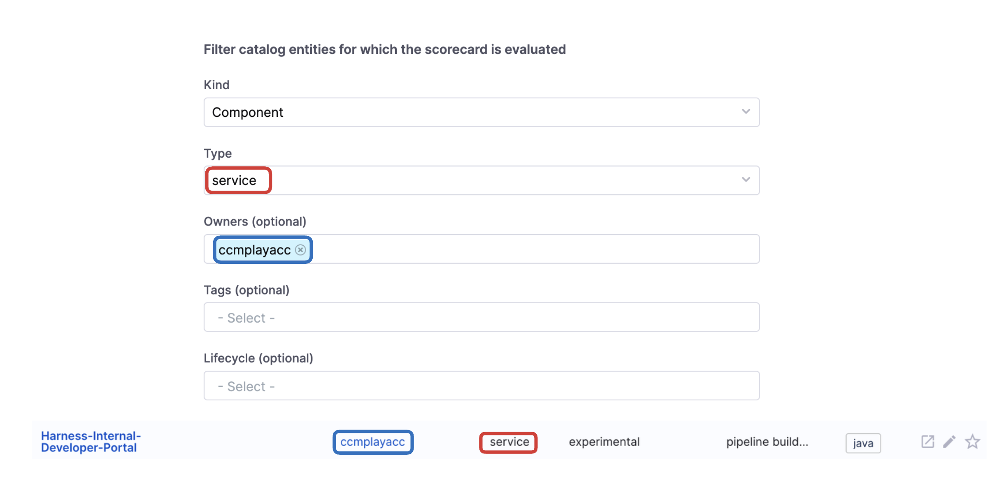
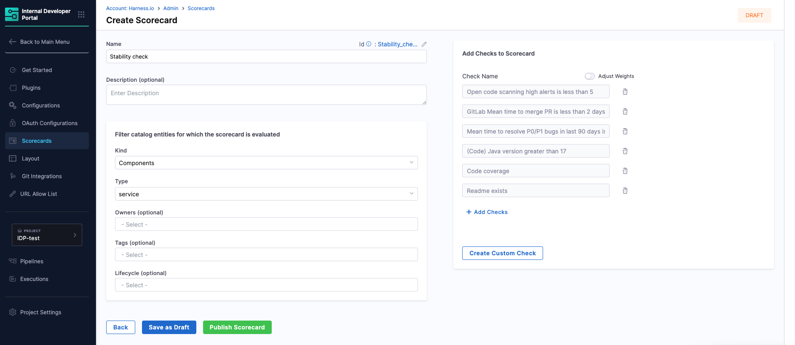
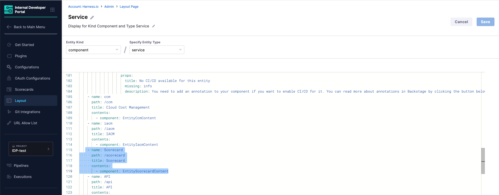

# Create Scorecards

In this document we will see how to create a Scorecard in Harness IDP. Scorecards help measure standards and best practices across your services or components, and the results appear directly within the Software Catalog UI.


## Define Scorecard

<iframe
  src="https://app.tango.us/app/embed/bcd25221-1882-4f02-9aa2-deb178f72e73?skipCover=false&defaultListView=false&skipBranding=false&makeViewOnly=true&hideAuthorAndDetails=false" 
  style={{ minHeight: '640px' }}
  sandbox="allow-scripts allow-top-navigation-by-user-activation allow-popups allow-same-origin"
  security="restricted"
  title="Create and Configure Onboarding Component"
  width="100%"
  height="100%"
  referrerPolicy="strict-origin-when-cross-origin"
  frameBorder="0"
  webkitallowfullscreen="true"
  mozallowfullscreen="true"
  allowFullScreen
/>


To get started, go to **Scorecards → Create Scorecard** in the Admin settings.

You’ll need to enter the following:

- Name (required): The display name for the Scorecard.
- Description (optional): A summary of what this Scorecard evaluates.


### Set Component Filters

You can filter which catalog entities this Scorecard applies to by setting:

- Kind: Defaults to `Component`. Choose based on entity type (e.g., `API`, `System`, etc.).
- Type: Optionally filter by sub-type (e.g., `service`, `website`).
- Owners (optional): Restrict to components owned by specific teams.
- Tags (optional): Filter based on tags such as `tier`, `domain`, or `product`.
- Lifecycle (optional): Limit checks to entities in a specific lifecycle stage (e.g., `production`, `experimental`).

:::caution

Make sure the values under Filter catalog entities for which the scorecard is evaluated should match with your entity "owner" and "type" as shown below, also tags are applied as AND operations so if you select multiple tags make sure all of them are present for the software component you want to compute the score for.


:::


## Add Checks

You can configure your Scorecard using a combination of built-in, reusable, or newly defined custom checks.


### Use Built-in Checks

Built-in checks are predefined by Harness and cover widely applicable best practices. These are useful for quickly enforcing foundational standards across all components.

Examples include:

- `Has TechDocs`
- `Has Owner`
- `OnCall Escalation Defined`
- `Has Scorecard Tab`

To view the full list of available built-in checks and their behavior, refer to [Built-in Checks](./built-in-checks.md).


### Use Reusable Custom Checks

Reusable custom checks are those previously defined and saved. These allow teams to enforce internal policies or platform-specific rules consistently across Scorecards.

Typical use cases include:

- Validating specific annotation values
- Checking integration with external systems (e.g., Snyk, PagerDuty)
- Enforcing tag structures or lifecycle statuses

To learn more about creating or managing custom checks, refer to [Custom Rules and Evaluators](./custom-rules-and-evaluators.md).


### Create a Custom Check Inline

You can define a new custom check directly within the Scorecard creation screen but it will take you to the Create Custom Check Page, so make sure you save the configuration first and then leave . This is useful for defining rules tailored to specific evaluation goals without leaving the workflow.

The custom check definition includes:

- A unique check name and optional description
- Evaluator logic (e.g., expression-based, script-based)
- Parameters for validation (e.g., expected values, field keys)

For details on how to create a new check, refer to [Creating a Custom Check](./creating-custom-checks.md).


## Save as Draft or Publish

Once you’ve configured all fields and added checks, choose to:

- **Save as Draft** – to return and finalize later
- **Publish Scorecard** – to activate the Scorecard and run evaluations immediately

---



---

## Enabling Scorecards in the Catalog

To display Scorecard results directly on Catalog component pages, you need to update the entity layout configuration in IDP Admin.

Scorecard includes two developer-facing UI components:

1. A small **Card** in the **Overview** tab that displays the component’s overall score.
2. A full **Tab** view that shows detailed check results and how the score was calculated.

These views help developers understand compliance and quality without leaving the component page.

<!-- > If your Catalog already displays these components, you can skip this step and proceed to [Create your first scorecard](./creating-a-scorecard.md#create-a-new-scorecard). -->

For reference, the following image shows both components in the Catalog UI:

<DocImage path={require('./static/scorecard-overviewpage.png')} />



#### Add Card and Tab Content for an Entity

Go to the **Layout** section in the IDP Admin area and select the entity kind then go to edit of that entity kind, where you want to enable Scorecards.

#### Add Scorecard Card to the Overview

In the layout YAML, locate the `Overview` tab and add the following under its `component` section:

```yaml
- component: EntityScoreCard
  specs:
    gridProps:
      md: 6
```

This adds a compact score summary card to the entity’s overview page.


#### Add Scorecard Tab

Under the `tabs` section of the layout YAML, add the following:

```yaml
- name: Scorecard
  path: /scorecard
  title: Scorecard
  contents:
    - component: EntityScorecardContent
```

This adds a dedicated **Scorecard** tab, where developers can explore the detailed breakdown of checks and how each score was computed.

