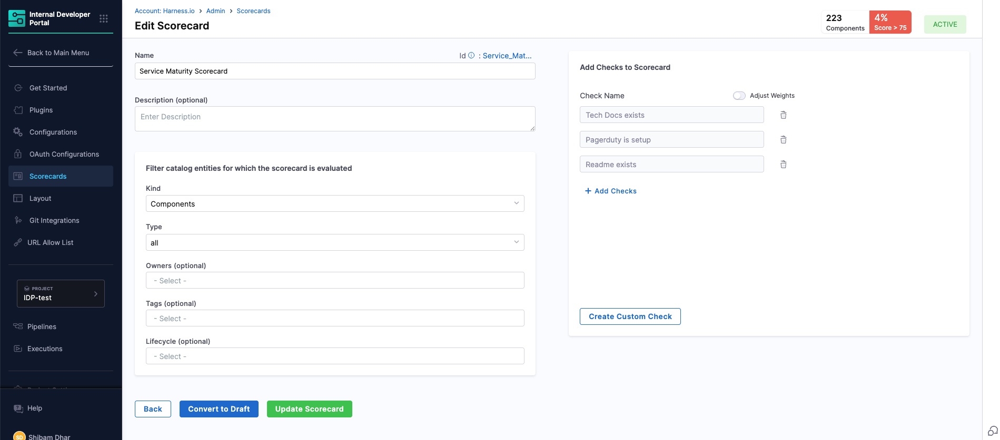
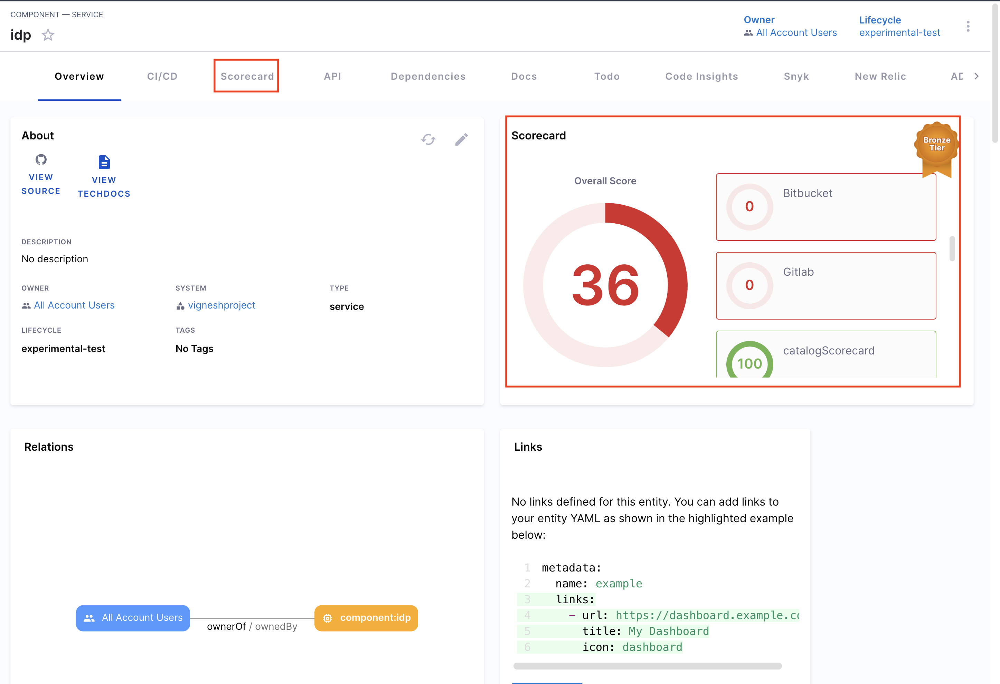
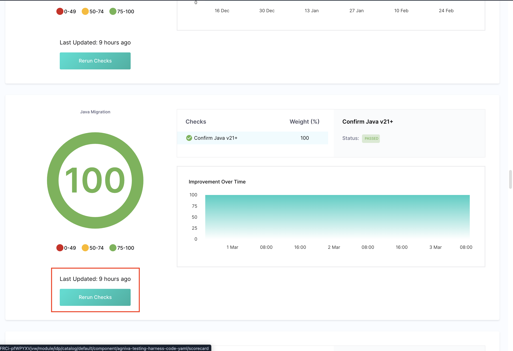

# Edit Scorecards

In this document we will see how to edit, refresh, or disable existing Scorecards in Harness IDP after they have been created.

## Editing Scorecards

Once a Scorecard is published, you can make updates at any time from the **Scorecards** section in IDP Admin.

Click on an existing Scorecard to:

- Edit the name, description, filters, or checks
- Add or remove checks from the Scorecard
- Update filters to change which components are evaluated
<!-- - Toggle weight adjustments for more granular scoring -->
After making changes, click **Update Scorecard** to apply the updates immediately.

To stop active evaluation without deleting the Scorecard, you can click **Convert to Draft**. This preserves the Scorecard but stops it from computing or displaying scores in the UI.

## Refreshing Scorecards

Harness IDP allows you to manually refresh the evaluation of a Scorecard for any individual component. This is useful if:

- You’ve updated the component metadata or annotations
- You’ve recently published a new Scorecard or check
- You want to validate changes immediately

1. Navigate to the target component in the Catalog.
2. Click the **Scorecard - Overall Score** badge in the Overview section or from the navigation bar.

3. In the Scorecard tab, locate the relevant Scorecard.

4. Click **Rerun Checks** to manually trigger a refresh.

The Scorecard will re-evaluate the component in real time, and scores will update accordingly.

## Disabling Scorecards

There are two ways to disable Scorecards for developers:

#### Remove Scorecard UI from Catalog Pages

Edit the **entity layout configuration** and comment out or delete the Scorecard-related components added under the `Overview` and `tabs` sections. 

#### Set Scorecard Status to Draft

To globally disable a Scorecard:

1. Navigate to **Scorecards** in IDP Admin.
2. Open the Scorecard and click **Convert to Draft**.
3. Once in draft mode, the Scorecard will no longer be computed or shown in the Catalog UI.

This method is useful for temporarily disabling a Scorecard without editing layout configurations.
