Harness IDP allows you to integrate various data sources and implement custom checks to ensure your software components adhere to best practices and compliance. In this docs, we'll walk through how to add custom checks and data sources for [scorecards](https://developer.harness.io/docs/internal-developer-portal/features/scorecard) in Harness IDP.

### Overview

Harness IDP allows you to integrate various data sources, such as GitHub, GitLab, Bitbucket, Azure DevOps, and many more, to collect specific data points for each software component. Once a data source is enabled, you can use them to create checks to be used in scorecards.

### Add Custom Checks

1. Under the `Admin` go to `Scorecards`.
2. In the `Scorecards` go to the `Checks` tab and select **Create Custom Check**.
3. Now on the **Create Check** page add a name and description for your check.
4. Under **Rules** you can find the following Data Sources to select from.

:::info

There's a tab called `Data Sources` available in `Scorecards` page to check for supported data sources and the corresponding data points. 

:::

:::warning

The git (GitHub, GitLab, Bitbucket) datasources doesn't support monorepos.

:::

### Supported Operators

We support the following `regex operators` as Operators for all the Data Points.

1. Less Than
2. Less than or equal to
3. Greater than
4. Greater than or equal to 
5. Equal to
6. Not equal to
7. In or Match
8. Not-In or Not-Match
9. Starts With

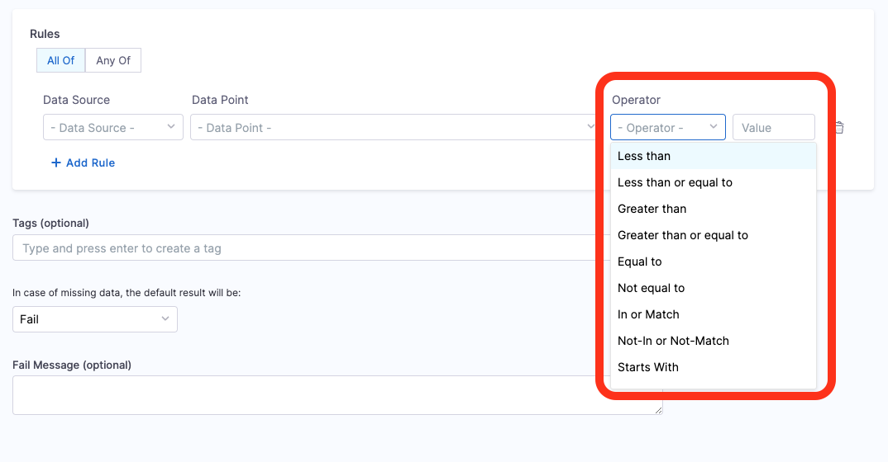


### Support for `catalog-info.yaml` metadata as inputs.

Users can now use all the entity definition from the `catalog-info.yaml` or from additional properties [ingested using APIs](https://developer.harness.io/docs/internal-developer-portal/catalog/custom-catalog-properties) as input variable(JEXL format) in Scorecard Checks. For example, `<+metadata.testCoverageScore>`, `<+metadata.annotations['backstage.io/techdocs-ref']>`. Checks e.g., `<+metadata.harnessData.name>` will fetch the value for the branch in the following YAML as `catalog-info.yaml`.

```YAML
...
metadata:
  name: idp-module
  harnessData:
    name: idp-module-prod
    path: idp
    priority: P0,P1
  annotations:
    jira/project-key: IDP
...
```

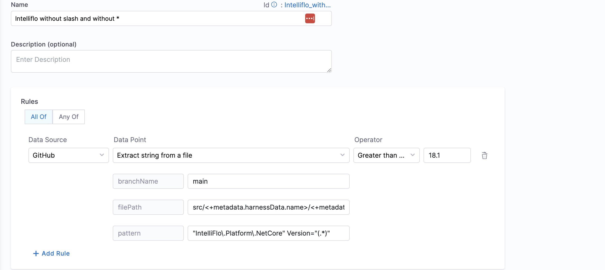

:::info

Few datasources like **PagerDuty**, **Kubernetes** are dependent on the Plugins to fetch data using the annotations meant for the plugins in `catalog-info.yaml` as well as the proxy defined in the plugins section. 

:::


## GitHub

The following **Data Points** are available for GitHub Data Source. 

1. **Branch Protection**
- *Objective:* Ensure that branch protection rules disallow force push and delete.
- *Calculation Method:* Fetch `backstage.io/source-location` annotation from the catalog YAML file to find repository details and verify the branch protection rules.
- *Prerequisites:* GitHub Connector with Admin access. Provide suitable `backstage.io/source-location` annotation if the catalog YAML file is present outside the source GitHub repository.

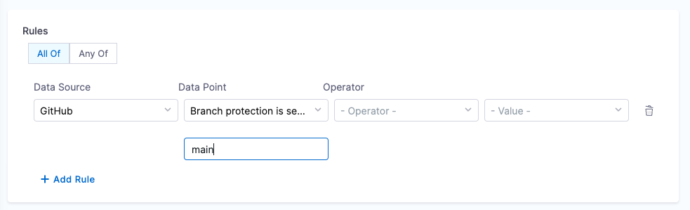

**Example YAML**

```
kind: "Component"
apiVersion: "backstage.io/v1alpha1"
metadata:
  name: order-service
  annotations:
    backstage.io/source-location: 'url:https://github.com/kubernetes/kubernetes/tree/master'
    ...
spec:
    ...
```

2. **File Existence**
- *Objective:* Verify the existence of a specified file in the repository.
- *Calculation Method:* Use the `backstage.io/source-location` annotation to locate the repository and check for the file’s presence. Make sure to mention the filename with extension or relative path from the root folder (e.g.: README.md or docs/README.md) in the conditional input field.
- *Prerequisites:* Provide suitable `backstage.io/source-location` annotation if the catalog YAML file is present outside the source GitHub repository.

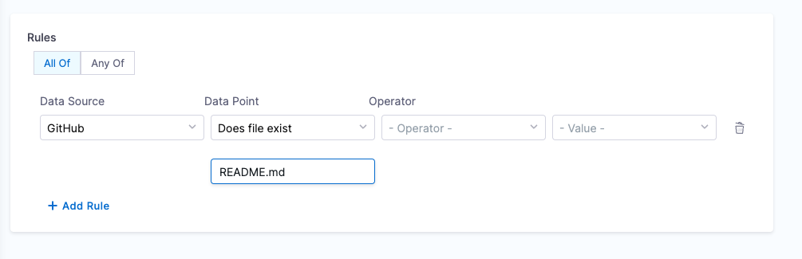

**Example YAML**

```
kind: "Component"
apiVersion: "backstage.io/v1alpha1"
metadata:
  name: order-service
  annotations:
    backstage.io/source-location: 'url:https://github.com/kubernetes/kubernetes/tree/master'
    ...
spec:
    ...
```

3. **Mean Time to Merge Pull Request**
- *Objective*: Calculate the average time taken to merge the last 100 pull requests.
- *Calculation Method:* Retrieve repository details using `backstage.io/source-location` and calculate the average merge time.
- *Prerequisites:* Provide suitable `backstage.io/source-location` annotation if the catalog YAML file is present outside the source GitHub repository. Make sure to mention the branch name in the conditional input field.

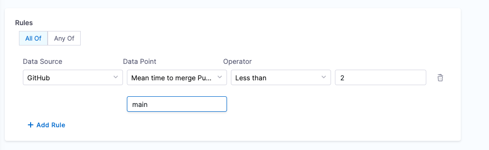

**Example YAML**

```YAML
kind: "Component"
apiVersion: "backstage.io/v1alpha1"
metadata:
  name: order-service
  annotations:
    backstage.io/source-location: 'url:https://github.com/kubernetes/kubernetes/tree/master'
    ...
spec:
    ...
```

4. **Average time to complete successful workflow runs (in minutes)**
- *Objective:* Calculate the average time taken to complete **successful** workflow runs (in minutes).
- *Calculation Method:* Fetches `backstage.io/source-location` annotation from catalog YAML file to find repository details and calculates the average time for the last 100 successful workflow runs to complete.
- *Prerequisites:* Provide suitable `backstage.io/source-location` annotation if the catalog YAML file is present outside the source GitHub repository. Make sure to mention the workflow ID or filename in the conditional input field.

5. **Average time to complete workflow runs (in minutes)**
- *Objective:* Calculate the average time taken to complete workflow runs (in minutes).
- *Calculation Method:* Fetches `backstage.io/source-location` annotation from catalog YAML file to find repository details and calculates the average time for the last 100 workflow runs to complete.
- *Prerequisites:* Provide suitable `backstage.io/source-location` annotation if the catalog YAML file is present outside the source GitHub repository. Make sure to mention the workflow ID or filename in the conditional input field.

6. **Workflow success rate**
- *Objective:* Calculates success rate for the given workflow.
- *Calculation Method:* Fetches `backstage.io/source-location` annotation from catalog YAML file to find repository details and calculates the success rate for the workflow.
- *Prerequisites:* Provide suitable `backstage.io/source-location` annotation if the catalog YAML file is present outside the source GitHub repository. Make sure to mention the workflow ID or filename in the conditional input field.

7. **Workflows count**
- *Objective:* Calculates total number of workflows.
- *Calculation Method:* Fetches `backstage.io/source-location` annotation from catalog YAML file to find repository details and calculates the total number of workflows
- *Prerequisites:* Provide suitable `backstage.io/source-location` annotation if the catalog YAML file is present outside the source GitHub repository.

8. **Open code scanning alerts**
- *Objective:* Calculates the total number of open alerts reported in code scanning for the given severity.
- *Calculation Method:* Fetches `backstage.io/source-location` annotation from catalog YAML file to find repository details and calculates the total number of open alerts reported in code scanning.
- *Prerequisites:* GitHub Connector with read access for code scanning alerts. Provide suitable `backstage.io/source-location` annotation if the catalog YAML file is present outside the source GitHub repository. Make sure to mention the severity type in the conditional input field.

9. **Open Dependabot alerts**
- *Objective:* Calculates the total number of open alerts reported by Dependabot for the given severity.
- *Calculation Method:* Fetches `backstage.io/source-location` annotation from catalog YAML file to find repository details and calculates the total number of open alerts reported by Dependabot.
- *Prerequisites:* Provide suitable `backstage.io/source-location` annotation if the catalog YAML file is present outside the source GitHub repository. Make sure to mention the severity type in the conditional input field.

10. **Open secret scanning alerts**
- *Objective:* Calculates the total number of open alerts reported in secret scanning. 
- *Calculation Method:* Fetches `backstage.io/source-location` annotation from catalog YAML file to find repository details and calculates the total number of open alerts reported in secret scanning. 
- *Prerequisites:* GitHub Connector with read access for secret scanning alerts. Provide suitable `backstage.io/source-location` annotation if the catalog YAML file is present outside the source GitHub repository.

11. **Open pull requests by account**
- *Objective:* Calculates the total number of open pull requests raised by the given account.
- *Calculation Method:* Fetches `backstage.io/source-location` annotation from catalog YAML file to find repository details and calculates the total number of open pull requests raised by account.
- *Prerequisites:* Provide suitable `backstage.io/source-location` annotation if the catalog YAML file is present outside the source GitHub repository. Make sure to mention the username in the conditional input field.

12. **Extract string from a file**
- *Objective:* Gets the string matching the pattern from given file from the branch.
- *Calculation Method:* If a branch name is specified, it is utilized. However, if no branch name is provided, the system retrieves information from the catalog YAML file using the `backstage.io/source-location` annotation to determine the branch name and repository details. It is essential to specify the filename with its extension or provide the relative path from the root folder (e.g., README.md or docs/README.md) in the conditional input field, **also the filename can be provided as a regex pattern**, example for a file path `/backstage/blob/master/scripts/log-20240105.anyextension` the regex would be `/backstage/blob/master/scripts/log-20240105\..*`. After fetching the file, the designated pattern is then searched within the file contents and its value is extracted and returned.

:::info

### URL priority for branch name field

In some of the data points we take `branchName` as input, and it's an optional field in case the branch is mentioned in `source-location` in **catalog-info.yaml**. It is suggested to give a branchName in case you want to use the same for all the repositories, otherwise we use the branch name mentioned in the `source-location`.

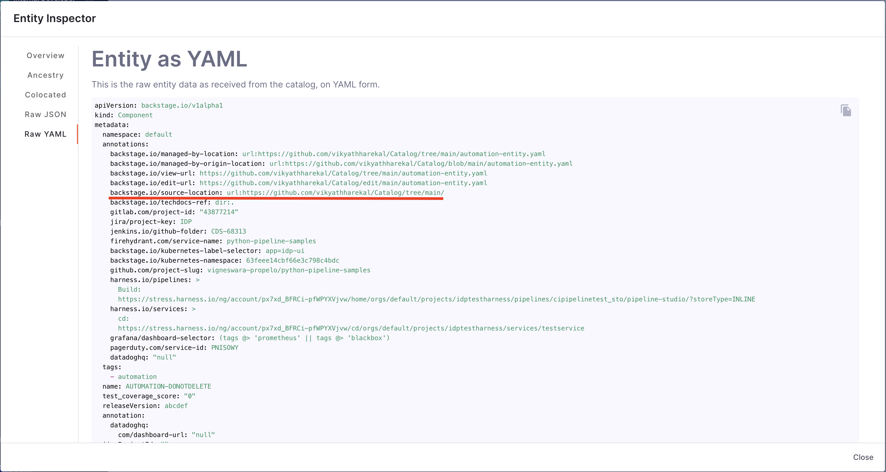

In case you mention the `branchName` field as a check config other than what's present in the `source-location` the priority order conditions could be found below. 

1. If it’s in both, the check configuration will take precedence.
2. If it’s in only one, we’ll use that value.
3. If it’s in neither, the check will fail.

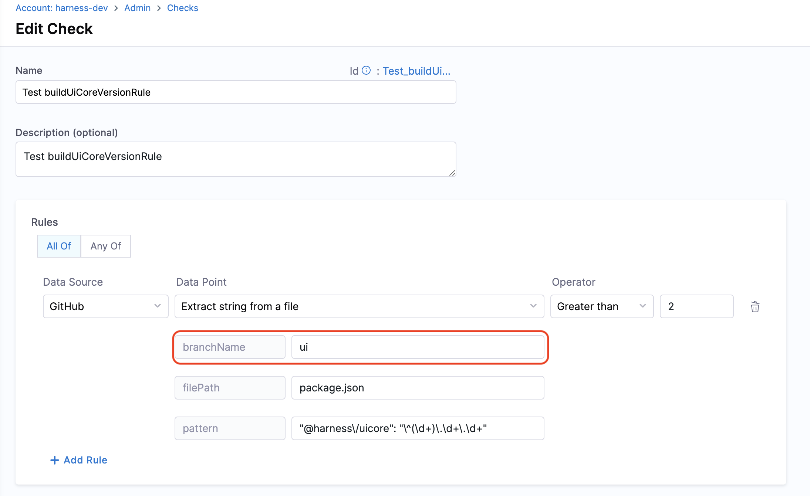

:::

- *Prerequisites:* Provide suitable `backstage.io/source-location` annotation if the catalog YAML file is present outside the source GitHub repository.

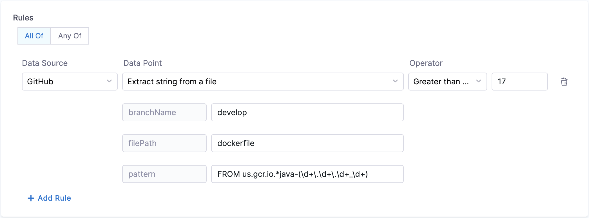

13. **Match string in a file**
- *Objective:* Matches the pattern in the given file from the branch.
- *Calculation Method:* If a branch name is specified, it is utilized. However, if no branch name is provided, the system retrieves information from the catalog YAML file using the `backstage.io/source-location` annotation to determine the branch name and repository details. It is essential to specify the filename with its extension or provide the relative path from the root folder (e.g., README.md or docs/README.md) in the conditional input field. After fetching the file, the contents are examined to find the pattern. Returns true/false based on whether the pattern was found or not.

:::info

### URL priority for branch name field

In some of the data points we take `branchName` as input, and it's an optional field in case the branch is mentioned in `source-location` in **catalog-info.yaml**. It is suggested to give a branchName in case you want to use the same for all the repositories, otherwise we use the branch name mentioned in the `source-location`.


In case you mention the `branchName` field as a check config other than what's present in the `source-location` the priority order conditions could be found below. 

1. If it’s in both, the check configuration will take precedence.
2. If it’s in only one, we’ll use that value.
3. If it’s in neither, the check will fail.


:::

- *Prerequisites:* Provide suitable `backstage.io/source-location` annotation if the catalog YAML file is present outside the source GitHub repository.

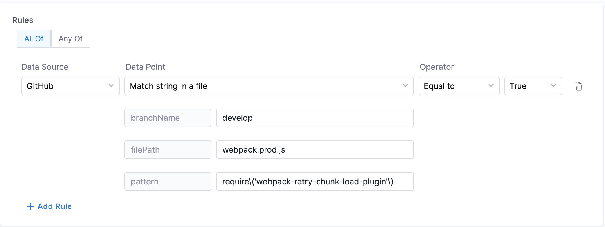

## GitLab

The following **Data Points** are available for GitLab Data Source. 

1. **Branch Protection**
- *Objective:* Ensure that branch protection rules disallow force push and delete.
- *Calculation Method:* Fetch `backstage.io/source-location` annotation from the catalog YAML file to find repository details and verify the branch protection rules.
- *Prerequisites:* GitLab Connector with Admin access. Provide suitable `backstage.io/source-location` annotation if the catalog YAML file is present outside the source GitLab repository.

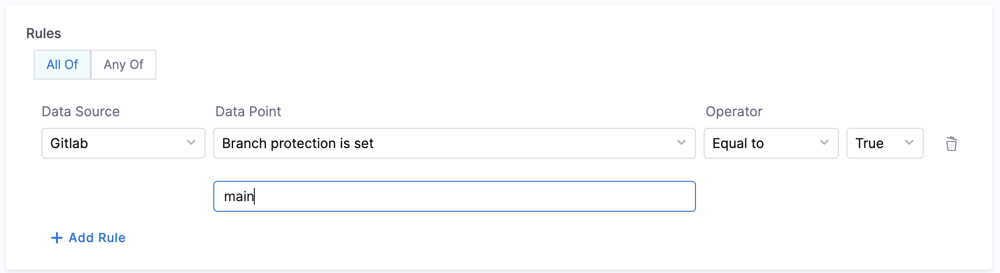

**Example YAML**

```
kind: "Component"
apiVersion: "backstage.io/v1alpha1"
metadata:
  name: order-service
  annotations:
    backstage.io/source-location: 'url:https://gitlab.com/kubernetes/kubernetes/tree/master'
    ...
spec:
    ...
```

2. **File Existence**
- *Objective:* Verify the existence of a specified file in the repository.
- *Calculation Method:* Use the `backstage.io/source-location` annotation to locate the repository and check for the file’s presence. Make sure to mention the filename with extension or relative path from the root folder (e.g.: README.md or docs/README.md) in the conditional input field.
- *Prerequisites:* Provide suitable `backstage.io/source-location` annotation if the catalog YAML file is present outside the source GitLab repository.

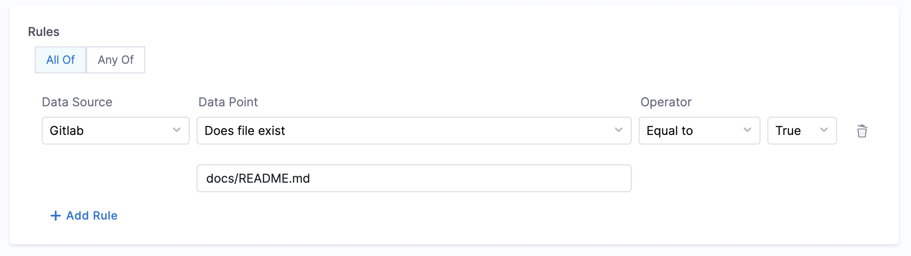

**Example YAML**

```
kind: "Component"
apiVersion: "backstage.io/v1alpha1"
metadata:
  name: order-service
  annotations:
    backstage.io/source-location: 'url:https://gitlab.com/kubernetes/kubernetes/tree/master'
    ...
spec:
    ...
```

3. **Mean Time to Merge Pull Request**
- *Objective:* Calculate the average time taken to merge the last 100 pull requests.
- *Calculation Method:* Retrieve repository details using `backstage.io/source-location` and calculate the average merge time.
- *Prerequisites:* Provide suitable `backstage.io/source-location` annotation if the catalog YAML file is present outside the source GitLab repository. Make sure to mention the branch name in the conditional input field.

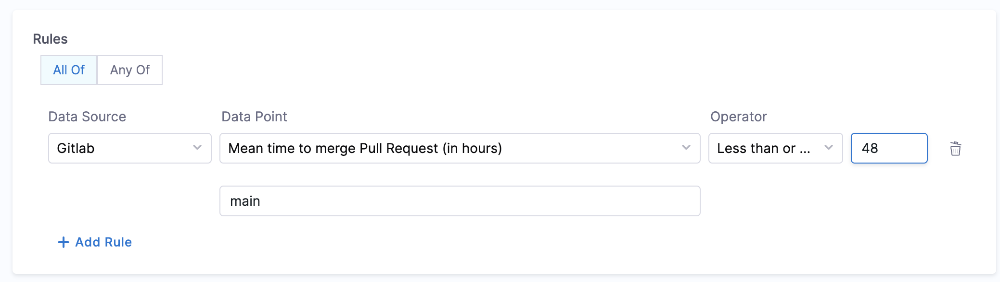

**Example YAML**

```
kind: "Component"
apiVersion: "backstage.io/v1alpha1"
metadata:
  name: order-service
  annotations:
    backstage.io/source-location: 'url:https://gitlab.com/kubernetes/kubernetes/tree/master'
    ...
spec:
    ...
```

4. **Extract string from a file**
- *Objective:* Gets the string matching the pattern from given file from the branch.
- *Calculation Method:* If a branch name is specified, it is utilized. However, if no branch name is provided, the system retrieves information from the catalog YAML file using the `backstage.io/source-location` annotation to determine the branch name and repository details. It is essential to specify the filename with its extension or provide the relative path from the root folder (e.g., README.md or docs/README.md) in the conditional input field. After fetching the file, the designated pattern is then searched within the file contents and its value is extracted and returned.

:::info

### URL priority for branch name field

In some of the data points we take `branchName` as input, and it's an optional field in case the branch is mentioned in `source-location` in **catalog-info.yaml**. It is suggested to give a branchName in case you want to use the same for all the repositories, otherwise we use the branch name mentioned in the `source-location`.


In case you mention the `branchName` field as a check config other than what's present in the `source-location` the priority order conditions could be found below. 

1. If it’s in both, the check configuration will take precedence.
2. If it’s in only one, we’ll use that value.
3. If it’s in neither, the check will fail.


:::

- *Prerequisites:* Provide suitable `backstage.io/source-location` annotation if the catalog YAML file is present outside the source GitHub repository.


5. **Match string in a file**
- *Objective:* Matches the pattern in the given file from the branch.
- *Calculation Method:* If a branch name is specified, it is utilized. However, if no branch name is provided, the system retrieves information from the catalog YAML file using the `backstage.io/source-location` annotation to determine the branch name and repository details. It is essential to specify the filename with its extension or provide the relative path from the root folder (e.g., README.md or docs/README.md) in the conditional input field. After fetching the file, the contents are examined to find the pattern. Returns true/false based on whether the pattern was found or not.

:::info

### URL priority for branch name field

In some of the data points we take `branchName` as input, and it's an optional field in case the branch is mentioned in `source-location` in **catalog-info.yaml**. It is suggested to give a branchName in case you want to use the same for all the repositories, otherwise we use the branch name mentioned in the `source-location`.


In case you mention the `branchName` field as a check config other than what's present in the `source-location` the priority order conditions could be found below. 

1. If it’s in both, the check configuration will take precedence.
2. If it’s in only one, we’ll use that value.
3. If it’s in neither, the check will fail.


:::

- *Prerequisites:* Provide suitable `backstage.io/source-location` annotation if the catalog YAML file is present outside the source GitHub repository.


## Bitbucket

The following **Data Points** are available for Bitbucket Data Source. 

1. **Branch Protection**
- *Objective:* Ensure that branch protection rules disallow force push and delete.
- *Calculation Method:* Fetch `backstage.io/source-location` annotation from the catalog YAML file to find repository details and verify the branch protection rules.
- *Prerequisites:* Bitbucket Connector with Admin access. Provide suitable `backstage.io/source-location` annotation if the catalog YAML file is present outside the source Bitbucket repository.

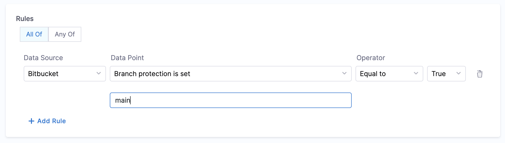

**Example YAML**

```
kind: "Component"
apiVersion: "backstage.io/v1alpha1"
metadata:
  name: order-service
  annotations:
    backstage.io/source-location: 'url:https://bitbucket.org/kubernetes/kubernetes/tree/master'
    ...
spec:
    ...
```

2. **Mean Time to Merge Pull Request**
- *Objective:* Calculate the average time taken to merge the last 100 pull requests.
- *Calculation Method:* Retrieve repository details using `backstage.io/source-location` and calculate the average merge time.
- *Prerequisites:* Provide suitable `backstage.io/source-location` annotation if the catalog YAML file is present outside the source Bitbucket repository. Make sure to mention the branch name in the conditional input field.

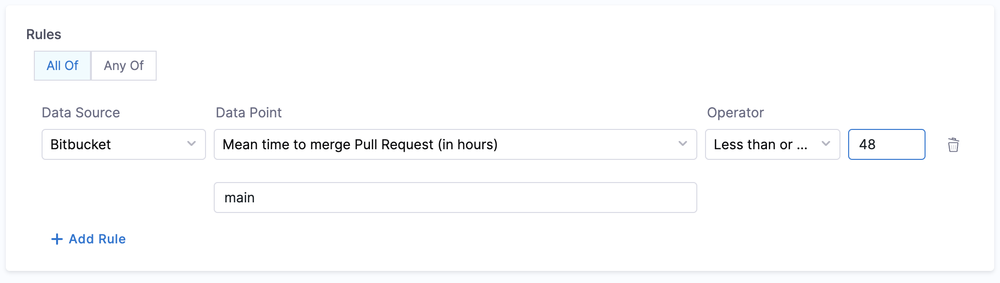

**Example YAML**

```
kind: "Component"
apiVersion: "backstage.io/v1alpha1"
metadata:
  name: order-service
  annotations:
    backstage.io/source-location: 'url:https://bitbucket.org/kubernetes/kubernetes/tree/master'
    ...
spec:
    ...
```

3. **Extract string from a file**
- *Objective:* Gets the string matching the pattern from given file from the branch.
- *Calculation Method:* If a branch name is specified, it is utilized. However, if no branch name is provided, the system retrieves information from the catalog YAML file using the `backstage.io/source-location` annotation to determine the branch name and repository details. It is essential to specify the filename with its extension or provide the relative path from the root folder (e.g., README.md or docs/README.md) in the conditional input field. After fetching the file, the designated pattern is then searched within the file contents and its value is extracted and returned.

:::info

### URL priority for branch name field

In some of the data points we take `branchName` as input, and it's an optional field in case the branch is mentioned in `source-location` in **catalog-info.yaml**. It is suggested to give a branchName in case you want to use the same for all the repositories, otherwise we use the branch name mentioned in the `source-location`.


In case you mention the `branchName` field as a check config other than what's present in the `source-location` the priority order conditions could be found below. 

1. If it’s in both, the check configuration will take precedence.
2. If it’s in only one, we’ll use that value.
3. If it’s in neither, the check will fail.


:::

- *Prerequisites:* Provide suitable `backstage.io/source-location` annotation if the catalog YAML file is present outside the source GitHub repository.


4. **Match string in a file**
- *Objective:* Matches the pattern in the given file from the branch.
- *Calculation Method:* If a branch name is specified, it is utilized. However, if no branch name is provided, the system retrieves information from the catalog YAML file using the `backstage.io/source-location` annotation to determine the branch name and repository details. It is essential to specify the filename with its extension or provide the relative path from the root folder (e.g., README.md or docs/README.md) in the conditional input field. After fetching the file, the contents are examined to find the pattern. Returns true/false based on whether the pattern was found or not.

:::info

### URL priority for branch name field

In some of the data points we take `branchName` as input, and it's an optional field in case the branch is mentioned in `source-location` in **catalog-info.yaml**. It is suggested to give a branchName in case you want to use the same for all the repositories, otherwise we use the branch name mentioned in the `source-location`.


In case you mention the `branchName` field as a check config other than what's present in the `source-location` the priority order conditions could be found below. 

1. If it’s in both, the check configuration will take precedence.
2. If it’s in only one, we’ll use that value.
3. If it’s in neither, the check will fail.


:::

- *Prerequisites:* Provide suitable `backstage.io/source-location` annotation if the catalog YAML file is present outside the source GitHub repository.


2. **File Existence**
- *Objective:* Verify the existence of a specified file in the repository.
- *Calculation Method:* Use the `backstage.io/source-location` annotation to locate the repository and check for the file’s presence. Make sure to mention the filename with extension or relative path from the root folder (e.g.: README.md or docs/README.md) in the conditional input field.

### URL priority for branch name field

In some of the data points we take `branchName` as input, and it's an optional field. It is suggested to give a `branchName` in case you want to use the same for all the repositories, otherwise we use the **default branch** for the repository mentioned in `source-location`.


In case you mention the `branchName` field as a check config other than what's present in the `source-location` the priority order conditions could be found below. 

1. If it’s in both, the check configuration will take precedence.
2. If it’s in only one, we’ll use that value.
3. **If it’s in neither, then we will use the default branch for the repository used in `source-location`.**


:::

**Example YAML**

```
kind: "Component"
apiVersion: "backstage.io/v1alpha1"
metadata:
  name: order-service
  annotations:
    backstage.io/source-location: 'url:https://gitlab.com/kubernetes/kubernetes/tree/master'
    ...
spec:
    ...
```

## Harness 

### Pre-Requisites

- For the functioning of Harness Data Source related checks, the Harness CI/CD plugin should be configured with annotations in catalog info YAML, `harness.io/pipelines` and `harness.io/services`.

- `harness.io/pipelines`: The pipeline URL is used as input, and it should only be fetched from under **Projects** and not from specific modules. 

Here's an example of the URL input: `https://app.harness.io/ng/account/account_id/home/orgs/org_id/projects/project_id/pipelines/pipeline_id`

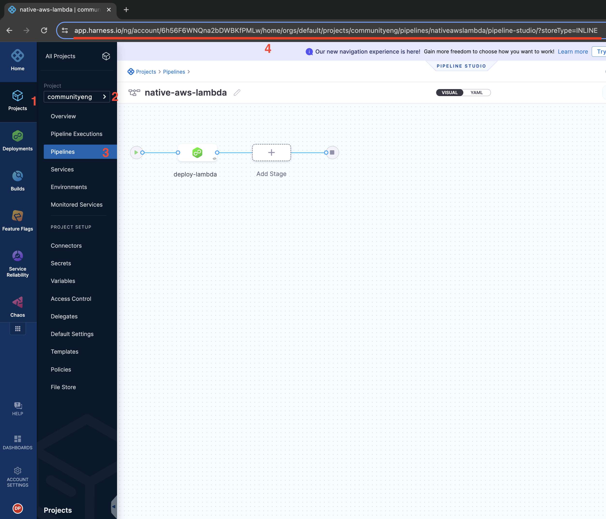

- `harness.io/services`: The URL for the Service should be used as an input, and it should only be fetched from under **Projects** and not from specific modules.

Here's an example of the URL input: `https://app.harness.io/ng/account/account_id/home/orgs/org_id/projects/project_id/services/service_id`

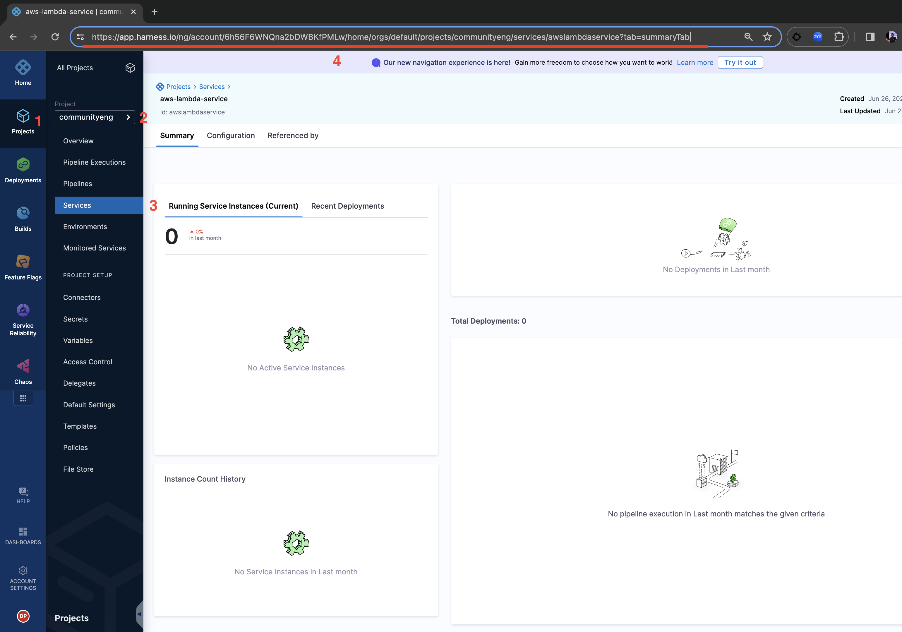

:::info

In the Harness Data source, the first pipeline URL from `harness.io/pipelines` is considered for score computation and similarly, the first service URL from `harness.io/services` is considered.

:::

The following **Data Points** are available for Harness Data Source. 

1. **CI Pipeline success rate (last 7 days)**: 
- *Objective:* Used for creating rules that will check the success percent of the ci-pipeline in the past 7 days. (This data point is only applicable for CI Pipelines).
- *Calculation Method:* The success rate is calculated only on CI Pipeline that we provide in catalog info YAML with annotation is considered for evaluating the check.

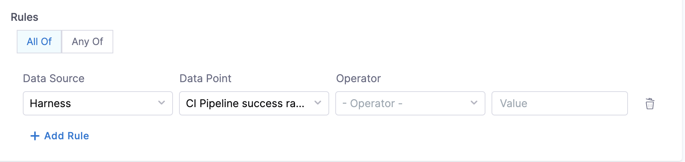

2. **Policy evaluation successful**:
- *Objective:* This data point can be used for creating a rule that will check if the policy evaluation is successful in pipelines. (This data point is applicable to both CI and CD Pipelines)

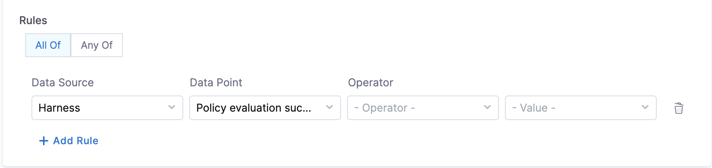

3. **Tests passing on CI (boolean)**:
- *Objective:* This data point can be used for creating a rule that will check if all the test cases running the CI Pipeline are passing(not a single failing test case). (This data point is only applicable to CI Pipeline)

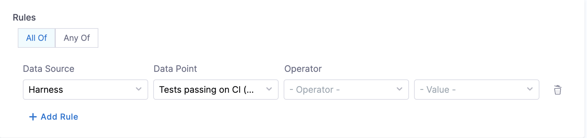

4. **STO stage added in pipeline**:
- *Objective:* This data point can be used for creating a rule that will check if STO stage is added in the pipelines. (This data point is applicable to both CI and CD Pipelines)


:::info

**Points to remember**:- 

- In the case of CI Pipeline, the first pipeline that we provide in the annotation in catalog info YAML will be used for evaluating the rules corresponding to data points.
If the rule depends on the execution of the pipeline then the latest execution of the provided CI Pipeline will be considered.

- In the case of CD Pipeline, the latest deployment pipeline using the first service that we provide in the annotation in catalog info YAML is considered for evaluating the rules corresponding to data points.

- If the data point depends on both CI and CD Pipelines, annotations corresponding to both should be present in the catalog YAML

:::

### Error Scenarios:

1. In case the check fails, the failure summary will provide the details for the pipeline because of which the check is failing. [We can refer to the pipeline and fix the pipeline with respect to the corresponding check]

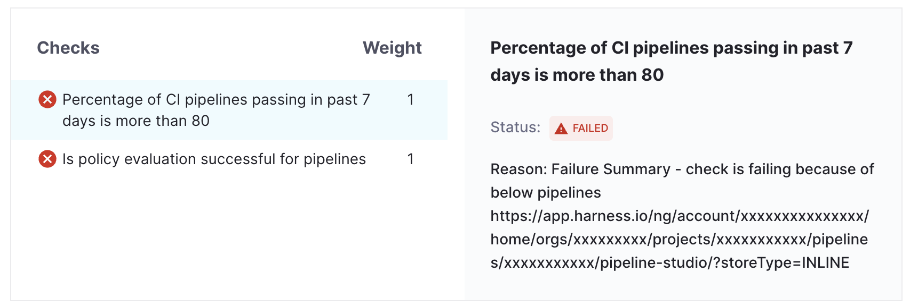

2. In case if annotation is missing the catalog info YAML, we will get the failure summary for the check in order to add the annotation [We can refer to the Pre-Requisite section to add it]

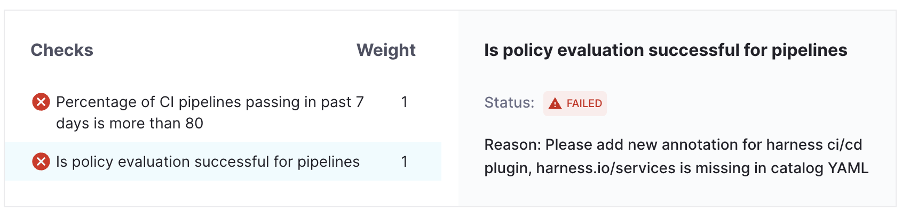

## Catalog 

The following **Data Points** are available for Catalog Data Source. 

1. **Evaluate expression (JEXL):**
- *Objective:* Evaluate [JEXL expression](https://commons.apache.org/proper/commons-jexl/reference/syntax.html) on the catalog YAML file.
- *Calculation Method:* The catalog YAML is inspected to perform custom JEXL expression and returns the evaluated data.

#### Example Usage: 

Below is an example of `catalog-info.yaml` 

```YAML
##Example
apiVersion: backstage.io/v1alpha1
kind: Component
metadata:
  name: artist-web
  description: The place to be, for great artists
  labels:
    example.com/custom: custom_label_value
  annotations:
    example.com/service-discovery: artistweb
    circleci.com/project-slug: github/example-org/artist-website
  tags:
    - java
  links:
    - url: https://admin.example-org.com
      title: Admin Dashboard
      icon: dashboard
      type: admin-dashboard
spec:
  type: website
  lifecycle: production
  owner: artist-relations-team
  system: public-websites
```

In the above example using the **Evaluate expression** we can match input values for all the root fields `apiVersion`, `kind`, `metadata`, and `spec` only and the [supported values](https://backstage.io/docs/features/software-catalog/descriptor-format#contents) under the root field. 

for eg. `<+metadata.name>` would point to `artist-db` from the above example, and could be used to check the values 
 
:::info

We only support string and key-value pair data types in JEXL, some datatype like array, list aren't supported.

:::

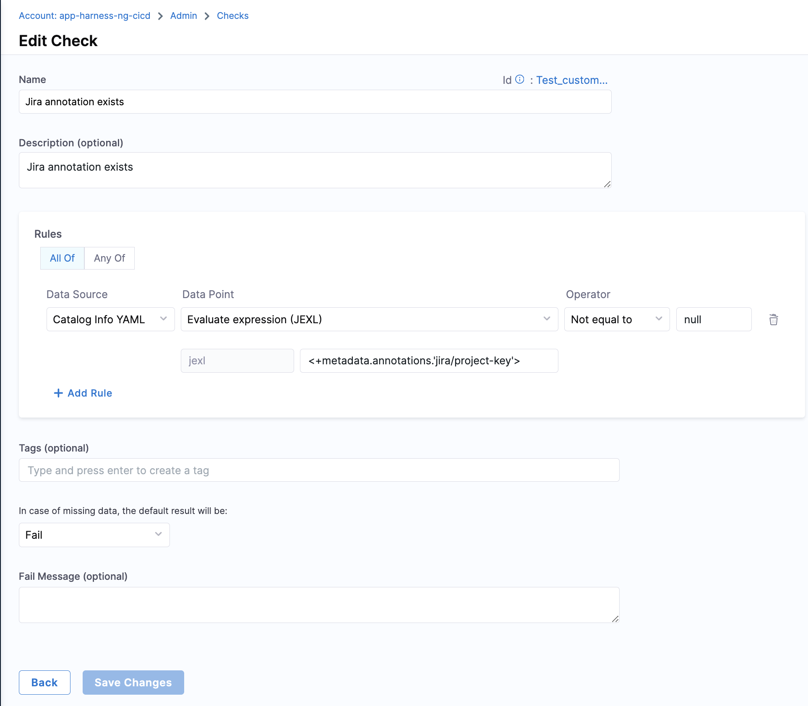

2. **Owner is defined**:
- *Objective:* Checks if the catalog YAML file has the owner configured or not
- *Calculation Method:* The catalog YAML is inspected to check if the owner is under the spec field and the owner should not be Unknown.


**Example YAML**

```
apiVersion: backstage.io/v1alpha1
kind: Component
metadata:
  ...
spec:
  type: service
  system: order
  lifecycle: experimental
  owner: order-team
```

3. **Documentation Exists**:
- *Objective:* Checks if the catalog YAML file has the annotation `backstage.io/techdocs-ref` configured or not.
- *Calculation Method:* The catalog YAML is inspected to check if the `backstage.io/techdocs-ref` is present under the metadata field.
- *Prerequisites:* The directory configured should have the `mkdocs.yml` file and a docs directory having all the documentation in Markdown format.


**Example YAML**

```
apiVersion: backstage.io/v1alpha1
kind: Component
metadata:
  name: order-service
  annotations:
    backstage.io/techdocs-ref: dir:.
    ...
spec:
    ...

```

4. **Pagerduty is set**:

- *Objective:* Checks if the catalog YAML file has the annotation `pagerduty.com/service-id` configured or not.
- *Calculation Method:* The catalog YAML is inspected to check if the `pagerduty.com/service-id` is present under the metadata field.
- *Prerequisites:* The PagerDuty plugin needs to be configured and enabled in the admin section. Please [refer](https://developer.harness.io/docs/internal-developer-portal/plugins/available-plugins/pagerduty/) here for more details. 

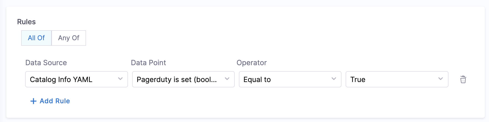

**Example YAML**

```
kind: "Component"
apiVersion: "backstage.io/v1alpha1"
metadata:
  name: order-service
  annotations:
    pagerduty.com/service-id: PT5ED69
    ...
spec:
    ...
```

5. **Annotation Exists**:

- *Objective:* Checks if the catalog YAML file has a particular annotation set under `annotation` field is configured or not.
- *Calculation Method:* The catalog YAML is inspected to check if the particular annotation is present under the metadata field.
 
For example, setting up the check below for the example `catalog-info.yaml` you could find whether the annotation `jira/project-key`present or not. In this case the check would pass as the annotation is present.

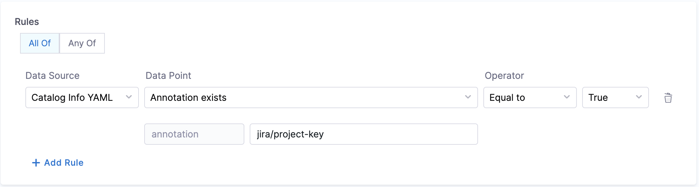

```YAML
## Example catalog-info.yaml
kind: "Component"
apiVersion: "backstage.io/v1alpha1"
metadata:
  name: order-service
  annotations:
    jira/project-key: IDP
    ...
spec:
    ...
```

## Kubernetes

:::info

The Kubernetes datasource being dependent on the Kubernetes Plugin for annotations and proxy we only support `label-selector` e.g. `'backstage.io/kubernetes-label-selector': 'app=my-app,component=front-end'` rest all other annotation type mentioned [here](https://backstage.io/docs/features/kubernetes/configuration#common-backstageiokubernetes-id-label) are planned to be supported in the next few releases. 

Also, for additional filtering we support namespace in annotation `'backstage.io/kubernetes-namespace': dice-space` as well, but `label-selector` is mandatory. 

:::

### Prerequisites:

1. **Plugin Configuration**

- The Kubernetes plugin needs to be configured. Refer [here](https://developer.harness.io/docs/internal-developer-portal/plugins/available-plugins/kubernetes).

:::info

The plugin provides 2 ways to authenticate - `serviceAccount` and `Google authentication`. But currently, the scorecards supports `serviceAccount` type authentication only.

:::

2. **Entity Configuration**

- There are two ways to surface Kubernetes components as part of an entity using annotations - `backstage.io/kubernetes-id` and `backstage.io/kubernetes-label-selector`. But currently, scorecards support [backstage.io/kubernetes-label-selector](https://backstage.io/docs/features/kubernetes/configuration/#label-selector-query-annotation) annotation only. 

The following **Data Points** are available for Kubernetes Data Source.

1. **Replicas Count**:

- *Objective:* Fetches the number of replicas configured for the given service.
- *Calculation Method:* The label selector configured in the catalog YAML is used to identify the Kubernetes workload and the configured replica count is used. The cluster details configured in the Kubernetes plugin are used. If more than one cluster is configured, the workload search is done in each cluster and a minimum of all the replica counts is taken into consideration.
- *Prerequisites:* The Kubernetes plugin needs to be configured and enabled in the admin section. Refer [here](https://developer.harness.io/docs/internal-developer-portal/plugins/available-plugins/kubernetes) for more details. 

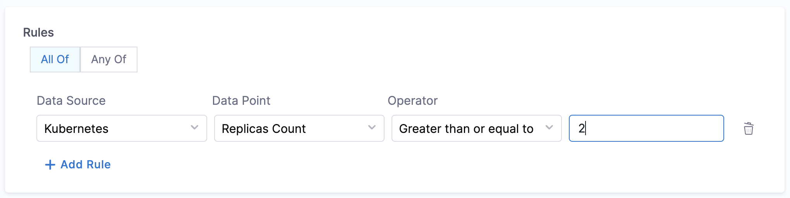

2. **Days passed since the application was last deployed**:

- *Objective:* Fetches the number of days since the most recent deployment was done.
- *Calculation Method:* The label selector configured in the catalog YAML is used to identify the `Kubernetes workload` and the `lastUpdateTime` is used from the conditions section. The cluster details configured in the Kubernetes plugin are used. If more than one cluster is configured, the workload search is done in each cluster and the oldest deployment time of all is taken into consideration.
- *Prerequisites:* The Kubernetes plugin needs to be configured and enabled in the admin section. Refer [here](https://developer.harness.io/docs/internal-developer-portal/plugins/available-plugins/kubernetes) for more details. 

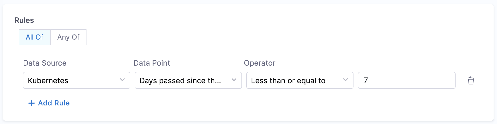

## Jira

The following **Data Points** are available for Jira Data Source.

1. **Issues Count**:

- *Objective:* Calculates the total number of issues for the given JQL query. 
- *Calculation Method:* Fetches annotations from catalog YAML file to find project details and calculates number of issues. Make sure to provide JQL expression in the conditional input field.
    1. Open P0/P1 bugs: `issuetype = Bug AND priority in (P0, P1) AND statusCategory != Done`
    2. Features delivered (last 90 days): `issuetype in (Epic, 'New Feature') AND resolved >= -90d`
    3. Make sure to wrap words within single quotes. e.g.: `'New Feature'`
- *Prerequisites:* Provide annotations like `jira/project-key`(required) and `jira/component`(optional) in the catalog YAML file.

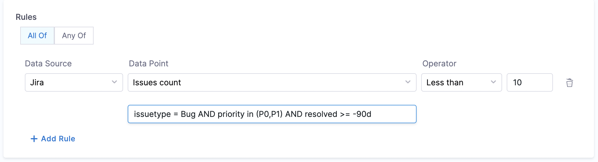

Example YAML

```
kind: "Component"
apiVersion: "backstage.io/v1alpha1"
metadata:
  name: order-service
  annotations:
    jira/project-key: <jira-project-key>
    jira/component: <jira-component>
    ...
spec:
    ...
```

2. **Mean time to resolve**:

- *Objective:* Calculates the average time taken to resolve issues for the given JQL query. 
- *Calculation Method:* Fetches annotations from catalog YAML file to find project details and calculates average time. Make sure to provide JQL expression in the conditional input field.
    1. Mean time to resolve bugs: `issuetype = Bug AND priority in (P0,P1) AND resolved >= -90d`
    2. Make sure to wrap words within single quotes. e.g.: `'New Feature'`
- *Prerequisites:* Provide annotations like `jira/project-key`(required) and `jira/component`(optional) in the catalog YAML file.

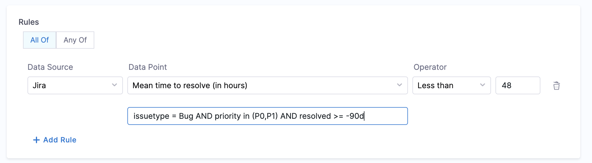

**Example YAML**

```
kind: "Component"
apiVersion: "backstage.io/v1alpha1"
metadata:
  name: order-service
  annotations:
    jira/project-key: <jira-project-key>
    jira/component: <jira-component>
    ...
spec:
    ...
```

3. **Issues Open/Close Ratio**:

- *Objective:* Calculates the ratio between Open & Closed issues for the given JQL query. 
- *Calculation Method:* Fetches annotations from catalog YAML file to find project details and calculates the ratio. Make sure to provide JQL expression in the conditional input field.
    1. Mean time to resolve bugs: `issuetype = Bug AND priority in (P0,P1) AND resolved >= -90d`
    2. Make sure to wrap words within single quotes. e.g.: `'New Feature'`
- *Prerequisites:* Provide annotations like `jira/project-key`(required) and `jira/component`(optional) in the catalog YAML file.

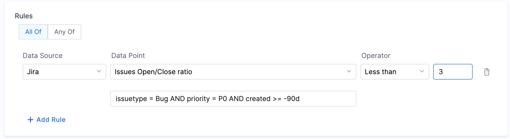

**Example YAML**

```YAML
kind: "Component"
apiVersion: "backstage.io/v1alpha1"
metadata:
  name: order-service
  annotations:
    jira/project-key: <jira-project-key>
    jira/component: <jira-component>
    ...
spec:
    ...
```

## PagerDuty

### Prerequisites:

- The PagerDuty plugin must be configured and enabled in the admin section. Refer [here](https://developer.harness.io/docs/internal-developer-portal/plugins/available-plugins/pagerduty/).


The following **Data Points** are available for PagerDuty Data Source.

1. **Is on-call Set** - This data point can be used for creating rules that will check if the on-call is set for a given service.

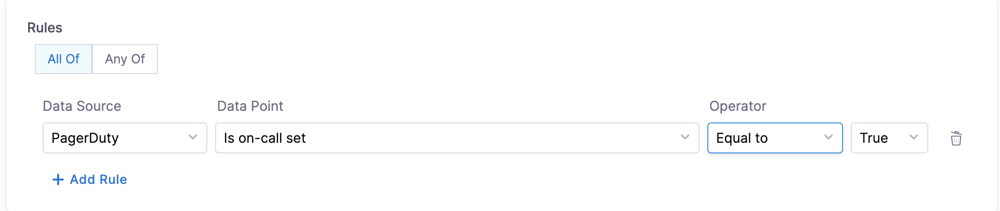

2. **Is Escalation Policy call** - This data point can be used to create rules to check if the escalation policy is set for a given service.

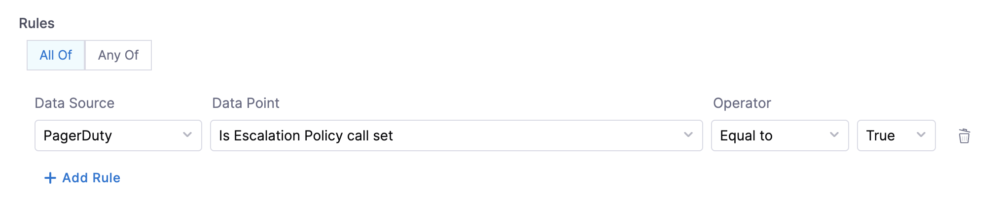

3. **Number of incidents in the last 30 days** - This data point can be used to create rules to check if the number of incidents created in the last 30 days is less than the given threshold input value.

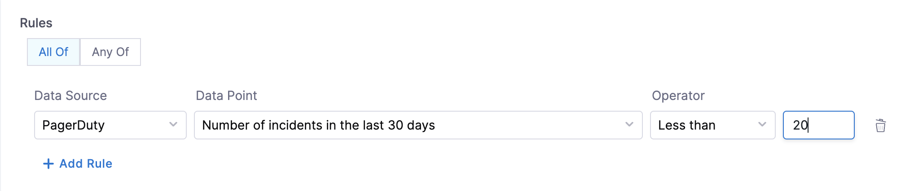

4. **Average resolved time of the last 10 resolved incidents (in Minutes)** - This data point can be used to create rules to check if the average resolved time for the last 10 resolved incidents (in Minutes) is less than the given provided input values.

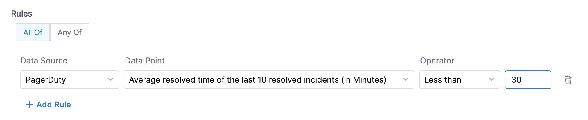

### Error Scenarios:-

1. In case checks fail because of PagerDuty plugin is not enabled we will get the error message in the failure summary.

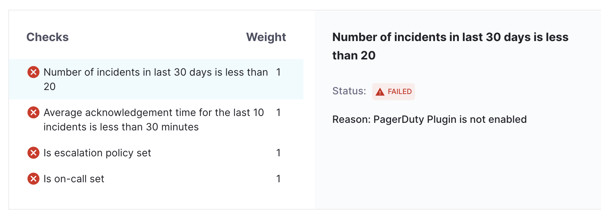

2. In case of checks fail because of PagerDuty annotation is missing in catalog info YAML we will get the corresponding error message.

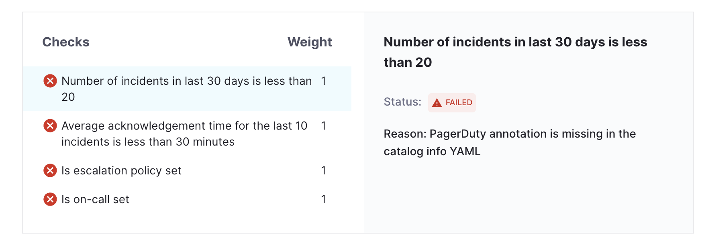


5. Now add a `tag` under which category your check belongs to, Ex. "Developer Productivity", "Software Maturity" and click `enter` to add each tags. 

6. Now add the default result in case of missing data and **Save Changes**. Your checks will be added. 

## Checks Overview

- Once the Checks are created, you can view the list of all the checks under the **Checks** tab. 

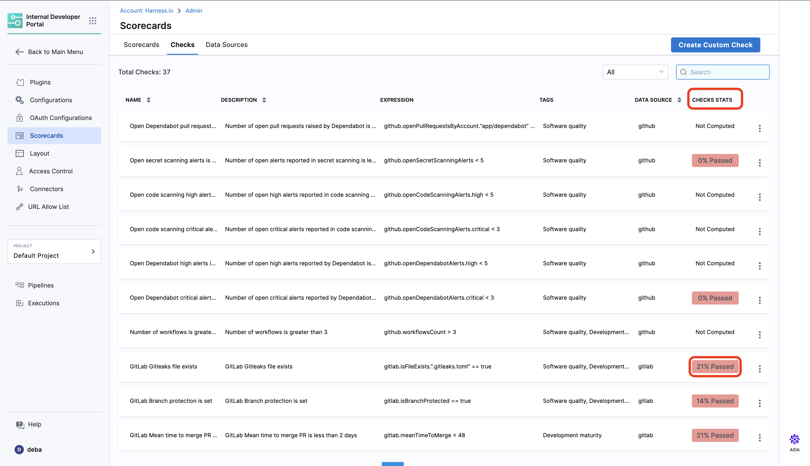

- To have an overview of a single check and information on all the components it is applied, select the tab under **Check Stats** column for an individual check, it will redirect you to the overview page. 

- The overview page lists all the components on which the check is applied, and the graph helps you to track time-sensitive information on the components on which the check has passed, this can be used to track functions like migration and upgrades across your software ecosystem. 

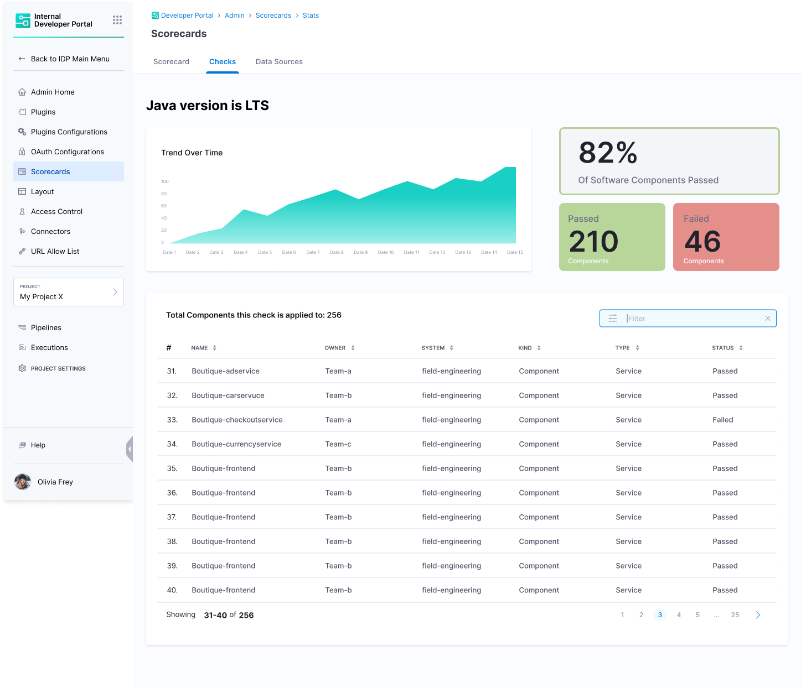

:::info

Follow the breadcrumbs on the top of the page to navigate across both the pages i.e., list of all checks and individual check overview page

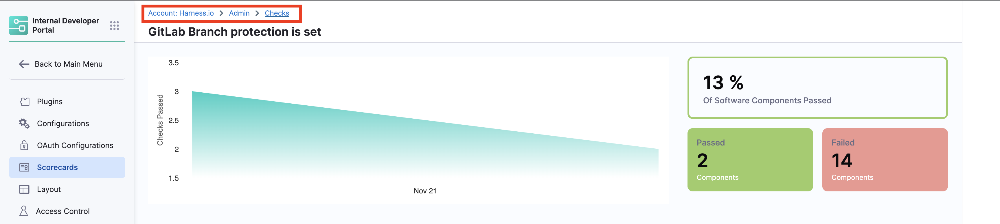

:::