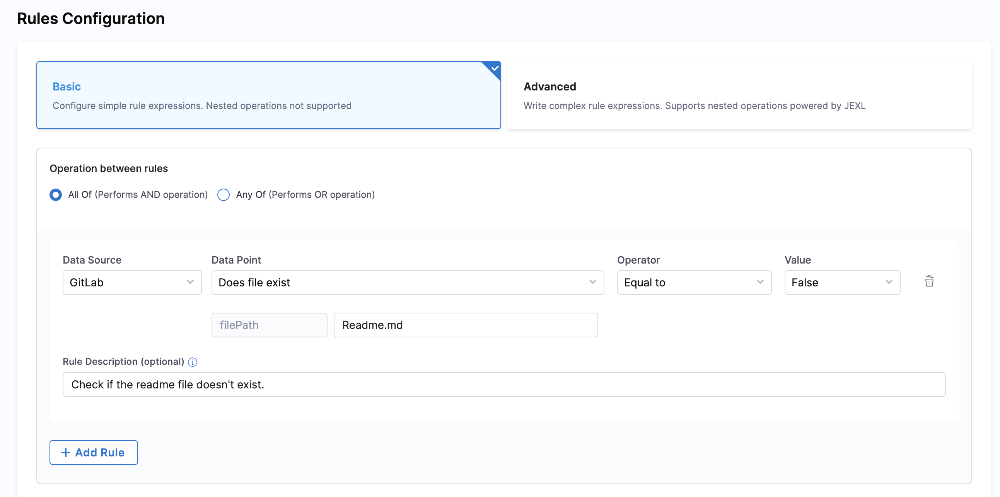
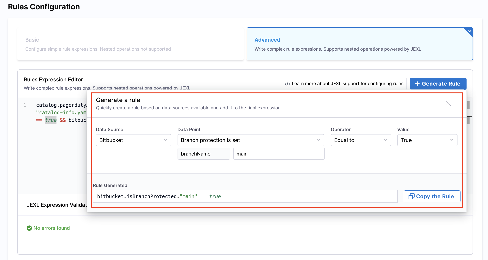
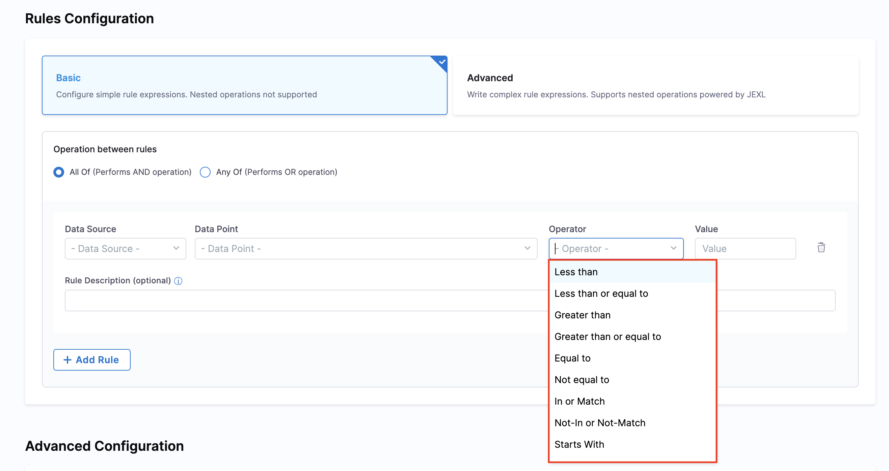

Checks are the building blocks of scorecards. A check is a query performed against a data point for a software component, which results in either **Pass** or **Fail**. Checks help you evaluate whether your software components meet specific criteria and standards.

---

## Create Custom Checks

You can create custom checks to evaluate data points from different data sources and use them in your scorecards.

1. In your Harness IDP account, navigate to **Configure** → **Scorecards**
2. On the Scorecards page, go to the **Checks** tab and select **Create Custom Check** in the top-right corner
3. On the Create Check page, add the following information:
   - **Name**: A descriptive name for your check
   - **Description**: Explain what the check validates
   - **Tags** (optional): Add tags for better organization
4. Under **Rules Configuration**, configure your rules using either **Basic** or **Advanced** mode (see [Rules Configuration](#rules-configuration) for details)
5. (Optional) Add a **Rule Description** for each rule to provide context and clarify what the rule validates
6. Click **Save changes** to save the check and its rule configuration

<DocVideo src="https://app.tango.us/app/embed/7e28b1de-fd46-4379-9560-a4afba4eaab6?skipCover=true&defaultListView=false&skipBranding=false&makeViewOnly=true&hideAuthorAndDetails=true" title="Create Custom Check" />

---

## Rules Configuration

Harness IDP provides two modes for configuring rules in your custom checks: **Basic** and **Advanced**. Each mode is designed to cater to different levels of complexity.

### Basic Rules Configuration

The **Basic** mode offers a user-friendly interface for creating simple rule expressions without requiring technical expertise.

**Key Features:**
- **No Nested Operations**: Keeps configuration straightforward and easy to understand
- **Multiple Rules**: Add multiple rules and define how they should be evaluated together
- **Operation Between Rules**: Choose how rules are combined:
  - **All Of** (AND operation): All rules must be satisfied for the check to pass
  - **Any Of** (OR operation): At least one rule must be satisfied for the check to pass

**Rule Components:**

Each rule in Basic mode consists of four components:

1. **Data Source**: Select the data source you want to evaluate (e.g., GitHub, GitLab, Bitbucket, PagerDuty)
2. **Data Point**: Choose the specific data point from the selected data source (e.g., repository name, branch protection status, number of open issues)
3. **Operator**: Select the comparison operator (e.g., equals, not equals, greater than, less than, contains)
4. **Value**: Specify the value to compare against



**Example:**

Let's create a simple check to ensure a repository has branch protection enabled:

1. **Operation Between Rules**: Select **All Of** (AND operation)
2. **Rule Configuration**:
   - Data Source: `Bitbucket`
   - Data Point: `Is Branch Protected`
   - Operator: `Equals`
   - Value: `true`
   - Rule Description: "Ensure main branch is protected"

This basic rule checks if the main branch has protection enabled in Bitbucket.

---

### Advanced Rules Configuration

The **Advanced** mode provides a powerful Rules Expression Editor that allows you to write complex rule expressions using **JEXL** (Java Expression Language).

**Key Features:**
- **JEXL-Powered**: Write complex rule expressions using JEXL syntax, which supports nested operations, conditional logic, and advanced operators. Refer to the [JEXL Reference](https://commons.apache.org/proper/commons-jexl/reference/syntax.html) for more details
- **Expression Validation**: Built-in JEXL validation ensures your expressions are syntactically correct before saving
- **Generate Rule**: Use the **+ Generate Rule** button to quickly insert rule templates or snippets



**Mode Components:**

1. **Rules Expression Editor**: A text area where you can write your JEXL expressions. The expressions can reference data points from various data sources and apply complex logic to evaluate them

2. **JEXL Expression Validation**: After writing your expression, click the **Validate JEXL** button to check if your syntax is correct. The validation feedback will appear below the editor, helping you identify and fix any errors before saving the check


**Example:**

Here's a complex check that validates multiple conditions across different data sources:

```jexl
catalog.pagerdutyAnnotationExists == true && 
catalog.annotationExists."jira/project-key" == true && 
bitbucket.extractStringFromAFile."main"."catalog-info.yaml"."/test-/" == "True" && 
harness.PercentageOfCIPipelinePassingInPastSevenDays == "test" && 
bitbucket.isBranchProtected."main" == true && 
bitbucket.isFileExists."catalog-info.yaml"."main" == true && 
catalog.annotationExists."backstage.io/kubernetes-id" == true
```

This advanced rule checks if:
- PagerDuty annotation exists in the catalog
- Jira project key annotation is present
- A specific string pattern exists in the catalog-info.yaml file
- CI pipeline success rate meets requirements
- Main branch is protected in Bitbucket
- catalog-info.yaml file exists in the main branch
- Kubernetes ID annotation is configured

:::info
**Switching from Advanced to Basic Mode:**
- JEXL validation occurs automatically
- Switching is **blocked** if the expression is invalid or contains mixed `&&` and `||` operators
- **Allowed**: `A && B && C` or `A || B || C` (only AND or OR operators)
- **Not Allowed**: `A && B || C` (mixed AND/OR operators)

**Additional Notes:**
- A **Data Sources** tab is available on the **Scorecards** page to view supported data sources and their corresponding data points
- Git data sources (GitHub, GitLab, Bitbucket) do not support monorepos
:::

---

## Supported Operators

The following operators are available for all data points:

1. **Less Than** (`<`)
2. **Less than or equal to** (`<=`)
3. **Greater than** (`>`)
4. **Greater than or equal to** (`>=`)
5. **Equal to** (`==`)
6. **Not equal to** (`!=`)
7. **In or Match**: Checks if a value exists in a list or matches a pattern
8. **Not-In or Not-Match**: Checks if a value does not exist in a list or doesn't match a pattern
9. **Starts With**: Checks if a string starts with a specific value



---

## Use YAML Metadata as Inputs

You can use entity definitions from your entity YAML file or from additional properties [ingested using APIs](https://developer.harness.io/docs/internal-developer-portal/catalog/custom-catalog-properties) as input variables in Scorecard Checks.

**JEXL Format Examples:**
- `<+metadata.testCoverageScore>`
- `<+metadata.annotations['backstage.io/techdocs-ref']>`
- `<+metadata.harnessData.name>`

**Example YAML:**

```yaml
...
metadata:
  name: idp-module
  harnessData:
    name: idp-module-prod
    path: idp
    priority: P0,P1
  annotations:
    jira/project-key: IDP
...
```

In this example, the check `<+metadata.harnessData.name>` will fetch the value `idp-module-prod` from the YAML.


:::info
Some data sources like **PagerDuty** and **Kubernetes** depend on plugins to fetch data. These plugins use annotations in the `catalog-info.yaml` file as well as proxy configurations defined in the plugins section.
:::

---

## Next Steps

- Explore available [data sources](/docs/internal-developer-portal/scorecards/create-scorecards/data-sources) and their data points
- Learn how to [manage and monitor](/docs/internal-developer-portal/scorecards/manage-scorecards) your scorecards and checks