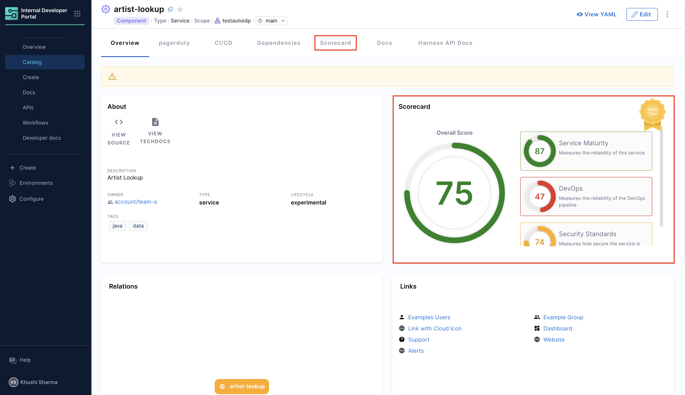
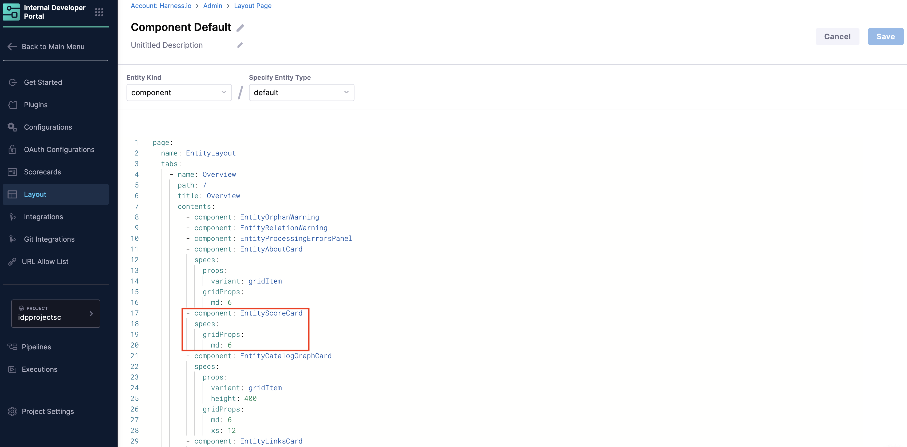
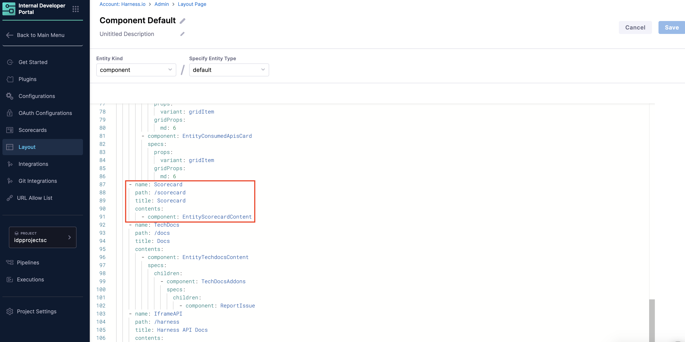

Scorecards help you measure software maturity and ensure adherence to organizational and industry best practices. Before creating your first scorecard, you need to enable the scorecard components in your IDP catalog.

---

## Scorecard View

Scorecards have two main UI components that are developer-facing and displayed in the Catalog:

1. **Card**: A small card on the Overview page that displays scores
2. **Tab**: A detailed tab view that shows check details and score computation



---

## Enable Scorecards

:::info

If Scorecard UI components are already visible on your Catalog component pages, you can skip this section and proceed directly to [Create a Scorecard](#create-a-scorecard).

:::

Follow these steps to add Scorecards to your catalog entities:

1. **Navigate to Layout Settings**
   - Go to the **Configure** -> **Layout** in Harness IDP. 
   - Go to **Catalog Entities**.
   - Select the catalog entity type where you want to add Scorecards. 

2. **Add Scorecard to the Overview Tab**
   - Find the **Overview** tab in the YAML
   - Add the following to its component section:

```yaml
- component: EntityScoreCard
    specs:
    gridProps:
        md: 6
```



3. **Add Scorecard Tab Component**
   - Under the **Tabs** section, add the following:

```yaml
- name: Scorecard
  path: /scorecard
  title: Scorecard
  contents:
    - component: EntityScorecardContent
```



---

## Create a Scorecard

:::info
Before you create a Scorecard, ensure that you have created some checks. To learn more about checks, go to [Scorecard Checks](/docs/internal-developer-portal/scorecards/create-scorecards/checks).
:::

Once you've enabled the Scorecard components, follow these steps to create your first scorecard:

1. **Navigate to Scorecards**
   - Go to **Configure** → **Scorecards**. 
   - Select **Create New Scorecard**. 

2. **Configure Basic Information**
   - **Name**: Enter a descriptive name for your scorecard. 
   - **Description**: Describe the scorecard's purpose and what it evaluates. 

3. **Add Filters (Optional)**
   
   Apply filters to specify which Catalog entities the scorecard should evaluate:

   - **Kind** (mandatory): Select the entity `kind` (e.g., Component, Service)
   - **Type** (mandatory): Select the `type` for the chosen kind
   - **Owners** (optional): Select specific entity owners to evaluate
   - **Tags** (optional): Filter entities by tags
   - **Lifecycle** (optional): Select lifecycle stages (e.g., production, experimental)
   - **Scope** (optional): Choose the evaluation scope:
     - **Project**: Evaluates entities within a specific project
     - **Org**: Evaluates entities within an organization
     - **Account**: Evaluates entities across the entire account
     - **No selection**: Evaluates entities across all scopes

4. **Add Checks**
   - Select the checks you want to include in your scorecard. To learn more about checks, go to [Scorecard Checks](/docs/internal-developer-portal/scorecards/create-scorecards/checks). 
   - Checks evaluate specific criteria and return Pass or Fail results. 

5. **Publish Scorecard**
   - Review your configuration
   - Click **Publish Scorecard** to make it active


:::info GitX Enabled
Scorecard calculations are based on entity data from the default branch of the associated Git repository. If you're using a remote Git repository to manage your Scorecard definitions, ensure that the YAML file is committed and pushed to the default branch. This behavior maintains a single source of truth and prevents confusion from incomplete or in-progress configurations.
:::

---

## Next Steps

After creating your scorecard:
- Learn how to [create custom checks](/docs/internal-developer-portal/scorecards/create-scorecards/checks) for your scorecards
- Explore available [data sources](/docs/internal-developer-portal/scorecards/create-scorecards/data-sources) for your checks
