import DocImage from '@site/src/components/DocImage';

Harness IDP allows you to integrate various data sources to collect specific data points for each software component. Once a data source is enabled, you can use it to create checks for your scorecards.

**Data Sources** are third-party providers that supply specific types of data for software components. Examples include GitHub, GitLab, Bitbucket, Harness, PagerDuty, Jira, and Kubernetes. **Data Points** are the specific pieces of information that each data source provides for a software component. Data points can be numbers, strings, or booleans.


A **Data Sources** tab is available on the **Scorecards** page where you can view all supported data sources and their corresponding data points.
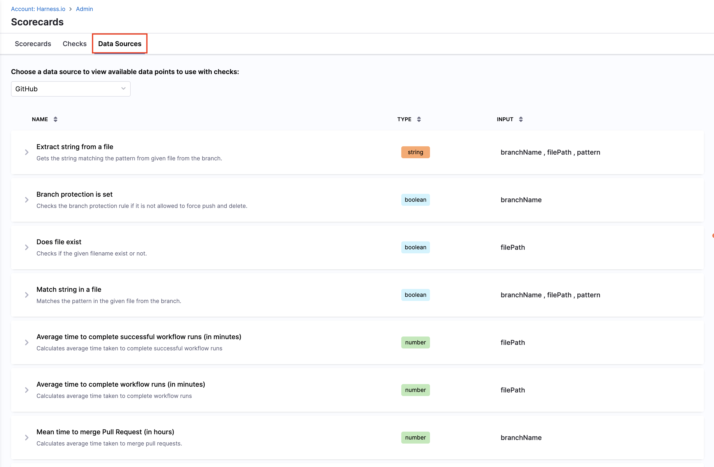

---

## Data sources

### Bitbucket

The following data points are available for the Bitbucket data source. All data points follow similar patterns to GitHub and GitLab, requiring the `backstage.io/source-location` annotation for repository identification.

#### Available data points:
1. [Branch Protection](#1-branch-protection) - See GitHub section for detailed description.
>This check works with repository-level branch restrictions. Bitbucket Cloud allows branch restrictions to be configured at both the repository and project levels. However, Bitbucket Cloud's REST API only exposes repository-level branch restrictions. Project-level restrictions, while enforced by Bitbucket across all repositories in a project, are not accessible via the API and therefore cannot be detected programmatically by any tool. To ensure this check works as expected, configure branch restrictions at the repository level. 
2. [File Existence](#2-file-existence) - See GitHub section for detailed description
3. [Mean Time to Merge Pull Request](#3-mean-time-to-merge-pull-request) - See GitHub section for detailed description
4. [Extract String from a File](#12-extract-string-from-a-file) - See GitHub section for detailed description
5. [Match String in a File](#13-match-string-in-a-file) - See GitHub section for detailed description

:::info
#### URL priority for branch name field

For Bitbucket data points that require a branch name, the same priority rules apply as mentioned in the [GitHub URL Priority section](#url-priority-for-branch-name-field) above.
:::

#### Prerequisites for Bitbucket connector

Configure the Bitbucket connector using **Email and API Token** authentication to ensure Scorecards can fetch Bitbucket data without permission-related issues.

<DocImage path={require('./static/bb-authentication.png')} />

Use the following credentials when setting up the connector:

- **Email**: Your Bitbucket account email address
- **API Token**: A Bitbucket API token with the required scopes

To create an API token, go to [Atlassian account security settings](https://id.atlassian.com/manage-profile/security/api-tokens).

The API token must include the following scopes:

- `read:repository:bitbucket`
- `read:project:bitbucket`
- `read:pullrequest:bitbucket`
- `read:workspace:bitbucket`
- `admin:project:bitbucket`
- `admin:repository:bitbucket`
- `admin:workspace:bitbucket`

---


### Catalog Info YAML

The Catalog Info YAML data source evaluates fields stored directly in an entity's `catalog-info.yaml`. It provides general entity checks available for any catalog entity kind, and [four structural checks](#aiasset-checks) specific to **AIAsset** entities.

**Available data points**:

| Check | Type | Description |
|---|---|---|
| `Annotation exists` | Boolean | Checks if the catalog YAML file has the given annotation configured or not. |
| `Evaluate expression (JEXL)` | String | Evaluates a JEXL expression on the catalog YAML file. |
| `Pagerduty is set` | Boolean | Checks if the catalog YAML file has the annotation `pagerduty.com/service-id` configured or not. |
| `Owner is defined and is not unknown` | Boolean | Checks if the catalog YAML file has the owner configured or not. |
| `System is defined and it exists` | Boolean | Checks if your component has `spec.system` defined and whether or not it is a valid entry in the catalog. |
| `Documentation exists` | Boolean | Checks if the catalog YAML file has the annotation `backstage.io/techdocs-ref` configured or not. |
| [AIAsset checks](#aiasset-checks) | Boolean, Number | Four structural checks for AIAsset entities covering discovery recency, asset ID prefix, provider, and source file path conventions. |

#### AIAsset checks

The AIAsset checks from **Catalog Info YAML** data source currently support assets discovered via the [IDP GitHub integration](/docs/internal-developer-portal/catalog/create-entity/catalog-discovery/github) only. The following example shows an AIAsset scorecard with all four checks applied to a plugin entity.

<DocImage path={require('../static/scorecard-results-aiassets.png')} />

<DocImage path={require('../static/scorecard-checks-aiassets.png')} />

**Available data points**:

| Check | Type | Description |
|---|---|---|
| `Days passed since last discovered (AIAsset)` | Number | Fetches the number of days since the AI asset was last rediscovered by the integration. Use this check with a threshold condition (for example, `<= 30`) to confirm the asset is still being actively indexed in its source system. |
| `Asset Id Prefix Match (AIAsset)` | Boolean | Checks whether `metadata.integration_properties.GitHub.asset_id` in the catalog YAML begins with the expected prefix for the asset's type: <br/><br/> Plugin → `p_` <br/> Skill → `s_` <br/> Command → `c_` <br/> Agent → `a_` |
| `Provider is set (AIAsset)` | Boolean | Checks whether the `metadata.integration_properties.GitHub.provider` field is configured in the catalog YAML. The field must be set to a recognized provider value (e.g., `OpenAI` or `Anthropic`) for the check to pass. |
| `Source File Pattern Match (AIAsset)` | Boolean | Checks whether the `metadata.integration_properties.GitHub.source_file` path in the catalog YAML follows the structural convention for the asset's type: <br/><br/> Skill → `**/skills/<name>/SKILL.md` <br/> Command → `**/commands/<name>.md` <br/> Agent → `**/agents/<name>.md` <br/> Plugin (definition) → `**/.claude-plugin/plugin.json` |

---

### GitHub

The following data points are available for the GitHub data source.

#### 1. Branch protection

**Objective:** Ensure that branch protection rules disallow force push and delete.

**Calculation Method:** Fetches the `backstage.io/source-location` annotation from the catalog YAML file to find repository details and verify the branch protection rules.

**Prerequisites:** 
- GitHub Connector with Admin access
- Provide suitable `backstage.io/source-location` annotation if the catalog YAML file is present outside the source GitHub repository

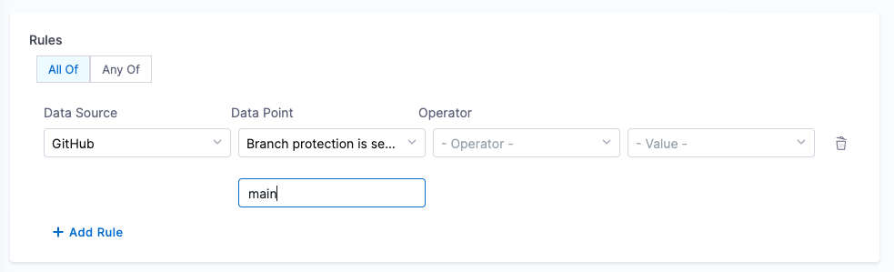

**Example YAML:**

```yaml
kind: "Component"
apiVersion: "backstage.io/v1alpha1"
metadata:
  name: order-service
  annotations:
    backstage.io/source-location: 'url:https://github.com/kubernetes/kubernetes/tree/master'
    ...
spec:
    ...
```

#### 2. File existence

**Objective:** Verify the existence of a specified file in the repository.

**Calculation Method:** Uses the `backstage.io/source-location` annotation to locate the repository and check for the file's presence. Make sure to mention the filename with extension or relative path from the root folder (e.g., README.md or docs/README.md) in the conditional input field.

**Prerequisites:** Provide suitable `backstage.io/source-location` annotation if the catalog YAML file is present outside the source GitHub repository.

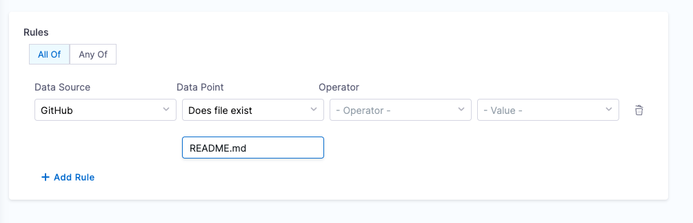

**Example YAML:**

```yaml
kind: "Component"
apiVersion: "backstage.io/v1alpha1"
metadata:
  name: order-service
  annotations:
    backstage.io/source-location: 'url:https://github.com/kubernetes/kubernetes/tree/master'
    ...
spec:
    ...
```

#### 3. Mean time to merge pull request

**Objective:** Calculate the average time taken to merge the last 100 pull requests.

**Calculation Method:** Retrieves repository details using `backstage.io/source-location` and calculates the average merge time.

**Prerequisites:** 
- Provide suitable `backstage.io/source-location` annotation if the catalog YAML file is present outside the source GitHub repository
- Make sure to mention the branch name in the conditional input field

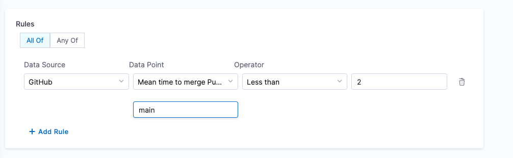

**Example YAML:**

```yaml
kind: "Component"
apiVersion: "backstage.io/v1alpha1"
metadata:
  name: order-service
  annotations:
    backstage.io/source-location: 'url:https://github.com/kubernetes/kubernetes/tree/master'
    ...
spec:
    ...
```

#### 4. Average time to complete successful workflow runs (in minutes)

**Objective:** Calculate the average time taken to complete **successful** workflow runs (in minutes).

**Calculation Method:** Fetches `backstage.io/source-location` annotation from catalog YAML file to find repository details and calculates the average time for the last 100 successful workflow runs to complete.

**Prerequisites:** 
- Provide suitable `backstage.io/source-location` annotation if the catalog YAML file is present outside the source GitHub repository
- Make sure to mention the workflow ID or filename in the conditional input field

#### 5. Average time to complete workflow runs (in minutes)

**Objective:** Calculate the average time taken to complete workflow runs (in minutes).

**Calculation Method:** Fetches `backstage.io/source-location` annotation from catalog YAML file to find repository details and calculates the average time for the last 100 workflow runs to complete.

**Prerequisites:** 
- Provide suitable `backstage.io/source-location` annotation if the catalog YAML file is present outside the source GitHub repository
- Make sure to mention the workflow ID or filename in the conditional input field

#### 6. Workflow success rate

**Objective:** Calculates success rate for the given workflow.

**Calculation Method:** Fetches `backstage.io/source-location` annotation from catalog YAML file to find repository details and calculates the success rate for the workflow.

**Prerequisites:** 
- Provide suitable `backstage.io/source-location` annotation if the catalog YAML file is present outside the source GitHub repository
- Make sure to mention the workflow ID or filename in the conditional input field

#### 7. Workflows count

**Objective:** Calculates total number of workflows.

**Calculation Method:** Fetches `backstage.io/source-location` annotation from catalog YAML file to find repository details and calculates the total number of workflows.

**Prerequisites:** Provide suitable `backstage.io/source-location` annotation if the catalog YAML file is present outside the source GitHub repository.

#### 8. Open code scanning alerts

**Objective:** Calculates the total number of open alerts reported in code scanning for the given severity.

**Calculation Method:** Fetches `backstage.io/source-location` annotation from catalog YAML file to find repository details and calculates the total number of open alerts reported in code scanning.

**Prerequisites:** 
- GitHub Connector with read access for code scanning alerts
- Provide suitable `backstage.io/source-location` annotation if the catalog YAML file is present outside the source GitHub repository
- Make sure to mention the severity type in the conditional input field

#### 9. Open dependabot alerts

**Objective:** Calculates the total number of open alerts reported by Dependabot for the given severity.

**Calculation Method:** Fetches `backstage.io/source-location` annotation from catalog YAML file to find repository details and calculates the total number of open alerts reported by Dependabot.

**Prerequisites:** 
- Provide suitable `backstage.io/source-location` annotation if the catalog YAML file is present outside the source GitHub repository
- Make sure to mention the severity type in the conditional input field

#### 10. Open secret scanning alerts

**Objective:** Calculates the total number of open alerts reported in secret scanning.

**Calculation Method:** Fetches `backstage.io/source-location` annotation from catalog YAML file to find repository details and calculates the total number of open alerts reported in secret scanning.

**Prerequisites:** 
- GitHub Connector with read access for secret scanning alerts
- Provide suitable `backstage.io/source-location` annotation if the catalog YAML file is present outside the source GitHub repository

#### 11. Open pull requests by Account

**Objective:** Calculates the total number of open pull requests raised by the given account.

**Calculation Method:** Fetches `backstage.io/source-location` annotation from catalog YAML file to find repository details and calculates the total number of open pull requests raised by account.

**Prerequisites:** 
- Provide suitable `backstage.io/source-location` annotation if the catalog YAML file is present outside the source GitHub repository
- Make sure to mention the username in the conditional input field

#### 12. Extract string from a file

**Objective:** Gets the string matching the pattern from given file from the branch.

**Calculation Method:** If a branch name is specified, it is utilized. However, if no branch name is provided, the system retrieves information from the catalog YAML file using the `backstage.io/source-location` annotation to determine the branch name and repository details. It is essential to specify the filename with its extension or provide the relative path from the root folder (e.g., README.md or docs/README.md) in the conditional input field. The filename can also be provided as a regex pattern. For example, for a file path `/backstage/blob/master/scripts/log-20240105.anyextension`, the regex would be `/backstage/blob/master/scripts/log-20240105\..*`. After fetching the file, the designated pattern is then searched within the file contents, and its value is extracted and returned.

:::info
#### URL priority for branch name field

In some data points, we take `branchName` as input. It is an optional field if the branch is mentioned in `source-location` in your entity YAML. It is suggested to provide a branchName if you want to use the same for all repositories; otherwise, we use the branch name mentioned in the `source-location`.

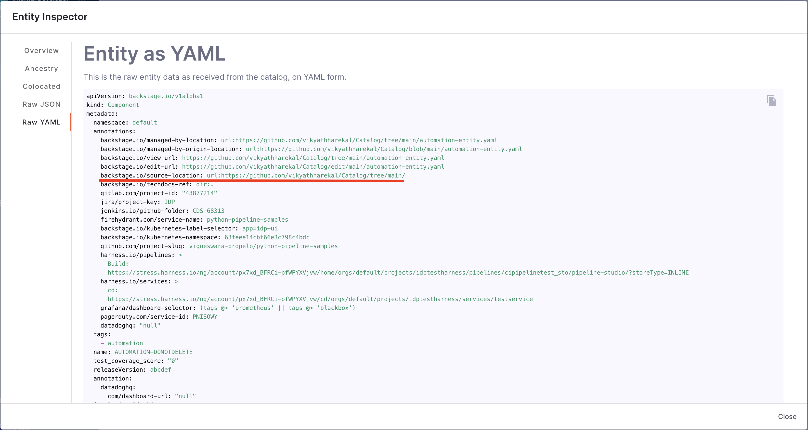

If you mention the `branchName` field as a check config other than what is present in the `source-location`, the priority order conditions are:

1. If it is in both, the check configuration will take precedence
2. If it is in only one, we will use that value
3. If it is in neither, the check will fail

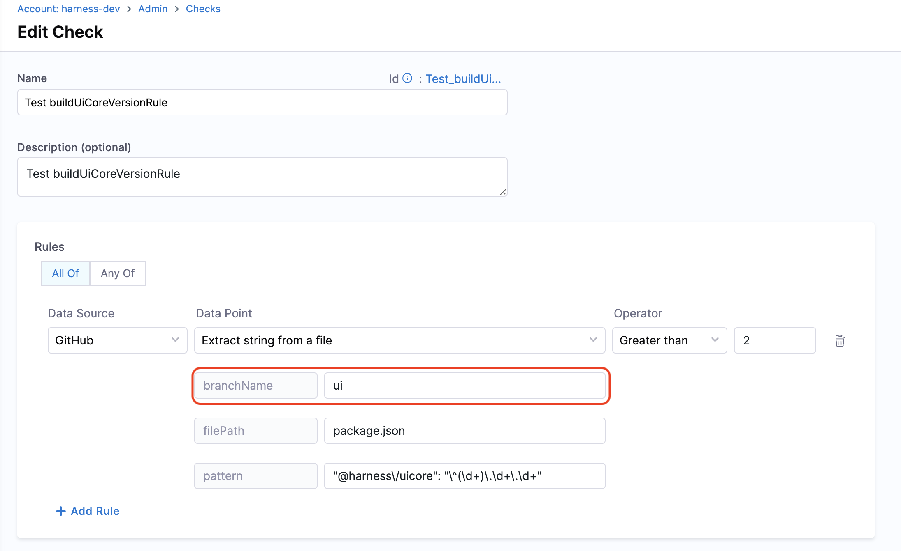
:::

**Prerequisites:** Provide suitable `backstage.io/source-location` annotation if the catalog YAML file is present outside the source GitHub repository.

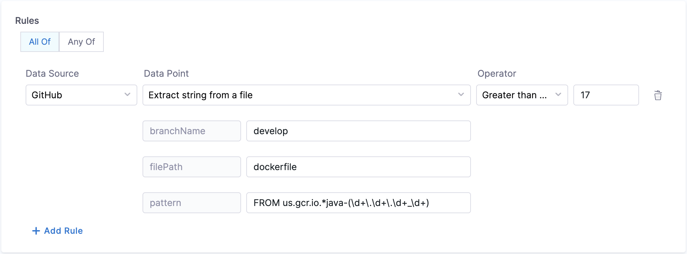

#### 13. Match string in a file

**Objective:** Matches the pattern in the given file from the branch.

**Calculation Method:** If a branch name is specified, it is utilized. However, if no branch name is provided, the system retrieves information from the catalog YAML file using the `backstage.io/source-location` annotation to determine the branch name and repository details. It is essential to specify the filename with its extension or provide the relative path from the root folder (e.g., README.md or docs/README.md) in the conditional input field. After fetching the file, the contents are examined to find the pattern. Returns true/false based on whether the pattern was found or not.

:::info
#### URL priority for branch name field

In some data points, we take `branchName` as input. It is an optional field if the branch is mentioned in `source-location` in **catalog-info.yaml**. It is suggested to provide a branchName if you want to use the same for all repositories; otherwise, we use the branch name mentioned in the `source-location`.


If you mention the `branchName` field as a check config other than what is present in the `source-location`, the priority order conditions are:

1. If it is in both, the check configuration will take precedence
2. If it is in only one, we will use that value
3. If it is in neither, the check will fail


:::

**Prerequisites:** Provide suitable `backstage.io/source-location` annotation if the catalog YAML file is present outside the source GitHub repository.

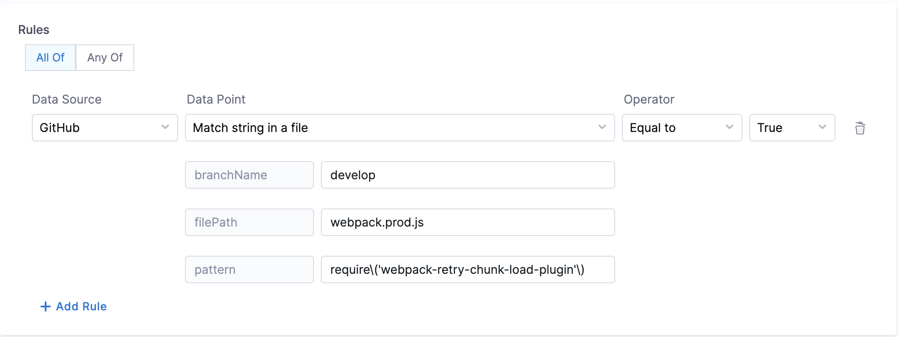

---

### GitLab

The following data points are available for the GitLab data source.

#### 1. Branch protection

**Objective:** Ensure that branch protection rules disallow force push and delete.

**Calculation Method:** Fetches `backstage.io/source-location` annotation from the catalog YAML file to find repository details and verify the branch protection rules.

**Prerequisites:** 
- GitLab Connector with Admin access
- Provide suitable `backstage.io/source-location` annotation if the catalog YAML file is present outside the source GitLab repository

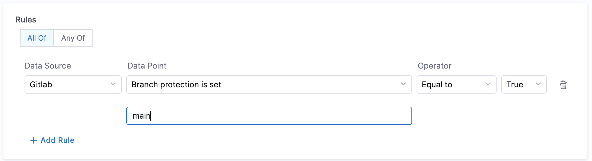

**Example YAML:**

```yaml
kind: "Component"
apiVersion: "backstage.io/v1alpha1"
metadata:
  name: order-service
  annotations:
    backstage.io/source-location: 'url:https://gitlab.com/kubernetes/kubernetes/tree/master'
    ...
spec:
    ...
```

#### 2. File existence

**Objective:** Verify the existence of a specified file in the repository.

**Calculation Method:** Uses the `backstage.io/source-location` annotation to locate the repository and check for the file's presence. Make sure to mention the filename with extension or relative path from the root folder (e.g., README.md or docs/README.md) in the conditional input field.

**Prerequisites:** Provide suitable `backstage.io/source-location` annotation if the catalog YAML file is present outside the source GitLab repository.

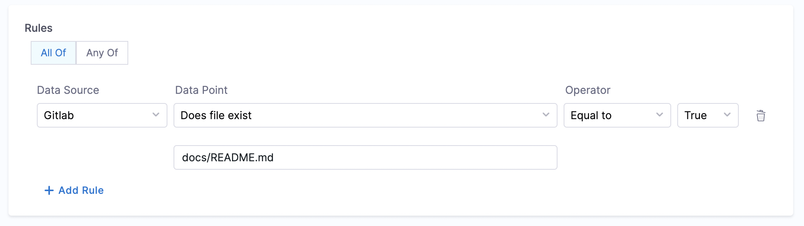

**Example YAML:**

```yaml
kind: "Component"
apiVersion: "backstage.io/v1alpha1"
metadata:
  name: order-service
  annotations:
    backstage.io/source-location: 'url:https://gitlab.com/kubernetes/kubernetes/tree/master'
    ...
spec:
    ...
```

#### 3. Mean time to merge pull request

**Objective:** Calculate the average time taken to merge the last 100 pull requests.

**Calculation Method:** Retrieves repository details using `backstage.io/source-location` and calculates the average merge time.

**Prerequisites:** 
- Provide suitable `backstage.io/source-location` annotation if the catalog YAML file is present outside the source GitLab repository
- Make sure to mention the branch name in the conditional input field

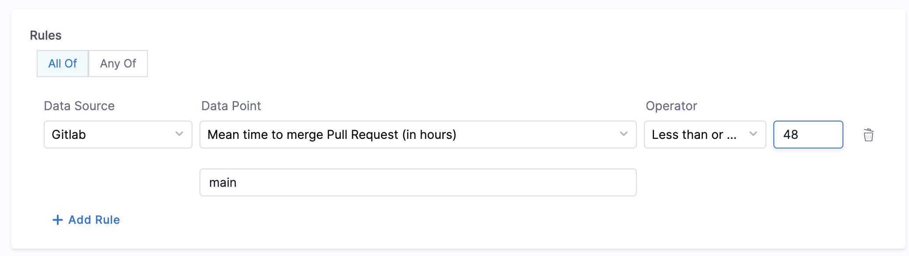

**Example YAML:**

```yaml
kind: "Component"
apiVersion: "backstage.io/v1alpha1"
metadata:
  name: order-service
  annotations:
    backstage.io/source-location: 'url:https://gitlab.com/kubernetes/kubernetes/tree/master'
    ...
spec:
    ...
```

#### 4. Extract string from a file

**Objective:** Gets the string matching the pattern from given file from the branch.

**Calculation Method:** If a branch name is specified, it is utilized. However, if no branch name is provided, the system retrieves information from the catalog YAML file using the `backstage.io/source-location` annotation to determine the branch name and repository details. It is essential to specify the filename with its extension or provide the relative path from the root folder (e.g., README.md or docs/README.md) in the conditional input field. After fetching the file, the designated pattern is then searched within the file contents, and its value is extracted and returned.

:::info
#### URL priority for branch name field

In some data points, we take `branchName` as input. It is an optional field if the branch is mentioned in `source-location` in **catalog-info.yaml**. It is suggested to provide a branchName if you want to use the same for all repositories; otherwise, we use the branch name mentioned in the `source-location`.


If you mention the `branchName` field as a check config other than what is present in the `source-location`, the priority order conditions are:

1. If it is in both, the check configuration will take precedence
2. If it is in only one, we will use that value
3. If it is in neither, the check will fail


:::

**Prerequisites:** Provide suitable `backstage.io/source-location` annotation if the catalog YAML file is present outside the source GitLab repository.

#### 5. Match string in a file

**Objective:** Matches the pattern in the given file from the branch.

**Calculation Method:** If a branch name is specified, it is utilized. However, if no branch name is provided, the system retrieves information from the catalog YAML file using the `backstage.io/source-location` annotation to determine the branch name and repository details. It is essential to specify the filename with its extension or provide the relative path from the root folder (e.g., README.md or docs/README.md) in the conditional input field. After fetching the file, the contents are examined to find the pattern. Returns true/false based on whether the pattern was found or not.

:::info
#### URL priority for branch name field

In some data points, we take `branchName` as input. It is an optional field if the branch is mentioned in `source-location` in **catalog-info.yaml**. It is suggested to provide a branchName if you want to use the same for all repositories; otherwise, we use the branch name mentioned in the `source-location`.


If you mention the `branchName` field as a check config other than what is present in the `source-location`, the priority order conditions are:

1. If it is in both, the check configuration will take precedence
2. If it is in only one, we will use that value
3. If it is in neither, the check will fail


:::

**Prerequisites:** Provide suitable `backstage.io/source-location` annotation if the catalog YAML file is present outside the source GitLab repository.

---


### Harness

The Harness data source provides insights into your CI/CD pipelines and deployments.

#### Before you begin

To use Harness as a data source for Scorecards, you need to:

1. Add the Harness annotation in your `catalog-info.yaml` file:

```yaml
metadata:
  annotations:
    harness.io/pipelines: |
      labelA: <harness_pipeline_url>
      labelB: <harness_pipeline_url>
```

2. The pipeline URL format should be:
```
https://app.harness.io/ng/account/<ACCOUNT_ID>/module/ci/orgs/<ORG_ID>/projects/<PROJECT_ID>/pipelines/<PIPELINE_ID>/
```

#### Available data points:

1. **Deployment Frequency (Per Day)**
   - Calculates the average number of deployments per day over the last 30 days

2. **Deployment Frequency (Per Week)**
   - Calculates the average number of deployments per week over the last 12 weeks

3. **Deployment Frequency (Per Month)**
   - Calculates the average number of deployments per month over the last 6 months

4. **Change Failure Rate**
   - Calculates the percentage of deployments that failed in the last 30 days

5. **Mean Time to Restore (MTTR)**
   - Calculates the average time taken to restore service after a failed deployment

6. **CI Pipeline Success Rate (Last 7 Days)**
   - Percentage of successful CI pipeline executions in the past 7 days

7. **CI Pipeline Success Rate (Last 30 Days)**
   - Percentage of successful CI pipeline executions in the past 30 days

#### Error scenarios

**Missing Harness Annotation:**
If the `harness.io/pipelines` annotation is missing from the catalog-info.yaml file, the check will fail with an appropriate error message indicating that the annotation is required.

**Invalid Pipeline URL:**
If the pipeline URL format is incorrect or the pipeline does not exist, the check will fail with an error message.

---

### Jira

The Jira data source provides insights into your project management and issue tracking.

#### Available data points:

1. **Open Issues Count**
   - Calculates the total number of open issues for a project

2. **Issues by Priority**
   - Counts issues based on priority (High, Medium, Low)

3. **Issues by Status**
   - Counts issues based on status (To Do, In Progress, Done)

4. **Average Time to Close Issues**
   - Calculates the average time taken to close issues

5. **Overdue Issues Count**
   - Counts the number of issues past their due date

#### Prerequisites:

- Add the Jira project key annotation in your `catalog-info.yaml`:

```yaml
metadata:
  annotations:
    jira/project-key: MYPROJ
```

---

### Kubernetes

The Kubernetes data source provides insights into your Kubernetes deployments and resources.

#### Before you begin

1. **Enable Kubernetes Plugin:**
   - The Kubernetes plugin must be enabled in your IDP
   - Configure the plugin with appropriate cluster access

2. **Add Kubernetes Annotation:**
   - Add the `backstage.io/kubernetes-id` annotation to your `catalog-info.yaml`:

```yaml
metadata:
  annotations:
    backstage.io/kubernetes-id: my-service
```

#### Available data points:

1. **Pod Count**
   - Returns the number of pods running for the service

2. **Deployment Status**
   - Checks if the deployment is healthy and running

3. **Resource Utilization**
   - Monitors CPU and memory usage

4. **Replica Count**
   - Returns the number of replicas configured

---


### PagerDuty
The PagerDuty data source provides insights into your incident management and on-call schedules.

#### Before you begin

1. **Enable PagerDuty Plugin:**
   - The PagerDuty plugin must be enabled in your IDP

2. **Add PagerDuty Annotation:**
   - Add the PagerDuty integration key to your `catalog-info.yaml`:

```yaml
metadata:
  annotations:
    pagerduty.com/integration-key: <your-integration-key>
```

#### Available data points:

1. **Open Incidents Count**
   - Returns the number of currently open incidents

2. **Mean Time to Acknowledge (MTTA)**
   - Calculates the average time taken to acknowledge incidents

3. **Mean Time to Resolve (MTTR)**
   - Calculates the average time taken to resolve incidents

4. **Incidents in Last 30 Days**
   - Counts the total number of incidents in the past 30 days

5. **On-Call Schedule Status**
   - Checks if an on-call schedule is configured

#### Error scenarios

**Missing PagerDuty Annotation:**
If the PagerDuty annotation is missing from the catalog-info.yaml file, the check will fail with an error message indicating that the annotation is required.

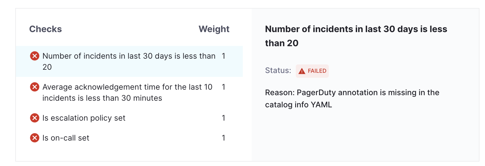

---


## Custom data sources

Custom data sources enable you to extend Harness IDP's scorecard capabilities beyond the out-of-the-box integrations. This is particularly useful when you want to build scorecards for tools that aren’t natively supported or when you need to enrich existing catalog entities with additional metadata.

There are two primary approaches to working with data sources in Harness IDP:

1. **Out-of-the-Box Data Sources**: Native integrations (GitHub, GitLab, Jira, PagerDuty, etc.) that automatically fetch data from connected tools
2. **Custom Data Sources**: User-defined data ingested via the Catalog Ingestion API, allowing you to bring in data from any source

#### When to use custom data sources

Consider using custom data sources when:

- **Tool Not Natively Supported**: You’re using a tool that doesn’t have an out-of-the-box integration (e.g., custom testing frameworks, proprietary tools, internal systems)
- **Multiple Data Sources**: You want to combine data from multiple tools into a single metric

Use the Catalog Ingestion API to programmatically update your catalog entities with custom data. The API accepts the full entity YAML and updates the catalog.

#### Steps
1. **Create a Custom Check using the Catalog Expressions Data Point**
   - Navigate to **Configure** → **Scorecards** → **Checks**
   - Create a new check and select Catalog as the data source
   - Use catalog expressions to reference your custom data

2. **Ingest Data into the Catalog using the API**
   - Use the Catalog Ingestion API to push your custom data
   - You can use a Python script or any other method to automate this process

3. **Schedule Periodic Data Updates**
   - Set up a cron job or scheduled process to push data periodically and keep your catalog up-to-date
   - You can use a scheduled Harness pipeline, a cron job, or any other automation to trigger the ingestion API at regular intervals (e.g., hourly, daily)
   - This ensures your custom data remains current and reflects the latest information from your data sources

Watch [this video](https://youtu.be/MB-IWGoYjOo?si=J5GgmUItG1TQ-0M1) to see a working example. Here is a [sample Harness pipeline](https://github.com/harness-community/idp-samples/blob/main/idp-pipelines/Catalog_Ingestion_Pipeline.yaml) with a Python script for ingestion.

---

## Next steps

- Learn how to [create custom checks](/docs/internal-developer-portal/scorecards/create-scorecards/checks) using these data sources
- Explore scorecard tutorials for advanced use cases:
  - [Track Migrations using Scorecards](/docs/internal-developer-portal/scorecards/tutorials/track-migrations)
  - [Harness OPA using Scorecards](/docs/internal-developer-portal/scorecards/tutorials/opa-implementation)
- Review how to [manage your scorecards](/docs/internal-developer-portal/scorecards/manage-scorecards)
