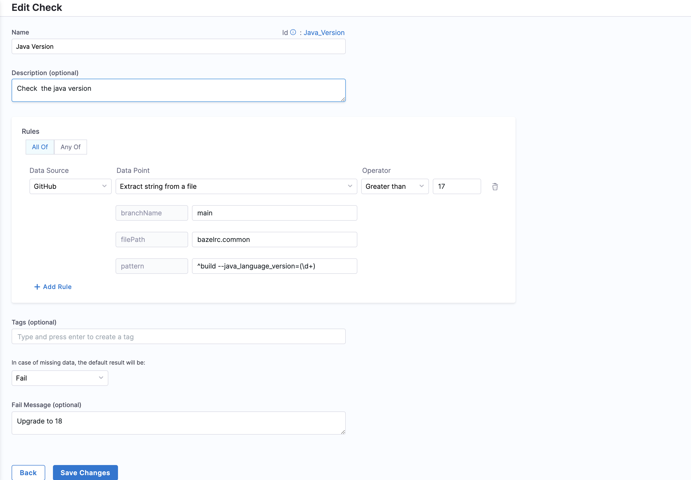
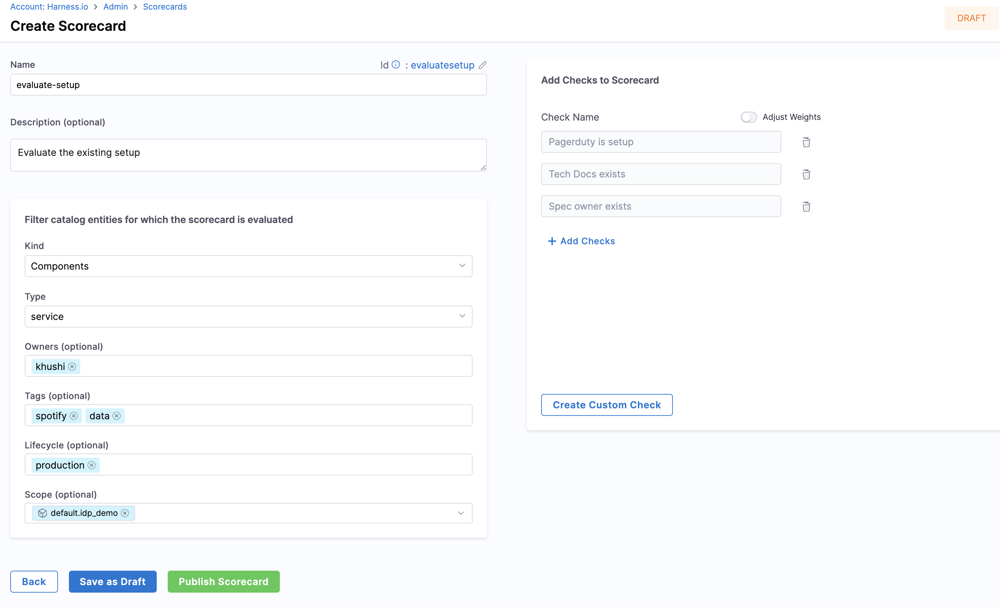
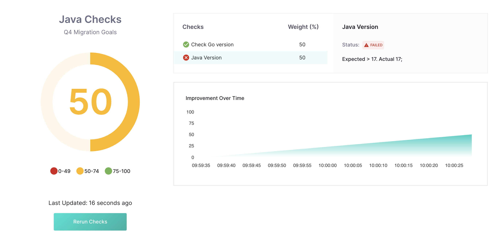

You can use [Scorecards](./scorecard) for tracking and driving migrations. You can use the Harness IDP Data Points for git-based Data Sources (GitHub, GitLab, etc.) to extract information from files using regex patterns. You can use these to create custom checks in Scorecards that can match and extract specific string patterns from any file in your source code. This feature is particularly useful for tracking versions in various files, such as Bazel for Java, Dockerfile, go.mod for Go, package.json for React and Javascript, manifest files, and so on.

This tutorial shows how you can build some custom checks using these Data Points to track library and language versions from the contents of metadata files.

Before starting, ensure you have:

* An active Harness IDP account, at present IDP is enabled on request. [Submit this form to enable IDP in your Harness account.](https://www.harness.io/demo/internal-developer-portal)
* A [Harness Git connector](/docs/category/code-repo-connectors) with API access enabled.
* A [registered software component](https://developer.harness.io/tutorials/internal-developer-portal/register-component-in-catalog) for which you want to track migrations.
* If your `catalog-info.yaml` isn't stored at the root of your source code repo, make sure the `backstage.io/source-location` annotation appropriately points to the correct source code location.
   To check this, go to **Catalog**, select the relevant **Software Component**, select **More Options** (&vellip;), select **Inspect Entity**, and then select **Raw YAML**.

   

   

## Set up a custom check

1. Under **Admin**, select **Scorecards**, and then go to the **Checks** tab and select **Create Custom Check**.

   

2. Enter a Name and Description for the custom check.
3. Select the git provider data source, such as GitHub, and the `extract string from a file` data point to extract the version number.
4. Specify the branch. If you know the branch name, specify it directly. If not, Harness uses the branch from the `backstage.io/source-location` annotation.

   Ideally, `backstage.io/source-location` is taken from the root of the `catalog-info.yaml`. If your services aren't stored there, you need to add an annotation in your `catalog-info.yaml`, for example:

   ```YAML
   metadata:
     annotations:
       backstage.io/source-location: url:https://github.com/my-org/my-service/
   ```

   A `Location` reference that points to the source code of the entity (typically a `Component`) is useful when catalog files do not get ingested from the source code repository itself. If the URL points to a folder, it is important that it is suffixed with a `/` in order for relative path resolution to work consistently.

5. Defining the File. Specify the filename with its extension or provide the relative path from the root folder.

   For example, use `.bazelrc`, `package.json`, or `manifest/Dockerfile`. Filenames can be regex patterns. For example, the path `/backstage/blob/master/scripts/log-20240105.anyextension` could be represented in regex as `/backstage/blob/master/scripts/log-20240105\..*`.

6. Specify the pattern. For this tutorial, you're tracking the Java Version of a project using the bazelrc file, which mentions the java version as `build --java_language_version=17`. The corresponding regex pattern for that is `^build --java_language_version=(\d+)`.

   You need to wrap the string pattern that you want to match in `()`. For example, the above pattern groups the number `(\d+)`. Another example would be if you tried to match the string `go 1.21` in a go.mod file; the corresponding regex would be `^go\s(\d+\.\d+)$`. Finally, another regex pattern example for package.json file content `"eslint": "^7.7.0",` would be `"eslint":\s"\^(\d+\.\d+\.\d+)",`.

   ChatGPT is useful for generating regex patterns, and [regex101](https://regex101.com/) is useful for validating the resulting pattern.

   

## Create a Scorecard

After creating checks, add them to a Scorecard.

1. Go to **Scorecards** and select **Create New Scorecard**.
2. Enter a Name, Description, and Owner (same as that of the software component you want to add this scorecard to).
3. Select the Checks you created above to track the migration.
4. Publish the Scorecard.

   

### Check scores

To check the score, go to the software component in your catalog, and view the score under the Scorecards tab. You can re-run checks to re-compute scores instantaneously.



### Score calculations

* **Pattern Extraction (Extracting Data):** The system fetches the file, searches for the specified regex pattern within its contents, and then extracts and returns the value.
* **Return Value (Result):** The system returns a true/false value based on whether the pattern was found in the file or whether a value is the same as desired.

## Troubleshooting

* **Incorrect File Path:** Ensure the file path is relative to the root folder of the repository.
* **Pattern Matching Errors:** Verify the accuracy of the pattern you are trying to match. You can use a tool like [regex101](http://regex101.com/) to do that. Also make sure to wrap the string you're trying to match in parenthesis.

## Best Practices

* Regularly update the `backstage.io/source-location` annotation to reflect any changes in the repository structure.
* Check the regex used for pattern matching.
