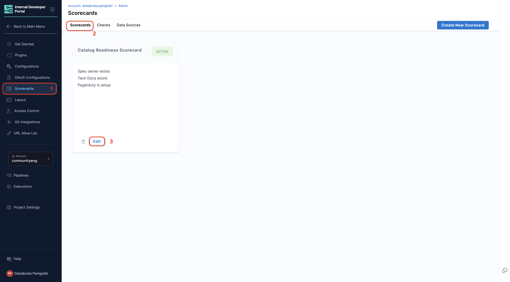

Once you've created [Scorecards](/docs/internal-developer-portal/scorecards/create-scorecards/create-scorecard.md) and [Checks](/docs/internal-developer-portal/scorecards/create-scorecards/checks.md), you can monitor their performance, track trends, refresh evaluations, and view detailed check results. This guide covers all aspects of managing your scorecards effectively.

---

## Update Scorecards

You can update a Scorecard's configuration by editing the Scorecard in the admin view of Harness IDP.

1. Click **Configure** in the side navigation bar to open the admin view of Harness IDP. 
2. Click **Scorecards** to view all available Scorecards in your account. 
3. Select the Scorecard you want to update and click on **Edit**. 

4. Update the Scorecard configuration and click **Update**.
 

---

## Refresh Scorecards

You can manually refresh a component's Scorecard evaluation from the Harness IDP UI, triggering an on-demand evaluation and updating the component's score in real time.

1. Navigate to the **component** in the catalog for which you want to refresh the Scorecard evaluation
2. Click **Scorecard - Overall Score** from either the **overview page** or the navigation bar at the top

3. On the **Scorecard page**, locate the specific Scorecard you want to refresh and click **Rerun Checks**

This will manually trigger a refresh, updating the component's score immediately.

---

## View Check Details

You can view detailed information about each check's execution status directly from the entity's Scorecard view. This helps you understand why a check passed or failed and take appropriate action.

#### Access Check Details

1. Navigate to the entity details view in the Catalog
2. Click on **Scorecard** from the navigation bar
3. Click on any **Check** to view its detailed execution results

#### Passed Checks

When a check passes, you'll see a "Passed" status with a confirmation message.

**What You'll See:**
- **About the check**: Description of what the check validates
- **Rule Expression**: Toggle between two views:
  - **JQL View**: Shows the JEXL expression that was evaluated
  
  

  - **Visual View**: Displays the rule in a basic format showing the data point, condition, and resulted value
  
  

#### Failed Checks

When a check fails, you'll see a "Failed" status with an **AI-powered explanation** of why the check failed and what needs to be fixed.

**What You'll See:**
- **About the check**: Description of what the check validates
- **Rule Expression**: Toggle between two views:
  - **JQL View**: Shows the JEXL expression that was evaluated
  
  
  
  - **Visual View**: Displays a table with all rules, their conditions, and the actual resulted values that caused the failure
  
  

The Visual view is particularly helpful for failed checks as it shows you exactly which data points didn't meet the expected criteria, making it easier to troubleshoot and resolve issues.

---

## Disable Scorecards

If you need to temporarily or permanently disable scorecards, follow these steps:

#### Remove Scorecard Components from Catalog Pages

1. Navigate to the **Layout** section in IDP **Admin**
2. Comment out the Scorecard-related lines you added under **Layout** pages to remove the Scorecard components from the Catalog pages

#### Change Scorecard Status to Draft

Additionally, you can change the status of all your Scorecards to "draft". This ensures that:
- Scorecard computations will not run
- Scorecards will not be shown to developers

---

## Delete Scorecards

To delete a Scorecard, follow these steps:

1. Navigate to the **Scorecards** section in IDP **Admin** view. 
2. Select the Scorecard you want to delete. 
3. Click **Delete**. 

---

## Scorecard Execution Schedule

Understanding when scorecards and checks run helps you plan your evaluations and troubleshooting.

#### Scorecard Trends Dashboard Updates
- The Trends Dashboard updates **every 24 hours**
- Newly created Scorecards (or Checks) will appear in the dashboard after the next update at **12:00 AM UTC**

#### Scorecard Check Jobs
- Check jobs run **twice a day** with a **12-hour interval** between each run
- If you manually run a check now, the next automatic run will occur after 12 hours

---

## Next Steps

- Learn how to [create custom checks](/docs/internal-developer-portal/scorecards/create-scorecards/checks) for your scorecards
- Explore available [data sources](/docs/internal-developer-portal/scorecards/create-scorecards/data-sources) for your checks
- Review scorecard tutorials for advanced use cases:
  - [Track Migrations using Scorecards](/docs/internal-developer-portal/scorecards/tutorials/track-migrations)
  - [Harness OPA using Scorecards](/docs/internal-developer-portal/scorecards/tutorials/opa-implementation)