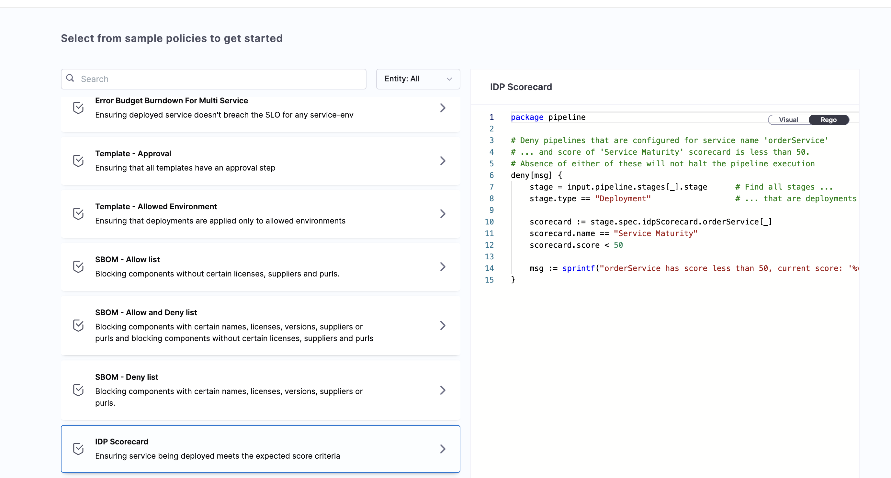
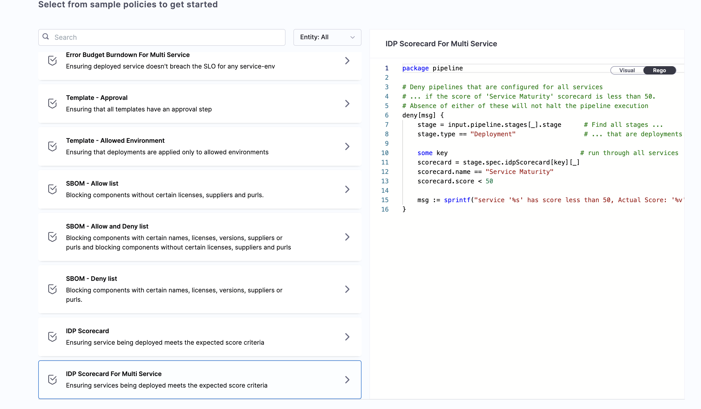
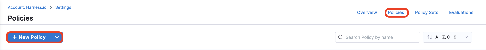

Harness Policy As Code uses [Open Policy Agent (OPA)](https://www.openpolicyagent.org/) as the central service to store and enforce policies for the different entities and processes across the Harness platform. For more information about Harness Policy as Code, go to [Harness Governance Overview](https://developer.harness.io/docs/platform/governance/policy-as-code/harness-governance-overview) and [Harness Governance Quickstart](https://developer.harness.io/docs/platform/governance/policy-as-code/harness-governance-quickstart).

You can centrally define and store policies and then select where (which entities) and when (which events) they will be applied.

Policies use OPA authoring language **Rego**. For more information, go to [OPA Policy Authoring](https://academy.styra.com/courses/opa-rego).

## Examples with Harness OPA using Scorecards

There are two sets of OPA policies that you can apply to any CD pipeline.

import Tabs from '@theme/Tabs';
import TabItem from '@theme/TabItem';

<Tabs>
<TabItem value="a" label="Example: Pipeline > On Save (Policy Used: IDP Scorecard)" default>

When a Pipeline is saved, the service used in the pipeline should have a score more than the set limit, before being able to save the pipeline.



```REGO
package pipeline

# Deny pipelines that are configured for service name 'orderService'
# ... and score of 'Service Maturity' scorecard is less than 50.
# Absence of either of these will not halt the pipeline execution
deny[msg] {
    stage = input.pipeline.stages[_].stage      # Find all stages ...
    stage.type == "Deployment"                  # ... that are deployments

    scorecard := stage.spec.idpScorecard.orderService[_]
    scorecard.name == "Service Maturity"
    scorecard.score < 50

    msg := sprintf("orderService has score less than 50, current score: '%v'", [scorecard.score])
}
```

In the REGO script we use `stage.spec.idpScorecard.orderService[_]` to fetch the [Harness service ID](/docs/continuous-delivery/get-started/key-concepts.md#service) mentioned in the annotation `harness.io/cd-serviceId: <SERVICE_IDENTIFIER>`. If you have followed the onboarding guide then this annotation is auto ingested in your `catalog-info.yaml` or-else you have to manually add it. 

* **Success:** Check the Score for the service you're using in your pipeline to be above the set limit so that when you save the Pipeline, the policy rule is evaluated and returns success.
* **Warning:** A warning message appears: Your Score for the service used needs to be more than 50. If you save the Pipeline and deploy, Harness will throw an error.
* **Failure:** You configure a Pipeline with a Deploy stage that deploys to a prod environment with a service having Score less than the set limit. When you save the Pipeline, Harness throws an error message indicating the rule was enforced and the Pipeline fails validation.

</TabItem>
<TabItem value="b" label="Example: Pipeline > On Run (Policy Used: IDP Scorecard For Multi Service )">

On deployment, I need all the services used in my pipeline to have a Score above 50.



```REGO
package pipeline

# Deny pipelines that are configured for all services
# ... if the score of 'Service Maturity' scorecard is less than 50.
# Absence of either of these will not halt the pipeline execution
deny[msg] {
    stage = input.pipeline.stages[_].stage      # Find all stages ...
    stage.type == "Deployment"                  # ... that are deployments

    some key                                   # run through all services
    scorecard = stage.spec.idpScorecard[key][_]
    scorecard.name == "Service Maturity"
    scorecard.score < 50

    msg := sprintf("service '%s' has score less than 50, Actual Score: '%v'", [key, scorecard.score])
}
```
* **Success:** You deploy the Pipeline and during the dry run the Scores of all the services you have used in the pipeline turns to be more than the set limit(here: 50). As a result, the dry run progresses. Harness indicates that the rule was evaluated and the action was valid.
* **Failure:** Some of the services you have used have a score less than the set limit(here: 50). As a result, the dry run fails. Harness indicates that a rule was enforced and the deployment is prevented.

</TabItem>
</Tabs>

## Tutorial - Harness Policy As Code for Services using Scorecards

This tutorial explains how you can create a policy and apply it to all services in your account. The policy is evaluated on the service-level based on the score fetched from scorecards and the conditions set by users. The policy triggers on pipeline events, such as saving a pipeline, which occurs during Connector Creation and Updates.

1. Go to **Account Setting** under **Administrative Settings**.

   

2. Select **Policies** under **Security and Governance**.

   

3. Go to the **Policies** tab and select **New Policy**.

   

4. Add a name to your policy and then select **Apply**.

   

5. On the Library, select **IDP Scorecard** and select **Use this Sample**.

   

6. Test and save the policy.

7. Go to **Policy Sets** and select **New Policy Set**.

8. Enter a **Name**, select the **Entity** to apply it to, and select the event for which it should be evaluated.

   

9. Add the policy you created previously, and then change the type to **Warn & Continue**. Then select **Apply**.

   

    

10. Finish and save your policy set. You can now use this policy set in your CD pipelines.
