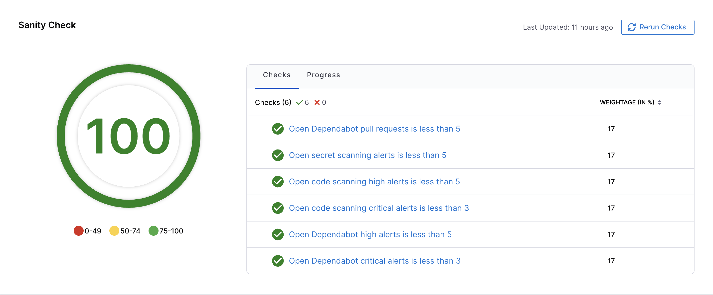
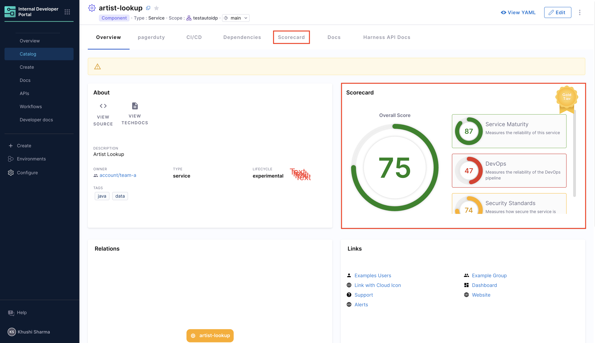

Scorecards help you measure and improve software quality by evaluating your services against organizational standards and best practices. They provide a clear, quantifiable view of software maturity, helping developers identify areas for improvement and teams make informed decisions about software adoption.

---

## What are Scorecards?

Scorecards are evaluation frameworks that assess your software components against predefined criteria. They help you:

- **Measure Software Maturity**: Evaluate the robustness and reliability of software components
- **Assess Best Practices**: Ensure software adheres to organizational and industry standards
- **Gamification**: Encourage developers to adhere to standards by providing scores
- **Confidence Estimation**: Help teams estimate the reliability of software based on its score

### Key Concepts

- **[Check](/docs/internal-developer-portal/scorecards/create-scorecards/checks.md)**: A check is a query performed against a data point for a software component which results in either `Pass` or `Fail`
- **[Data Source](/docs/internal-developer-portal/scorecards/create-scorecards/data-sources.md)**: Data Sources are third-party providers which can provide a specific type of data for a software component. Example - GitHub, GitLab, Harness, PagerDuty, etc.
- **[Data Points](/docs/internal-developer-portal/scorecards/create-scorecards/data-sources.md)**: For each software component, every data source provides some data points. The data points could be a number, a string, or a boolean

<DocImage path={require('./static/concept-scorecard.png')}/>

Each scorecard contains multiple checks that evaluate specific aspects of your services, such as:

- **Code Quality**: Test coverage, code scanning alerts, and linting standards
- **Security**: Vulnerability scanning, secret detection, and branch protection
- **Documentation**: README files, API documentation, and TechDocs
- **Operational Readiness**: Monitoring setup, incident management, and deployment frequency
- **Compliance**: License compliance, policy adherence, and regulatory requirements

Scorecards assign a score to each service based on how well it meets these criteria, making it easy to track progress and identify areas that need attention.

---

## Scorecard View 

Scorecards are integrated directly into your service catalog, making it easy for developers to see their service scores at a glance.

#### Overview Card

A compact scorecard card appears on each service's overview page, displaying:
- Overall scorecard score as a percentage
- Number of passed and failed checks
- Quick visual indicator of service health

#### Detailed Scorecard Tab

Click on the Scorecard tab to view comprehensive information:
- Individual check results (Pass/Fail)
- AI-powered explanations for failed checks
- Actionable recommendations to improve scores
- Historical trends and score changes over time

---

## Checks

Checks are the building blocks of scorecards. Each check evaluates a specific criterion and returns either **Pass** or **Fail**. You can create custom checks using:

- **Basic Rules**: Simple evaluations with a single data point and operator (e.g., "README file exists")
- **Advanced Rules**: Complex evaluations using JEXL expressions (e.g., "Test coverage > 80% AND no critical vulnerabilities")
- **Custom Data**: Extract data from files using regex patterns or ingest custom data via the Catalog Ingestion API

Learn more in the [Checks documentation](/docs/internal-developer-portal/scorecards/create-scorecards/checks).

---

## Data Sources

Data sources provide the information that checks evaluate. Harness IDP supports multiple data sources including:

- **Git Providers**: GitHub, GitLab, Bitbucket
- **Development Tools**: Jira, PagerDuty
- **Infrastructure**: Kubernetes, Harness CI/CD
- **Catalog**: IDP entity metadata and annotations
- **Custom Data**: Ingest data from any source using the Catalog Ingestion API

Each data source provides specific data points (numbers, strings, or booleans) that you can use in your checks.

Learn more in the [Data Sources documentation](/docs/internal-developer-portal/scorecards/create-scorecards/data-sources).

---

## Get Started with Scorecards

Follow these steps to start using scorecards in your developer portal:

1. **Enable Scorecard UI Components**: Add scorecard components to your catalog layout so developers can see scores on service pages. See [Enable Scorecard](/docs/internal-developer-portal/scorecards/create-scorecards/create-scorecard#enable-scorecards) for detailed instructions.

2. **Create Checks**: Define the criteria you want to evaluate. Create custom checks using data from various sources. Learn more in [Scorecard Checks](/docs/internal-developer-portal/scorecards/create-scorecards/checks).

3. **Create Your First Scorecard**: Combine checks into a scorecard, add filters to target specific services, and publish. Follow the [Create a Scorecard](/docs/internal-developer-portal/scorecards/create-scorecards/create-scorecard) guide.

4. **View and Track Results**: Check scores on service pages, view detailed check results, and monitor trends over time. See [Manage Scorecards](/docs/internal-developer-portal/scorecards/manage-scorecards) for more information.

  
