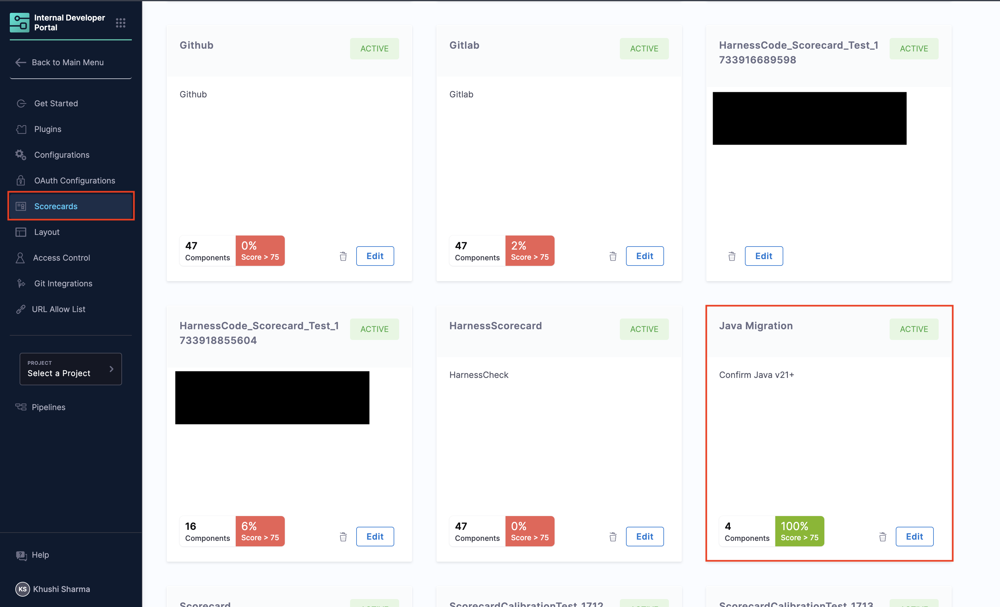
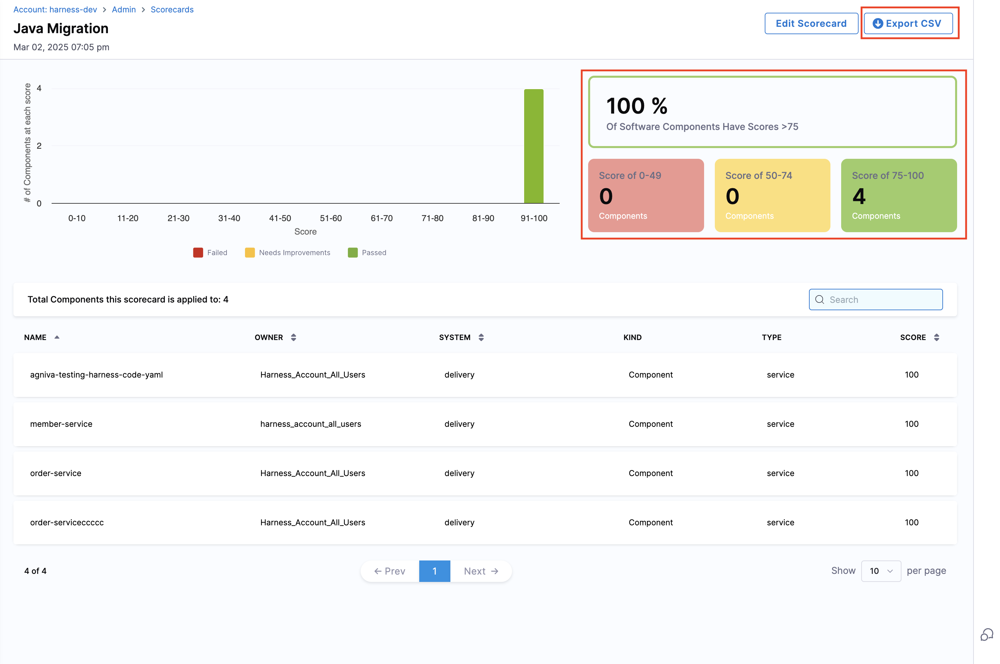
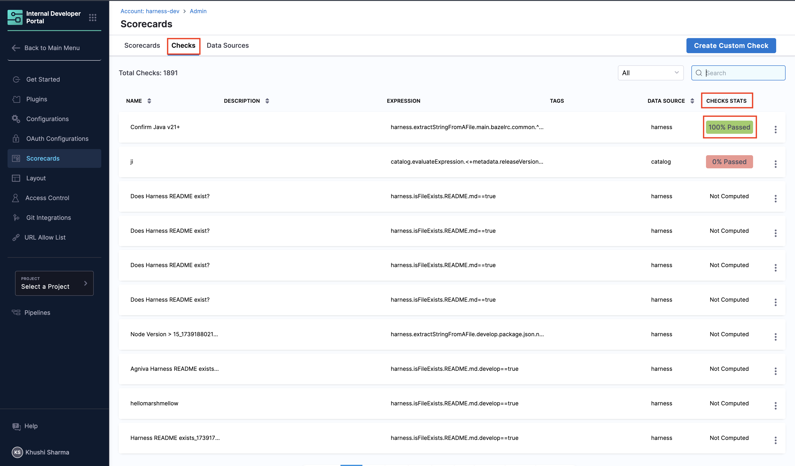
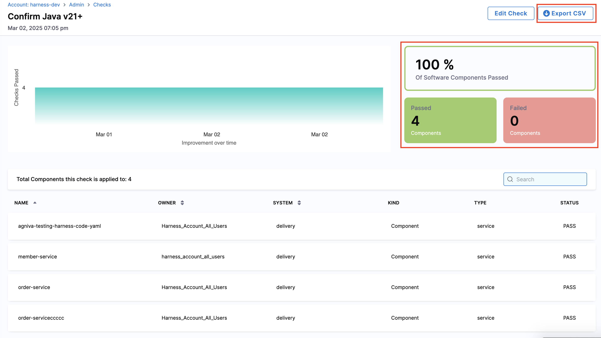
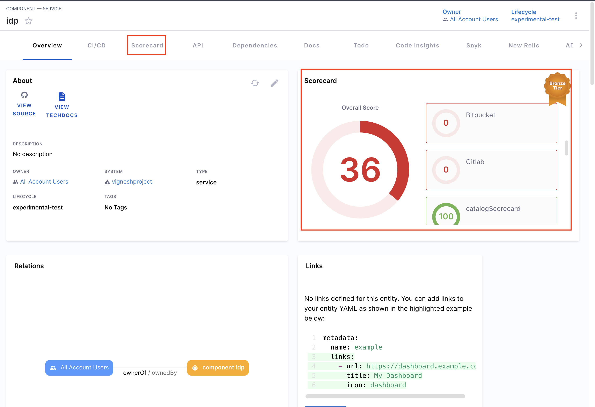
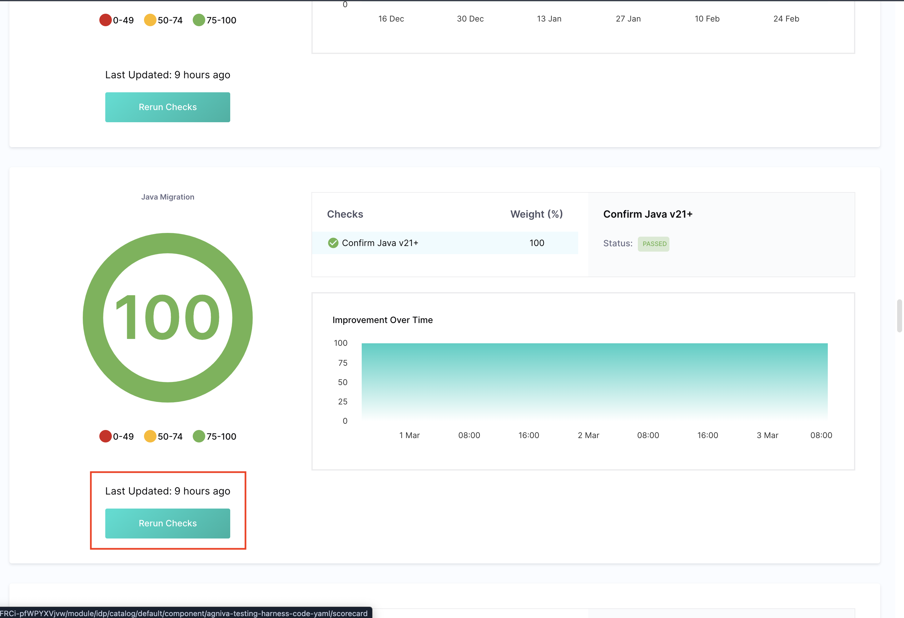

### Overview

Scorecards play a pivotal role in ensuring software components are developed and utilized while adhering to organizational and industry standards. They provide a quantifiable measure of software maturity and adherence to best practices, thereby aiding developers in enhancing quality and assisting teams in making informed decisions regarding software adoption.

<DocVideo src="https://www.youtube.com/embed/jvLDdWS3rFE?si=MBalzaKnDnr4p4QV" />

<DocImage path={require('./static/scorecard.png')}/>

<details>
<summary>Purpose & Concept of Scorecards</summary>

- **Measure Software Maturity**: Evaluate the robustness and reliability of software components.
- **Assess Best Practices**: Ensure software adheres to organizational and industry standards.
- **Gamification**: Encourage developers to adhere to standards by providing scores.
- **Confidence Estimation**: Help teams estimate the reliability of software based on its score.

<DocImage path={require('./static/concept-scorecard.png')}/>

- **Check**: A check is a query performed against a data point for a software component which results in either `Pass` or `Fail`.
- **Data Source**: Data Sources are third-party providers which can provide a specific type of data for a software component. Example - GitHub, GitLab, Harness, PagerDuty, etc.
- **Data Points**: For each software component, every data source provides some data points. The data points could be a number, a string or a boolean.

</details>

## Enabling Scorecards

:::info

If you have Scorecard UI components visible on your Catalog component pages, you can skip the following steps and proceed to "Create your first scorecard" section.

:::

### Scorecard Components in IDP

Scorecard has two main UI components which are developer facing and lives in the Catalog - 1. A small **Card** for the Overview page with the scores and, 2. A **Tab** view with details of the checks and how the score got computed. This is illustrated below. The Tab view contains detailed comprehensive information as shown in the image under [overview](/docs/internal-developer-portal/scorecards/scorecard#overview)

<DocImage path={require('./static/scorecard-overviewpage.png')}/>

1. #### Adding Card and Tab Content for an Entity

   - Go to the **Layout** section in IDP **Admin**, and select **Service** or any other kind of catalog entity for which you want to add Scorecards.

2. #### Add Scorecard to the overview tab

   - Find the **Overview** tab in the YAML and add the following in its component section -

```yaml
- component: EntityScoreCard
    specs:
    gridProps:
        md: 6
```

3. #### Add Scorecard Tab component

   - Under the **tabs** section add the following -

```yaml
- name: Scorecard
  path: /scorecard
  title: Scorecard
  contents:
    - component: EntityScorecardContent
```

<DocImage path={require('./static/entity.png')}/>

## Create Your Scorecard

- Go to the "Scorecards" tab under "Admin" and **Create New Scorecard**.
- Add a "Name" to it and give the criteria to **Filter your catalog entities**.
- Followed by adding the "Checks" and then select **Publish Scorecard**.

<DocImage path={require('./static/rename-scorecard.png')}/>

:::info

Make sure the values under **Filter catalog entities for which the scorecard is evaluated** should match with your entity "owner" and "type" as shown below, also **tags** are applied as **AND** operations so if you select multiple tags make sure all of them are present for the software component you want to compute the score for. 

<DocImage path={require('./static/caution-idp-scorecard.png')}/>
:::

## Trends Dashboard of a Scorecard  
After creating a Scorecard, you can track its aggregate trends and component-wise details in the **Trends Dashboard**. This dashboard displays the number of components the Scorecard applies to and provides detailed scores for each component.

:::info  
The Trends Dashboard updates every 24 hours. Newly created Scorecards (or Checks) will appear in the dashboard after the next update at **12:00 AM UTC**.  
:::

Follow these steps to navigate to the Trends Dashboard:  

1. Click **"Configure"** in the side navigation bar to open the **admin view** of **Harness IDP**.  
2. Click **"Scorecards"** to view all available Scorecards in your account.  
3. Select the Scorecard you want to track.  


4. The dashboard will display all components where the Scorecard was executed along with their detailed scores. You can export the aggregate data by clicking **"Export CSV"** to download it in CSV format. 



## Trends Dashboard of a Check  
Similarly, you can track trends for individual **Checks** to view component details and status updates.  

:::info  
The Scorecard Check jobs run twice a day, with a 12-hour interval between each run. If you run a check now, the next one will automatically run after 12 hours.  
:::

Follow these steps to navigate to the Trends Dashboard:

1. Click **"Configure"** in the side navigation bar and go to **Harness IDP's admin view**.  
2. Click **"Scorecards"** and navigate to the **"Checks"** section.  
3. Here, you'll find a list of all created Checks.  
4. Locate the Check you want to analyze and click on the **"Check Stats"** field.  


5. The dashboard will open, displaying component-wise details and insights. You can export the aggregate data by clicking **"Export CSV"** to download it in CSV format. 



## Refreshing Scorecards
You can manually refresh a component's Scorecard evaluation from the **Harness IDP UI**, triggering an on-demand evaluation and updating the component's score in real time.  

Follow these steps to refresh Scorecards:  

1. Navigate to the **component** in the catalog for which you want to refresh the Scorecard evaluation.  
2. Click **"Scorecard - Overall Score"** from either the **overview page** or the navigation bar at the top.  


3. On the **Scorecard page**, locate the specific Scorecard you want to refresh and click **"Rerun Checks"**.  


This will **manually trigger a refresh**, updating the component's score immediately.

## Disabling Scorecards
1. Comment out the Scorecard related lines added under **Layout** pages as mentioned above, to remove the Scorecard components from the Catalog pages.

2. Additionally, you can also change the status of all the Scorecards you have to "draft". This will ensure that the computation will not run and will not be shown to the developer.

<DocImage width="1750vw" path={require('./static/remove-scorecard.png')}/>

## Schedule of a Scorecard
The Trends Dashboard of a Scorecard updates **every 24 hours**. Newly created Scorecards (or Checks) will appear in the dashboard after the next update at **12:00 AM UTC**.

The Scorecard Check jobs run **twice a day**, with a **12-hour interval between each run**. If you run a check now, the next one will automatically run after 12 hours.  
