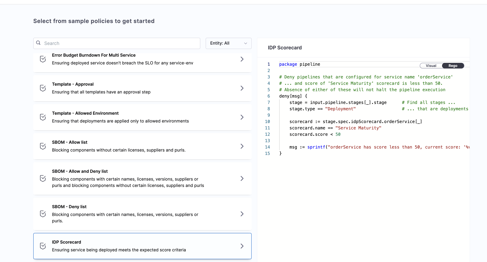
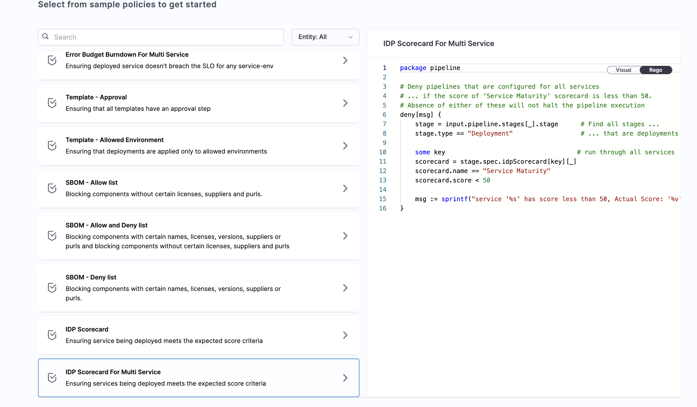

Harness Policy As Code uses [Open Policy Agent (OPA)](https://www.openpolicyagent.org/) as the central service to store and enforce policies for different entities and processes across the Harness platform. You can centrally define and store policies, then select where (which entities) and when (which events) they will be applied.

Policies use the OPA authoring language **Rego**. For more information, go to:
- [Harness Governance Overview](https://developer.harness.io/docs/platform/governance/policy-as-code/harness-governance-overview)
- [Harness Governance Quickstart](https://developer.harness.io/docs/platform/governance/policy-as-code/harness-governance-quickstart)
- [OPA Policy Authoring](https://academy.styra.com/courses/opa-rego)

## OPA Policy Examples with Scorecards

You can apply OPA policies to CD pipelines to enforce scorecard-based governance. The following examples demonstrate two common use cases:

import Tabs from '@theme/Tabs';
import TabItem from '@theme/TabItem';

<Tabs>
<TabItem value="a" label="Example: Pipeline > On Save (Policy Used: IDP Scorecard)" default>

This policy enforces that a service must have a scorecard score above a specified threshold before a pipeline can be saved.



```REGO
package pipeline

# Deny pipelines that are configured for service name 'orderService'
# ... and score of 'Service Maturity' scorecard is less than 50.
# Absence of either of these will not halt the pipeline execution
deny[msg] {
    stage = input.pipeline.stages[_].stage      # Find all stages ...
    stage.type == "Deployment"                  # ... that are deployments

    scorecard := stage.spec.idpScorecard.orderService[_]
    scorecard.name == "Service Maturity"
    scorecard.score < 50

    msg := sprintf("orderService has score less than 50, current score: '%v'", [scorecard.score])
}
```

In the REGO script, we use `stage.spec.idpScorecard.orderService[_]` to fetch the [Harness service ID](/docs/continuous-delivery/overview#service) from the `harness.io/cd-serviceId: <SERVICE_IDENTIFIER>` annotation. If you followed the onboarding guide, this annotation is automatically ingested into your `catalog-info.yaml`. Otherwise, you need to add it manually. 

**Policy Outcomes:**

- **Success:** The service scorecard score is above the threshold. The pipeline saves successfully, and the policy rule evaluation passes.
- **Warning:** A warning message appears indicating the service score is below the threshold (e.g., less than 50). You can still save the pipeline, but deployment may fail.
- **Failure:** The service score is below the threshold. Harness prevents the pipeline from being saved and displays an error message indicating the policy was enforced.

</TabItem>
<TabItem value="b" label="Example: Pipeline > On Run (Policy Used: IDP Scorecard For Multi Service )">

This policy enforces that all services used in a pipeline must have a scorecard score above a specified threshold (e.g., 50) before deployment.



```REGO
package pipeline

# Deny pipelines that are configured for all services
# ... if the score of 'Service Maturity' scorecard is less than 50.
# Absence of either of these will not halt the pipeline execution
deny[msg] {
    stage = input.pipeline.stages[_].stage      # Find all stages ...
    stage.type == "Deployment"                  # ... that are deployments

    some key                                   # run through all services
    scorecard = stage.spec.idpScorecard[key][_]
    scorecard.name == "Service Maturity"
    scorecard.score < 50

    msg := sprintf("service '%s' has score less than 50, Actual Score: '%v'", [key, scorecard.score])
}
```
**Policy Outcomes:**

- **Success:** All services in the pipeline have scores above the threshold (e.g., 50). The deployment dry run progresses successfully, and Harness confirms the policy evaluation passed.
- **Failure:** One or more services have scores below the threshold. The deployment dry run fails, and Harness prevents the deployment with an error message indicating the policy was enforced.

</TabItem>
</Tabs>

---

## Create and Apply OPA Policies for Scorecards

This tutorial demonstrates how to create a policy and apply it to all services in your account. The policy is evaluated at the service level based on scorecard scores and user-defined conditions. The policy triggers on pipeline events, such as saving a pipeline.

### Create a Policy

1. **Navigate to Policies**
   - Go to **Account Settings** under **Administrative Settings**
   - Select **Policies** under **Security and Governance**

2. **Create a New Policy**
   - Go to the **Policies** tab and select **New Policy**

3. **Configure Policy Details**
   - Enter a name for your policy
   - Select **Apply**

4. **Select Policy Template**
   - In the Library, select **IDP Scorecard**
   - Select **Use this Sample**

5. **Test and Save**
   - Test the policy to ensure it works as expected
   - Save the policy

<DocVideo src="https://app.tango.us/app/embed/fb308ebb-760e-4665-8a15-fd7077229fe4?skipCover=true&defaultListView=false&skipBranding=false&makeViewOnly=true&hideAuthorAndDetails=true" title="Create New Policy in Harness" />

---

### Create a Policy Set

1. **Navigate to Policy Sets**
   - Go to **Policy Sets** and select **New Policy Set**

2. **Configure Policy Set Details**
   - Enter a **Name** for your policy set
   - Select the **Entity** type to apply it to (e.g., Pipeline)
   - Select the **Event** for evaluation (e.g., On Save, On Run)

3. **Add Policy to Policy Set**
   - Add the policy you created previously
   - Change the enforcement type to **Warn & Continue** (or **Error and Exit** for stricter enforcement)
   - Select **Apply**

4. **Finish and Save**
   - Review your policy set configuration
   - Save the policy set

<DocVideo src="https://app.tango.us/app/embed/f099083e-8d72-47c4-a6dd-7d2bb1bdc698?skipCover=true&defaultListView=false&skipBranding=false&makeViewOnly=true&hideAuthorAndDetails=true" title="Create a New Policy Set in Harness" />

---

### Use the Policy Set

Once saved, the policy set will automatically be applied to your CD pipelines based on the entity and event you configured. The policy will evaluate scorecard scores and enforce governance rules according to your specifications.

---

## Conclusion

In this tutorial, you learned how to use Harness Policy As Code with OPA to enforce governance rules based on scorecard scores. By creating policies and policy sets, you can ensure that services meet quality standards before pipelines are saved or deployed.

Key takeaways:
- OPA policies can enforce scorecard-based governance on CD pipelines
- Policies can be triggered on different events (e.g., On Save, On Run)
- Policy sets allow you to apply multiple policies to specific entities
- Enforcement types (Warn & Continue or Error and Exit) provide flexibility in how policies are applied

For more information, refer to the [Harness Governance documentation](https://developer.harness.io/docs/platform/governance/policy-as-code/harness-governance-overview) and explore [Scorecard creation](/docs/internal-developer-portal/scorecards/create-scorecards/create-scorecard).
