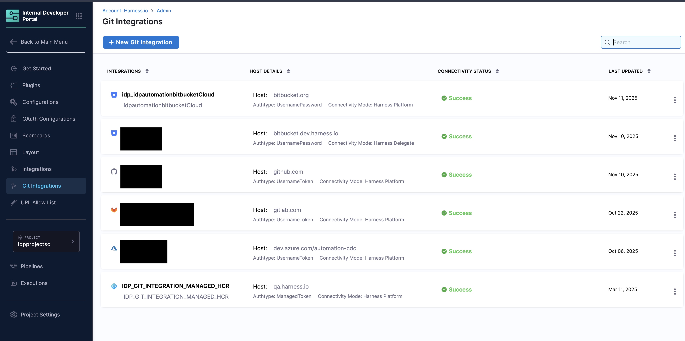
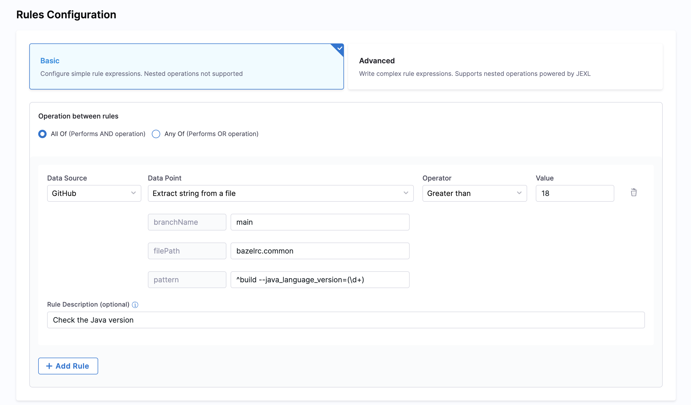
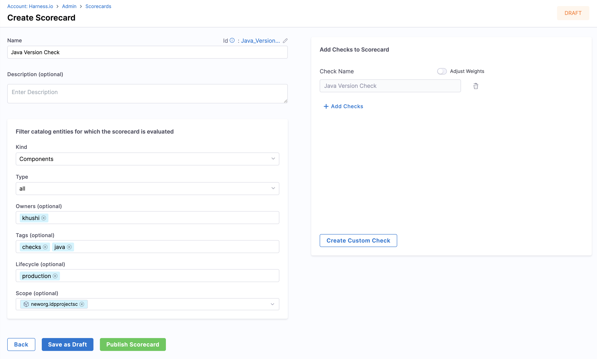

<DocsTag  backgroundColor= "#cbe2f9" text="Tutorial"  textColor="#0b5cad"  />

In this tutorial, you'll learn how to use [Scorecards](https://developer.harness.io/docs/internal-developer-portal/scorecards/scorecard) to track and drive migrations. You'll build custom checks using data points to track library and language versions from metadata file contents.

## Prerequisites

- Before starting, ensure you have access to your Git provider through Git Integrations in the IDP admin section with API access enabled. Follow the [connector creation steps](https://developer.harness.io/docs/category/code-repo-connectors) to set up your connector.

- A [registered software component](/docs/internal-developer-portal/tutorials/register-component-in-catalog) for which you want to track migration.

---

## Scorecard Checks

Harness IDP provides data points for Git-based data sources (GitHub, GitLab, etc.) that you can use to create custom checks in Scorecards. These checks can match and extract specific string patterns from any file in your source code. To learn more about creating checks, go to [Scorecard Checks](/docs/internal-developer-portal/scorecards/create-scorecards/checks.md). 

This feature is particularly useful for tracking versions in various files, such as:
- `.bazelrc` for Java
- `Dockerfile` for Docker
- `go.mod` for Go
- `package.json` for React and JavaScript
- Manifest files

---

## Create a Custom Check

Follow these steps to create a custom check for tracking migrations:

1. In your Harness IDP account, navigate to **Configure** → **Scorecards**
2. On the Scorecards page, go to the **Checks** tab and select **Create Custom Check** in the top-right corner
3. On the Create Check page, add the following information:
   - **Name**: Enter a descriptive name for your check (e.g., "Java Version Check")
   - **Description**: Describe what the check validates
   - **Data Source**: Select your Git provider (e.g., GitHub, GitLab, or Bitbucket)
   - **Data Point**: Select **Extract String from a File** to extract version information from files
   - **Operation**: Select **All Of** to ensure all rules must pass
4. Configure the rule using the **Basic** tab:
   - **Branch Name** (optional): Specify the branch name if you want to check a specific branch. If left empty, the system will use the branch from the `backstage.io/source-location` annotation in your entity YAML
   - **File Name**: Specify the filename with its extension or the relative path from the root folder (e.g., `.bazelrc`, `package.json`, `go.mod`, or `manifest/Dockerfile`)
   - **Pattern**: Enter the regex pattern to match and extract the version. For example:
     - For Java version in `.bazelrc` file containing `build --java_language_version=18`, use: `^build --java_language_version=(\d+)`
     - For Go version in `go.mod` file containing `go 1.21`, use: `^go\s(\d+\.\d+)$`
     - For npm package in `package.json` containing `"eslint": "^7.7.0",`, use: `"eslint":\s"\^(\d+\.\d+\.\d+)",`
   - **Operator**: Select the comparison operator (e.g., Equals, Greater Than, Less Than)
   - **Value**: Enter the expected value to compare against
5. (Optional) Add a **Rule Description** to provide context about what the rule validates
6. Click **Save changes** to save the check

:::info
**Regex Pattern Tips:**
- Use parentheses `()` to group the string pattern you want to extract
- Use [ChatGPT](https://chat.openai.com/) to generate regex patterns
- Use [regex101](https://regex101.com/) to test and validate your regex patterns
:::

---

## Create a Scorecard

Once you've created the checks, follow these steps to add them to a new Scorecard:

1. **Navigate to Scorecards**
   - Go to **Configure** → **Scorecards**
   - Select **Create New Scorecard**

2. **Configure Basic Information**
   - **Name**: Enter a descriptive name for your scorecard (e.g., "Java 18 Migration Tracker"). 
   - **Description**: Describe the scorecard's purpose (e.g., "Track migration to Java 18 across all services"). 

3. **Add Filters (Optional)**
   
   Apply filters to specify which Catalog entities the scorecard should evaluate:
   - **Kind**: Select the entity kind (e.g., Component)
   - **Type**: Select the type for the chosen kind (e.g., Service)
   - **Owners**: (Optional) Select specific entity owners to evaluate
   - **Tags**: (Optional) Filter entities by tags
   - **Lifecycle**: (Optional) Select lifecycle stages (e.g., production)

4. **Add Checks**
   - Select the checks you created above to track the migration
   - These checks will evaluate specific criteria and return Pass or Fail results

5. **Publish Scorecard**
   - Review your configuration
   - Click **Publish Scorecard** to make it active

---

## View Scorecard Results

Once your scorecard is published, you can view the results:

1. Navigate to the software component in your catalog. 
2. Go to the **Scorecards** tab to view the scores. 
3. You can re-run the check to compute the score instantly by clicking **Rerun Checks**. 

---

## Troubleshooting

#### Incorrect File Path

Ensure the file path is relative to the root folder of the repository.

#### Pattern Matching Errors

Verify the accuracy of the pattern you're trying to match. Use [regex101](http://regex101.com/) to test your regex pattern. Also, ensure you've properly grouped the string you're trying to match using parentheses `()`.

---

## Conclusion

In this tutorial, you learned how to use Scorecards in Harness IDP to track and drive migrations. This powerful feature helps you maintain up-to-date information on various aspects of your software projects, such as dependency versions, language versions, and tool configurations.

For more detailed information and support, refer to the [Harness IDP documentation](https://developer.harness.io/docs/internal-developer-portal) and [community forums](https://join-community-slack.harness.io/).
