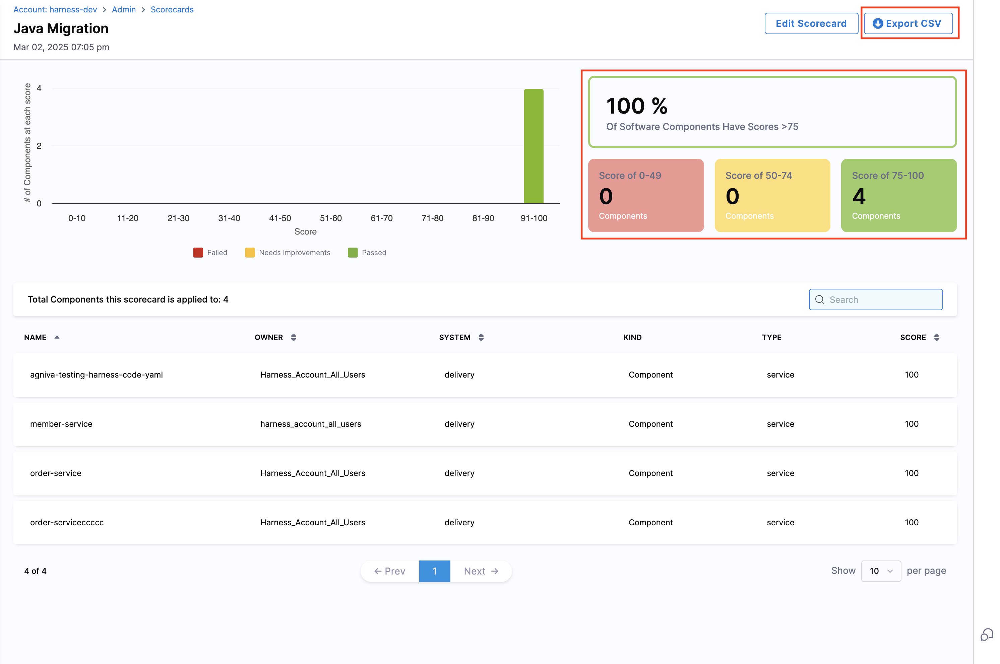
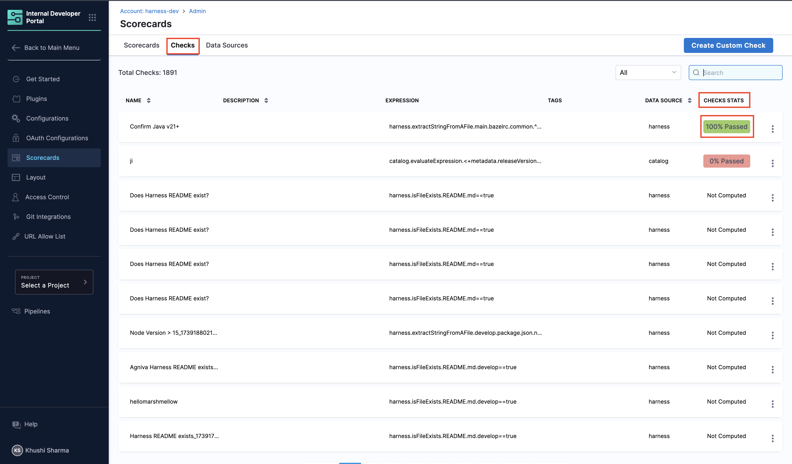
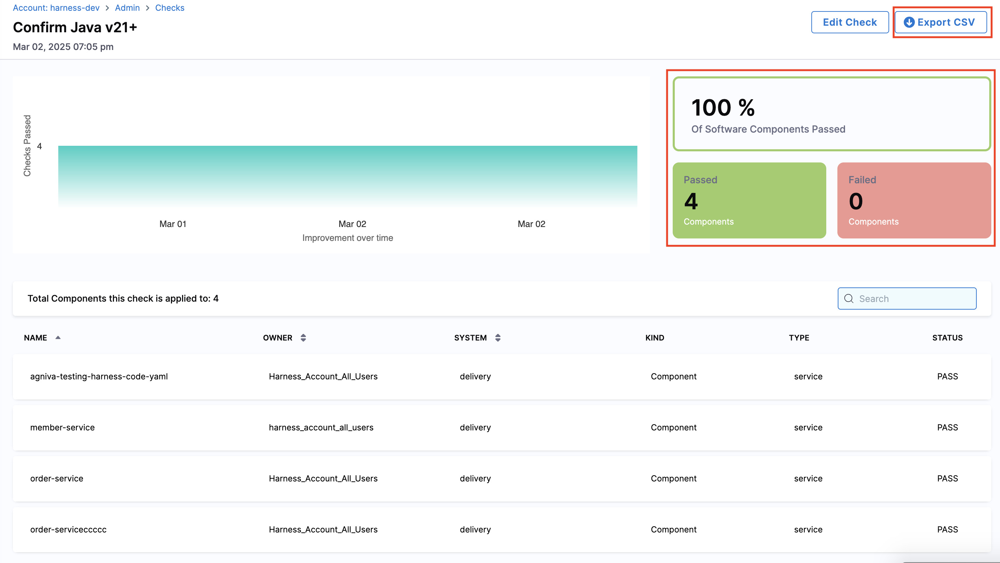

You can view the Scorecard results in your Catalog entity pages. This helps you keep a track of the score of your components and monitor their performance. There a few ways you can monitor and view the Scorecard results regularly. 

---

## Scorecard View

Scorecards have two main UI components that are developer-facing and displayed in the Catalog:

1. **Card**: A small card on the Overview page that displays scores
2. **Tab**: A detailed tab view that shows check details and score computation

---

## Trends Dashboard for Scorecards

After creating a Scorecard, you can track its aggregate trends and component-wise details in the **Trends Dashboard**. This dashboard displays the number of components the Scorecard applies to and provides detailed scores for each component.

:::info
The Trends Dashboard updates every **24 hours**. Newly created Scorecards (or Checks) will appear in the dashboard after the next update at **12:00 AM UTC**.
:::

Follow these steps to view the Trends Dashboard for a scorecard:

1. Click **Configure** in the side navigation bar to open the admin view of Harness IDP
2. Click **Scorecards** to view all available Scorecards in your account
3. Select the Scorecard you want to track

4. The dashboard will display all components where the Scorecard was executed along with their detailed scores
5. You can export the aggregate data by clicking **Export CSV** to download it in CSV format

---

## Trends Dashboard for Checks

Similarly, you can track trends for individual **Checks** to view component details and status updates.

:::info
Scorecard Check jobs run **twice a day**, with a **12-hour interval** between each run. If you run a check now, the next one will automatically run after 12 hours.
:::

Follow these steps to view the Trends Dashboard for a check:

1. Click **Configure** in the side navigation bar and go to Harness IDP's admin view
2. Click **Scorecards** and navigate to the **Checks** section
3. Here, you'll find a list of all created Checks
4. Locate the Check you want to analyze and click on the **Check Stats** field

5. The dashboard will open, displaying component-wise details and insights
6. You can export the aggregate data by clicking **Export CSV** to download it in CSV format

---
