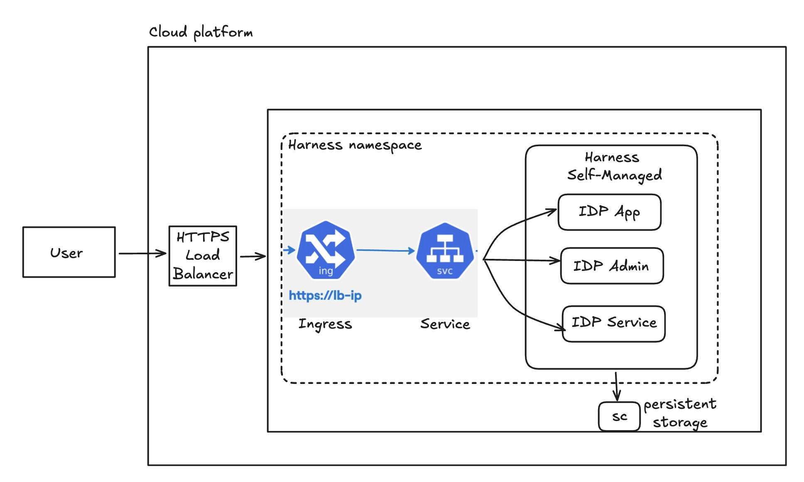

:::info Harness IDP SMP Edition [BETA]
Harness IDP Self-Managed Platform (SMP) Edition is currently in **BETA**. Please refer to the [Harness IDP Release Notes](/release-notes/internal-developer-portal) to keep track of new feature updates and improvements.
:::

## Harness IDP SMP Edition
[Harness Self-Managed Enterprise Edition](https://developer.harness.io/docs/self-managed-enterprise-edition/smp-overview) is an on-premises solution that allows you to install and run Harness on your own infrastructure. It gives you full control over data, security, and compliance while leveraging Harness’s software delivery capabilities. **Harness IDP** is available for the **Self-Managed Enterprise Edition**. This means you can use Harness IDP with the SMP version on your own infrastructure.

:::info Only for IDP 2.0
Harness IDP on SMP is available only for **IDP 2.0**. **IDP 1.0** is **not supported** on SMP.
:::

### Architecture 



#### PostgreSQL Databases created by IDP

IDP creates multiple **per-plugin databases** in PostgreSQL. Each database name is **prefixed with your Harness account ID**.

**Typical Databases**

* `accountId_app`
* `accountId_auth`
* `accountId_catalog`
* `accountId_devtools`
* `accountId_layout`
* `accountId_permission`
* `accountId_proxy`
* `accountId_scaffolder`
* `accountId_search`
* `accountId_sonarqube`
* `accountId_techdocs`

> **Note:** The exact set can vary based on which plugins are enabled. Some plugins may create their **own additional databases**.

#### PostgreSQL Configuration
- If `postgresql.enabled` is `true` in your setup, IDP will reuse the **in-cluster PostgreSQL instance** and default chart credentials will be used automatically.
- If `postgresql.enabled` is `false`, provide external PostgreSQL credentials in the following format:
```
postgres:
  ## - protocol to use for connection
  protocol: ''
  ## - host array for external
  hosts: []
  extraArgs: ''
  secrets:
    kubernetesSecrets:
      - secretName: ''
        keys:
          POSTGRES_USER: ''
          POSTGRES_PASSWORD: ''
    secretManagement:
      externalSecretsOperator:
        - secretStore:
            name: ''
            kind: ''
          remoteKeys:
            POSTGRES_USER:
              name: ''
              property: ''
            POSTGRES_PASSWORD:
              name: ''
              property: ''
```

---

## Supported Infrastructure
:::warning GKE Cluster Required
Harness IDP SMP Beta is **only supported on Google Kubernetes Engine (GKE)** clusters.
:::

The Self-Managed Enterprise Edition runs within the customer's environment alongside existing services. You must have a Kubernetes cluster with a configured load balancer. 

**Supported Platform:**
- **Google Cloud Platform (GCP)** using **Google Kubernetes Engine (GKE)** 

**Not Supported:**
- AWS (EKS) 
- Azure (AKS) 
- On-premises Kubernetes 
- OpenShift 

:::warning Network/Firewall Requirement
If your setup integrates with third-party SaaS products (for example, PagerDuty, GitHub, or GitLab), you must whitelist their domains in your firewall policies.

**PagerDuty example**
- **FQDNs:** `harness.pagerduty.com`
- **Protocol/Ports:** `tcp:80`, `tcp:443`
:::

---

## Supported Features

The following features are supported for Harness IDP SMP Edition:

| **Feature**              | **Status in SMP** | **Notes**                    |
|--------------------------|-------------------|------------------------------|
| Catalog                  | ✅                |                              |
| Self Service Workflows   | ✅                |                              |
| Scorecards               | ✅                |                              |
| Git Experience           | ✅                |                              |
| Environment Management   | ❌                | Not supported in SMP edition |
| Plugins                  | ✅                |                              |
| TechDocs                 | ❌                | Not supported in SMP edition |
| Custom Plugins           | ❌                | Not supported in SMP edition |
| RBAC                     | ✅                |                              |

---

## Next Steps
Go to [Onboarding Guide](/docs/internal-developer-portal/smp/idp-onboarding.md) to learn how to deploy Harness IDP on SMP.
