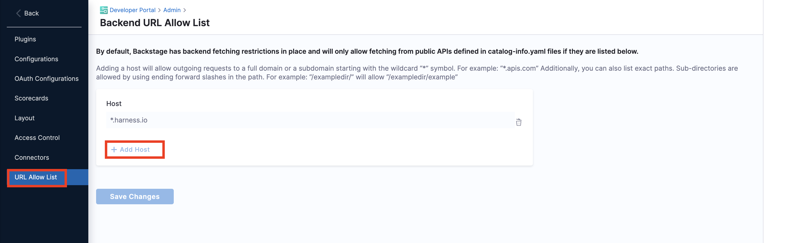
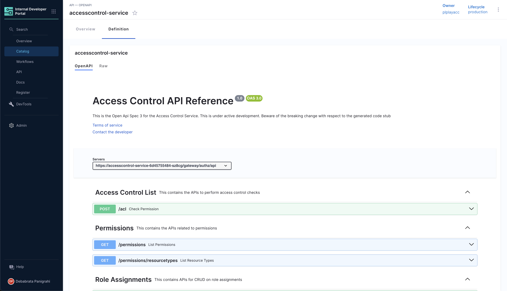
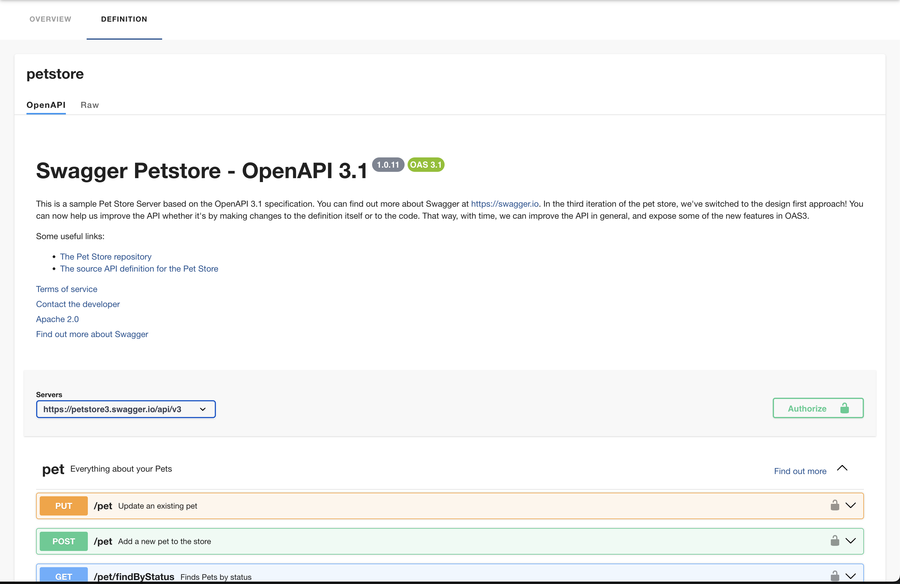
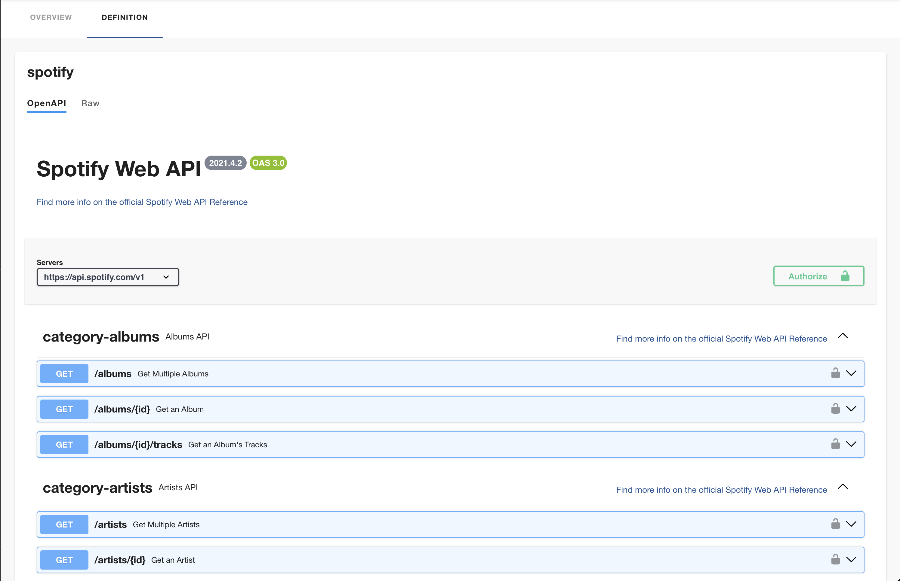
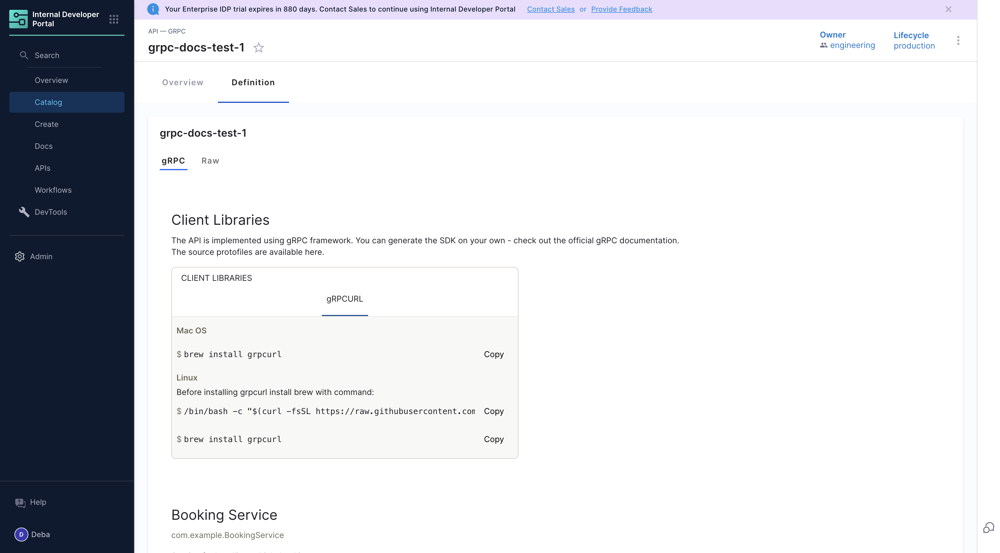
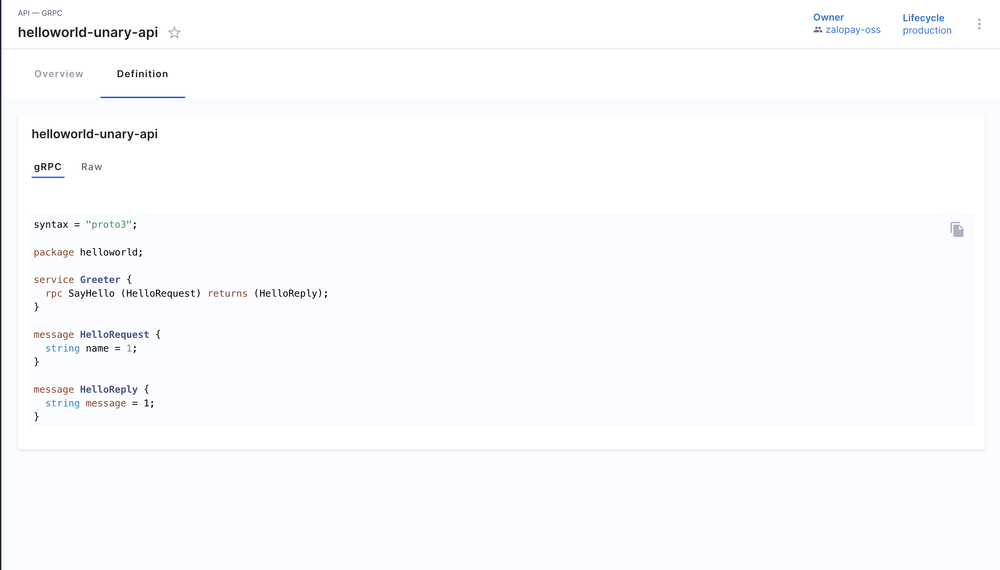

<DocsTag  backgroundColor= "#cbe2f9" text="Tutorial"  textColor="#0b5cad"  />

# Introduction 

Software Catalog in Harness IDP provides a comprehensive framework for defining and managing software entities, including APIs. Here’s a guideline to add API specifications, based on the Backstage descriptor format:

The type of API specs could be added in IDP. 

1. **openapi** - An API definition in YAML or JSON format based on the [OpenAPI](https://swagger.io/specification/) version 2 or version 3 spec.

2. **asyncapi** - An API definition based on the [AsyncAPI specification](https://www.asyncapi.com/docs/reference/specification/latest).

3. **graphql** - An API definition based on [GraphQL schemas](https://spec.graphql.org/) for consuming [GraphQL](https://spec.graphql.org/) based APIs.

4. **grpc** - An API definition based on [Protocol Buffers](https://spec.graphql.org/) to use with [gRPC](https://grpc.io/).

More details on descriptor format for API's could be found below in the references.

## Example for different use cases

:::info

Note that to be able to read from targets that are outside the normal integration points such as `github.com`, you'll need to explicitly allow it by adding an entry in the **URL Allow List** under **Admin**



:::

### Import API spec for all API defined in openapi spec

```YAML

apiVersion: backstage.io/v1alpha1
kind: API
metadata:
  name: ce-nextgen
  description: The official CE NEXTGEN service REST APIs
spec:
  type: openapi
  lifecycle: production
  owner: johndoe
  definition:
    $text: https://github.com/OAI/OpenAPI-Specification/blob/main/examples/v2.0/json/api-with-examples.json
```

:::info

In the above example we import all the API specs in `json` format as a `$text` embedding, and it's a suggested hack to import multiple APIs in openapi format. 

:::

The above-mentioned `catalog-info.yaml` when registered in the catalog would display all the APIs in the following format. 



### Import API spec for a single API defined in openapi spec in swaggger

```YAML
apiVersion: backstage.io/v1alpha1
kind: API
metadata:
  name: petstore
  description: The petstore API
  tags:
    - store
    - rest
  links:
    - url: https://github.com/swagger-api/swagger-petstore
      title: GitHub Repo
      icon: github
    - url: https://github.com/swagger-api/swagger-petstore/blob/master/src/main/resources/openapi.yaml
      title: API Spec
      icon: code
spec:
  type: openapi
  lifecycle: dev
  owner: Harness_Partners
  definition:
    $text: ./petstore.oas.yaml
```

The above-mentioned `catalog-info.yaml` when registered in the catalog would display all the APIs in the following format.



### Define API spec for a single API openapi format and import the same

```YAML
apiVersion: backstage.io/v1alpha1
kind: API
metadata:
  name: artist-api
  description: Retrieve artist details
spec:
  type: openapi
  lifecycle: production
  owner: artist-relations-team
  system: artist-engagement-portal
  definition: |
    openapi: "3.0.0"
    info:
      version: 1.0.0
      title: Artist API
      license:
        name: MIT
    servers:
      - url: http://artist.spotify.net/v1
    paths:
      /artists:
        get:
          summary: List all artists
    ...
```

The above-mentioned `catalog-info.yaml` when registered in the catalog would display all the APIs in the following format.



## Steps to add the API as an entity.

1. Save the YAML, created following the steps above, in your git repository. 
2. Follow the steps mentioned to [register a software component](https://developer.harness.io/docs/internal-developer-portal/get-started/register-a-new-software-component#register-the-software-component), to add your API docs to IDP.  


### References

Here’s a guideline to add API specifications to your IDP based on the Backstage descriptor format.

## Descriptor File Structure
### 1. `File Naming`: 
Typically named `catalog-info.yaml` or `idp.yaml`.
### 2. `Format`: 
YAML
### 3. `Sections`: 
Envelope, Metadata, API Specification, Relations, Status.

## Defining an API Entity
### 1. `apiVersion`: 
Specify the API version, e.g., `backstage.io/v1alpha1`.
### 2. `kind`: 
This should be API.
### 3. `metadata`: 
Includes name, description, labels, and annotations.
### 4. `name`: 
Unique identifier for the API.
### 5. `description`: 
Brief overview of the API.
### 6. `labels/annotations`: 
Key-value pairs for additional metadata.

## API Specification
### 1. `spec`: 
Contains the actual API specification details.
### 2. `type`: 
The type of API (e.g., openapi, grpc), the current set of well-known and supported values for this field is:

**openapi** - An API definition in YAML or JSON format based on the [OpenAPI](https://swagger.io/specification/) version 2 or version 3 spec.

**asyncapi** - An API definition based on the [AsyncAPI specification](https://www.asyncapi.com/docs/reference/specification/latest).

**graphql** - An API definition based on [GraphQL schemas](https://spec.graphql.org/) for consuming [GraphQL](https://spec.graphql.org/) based APIs.

**grpc** - An API definition based on [Protocol Buffers](https://spec.graphql.org/) to use with [gRPC](https://grpc.io/).

### 3. `lifecycle`: 
Stage of the API lifecycle (e.g., production, experimental).
### 4. `owner`: 
Team or individual responsible for the API.
### 5. `definition`: 
Location of the API definition file (e.g., a URL to a Swagger file).

## Substitutions in Descriptor
1. Supports `$text`, `$json`, `$yaml` for embedding external content.
2. Useful for loading API definitions from external sources.

## Example

```yaml
apiVersion: backstage.io/v1alpha1
kind: API
metadata:
  name: petstore
  description: The petstore API
  tags:
    - store
    - rest
  links:
    - url: https://github.com/swagger-api/swagger-petstore
      title: GitHub Repo
      icon: github
    - url: https://github.com/swagger-api/swagger-petstore/blob/master/src/main/resources/openapi.yaml
      title: API Spec
      icon: code
spec:
  type: openapi
  lifecycle: dev
  owner: Harness_Partners
  definition:
    $text: ./petstore.oas.yaml

```

## gRPC Docs

You can render gRPC documentation by using the [protoc-gen-doc plugin](https://github.com/backstage/backstage/tree/master/plugins/api-docs-module-protoc-gen-doc), which contains `ApiDefinitionWidgets` for [grpc-docs](https://github.com/gendocu-com/grpc-docs)to enable Swagger UI for gRPC APIs. 


### JSON Format

:::info

You can render gRPC documentation when the `type` is set to `grpc-doc` or `grpc` **and** the `definition` is provided in JSON format. 

:::

#### Type: `grpc`

```YAML
##Example
apiVersion: backstage.io/v1alpha1
kind: API
metadata:
  name: grpc-docs-test-1
spec:
  type: grpc
  lifecycle: production
  owner: group:engineering
  definition:
    $text: https://github.com/pseudomuto/protoc-gen-doc/blob/master/examples/doc/example.json
```

#### Rendered Output for JSON Format




#### Type: `grpc-docs`

[Example catalog-info.yaml](https://github.com/harness-community/idp-samples/blob/main/demo-prorto-api.yaml)

```YAML
apiVersion: backstage.io/v1alpha1
kind: API
metadata:
  name: grpc-docs-test
spec:
  type: grpc-docs
  lifecycle: production
  owner: group:engineering
  definition:
    $text: https://github.com/pseudomuto/protoc-gen-doc/blob/master/examples/doc/example.json
```

#### Rendered Output for JSON Format


### proto file Format

```YAML
## Example
apiVersion: backstage.io/v1alpha1
kind: API
metadata:
  name: helloworld-unary-api
  description: helloworld unary gRPC
  
spec:
  type: grpc
  lifecycle: production
  owner: zalopay-oss
  definition:
    $text: https://github.com/zalopay-oss/backstage-grpc-playground/blob/main/examples/unary/helloworld.proto
  files:
    - file_name: helloworld.proto
      file_path: examples/unary/helloworld.proto
      url: https://github.com/zalopay-oss/backstage-grpc-playground/blob/main/examples/unary/helloworld.proto
      
  targets:
    dev:
      host: 0.0.0.0
      port: 8084
```

#### Rendered Output for proto file



