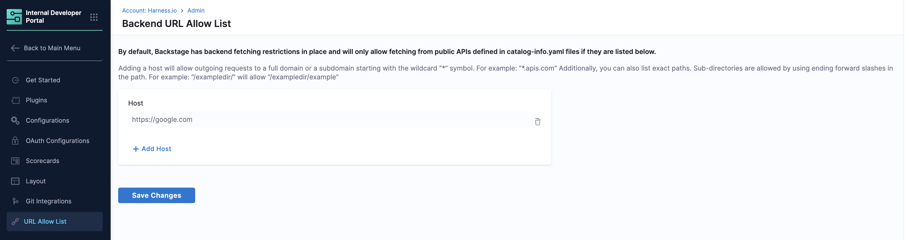
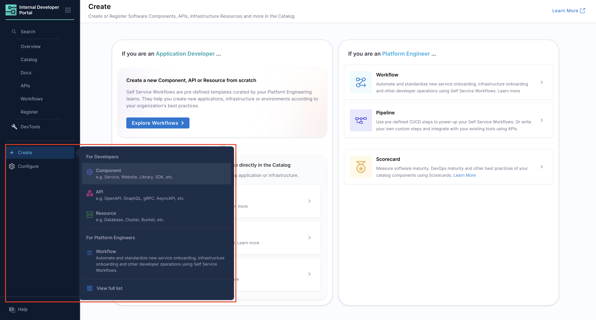

import Tabs from '@theme/Tabs';
import TabItem from '@theme/TabItem';

<DocsTag  backgroundColor= "#cbe2f9" text="Tutorial"  textColor="#0b5cad"  />

Software Catalog in Harness IDP provides a comprehensive framework for defining and managing software entities, including APIs. Here’s a guideline to add API specifications, based on the Backstage descriptor format:

The type of API specs could be added in IDP. 

1. **openapi** - An API definition in YAML or JSON format based on the [OpenAPI](https://swagger.io/specification/) version 2 or version 3 spec.

2. **asyncapi** - An API definition based on the [AsyncAPI specification](https://www.asyncapi.com/docs/reference/specification/latest).

3. **graphql** - An API definition based on [GraphQL schemas](https://spec.graphql.org/) for consuming [GraphQL](https://spec.graphql.org/) based APIs.

4. **grpc** - An API definition based on [Protocol Buffers](https://spec.graphql.org/) to use with [gRPC](https://grpc.io/).

More details on descriptor format for API's could be found below in the references.

## Example for different use cases

:::info

Note that to be able to read from targets that are outside the normal integration points such as `github.com`, you'll need to explicitly allow it by adding an entry in the **URL Allow List** under **Admin**



:::

### Import API spec for all API defined in openapi spec

<Tabs queryString="version">
<TabItem value="IDP 2.0 (New)" label="IDP 2.0 (New)">

```YAML
apiVersion: harness.io/v1
kind: API
type: openapi
identifier: cenextgen
name: cenextgen
owner: johndoe
spec:
  lifecycle: production
  definition:
    $text: https://github.com/OAI/OpenAPI-Specification/blob/main/examples/v2.0/json/api-with-examples.json
metadata:
  description: The official CE NEXTGEN service REST APIs
```

</TabItem>
<TabItem value="IDP 1.0>" label="IDP 1.0">

```YAML
apiVersion: backstage.io/v1alpha1
kind: API
metadata:
  name: ce-nextgen
  description: The official CE NEXTGEN service REST APIs
spec:
  type: openapi
  lifecycle: production
  owner: johndoe
  definition:
    $text: https://github.com/OAI/OpenAPI-Specification/blob/main/examples/v2.0/json/api-with-examples.json
```

</TabItem>
</Tabs>

:::info
In the above example we import all the API specs in `json` format as a `$text` embedding, and it's a suggested hack to import multiple APIs in openapi format. 
:::

:::note Backend URL Allow List

By default, Backstage restricts backend fetching and only allows requests to public APIs defined in `catalog-info.yaml` files if the domains are explicitly allowed.

To enable access:
- Go to your IDP portal and navigate to `Configuration` > `URL Allow List`.
- Add full domains or use wildcards (e.g., `*.apis.com`) to allow subdomains.
- You can also list specific paths. Subdirectories are supported using a trailing slash (e.g., `/exampledir/` allows `/exampledir/example`).

Make sure the host or path for your OpenAPI spec is included in this list to allow successful API documentation import.
:::


:::caution
API entity creation in IDP 2.0 currently supports OpenAPI specifications referenced via **absolute URLs** (e.g., `https://github.com/swagger-api/swagger-petstore/blob/master/src/main/resources/openapi.yaml`) in the `definition.$text` field.
Support for relative paths (e.g., `./openapi.yaml`, `../api.json`) is planned but not yet available. To ensure proper API documentation rendering, please ensure the domain is added to the **Backend URL Allow List** under *Configuration > URL Allow List*.
:::


The above-mentioned `catalog-info.yaml` when registered in the catalog would display all the APIs in the following format. 


### Import API spec for a single API defined in openapi spec in swaggger

<Tabs queryString="version">
<TabItem value="IDP 2.0 (New)" label="IDP 2.0 (New)">

```YAML
apiVersion: harness.io/v1
kind: API
type: openapi
identifier: petstore
name: petstore
owner: Harness_Partners
spec:
  lifecycle: dev
  definition:
    $text: https://<absolute-url-to-openapi-spec-file>/petstore.oas.yaml
metadata:
  description: The petstore API
  links:
    - url: https://github.com/swagger-api/swagger-petstore
      title: GitHub Repo
      icon: github
    - url: https://github.com/swagger-api/swagger-petstore/blob/master/src/main/resources/openapi.yaml
      title: API Spec
      icon: code
  tags:
    - store
    - rest
```
</TabItem>
<TabItem value="IDP 1.0>" label="IDP 1.0">

```YAML
apiVersion: backstage.io/v1alpha1
kind: API
metadata:
  name: petstore
  description: The petstore API
  tags:
    - store
    - rest
  links:
    - url: https://github.com/swagger-api/swagger-petstore
      title: GitHub Repo
      icon: github
    - url: https://github.com/swagger-api/swagger-petstore/blob/master/src/main/resources/openapi.yaml
      title: API Spec
      icon: code
spec:
  type: openapi
  lifecycle: dev
  owner: Harness_Partners
  definition:
    $text: https://<absolute-url-to-openapi-spec-file>/petstore.oas.yaml
```
</TabItem>
</Tabs>

The above-mentioned `catalog-info.yaml` when registered in the catalog would display all the APIs in the following format.


### Define API spec for a single API openapi format and import the same

<Tabs queryString="version">
<TabItem value="IDP 2.0 (New)" label="IDP 2.0 (New)">

```YAML
apiVersion: harness.io/v1
kind: API
type: openapi
identifier: artistapi
name: artistapi
owner: artist-relations-team
spec:
  lifecycle: production
  definition: |
    openapi: "3.0.0"
    info:
      version: 1.0.0
      title: Artist API
      license:
        name: MIT
    servers:
      - url: http://artist.spotify.net/v1
    paths:
      /artists:
        get:
          summary: List all artists
    ...
metadata:
  description: Retrieve artist details

```
</TabItem>
<TabItem value="IDP 1.0>" label="IDP 1.0">

```YAML
apiVersion: backstage.io/v1alpha1
kind: API
metadata:
  name: artist-api
  description: Retrieve artist details
spec:
  type: openapi
  lifecycle: production
  owner: artist-relations-team
  system: artist-engagement-portal
  definition: |
    openapi: "3.0.0"
    info:
      version: 1.0.0
      title: Artist API
      license:
        name: MIT
    servers:
      - url: http://artist.spotify.net/v1
    paths:
      /artists:
        get:
          summary: List all artists
    ...
```

</TabItem>
</Tabs>

The above-mentioned `catalog-info.yaml` when registered in the catalog would display all the APIs in the following format.


## Creating an API entity 

<Tabs queryString="version">
<TabItem value="IDP 2.0 (New)" label="IDP 2.0 (New)">

There are two ways to add and create a new API entity in your catalog:

- **[Create an entity via the Harness IDP UI](/docs/internal-developer-portal/catalog/manage-catalog.md#harness-idp-ui)**: Use the Harness UI to create entities directly—no YAML required. This method offers a streamlined, code-free experience for adding entities.
- **[Create an entity using your catalog YAML](/docs/internal-developer-portal/catalog/manage-catalog.md#catalog-yaml)**: You can still create entities using your existing catalog YAML files. Harness will automatically convert legacy Backstage YAML into the new Harness Catalog Entity Model and register the corresponding entity.



</TabItem>
<TabItem value="IDP 1.0" label="IDP 1.0">

#### Steps to add an API entity
1. Save the YAML, created following the steps above, in your git repository. 
2. Follow the steps mentioned to [register a software component](https://developer.harness.io/docs/internal-developer-portal/get-started/register-a-new-software-component#register-the-software-component), to add your API docs to IDP.  

#### Descriptor File Structure
1. `File Naming`: 
Typically named `catalog-info.yaml` or `idp.yaml`.
2. `Format`: 
YAML
3. `Sections`: 
Envelope, Metadata, API Specification, Relations, Status.

</TabItem>
</Tabs>

## Defining an API Entity

<Tabs queryString="version">
<TabItem value="IDP 2.0 (New)" label="IDP 2.0 (New)">
You can refer to the entity definition format [here](/docs/internal-developer-portal/catalog/catalog-yaml.md#common-to-all-kinds-the-envelope-idp-20). Here's the common envelope: 

1. `apiVersion`: With IDP 2.0, we've introduced a Harness-native entity schema. As part of this change, all entities now use an apiVersion prefixed with `harness.io/`.
2. `kind`: The kind field defines the high-level type of entity being described in the YAML file. For API, `kind` is `API`. 
3. `identifier`: The `identifier` field is a unique, machine-readable reference for the entity. It serves as the primary key for identifying and interacting with the entity.
4. `name`: The `name` field represents the display name of the entity shown in the UI.
5. `type`: The `type` field represents the type of entity (e.g., website, service, library, API, etc). The kind and type fields together define entity behavior and should always appear together.
6. `projectIdentifier`: In IDP 2.0, legacy System entities are now mapped to Harness Projects. Thus the `projectIdentifier` field indicates which project the entity belongs to.
7. `orgIdentifier`: In IDP 2.0, legacy Domain entities are now mapped to Harness Orgs. Thus the field `orgIdentifier` indicates which Org the entity belongs to.
8. `owner`: The `owner` field indicates the owner of that entity and maps to Harness Users or User Groups depending on the scope.
9. `metadata`: A container for auxiliary data that is not part of the entity’s specification. Additional metadata helps enhance platform-level processing or categorization
10. `spec`: Defines the actual specification data that describes the entity. This is the core configuration and varies depending on the kind.

</TabItem>
<TabItem value="IDP 1.0" label="IDP 1.0">

1. `apiVersion`: 
Specify the API version, e.g., `backstage.io/v1alpha1`.
2. `kind`: 
This should be API.
3. `metadata`: 
Includes name, description, labels, and annotations.
4. `name`: 
Unique identifier for the API.
5. `description`: 
Brief overview of the API.
6. `labels/annotations`: 
Key-value pairs for additional metadata.

</TabItem>
</Tabs>

## API Specification

<Tabs queryString="version">
<TabItem value="IDP 2.0 (New)" label="IDP 2.0 (New)">

### Kind: API  
An **API** describes an interface that can be exposed by a component. APIs can be defined using formats such as OpenAPI, AsyncAPI, GraphQL, gRPC, or others.

#### Entity Structure  
All the fields mentioned below are the mandatory parameters required to define an API:

| **Field** | **Value** |
| --------- | --------- |
| `apiVersion` | **harness.io/v1** |
| `kind` | **API** |
| `type` | You can find out more about the `type` key here. |
| `spec.lifecycle` | You can find out more about the `lifecycle` key here. |
| `spec.definition` | You can find out more about the `definition` key here. |

#### `type` Definition  
The type of the `API` definition as a string (e.g., `openapi`):

1. `openapi` – A definition in YAML or JSON based on OpenAPI v2 or v3.
2. `asyncapi` – A definition based on the AsyncAPI specification.
3. `graphql` – A definition using GraphQL schemas.
4. `grpc` – A definition based on Protocol Buffers for use with gRPC.

#### Example YAML
```yaml
apiVersion: harness.io/v1
kind: API
type: openapi
identifier: petstore
name: petstore
owner: Harness_Partners
spec:
  lifecycle: dev
  definition:
    $text: https://<absolute-url-to-openapi-spec-file>/petstore.oas.yaml
metadata:
  description: The petstore API
  links:
    - url: https://github.com/swagger-api/swagger-petstore
      title: GitHub Repo
      icon: github
    - url: https://github.com/swagger-api/swagger-petstore/blob/master/src/main/resources/openapi.yaml
      title: API Spec
      icon: code
  tags:
    - store
    - rest
```

</TabItem>
<TabItem value="IDP 1.0" label="IDP 1.0">
1. `spec`: 
Contains the actual API specification details.
2. `type`: 
The type of API (e.g., openapi, grpc), the current set of well-known and supported values for this field is:

**openapi** - An API definition in YAML or JSON format based on the [OpenAPI](https://swagger.io/specification/) version 2 or version 3 spec.

**asyncapi** - An API definition based on the [AsyncAPI specification](https://www.asyncapi.com/docs/reference/specification/latest).

**graphql** - An API definition based on [GraphQL schemas](https://spec.graphql.org/) for consuming [GraphQL](https://spec.graphql.org/) based APIs.

**grpc** - An API definition based on [Protocol Buffers](https://spec.graphql.org/) to use with [gRPC](https://grpc.io/).

3. `lifecycle`: 
Stage of the API lifecycle (e.g., production, experimental).
4. `owner`: 
Team or individual responsible for the API.
5. `definition`: 
Location of the API definition file (e.g., a URL to a Swagger file).

</TabItem>
</Tabs>

## Substitutions in Descriptor
1. Supports `$text`, `$json`, `$yaml` for embedding external content.
2. Useful for loading API definitions from external sources.

### Example
<Tabs queryString="version">
<TabItem value="IDP 2.0 (New)" label="IDP 2.0 (New)">

```YAML
apiVersion: harness.io/v1
kind: API
type: openapi
identifier: petstore
name: petstore
owner: Harness_Partners
spec:
  lifecycle: dev
  definition:
    $text: https://<absolute-url-to-openapi-spec-file>/petstore.oas.yaml
metadata:
  description: The petstore API
  links:
    - url: https://github.com/swagger-api/swagger-petstore
      title: GitHub Repo
      icon: github
    - url: https://github.com/swagger-api/swagger-petstore/blob/master/src/main/resources/openapi.yaml
      title: API Spec
      icon: code
  tags:
    - store
    - rest
```

</TabItem>
<TabItem value="IDP 1.0>" label="IDP 1.0">

```yaml
apiVersion: backstage.io/v1alpha1
kind: API
metadata:
  name: petstore
  description: The petstore API
  tags:
    - store
    - rest
  links:
    - url: https://github.com/swagger-api/swagger-petstore
      title: GitHub Repo
      icon: github
    - url: https://github.com/swagger-api/swagger-petstore/blob/master/src/main/resources/openapi.yaml
      title: API Spec
      icon: code
spec:
  type: openapi
  lifecycle: dev
  owner: Harness_Partners
  definition:
    $text: https://<absolute-url-to-openapi-spec-file>/petstore.oas.yaml

```
</TabItem>
</Tabs>

## gRPC Docs

You can render gRPC documentation by using the [protoc-gen-doc plugin](https://github.com/backstage/backstage/tree/master/plugins/api-docs-module-protoc-gen-doc), which contains `ApiDefinitionWidgets` for [grpc-docs](https://github.com/gendocu-com/grpc-docs)to enable Swagger UI for gRPC APIs. 


### JSON Format

:::info

You can render gRPC documentation when the `type` is set to `grpc-doc` or `grpc` **and** the `definition` is provided in JSON format. 

:::

#### Type: `grpc`

<Tabs queryString="version">
<TabItem value="IDP 2.0 (New)" label="IDP 2.0 (New)">

```YAML
##Example
apiVersion: harness.io/v1
kind: API
type: grpc
identifier: grpcdocstest1
name: grpcdocstest1
owner: group:engineering
spec:
  lifecycle: production
  definition:
    $text: https://github.com/pseudomuto/protoc-gen-doc/blob/master/examples/doc/example.json

```
</TabItem>
<TabItem value="IDP 1.0>" label="IDP 1.0">

```YAML
##Example
apiVersion: backstage.io/v1alpha1
kind: API
metadata:
  name: grpc-docs-test-1
spec:
  type: grpc
  lifecycle: production
  owner: group:engineering
  definition:
    $text: https://github.com/pseudomuto/protoc-gen-doc/blob/master/examples/doc/example.json
```
</TabItem>
</Tabs>

#### Rendered Output for JSON Format


#### Type: `grpc-docs`

[Example catalog-info.yaml](https://github.com/harness-community/idp-samples/blob/main/demo-prorto-api.yaml)
<Tabs queryString="version">
<TabItem value="IDP 2.0 (New)" label="IDP 2.0 (New)">

```YAML
apiVersion: harness.io/v1
kind: API
type: grpc-docs
identifier: grpcdocstest
name: grpcdocstest
owner: group:engineering
spec:
  lifecycle: production
  definition:
    $text: https://github.com/pseudomuto/protoc-gen-doc/blob/master/examples/doc/example.json
```

</TabItem>
<TabItem value="IDP 1.0>" label="IDP 1.0">

```YAML
apiVersion: backstage.io/v1alpha1
kind: API
metadata:
  name: grpc-docs-test
spec:
  type: grpc-docs
  lifecycle: production
  owner: group:engineering
  definition:
    $text: https://github.com/pseudomuto/protoc-gen-doc/blob/master/examples/doc/example.json
```

</TabItem>
</Tabs>

#### Rendered Output for JSON Format


### proto file Format
<Tabs queryString="version">
<TabItem value="IDP 2.0 (New)" label="IDP 2.0 (New)">

```YAML
## Example
apiVersion: harness.io/v1
kind: API
type: grpc
identifier: helloworldunaryapi
name: helloworldunaryapi
owner: zalopay-oss
spec:
  lifecycle: production
  files:
    - file_name: helloworld.proto
      file_path: examples/unary/helloworld.proto
      url: https://github.com/zalopay-oss/backstage-grpc-playground/blob/main/examples/unary/helloworld.proto
  definition:
    $text: https://github.com/zalopay-oss/backstage-grpc-playground/blob/main/examples/unary/helloworld.proto
  targets:
    dev:
      host: 0.0.0.0
      port: 8084
metadata:
  description: helloworld unary gRPC
```

</TabItem>
<TabItem value="IDP 1.0>" label="IDP 1.0">

```YAML
## Example
apiVersion: backstage.io/v1alpha1
kind: API
metadata:
  name: helloworld-unary-api
  description: helloworld unary gRPC
  
spec:
  type: grpc
  lifecycle: production
  owner: zalopay-oss
  definition:
    $text: https://github.com/zalopay-oss/backstage-grpc-playground/blob/main/examples/unary/helloworld.proto
  files:
    - file_name: helloworld.proto
      file_path: examples/unary/helloworld.proto
      url: https://github.com/zalopay-oss/backstage-grpc-playground/blob/main/examples/unary/helloworld.proto
      
  targets:
    dev:
      host: 0.0.0.0
      port: 8084
```
</TabItem>
</Tabs>

#### Rendered Output for proto file


