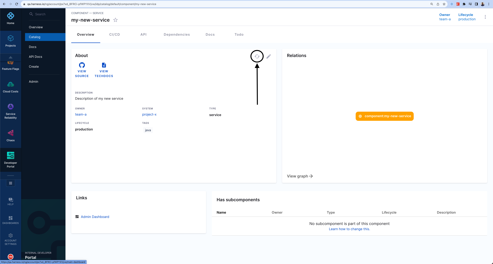
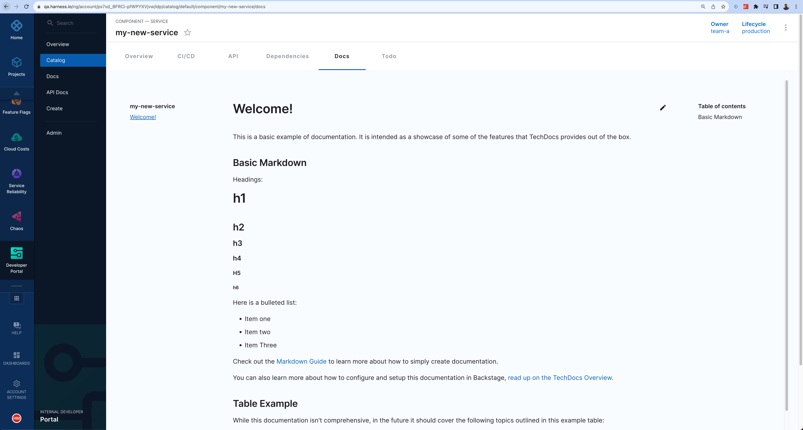

<DocsTag  backgroundColor= "#cbe2f9" text="Tutorial"  textColor="#0b5cad"  />

By default, the **Docs** tab in your catalog does not include documentation for a new software component. However, you can quickly publish Markdown documentation to the **Docs** tab.


import Tabs from '@theme/Tabs';
import TabItem from '@theme/TabItem';

:::info

Docs in Harness IDP is powered by [TechDocs Backstage Plugin](https://backstage.io/docs/features/techdocs/) and which currently is using MkDocs to generate the documentation from source, so the files have to be in Markdown format with a `mkdocs.yml` file present in the path provided. 

:::

<Tabs>
<TabItem value="Docs Available in the Root of Source Folder ">


To add documentation:

1. Create a `docs` directory next to where you have `catalog-info.yaml`.
2. Inside the `docs` directory, create an `index.md` file with the following contents.

```
# Welcome!

This is a basic example of documentation. It is intended to showcase some of the
features that TechDocs provides out of the box.

## Basic Markdown

Headings:

# h1

## h2

### h3

#### h4

##### h5

###### h6

Here is a bulleted list:

- Item one
- Item two
- Item Three

Check out the [Markdown Guide](https://www.markdownguide.org/) to learn more about how to
simply create documentation.

You can also learn more about how to configure and set up this documentation in Backstage,
[read the TechDocs Overview](https://backstage.io/docs/features/techdocs/).

## Table example

While this documentation isn't comprehensive, in the future it should cover the following
topics outlined in this example table:

| Topic   | Description                                                  |
| ------- | ------------------------------------------------------------ |
| Topic 1 | An introductory topic to help you learn about the component. |
| Topic 2 | A more detailed topic that explains more information.        |
| Topic 3 | A final topic that provides conclusions and lessons learned. |

## Learn more about MkDocs

TechDocs uses MkDocs as the static site generator. Visit https://www.mkdocs.org for more information about MkDocs.
```

3. Edit the `catalog-info.yaml` and add the TechDocs annotation.

4. In the `metadata.annotations` field, add `backstage.io/techdocs-ref: dir:.`.


When you see`dir:.`, you can translate it to mean:

- That the documentation source code lives in the same location as the `catalog-info.yaml` file.
- That, in particular, the `mkdocs.yml` file is a sibling of `catalog-info.yaml` (meaning, it is in the same directory)
- And that all of the source content of the documentation would be available if one were to download the directory containing those two files (as well as all sub-directories).

The directory tree of the entity would look something like this:

```sh
├── catalog-info.yaml
├── mkdocs.yml
└── docs
    └── index.md
```

If, for example, you wanted to keep a lean root directory, you could place your `mkdocs.yml` file in a subdirectory and update the `backstage.io/techdocs-ref` annotation value accordingly, e.g. to `dir:./sub-folder:`

```sh
├── catalog-info.yaml
└── sub-folder
    ├── mkdocs.yml
    └── docs
        └── index.md
```
:::warning

 Please note `dir:../.` does not work in the above use case due to security reasons.

:::

</TabItem>
<TabItem value="Docs Available in Some Other Location">

In situations where your TechDocs source content is managed and stored in a location completely separate from your `catalog-info.yaml`, you can instead specify a URL location reference, the exact value of which will vary based on the source code hosting provider. Notice that instead of the `dir:` prefix, the `url:` prefix is used instead. For example:

- GitHub: `url:https://githubhost.com/org/repo/tree/<branch_name>`
- GitLab: `url:https://gitlabhost.com/org/repo/tree/<branch_name>`
- Bitbucket: `url:https://bitbuckethost.com/project/repo/src/<branch_name>`
- Azure: `url:https://azurehost.com/organization/project/_git/repository`

Note, just as it's possible to specify a subdirectory with the `dir:` prefix, you can also provide a path to a non-root directory inside the repository which contains the `mkdocs.yml` file and `docs/` directory. 

e.g. `url:https://github.com/backstage/backstage/tree/master/plugins/techdocs-backend/examples/documented-component`


3. Edit the `catalog-info.yaml` and add the TechDocs annotation.

4. In the `metadata.annotations` field, add `backstage.io/techdocs-ref: url:https://github.com/my-org/my-service/tree/master`.

```YAML
metadata:
  annotations:
    backstage.io/techdocs-ref: url:https://github.com/backstage/backstage/tree/master/plugins/techdocs-backend/examples/documented-component
```


</TabItem>
</Tabs>


5. Select the refresh button on the catalog component page.



6. Navigate to the **Docs** tab to review the documentation, which should become available shortly. 



## Supported MkDocs Plugins in Techdocs

In techdocs we support [MkDocs plugins and extensions](https://backstage.io/docs/features/techdocs/faqs/#what-is-the-mkdocs-techdocs-core-plugin). Here's the list of plugins added.

  - [mkdocs-glightbox](https://github.com/blueswen/mkdocs-glightbox)
  - [mkdocs-git-authors-plugin](https://github.com/timvink/mkdocs-git-authors-plugin)
  - [mkdocs-git-revision-date-localized-plugin](https://github.com/timvink/mkdocs-git-revision-date-localized-plugin)
  - [mkdocs-video](https://pypi.org/project/mkdocs-video/)
  - [mkdocs-material-extensions](https://pypi.org/project/mkdocs-material-extensions/)
  - [mkdocs-redirects](https://github.com/mkdocs/mkdocs-redirects)
  - [mkdocs-awesome-pages-plugin](https://pypi.org/project/mkdocs-awesome-pages-plugin/2.6.1/)
  - [mkdocs-minify-plugin](https://pypi.org/project/mkdocs-minify-plugin/0.7.1/)