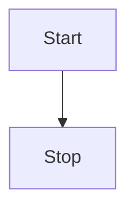
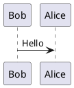

## Introduction

TechDocs is IDP’s documentation site generator, leveraging MkDocs to convert Markdown files into a static site. This guide highlights best practices for creating and maintaining documentation in TechDocs, including generating one-page and multi-page sites, using MkDocs plugins, embedding videos, and creating architecture diagrams.

## Creating a One-Page Docs Site

One-page documentation is ideal for quick-start guides, FAQs, or any standalone documentation.

### Steps:
1. **Set Up the Directory:**

- Create a repository with a single index.md file in the root directory.

```sh
/docs
  |-- index.md
```

2. **Basic `mkdocs.yml` Configuration:**

- Configure MkDocs to use index.md as the sole content file.

```YAML
site_name: Your Site Name
nav:
  - Home: index.md
```

3. **Publishing:**

Push your documentation to the Git repository and [add it to your `catalog-info.yaml` as annotation](/docs/internal-developer-portal/techdocs/enable-docs) to serve it in IDP. If needed, run `techdocs-cli` locally for testing:

```bash
techdocs-cli serve
```

## Working with Multi-Page Sites

For projects requiring detailed documentation, multi-page sites are recommended. These sites can have hierarchical navigation and allow for better content organization.

### Auto-Generated Navigation:

MkDocs generates navigation based on folder and file structures

- Example Structure: 

```sh
/docs
  |-- index.md
  |-- guide/
       |-- getting-started.md
       |-- troubleshooting.md
  |-- reference/
       |-- api.md
```

- Resulting NAV

    - Home
    - Guide
        - Getting Started
        - Troubleshooting
    - Reference
    - API

### Manual Navigation Control:

For custom navigation, explicitly define the structure in `mkdocs.yml`:

```YAML
site_name: Project Documentation
nav:
  - Home: index.md
  - Guide:
      - Getting Started: guide/getting-started.md
      - Troubleshooting: guide/troubleshooting.md
  - Reference:
      - API: reference/api.md
```

Here's an [example mkdocs.yml](https://github.com/backstage/backstage/blob/master/mkdocs.yml) following the above structure. 

Here's a video tutorial explaining the same

<DocVideo src="https://www.youtube.com/embed/S8kjTy5GBuQ?si=yAaIWdrzEkSSIVB_&amp;start=88" />

## Enhancing Docs with Architecture Diagrams

Visual representations, such as architecture diagrams, improve documentation clarity. Use the installed MkDocs plugins for diagrams.

### Mermaid Diagrams: 

Mermaid diagrams are supported out of the box.

```sh



### PlantUML Diagrams:

PlantUML diagrams for more complex visualizations:

```markdown


## Leveraging MkDocs Plugins

TechDocs supports a variety of MkDocs plugins. Here's an overview of all the plugins supported in Harness IDP.

### Installed Plugins:
**TBA** following are the general plugins available
- **`mkdocs-mermaid2-plugin`**: For creating Mermaid diagrams.
- **`mkdocs-material`**: Provides a modern and customizable theme.
- **`mkdocs-video`**: Embeds videos directly in Markdown.
- **`mkdocs-redirects`**: Handles redirects for renamed or moved files.


## Embedding Videos in TechDocs

Embedding videos enriches documentation, especially for tutorials or product demonstrations.

### Embedding Syntax:
Use Markdown for embedding videos:

```markdown

```

### Allowed Domains:
To maintain security and compatibility, only embed videos from the following domains are allowed:

- youtube.com
- www.youtube.com
- youtu.be
- www.youtu.be
- drive.google.com
- zoom.us
- loom.com
- sharepoint.com
- dropbox.com
- docs.google.com

## Working with MkDocs Locally

Working with MkDocs locally allows you to preview changes and troubleshoot issues before pushing your documentation to the repository.

### Prerequisites:

1. Install MkDocs: Ensure MkDocs is installed locally on your machine:

```sh
pip install mkdocs
```

2. Install Required Plugins: Install the plugins defined in your `mkdocs.yml` file. For example:

```sh
pip install mkdocs-material mkdocs-mermaid2-plugin mkdocs-awesome-pages-plugin
```
3. Install [techdocs-cli](https://backstage.io/docs/features/techdocs/cli) (optional but recommended): This can help you build the docs without the presence of `mkdocs.yaml`. 

```sh
npm install -g @techdocs/cli
```
### Steps to Work Locally:

1. **Navigate to Your Docs Directory:** Move to the directory containing your `mkdocs.yml` file:

```sh
cd /path/to/docs
```
2. **Run a Local Development Server:** Use MkDocs to serve your documentation locally:

```sh
mkdocs serve
```
Access the site at `http://localhost:8000`.

3. **Preview in TechDocs Format**: To mimic the TechDocs build process, use the techdocs-cli:

```sh
techdocs-cli serve
```
This ensures the documentation will render as it would in Harness IDP.

In case you want to view the build logs just use the verbose flag, quite helpful during debugging issues.

```sh
techdocs-cli serve -v
```

4. **Iterate and Test:**

- Edit Markdown files and refresh your browser to see changes.
- Verify navigation, plugins, and content rendering.

## Troubleshooting Common Issues:

1. Plugin Errors:
- Ensure all required plugins are listed in requirements.txt or installed manually.
- Verify compatibility with your MkDocs version.

2. Rendering Issues:
- Test with both mkdocs serve and techdocs-cli serve to catch discrepancies.
- Check your `mkdocs.yml` configuration for errors.

3. Build Warnings:
- Run mkdocs build to catch any warnings or errors:

```sh
mkdocs build --clean
```