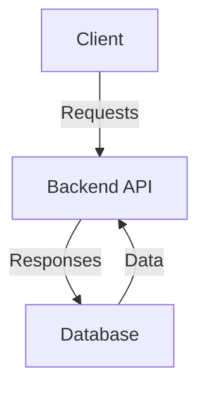
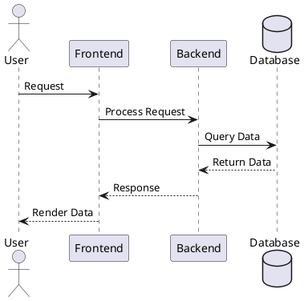

## Introduction

TechDocs is IDP’s documentation site generator, leveraging MkDocs to convert Markdown files into a static site adhering to the concepts of [docs-like-code](https://www.docslikecode.com/). This guide highlights best practices for creating and maintaining documentation in TechDocs, including generating one-page and multi-page sites, using MkDocs plugins, embedding videos, and creating architecture diagrams. 

## Creating a One-Page Docs Site

One-page documentation is ideal for quick-start guides, FAQs, or any standalone documentation.

### Steps:
1. **Set Up the Directory:**

- Create a docs folder in your repository and add a single `README.md` file inside it. Add your documentation content directly to `README.md`. GitHub and TechDocs both recognize and render it automatically.

2. **Serve in IDP:**

- Ensure the repository is registered in your catalog-info.yaml file. TechDocs will automatically render the content without additional setup.

## Working with Multi-Page Sites

For projects requiring detailed documentation, multi-page sites are recommended. These sites can have hierarchical navigation and allow for better content organization.

### Auto-Generated Navigation

MkDocs can automatically generate navigation based on folder and file structures.

- **Example Structure:**

```sh
/docs
  |-- index.md
  |-- guide/
       |-- getting-started.md
       |-- troubleshooting.md
  |-- reference/
       |-- api.md
```

- **Resulting Navigation (Auto-Generated):**

    - Home
    - Guide
        - Getting Started
        - Troubleshooting
    - Reference
        - API

:::info

Even with auto-generated navigation, you can include an `mkdocs.yml` file. In this case, you **cannot** define a `nav` section for custom navigation, but you can still specify other configurations like `site_name` and plugins.

:::

- **Example `mkdocs.yml` for Auto-Generated Navigation:**

```yaml
site_name: Project Documentation
plugins:
  - techdocs-core
```

> If no `mkdocs.yml` file is present, TechDocs will automatically create a basic configuration during rendering.


### Manual Navigation Control

For custom navigation, explicitly define the structure in a `mkdocs.yml` file by adding a `nav` section.

- **Example `mkdocs.yml` for Manual Navigation:**

```yaml
site_name: Project Documentation
plugins:
  - techdocs-core
nav:
  - Home: index.md
  - Guide:
      - Getting Started: guide/getting-started.md
      - Troubleshooting: guide/troubleshooting.md
  - Reference:
      - API: reference/api.md
```

:::info

Always include the `techdocs-core` plugin for compatibility with TechDocs.  

:::

Here's an [example mkdocs.yml](https://github.com/backstage/backstage/blob/master/mkdocs.yml) following the above structure. 

Here's a video tutorial explaining the same

<DocVideo src="https://www.youtube.com/embed/S8kjTy5GBuQ?si=yAaIWdrzEkSSIVB_&amp;start=88" />

## Enhancing Docs with Architecture Diagrams

Visual representations, such as architecture diagrams, improve documentation clarity. Use the installed MkDocs plugins for diagrams.

### Adding an Architecture Diagram (PNG)

1. Store Your Diagram in the same repo as `mkdocs.yml`

Save your architecture diagram in the `docs` folder or a subdirectory, such as `docs/static`. Only images stored in these locations will render correctly in TechDocs.

Example Structure:

```sh
Copy code
/docs
  |-- index.md
  |-- static/
       |-- architecture-diagram.png
```
2. Reference the Diagram in Markdown
- Use Markdown syntax to embed the diagram in your documentation:

```markdown

```
3. Ensure Proper Rendering

- The relative path (static/architecture-diagram.png) should match the diagram's location within the docs directory. For instance:

If the image is at `/docs/static/architecture-diagram.png`, reference it as `static/architecture-diagram.png`.
If the image is at `/docs/architecture-diagram.png`, reference it as `architecture-diagram.png`.

## Add Diagrams as code

### 1. Using Mermaid for Diagrams

Mermaid diagrams are supported out of the box.

```sh
### System Architecture Diagram




#### Supported Diagram Types:
- Flowcharts
- Sequence Diagrams
- Gantt Charts
- Pie Charts

For more syntax options, refer to the [Mermaid documentation](https://mermaid-js.github.io/mermaid/).

#### Instructions to use in local environment:

- Ensure the `mkdocs-mermaid2-plugin` is installed and configured in your `mkdocs.yml`.   

```YAML
plugins:
    - mermaid2
```

For more information refer [here](/docs/internal-developer-portal/techdocs/working-with-techdocs-locally)

### 2. Using **PlantUML** for Advanced Diagrams

PlantUML is ideal for more detailed and customizable diagrams, such as class diagrams, activity diagrams, and deployment diagrams.

#### Example Usage:
- In your Markdown file:

```sh
### Deployment Diagram



#### Instructions to use in local environment:
- Ensure the `mkdocs-plantuml-plugin` is installed and configured in your `mkdocs.yml`.  

```YAML
plugins:
  - plantuml:
      server: https://www.plantuml.com/plantuml
```
For more information refer [here](/docs/internal-developer-portal/techdocs/working-with-techdocs-locally)

## Embedding Videos in TechDocs

Embedding videos enriches documentation, especially for tutorials or product demonstrations.

### Embedding Videos Using iframe

To embed videos hosted on platforms like YouTube or Vimeo, use the following syntax:

```markdown
<iframe 
  width="560" 
  height="315" 
  src="https://www.youtube.com/embed/VIDEO_ID" 
  title="Video title" 
  frameborder="0" 
  allow="accelerometer; autoplay; clipboard-write; encrypted-media; gyroscope; picture-in-picture" 
  allowfullscreen>
</iframe>
```
- Replace `VIDEO_ID` with the unique ID of the video from the platform (e.g., dQw4w9WgXcQ for YouTube).
- Adjust width and height for desired sizing.

#### Allowed Domains:
To maintain security and compatibility, only embed videos from the following domains are allowed:

- youtube.com
- www.youtube.com
- youtu.be
- www.youtu.be
- drive.google.com
- zoom.us
- loom.com
- sharepoint.com
- dropbox.com
- docs.google.com

**Note:**
> Iframe-based videos cannot be rendered locally when using tools like techdocs-cli to preview documentation. They will render correctly only when the TechDocs site is hosted and accessed through the Internal Developer Portal (IDP).

### Embedding Self-Hosted Videos
For videos hosted in your repository or accessible via a direct URL, use the Markdown `<video>` tag:

```markdown
<video controls>
  <source src="https://www.example.com/path-to-video.mp4" type="video/mp4">
</video>
```
- Use this method for `.mp4` or other self-hosted video formats stored in the repository. 


## Create download links for static assets

You may want to make files available for download by your users such as PDF documents, images, or code templates. Download links for files included in your docs directory can be made by adding `{: download }` after a Markdown link.

```sh
[Link text](https://example.com/foo.jpg){: download }
```
The user's browser will download the file as `download.jpg` when the link is clicked.

Specify a file name to control the name the file will be given when it is downloaded:

```sh
[Link text](https://example.com/foo.jpg){: download="foo.jpg" }
```

## How to add the documentation setup to your Workflows

The purpose of this how-to guide is to walk you through how to add the required configuration and some default markdown files to your new Workflows. You can use the [react-ssr-workflow](https://github.com/backstage/software-templates/tree/main/scaffolder-templates/react-ssr-template) as a reference when walking through the steps.

Prerequisites:

- An existing software template including a template.yaml together with a skeleton folder including at least a catalog-info.yaml.

1. Update your component's entity description by adding the following lines to the catalog-info.yaml in your skeleton folder.

```sh
annotations:
  backstage.io/techdocs-ref: dir:.
```
The `backstage.io/techdocs-ref` annotation is used by TechDocs to download the documentation source files for generating an entity's TechDocs site.

2. Create a `mkdocs.yml` file in the root of your skeleton folder with the following content:

```sh
site_name: ${{values.component_id}}
site_description: ${{values.description}}

nav:
  - Introduction: index.md

plugins:
  - techdocs-core
```

3. Create a `/docs` folder in the skeleton folder with at least a `index.md` file in it.

The `docs/index.md` can for example have the following content:

```sh
# ${{ values.component_id }}

${{ values.description }}

## Getting started

Start writing your documentation by adding more markdown (.md) files to this
folder (/docs) or replace the content in this file.
```

:::info
The values of `site_name`, `component_id` and `site_description` depends on how you have configured your Workflow definition YAML.
:::

Done! You now have support for TechDocs in your own Workflows!
