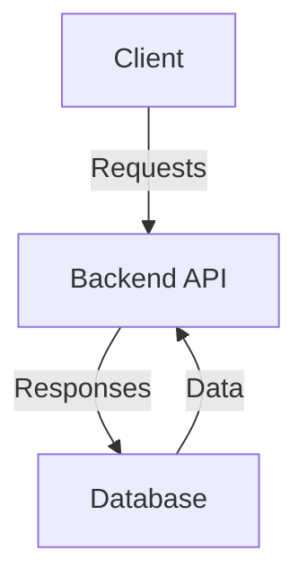
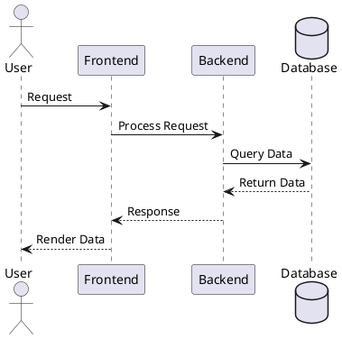

## Introduction

TechDocs is IDP’s documentation site generator, leveraging MkDocs to convert Markdown files into a static site. This guide highlights best practices for creating and maintaining documentation in TechDocs, including generating one-page and multi-page sites, using MkDocs plugins, embedding videos, and creating architecture diagrams.

## Creating a One-Page Docs Site

One-page documentation is ideal for quick-start guides, FAQs, or any standalone documentation.

### Steps:
1. **Set Up the Directory:**

- Create a repository with a single index.md file in the root directory.

```sh
/docs
  |-- index.md
```

2. **Basic `mkdocs.yml` Configuration:**

- Configure MkDocs to use index.md as the sole content file.

```YAML
site_name: Your Site Name
nav:
  - Home: index.md
```

3. **Publishing:**

Push your documentation to the Git repository and [add it to your `catalog-info.yaml` as annotation](/docs/internal-developer-portal/techdocs/enable-docs) to serve it in IDP. If needed, run `techdocs-cli` locally for testing:

```bash
techdocs-cli serve
```

## Working with Multi-Page Sites

For projects requiring detailed documentation, multi-page sites are recommended. These sites can have hierarchical navigation and allow for better content organization.

### Auto-Generated Navigation:

MkDocs generates navigation based on folder and file structures

- Example Structure: 

```sh
/docs
  |-- index.md
  |-- guide/
       |-- getting-started.md
       |-- troubleshooting.md
  |-- reference/
       |-- api.md
```

- Resulting NAV

    - Home
    - Guide
        - Getting Started
        - Troubleshooting
    - Reference
    - API

### Manual Navigation Control:

For custom navigation, explicitly define the structure in `mkdocs.yml`:

```YAML
site_name: Project Documentation
nav:
  - Home: index.md
  - Guide:
      - Getting Started: guide/getting-started.md
      - Troubleshooting: guide/troubleshooting.md
  - Reference:
      - API: reference/api.md
```

Here's an [example mkdocs.yml](https://github.com/backstage/backstage/blob/master/mkdocs.yml) following the above structure. 

Here's a video tutorial explaining the same

<DocVideo src="https://www.youtube.com/embed/S8kjTy5GBuQ?si=yAaIWdrzEkSSIVB_&amp;start=88" />

## Enhancing Docs with Architecture Diagrams

Visual representations, such as architecture diagrams, improve documentation clarity. Use the installed MkDocs plugins for diagrams.

### 1. Using Mermaid for Diagrams

Mermaid diagrams are supported out of the box.

#### Prerequisites to use in local environemnt:
- Ensure the `mkdocs-mermaid2-plugin` is installed and configured in your `mkdocs.yml`.   

```YAML
plugins:
    - mermaid2
```

```sh
### System Architecture Diagram




#### Supported Diagram Types:
- Flowcharts
- Sequence Diagrams
- Gantt Charts
- Pie Charts

For more syntax options, refer to the [Mermaid documentation](https://mermaid-js.github.io/mermaid/).

### 2. Using **PlantUML** for Advanced Diagrams

PlantUML is ideal for more detailed and customizable diagrams, such as class diagrams, activity diagrams, and deployment diagrams.

#### Prerequisites to use in local environemnt:
- Install and configure the `mkdocs-plantuml-plugin` in your project.

#### Adding PlantUML to `mkdocs.yml`:

```yaml
plugins:
  - plantuml:
      server: https://www.plantuml.com/plantuml
```

#### Example Usage:
- In your Markdown file:

```sh
### Deployment Diagram



## Leveraging MkDocs Plugins

TechDocs supports a variety of MkDocs plugins. Here's an overview of all the plugins supported in Harness IDP.

### Installed Plugins:

#### 1. `mkdocs-glightbox`
A plugin that provides a responsive and lightweight image viewer for Markdown content.

Features:
- Adds a modern lightbox effect for images embedded in your documentation.
- Supports image galleries with thumbnails and fullscreen views.

Use Case:
- Great for showcasing multiple screenshots, design mockups, or visual assets in documentation.

To enable a lightbox for images, simply add images with links:

```markdown
### Image Gallery

{: .glightbox}
{: .glightbox}
```

#### 2. `mkdocs-git-authors-plugin`

Displays the list of contributors for each page based on Git history.

Features:
- Uses Git commit history to determine authorship.
- Shows contributors' names and commit counts.

Use Case:

- Ideal for collaborative documentation to credit contributors or track accountability for changes.
- The plugin doesn’t require specific Markdown syntax. Once configured, it automatically displays contributors at the bottom of each page.

#### 3. `mkdocs-git-revision-date-localized-plugin`

Adds the last revision date of each page to the footer, localized to the user's time zone.

Features:
- Retrieves the last modification date from Git.
- Supports localization for different time zones and date formats.

Use Case:
- Useful for indicating the freshness of content, especially in rapidly changing environments.
- This plugin also doesn’t need Markdown syntax. It automatically appends a “Last updated” date to the footer of each page.

Example footer display after plugin setup:

```plaintext
Last updated: November 22, 2024
```

#### 4. `mkdocs-video`

Allows embedding videos directly in Markdown content.

Features:
- Simplifies embedding videos from external sources (e.g., YouTube, Vimeo).
- Supports videos hosted on custom domains.

Use Case:
- Helpful for embedding tutorials, walkthroughs, or presentations in documentation.
- Embed videos with ease by using the video shortcode:

```markdown
### Embedded Video

<video controls>
  <source src="https://www.example.com/path-to-video.mp4" type="video/mp4">
</video>
```

- For YouTube videos:

```markdown
### YouTube Video

[youtube](https://www.youtube.com/watch?v=example_video_id)

```

#### 5. `mkdocs-material-extensions`

Adds additional Markdown extensions and features to enhance MkDocs Material themes.

Features:
- Provides better typography, callouts, tabs, and grid layouts.
- Extends the functionality of mkdocs-material.

Use Case:
- Improves content formatting and visual appeal, particularly when using the Material theme.
- Add callouts, tabs, or grids:
- Callouts:

```markdown
!!! note
    This is a note.
```
- Tabs:

```markdown
=== "Python"
    ```python
    print("Hello, World!")
```

- Grid Layout

```markdown

**Column 1 Content**

**Column 2 Content**

```

#### 6. `mkdocs-redirects`

Helps manage redirects when pages are renamed, moved, or deleted.

Features:
- Automatically redirects old URLs to new ones.
- Prevents broken links when restructuring documentation.

Use Case:
- Critical for maintaining a seamless user experience in large or evolving documentation sites.
- This plugin manages redirects without requiring Markdown changes. In the `redirects` section of `mkdocs.yml`, specify old-to-new paths:

```YAML
redirects:
  old-page.md: new-page.md
```
Users visiting `old-page.md` will be redirected to `new-page.md`.

#### 7. `mkdocs-awesome-pages-plugin`

Simplifies page ordering and organization in navigation.

Features:
- Allows automatic generation of navigation structure based on file hierarchy.
- Provides `.pages` configuration for advanced custom ordering.

Use Case:
- Streamlines the creation and maintenance of navigation in large documentation projects.
- Use `.pages` files to organize navigation:

```plaintext
.pages
---
- Home: index.md
- Guide:
    - Getting Started: guide/start.md
    - Advanced Topics: guide/advanced.md
```
*No changes in Markdown are required.*

#### 8. mkdocstrings[crystal,python,vba]:

Auto-generates documentation for code directly from docstrings in your source files.This specifies additional language-specific parsers:
- Crystal: Supports docstring extraction for Crystal projects.
- Python: Processes Python docstrings for classes, functions, and modules.
- VBA: Handles VBA (Visual Basic for Applications) docstrings.

Features:
- Supports multiple programming languages (e.g., Python, Crystal, VBA).
- Integrates well with MkDocs to provide API documentation.

Use Case:
- Ideal for documenting APIs or libraries where docstrings are already maintained in the source code.
- Write docstrings in your code:

```python
def greet(name: str) -> str:
    """
    Greets the user.

    Args:
        name (str): Name of the user.

    Returns:
        str: A greeting message.
    """
    return f"Hello, {name}!"
```

The plugin automatically generates documentation for such functions/classes. In Markdown, you can add placeholders to display the generated content:

```markdown
::: my_package.my_module.greet
```

#### 9. `mkdocs-minify-plugin`

Minifies the output files (HTML, CSS, JS) to reduce size and improve performance.

Features:
- Optimizes documentation by reducing file sizes.
- Speeds up loading times for users.

Use Case:
- Helpful for public-facing documentation where performance and bandwidth savings matter.
- This plugin works silently during the build process and doesn’t affect Markdown. Once configured, it minimizes your generated HTML, CSS, and JS files.


## Embedding Videos in TechDocs

Embedding videos enriches documentation, especially for tutorials or product demonstrations.

### Embedding Syntax:
Use Markdown for embedding videos:

```markdown
<video controls>
  <source src="https://www.example.com/path-to-video.mp4" type="video/mp4">
</video>
```

### Allowed Domains:
To maintain security and compatibility, only embed videos from the following domains are allowed:

- youtube.com
- www.youtube.com
- youtu.be
- www.youtu.be
- drive.google.com
- zoom.us
- loom.com
- sharepoint.com
- dropbox.com
- docs.google.com

## Working with MkDocs Locally

Working with MkDocs locally allows you to preview changes and troubleshoot issues before pushing your documentation to the repository.

### Prerequisites:

1. Install MkDocs: Ensure MkDocs is installed locally on your machine:

```sh
pip install mkdocs
```

2. Install Required Plugins: Install the plugins defined in your `mkdocs.yml` file. For example:

```sh
pip install mkdocs-material mkdocs-mermaid2-plugin mkdocs-awesome-pages-plugin
```
3. Install [techdocs-cli](https://backstage.io/docs/features/techdocs/cli) (optional but recommended): This can help you build the docs without the presence of `mkdocs.yaml`. 

```sh
npm install -g @techdocs/cli
```
### Steps to Work Locally:

1. **Navigate to Your Docs Directory:** Move to the directory containing your `mkdocs.yml` file:

```sh
cd /path/to/docs
```
2. **Run a Local Development Server:** Use MkDocs to serve your documentation locally:

```sh
mkdocs serve
```
Access the site at `http://localhost:8000`.

3. **Preview in TechDocs Format**: To mimic the TechDocs build process, use the techdocs-cli:

```sh
techdocs-cli serve
```
This ensures the documentation will render as it would in Harness IDP.

In case you want to view the build logs just use the verbose flag, quite helpful during debugging issues.

```sh
techdocs-cli serve -v
```

4. **Iterate and Test:**

- Edit Markdown files and refresh your browser to see changes.
- Verify navigation, plugins, and content rendering.

## Troubleshooting Common Issues:

1. Plugin Errors:
- Ensure all required plugins are listed in requirements.txt or installed manually.
- Verify compatibility with your MkDocs version.

2. Rendering Issues:
- Test with both mkdocs serve and techdocs-cli serve to catch discrepancies.
- Check your `mkdocs.yml` configuration for errors.

3. Build Warnings:
- Run mkdocs build to catch any warnings or errors:

```sh
mkdocs build --clean
```