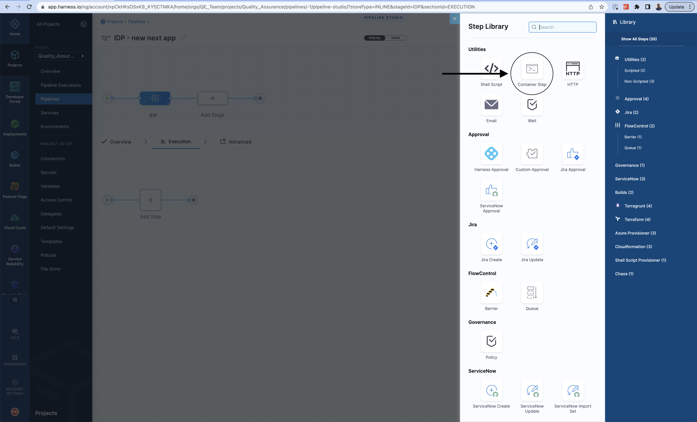
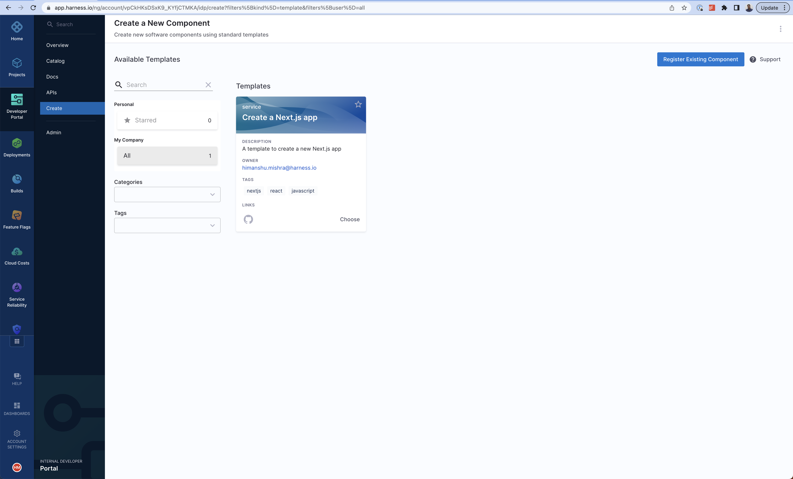

In this tutorial, we will create a basic service onboarding pipeline which will on-demand provision a new Next.js app for developers using a software template. As a developer, you will go to the **Create** page, choose the template and enter a few details like the new of your new app. The service onboarding pipeline will create a new hello world repository for you to start writing code.

The user flow consists of a few parts. The very first thing a user interacts with is called a "Software Template" inside IDP. This is a customizable form where you can collect inputs from the user about their needs. It then executes a Harness pipeline which onboards the new service. Usually the pipeline fetches a _hello-world_ skeleton code, creates a new repository and interacts with third party providers like cloud providers, Jira, Slack, etc.


## Pre-requisites

- You should have Developer Portal enabled in your account.
- You should either have CI or CD license. This is a temporary requirement.

## Start by creating the pipeline

### Create CI or Custom stage

Go to the Projects page in the sidebar and choose any project. You can also create a new project just for service onboarding pipelines. Eventually, all the users in your account should have permission to execute the pipelines in this project, so it's better to create a new one. [Docs](https://developer.harness.io/docs/platform/organizations-and-projects/create-an-organization/).

Click on the create pipeline button and you will land on the pipeline studio.


Now let's create an `IDP` stage. If you have the license of Harness CI, choose the Build stage. Otherwise, choose Custom stage. For the purpose of this tutorial, we will use the Custom stage.


After creating the stage, click on `Add step`. A sidebar with available steps should appear on the right hand side.

Here, we are going to make use of the `Container` step to run a Python CLI called [cookiecutter](https://github.com/cookiecutter/cookiecutter). We will need a publicly available Python image for this purpose. You can use the Container step for any such project generators, for example [yeoman](https://yeoman.io/).

:::info note
In the CI or Build stage, the Container step is called Run step with the same functionality.
:::



Name the step anything you like, for example - "Create Next.js app".

You can enter `10m` (10 minutes) in the Timeout field.

In the Container registry field, create or choose an anonymous Docker connector which connects to DockerHub (`https://registry.hub.docker.com/v2/`)

Use `python` in the Image field.

Before writing the command, let's finish the Infrastructure part which means where should the pipeline execute. You have the option to execute the pipeline in your own infrastructure or use Harness platform. If you have an existing delegate setup for any deployments, you can use that connector and enter its Kubernetes namespace. If you want to use Harness platform, then you have to use the CI or Build stage instead of custom stage and choose Harness platform as the infrastructure.

:::info note
Depending upon our operation, we'll have to adjust the memory limit of the container. You can change the Limit Memory field from `500Mi` to `4000Mi` if needed.
:::

### Execute cookiecutter-based script

Now, let's finish the code part. You can copy paste the following and we can dive deeper into each block afterwards.

```sh
# Pre-cleanup in case pipeline fails

rm -rf idp-samples/
rm -rf "<+pipeline.variables.project_name>"

# Clone skeleton
git clone https://github.com/harness-community/idp-samples

# Generate code to be pushed
pip install cookiecutter
cookiecutter idp-samples/idp-pipelines/nextjs/skeleton project_name="<+pipeline.variables.project_name>" --no-input

# Create a new GitHub repository
curl -L -i -X POST -H "Accept: application/vnd.github+json" -H "Authorization: Bearer <+pipeline.variables.github_token>" https://api.github.com/orgs/<+pipeline.variables.github_org>/repos -d "{\"name\":\"<+pipeline.variables.github_repo>\",\"description\":\"<+pipeline.variables.project_name> - A Next.js app\",\"private\":false}"

# Push the code
cd <+pipeline.variables.project_name>/
git init -b main
git config --global user.email "support@harness.io"
git config --global user.name "Harness Support"
git add .
git commit -m "Project init"
git remote add origin https://github.com/<+pipeline.variables.github_org>/<+pipeline.variables.github_repo>.git
git push https://<+pipeline.variables.github_token>@github.com/<+pipeline.variables.github_org>/<+pipeline.variables.github_repo>.git
```

The above script has two main jobs 1. Generate a basic Next.js app and 2. Create a new repository with the contents. The sample code used here is stored [here](https://github.com/harness-community/idp-samples/tree/main/idp-pipelines/nextjs) which essentially is a [cookiecutter project](https://cookiecutter.readthedocs.io/en/stable/tutorials/tutorial2.html). You can choose to select from available [cookiecutter projects](https://www.cookiecutter.io/templates) or create your own from scratch!

### Manage variables in the pipeline

Note that the script uses several pipeline variables -

- `<+pipeline.variables.project_name>`
- `<+pipeline.variables.github_username>`
- `<+pipeline.variables.github_token>`
- `<+pipeline.variables.github_org>`
- `<+pipeline.variables.github_repo>`

You can use the Variables button on the floating sidebar on the right to open the Variables page for the pipeline.


You can create any number of pipeline variables and decide their value type. Some of the variables can have fixed value like github token, username and org. The token in this case is fixed to a Harness secret and the value is decoded at the time of pipeline execution.

Variables like project name and github repo are runtime inputs. They are needed at the time of pipeline execution. When creating a new variable you can decide the type of the variable on the UI. Here is a [reference documentation](https://developer.harness.io/docs/platform/Variables-and-Expressions/harness-variables) on pipeline variables.

### Create Software Template definition in IDP

Now that our pipeline is ready to execute if given a project name and a github repository name, let's create the UI counterpart of it in IDP. This is powered by the [Backstage Software Template](https://backstage.io/docs/features/software-templates/writing-templates). Create a `template.yaml` file anywhere in your git system. (Usually in the same place as your skeleton hello world code).

[Source](https://github.com/harness-community/idp-samples/blob/main/idp-pipelines/nextjs/template.yaml)

```yaml
apiVersion: scaffolder.backstage.io/v1beta3
kind: Template
metadata:
  name: nextjs-app
  title: Create a Next.js app
  description: A template to create a new Next.js app
  tags:
    - nextjs
    - react
    - javascript
spec:
  owner: himanshu.mishra@harness.io
  type: service
  parameters:
    - title: Next.js app details
      required:
        - project_name
        - github_repo
      properties:
        project_name:
          title: Name of your new app
          type: string
          description: Unique name of the app
        github_repo:
          title: Name of the GitHub repository
          type: string
          description: This will be the name of Repository on Github
        isPublish:
          title: Do you wish to publish the artificat the internal registry?
          type: boolean
    - title: Service Infrastructure Details
      required:
        - owner
      properties:
        cloud_provider:
          title: Choose a cloud provider for Deployment
          type: string
          enum: ["GCP", "AWS"]
          default: GCP
        db:
          title: Choose a Database Type for the Service
          type: string
          enum: ["None", "MySQL", "Postgres", "MongoDB"]
          default: None
        cache:
          title: Choose a caching system for the Service
          type: string
          enum: ["None", "Redis"]
          default: None
        owner:
          title: Choose an Owner for the Service
          type: string
          ui:field: OwnerPicker
          ui:options:
            allowedKinds:
              - Group
        # This field is hidden but needed to authenticate the request to trigger the pipeline
        token:
          title: Harness Token
          type: string
          ui:widget: password
          ui:field: HarnessAuthToken
  steps:
    - id: trigger
      name: Creating your Next.js app
      action: trigger:harness-custom-pipeline
      input:
        url: "https://app.harness.io/ng/account/vpCkHKsDSxK9_KYfjCTMKA/home/orgs/QE_Team/projects/Quality_Assurence/pipelines/IDP_New_NextJS_app/pipeline-studio/?storeType=INLINE"
        inputset:
          project_name: ${{ parameters.project_name }}
          github_repo: ${{ parameters.github_repo }}
          cloud_provider: ${{ parameters.provider }}
          db: ${{ parameters.db }}
          cache: ${{ parameters.cache }}
        apikey: ${{ parameters.token }}

  output:
    links:
      - title: Pipeline Details
        url: ${{ steps.trigger.output.PipelineUrl }}
```

This YAML is just another entity definition YAML that is governed by Backstage. The name, description of the Software template can be changed accordingly. The template has two main parts 1. Input from the user 2. Execution of pipeline.




Let's first take a look at the inputs are we asking from developers as part of the template. This is written in the `spec.parameters` field. It has two parts but you can combine it into one. The keys under `properties` is the unique id of the field, for example `github_repo`, `project_name`, etc. If you remember from above, these are the pipeline variables which are set as runtime inputs above. This is exactly what we want the developer to enter when creating their new app.

There are some additional fields in here like cloud provider, database choice etc. but it's only for demo purpose and are not actually used in this tutorial.

### Authenticate the request

Once you have written all the inputs needed in the template, you need to add this block under `spec.parameters.properties`.

```yaml
token:
  title: Harness Token
  type: string
  ui:widget: password
  ui:field: HarnessAuthToken
```

This is a custom component we have created to authenticate the call to execute the pipeline based on the logged in user's credentials. So the logged in user's access will be used to execute the pipeline you have created above.

### Action to trigger the pipeline

The `spec.steps` field contains only one action - trigger a Harness pipeline. Update the `url` and replace it with the url of your service onboarding pipeline. Also ensure that the `inputset` is correct and it contains all the runtime input variables needed by the pipeline.

### Register the template

Use the url to the `template.yaml` created above and register it using the same process for [registering a new software component](../getting-started/register-a-new-software-component.md).

Now navigate to `Create` page in your IDP and you will see the newly created template appear. Try it out!
