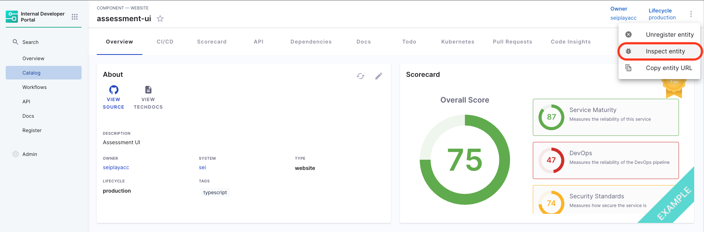

<DocsTag  backgroundColor= "#cbe2f9" text="Tutorial"  textColor="#0b5cad"  />

## Introduction

In this tutorial we will be using [Scorecards](https://developer.harness.io/docs/internal-developer-portal/scorecards/scorecard) for tracking and driving migrations. Recently we have introduced new Data Points for git based Data Sources to extract information from files using regex patterns. In this tutorial we will be building some custom checks using these Data Points to track library and language versions from the contents of metadata files.

## Prerequisites

Before starting, ensure you have:

1. An active Harness IDP account, at present IDP is enabled on request so please [fill this form](https://www.harness.io/demo/internal-developer-portal) to get IDP enabled for you.

2. Access to your git provider through the connectors in the Admin section, remember to provide API access. Follow the [steps mentioned here to create connector](https://developer.harness.io/docs/category/code-repo-connectors) once you're in the connector window.


3. (Optional) If your catalog-info.yaml does not live at the root of the source code, then ensure the `backstage.io/source-location` annotation appropriately points to the correct source code location.

:::info

### How to check `backstage.io/source-location`

Catalog -> Software Component -> Inspect Entity -> Raw YAML




:::

4. A [registered software component](/docs/internal-developer-portal/tutorials/register-component-in-catalog) for which you want to track migration.

## Understanding Checks in Scorecards

We have added data points for git based datasources (GitHub, GitLab, etc.), to be used to create custom checks in Scorecards that can match and extract specific string patterns from any file in your source code. This feature is particularly useful for tracking versions in various files eg., bazel for java, Dockerfile, go.mod for go, package.json for react and javascript, manifest files, etc.

## Setting up a Custom Check

1. Under **Admin** section select **Scorecards**, now go to **Checks** tab and select **Create Custom Check**


2. Now add Name and Description to the custom check.

### Select DataSource and DataPoints

3. Select the git provider datasource, for example GitHub along with `extract string from a file` data point to extract the version number.

### Branch Specification

4. Specifying the Branch: If you know the branch name, specify it directly. If not, the system will use the branch from `backstage.io/source-location` annotation.

:::info

### How to add `backstage.io/source-location`

Ideally `backstage.io/source-location` is taken from the root of the `catalog-info.yaml` in case your services don't live there, you need to add an annotation as mentioned below in your `catalog-info.yaml`

```YAML
#Example
metadata:
  annotations:
    backstage.io/source-location: url:https://github.com/my-org/my-service/
```

A `Location` reference that points to the source code of the entity (typically a `Component`). Useful when catalog files do not get ingested from the source code repository itself. If the URL points to a folder, it is important that it is suffixed with a `'/'` in order for relative path resolution to work consistently.

:::

### File Specification

5. Defining the File: Specify the filename with its extension or provide the relative path from the root folder. For example, use .bazelrc, package.json, manifest/Dockerfile. Also you can provide the filename as a regex pattern, example for a file path `/backstage/blob/master/scripts/log-20240105.anyextension` the regex would be `/backstage/blob/master/scripts/log-20240105\..*`

### Specify the Pattern

6. Since I'm trying to track to Java Version of my project using the bazelrc file which mentions my java version as `build --java_language_version=17` and the corresponding Regex Pattern to be used for the same is `^build --java_language_version=(\d+)`

:::info

Here, we need to group the string pattern which we want to match using `()` for example in the above example we have grouped the number `(\d+)` another example is if we would try to match this string `go 1.21` in a go.mod file, the corresponding regex would be `^go\s(\d+\.\d+)$` another regex pattern example for package.json file content `"eslint": "^7.7.0",` is `"eslint":\s"\^(\d+\.\d+\.\d+)",`

Also we suggest you to use [chatgpt](https://chat.openai.com/) for generating and [regex101](https://regex101.com/) validating the regex.

:::


## Create a Scorecard

Once the Checks are created, now we need to add them to a new Scorecard.

7. Go to Scorecards on the left nav in Admin and select **Create New Scorecard**

8. Add Name, Description, Owner (same as that of the software component you want to add this scorecard to) and select the Checks you created above to track the migration and publish the Scorecard.


### Check Score

9. Now go to the software component in your catalog and under the Scorecards tab you can view the scores, also you can re-run the check to compute score instantaneously.


### How does the Score gets computed?

#### Pattern Extraction

Extracting Data: The system fetches the file, searches for the specified regex pattern within its contents, and then extracts and returns the value.

#### Return Value

Result: The system returns a true/false value based on whether the pattern was found in the file or whether a value is the same as desired.

## Troubleshooting

### Incorrect File Path:

Ensure the file path is relative to the root folder of the repository.

### Pattern Matching Errors:

Verify the accuracy of the pattern you are trying to match. You can use [this website](http://regex101.com/) for the same, also check for the group `()` for the string you're trying to match.

## Best Practices

Regularly update the backstage.io/source-location annotation to reflect any changes in the repository structure.
Check the regex used for pattern matching.

## Conclusion

In this tutorial, we covered how to use Scorecards in Harness IDP for tracking and driving migrations. This tool is incredibly useful for maintaining up-to-date information on various aspects of your software projects, such as dependency versions.

For more detailed information and support, refer to the [Harness IDP documentation](https://developer.harness.io/docs/internal-developer-portal) and [community forums](https://join-community-slack.harness.io/).
