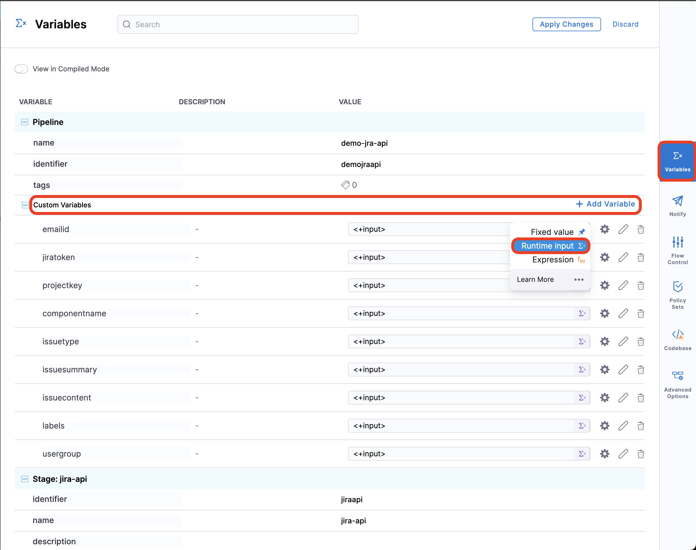
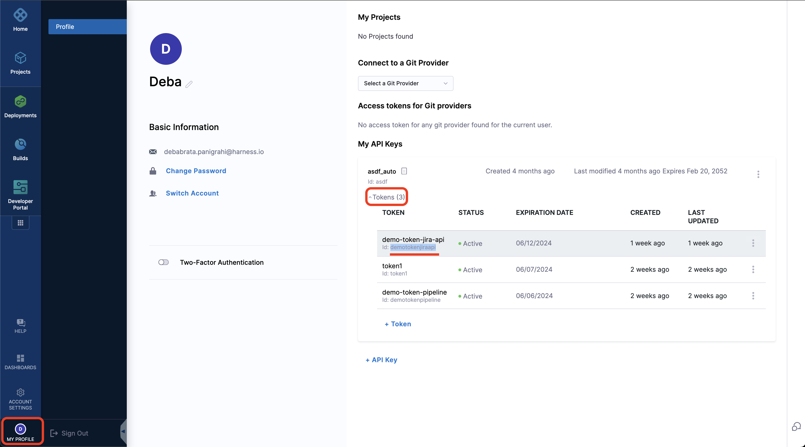
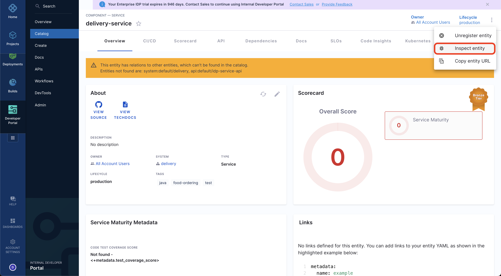
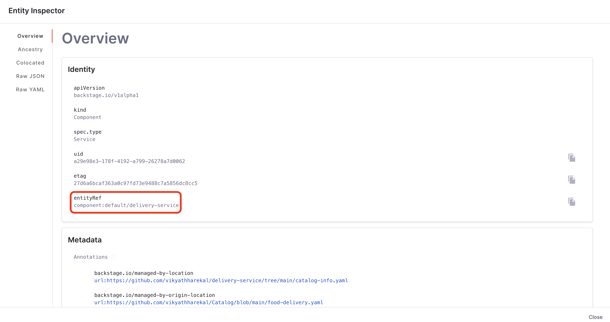
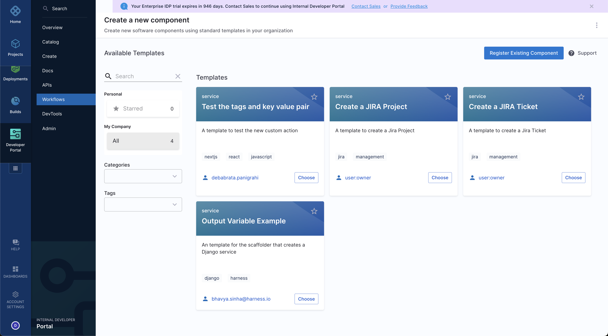
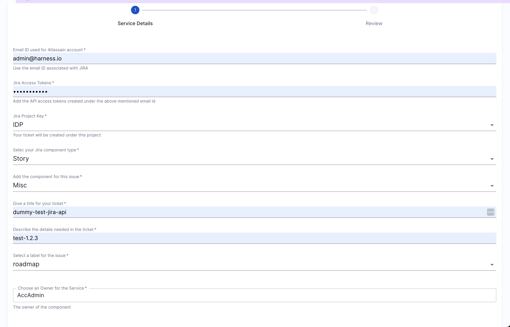
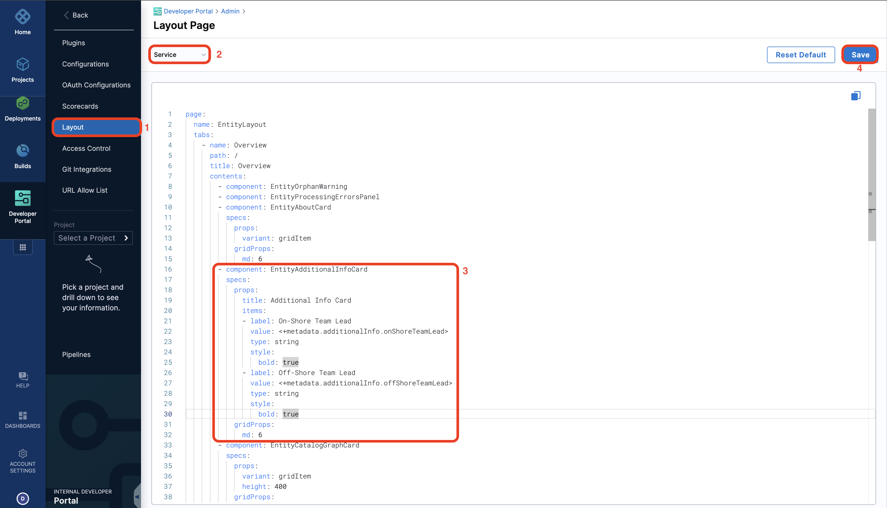
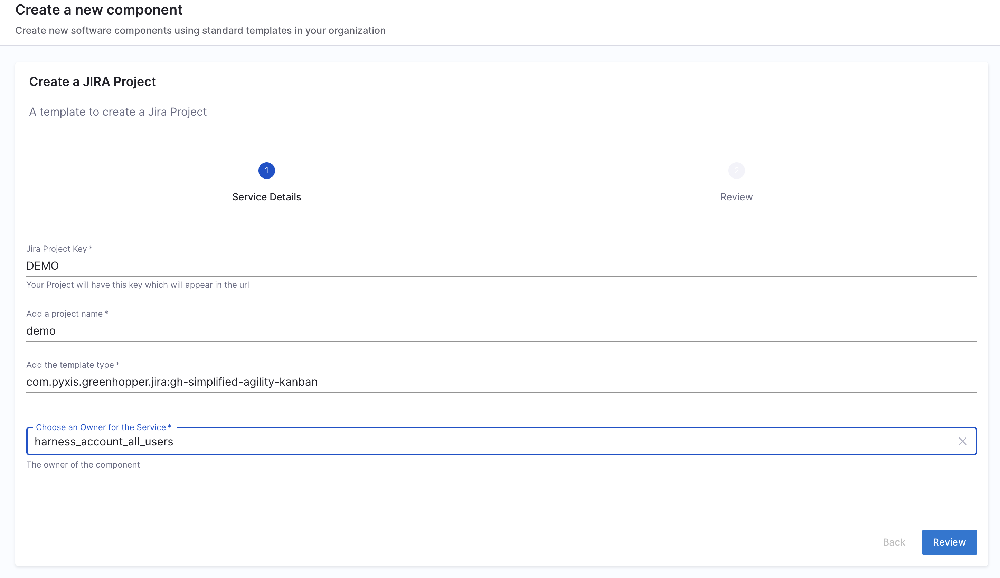

## Introduction

In this tutorial we will be creating Jira tickets using Workflows and add the information (i.e. ticket numbers) to the corresponding Software Component in the Catalog and display the same in the UI using Additional Info Card. The aim of this tutorial is to help you understand the usage of REST APIs to push information in the Catalog and then use them in different parts of IDP according to your use-cases. 

## Pre-Requisite

1. We assume you have JIRA set-up as your ticket management system, and you have access to the same to create tickets in your corresponding project as well as administrator access to create projects.

## Create the Workflow


import Tabs from '@theme/Tabs';
import TabItem from '@theme/TabItem';

<Tabs queryString="Create Jira Ticket">
<TabItem value="display-jira-ticket" label="Create JIRA Ticket">

### Create Jira ticket 

<Tabs queryString="Using RUN Step">
<TabItem value="using-run-step" label="Using RUN Step">

### Using RUN Step

1. Go to **Admin** in your IDP
2. Now select the **project** where you you want to **create the pipeline** for the Workflows. 
3. Begin by selecting the **Create a Pipeline** button followed by adding a name for the pipeline and set up your pipeline as **inline**.
4. Now select the **Developer Portal Stage** and give it a name. 
5. Add a **RUN** step, name it as **create jira ticket** and select the **Shell** as `Bash`
6. Now add the following under the **Command**.

```sh
EMAIL_ID="<+pipeline.variables.email-id>"
JIRA_TOKEN="<+pipeline.variables.jiratoken>"
PROJECT_KEY="<+pipeline.variables.projectkey>"
COMPONENT_NAME="<+pipeline.variables.componentname>"
ISSUE_TYPE="<+pipeline.variables.issuetype>"
ISSUE_SUMMARY="<+pipeline.variables.issuesummary>"
ISSUE_CONTENT="<+pipeline.variables.issuecontent>"
LABELS="<+pipeline.variables.labels>"

# Perform the POST request with curl and capture the response
response=$(curl --silent --request POST \
  --url 'https://harness.atlassian.net/rest/api/3/issue' \
  --user "$EMAIL_ID:$JIRA_TOKEN" \
  --header 'Accept: application/json' \
  --header 'Content-Type: application/json' \
  --data '{
    "fields": {
        "project": {
            "key": "'"$PROJECT_KEY"'"
        },
        "components": {
            "name": "'"$COMPONENT_NAME"'"
        },
        "issuetype": {
            "name": "'"$ISSUE_TYPE"'"
        },
        "summary": "'"$ISSUE_SUMMARY"'",
        "description": {
            "version": 1,
            "type": "doc",
            "content": [
                {
                    "type": "paragraph",
                    "content": [
                        {
                            "type": "text",
                            "text": "'"$ISSUE_CONTENT"'"
                        }
                    ]
                }
            ]
        },
        "labels": [
            "'"$LABELS"'"
        ]
    }
}')

# Extract the key from the JSON response using jq
issue_key=$(echo "$response" | jq -r '.key')

# Export the issue key as an environment variable
export ISSUE_KEY="$issue_key"

# Print the issue key (optional)
echo "The created issue key is: $ISSUE_KEY"

```

The above given request body can create a Jira ticket based on [project](https://confluence.atlassian.com/jiracoreserver073/creating-a-project-861255642.html) and [component](https://support.atlassian.com/statuspage/docs/create-a-component/) and add a label to the same. 

We have used few pipeline variables in the body, which will be used to take input from the IDP Workflows and for the users to choose project, add the summary, description for the tickets. 

7. Now under **Optional Configuration** add the **Output Variables** as `ISSUE_KEY`.
8. Apply the Changes.
9. Go to **Variables** on the right side of the page and add the following variables and have the input type as **Runtime Input**. 
    - emailid
    - jiratoken
    - projectkey
    - componentname
    - issuetype
    - issuesummary
    - issuecontent
    - labels
    - usergroup

10. Apply the changes.



### Use Catalog Metadata Ingestion API

11. Start by adding another `RUN` step. 
12. Name it as **Ingestion API** and select the **Shell** as `Bash`
13. Now add the following under the **Command**.

```sh
curl --location 'https://app.harness.io/gateway/v1/catalog/custom-properties' \
--header 'Harness-Account: <+account.identifier>' \
--header 'Content-Type: application/json' \
--header 'x-api-key: <+secrets.getValue('account.TOKEN_ID')>' \
--data '{
    "properties": [
        {
            "field": "metadata.openTicket",
            "filter": {
                "kind": "Component",
                "type": "service",
                "owners": [
                    "<+pipeline.variables.usergroup>"
                ]
            },
            "value_overrides": [
                {
                    "entity_ref": "YOUR_COMPONENT_LINK",
                    "override_value": "<+stage.spec.execution.steps.create_jira_ticket.output.outputVariables.ISSUE_KEY>"
                }
            ],
            "value": "0"
        }
    ]
}'

```

14. Under `header` x-api-key: `<+secrets.getValue('account.TOKEN_ID')>`, add the token ID for your API key. Get your token ID from your Profile



In the above body the openTicket which got created in JIRA will be added, to kind component and type service owned by the `usergroup` selected in the Workflows. Under `entity_ref` add the component link to which you want to add the ticket ID, the unique entity reference could be found using inspect entity for the component in Catalog. 





15. Now Apply the changes. 


</TabItem>
<TabItem value="using-http-step" label="Using HTTP Step">

### Using HTTP Step

:::info

HTTP Step is available under custom stage and it's part of CD License 

:::

1. Go to **Admin** in your IDP
2. Now select the **project** where you you want to **create the pipeline** for the Workflows. 
3. Begin by selecting the **Create a Pipeline** button followed by adding a name for the pipeline and set up your pipeline as **inline**.
4. Now select the **Custom Stage** and give it a name. 
5. Add a **HTTP** step and name it as **create jira ticket**
6. Under the URL add this endpoint `https://YOUR_COMPANY.atlassian.net/rest/api/3/issue` and replace the `YOUR_COMPANY` with your domain name.
7. Select the Method as `POST`.
8. Under the body add the following:

```json
{
    "fields": {
        "project": {
            "key": "<+pipeline.variables.projectkey>"
        },
        "components": [
        {
            "name": "<+pipeline.variables.componentname>"
        }
        ],
        "issuetype": {
            "name": "<+pipeline.variables.issuetype>"
        },
        "summary": "<+pipeline.variables.issuesummary>",
        "description": {
            "version": 1,
            "type": "doc",
            "content": [
                {
                    "type": "paragraph",
                    "content": [
                        {
                            "type": "text",
                            "text": "<+pipeline.variables.issuecontent>"
                        }
                    ]
                }
            ]
        },
        "labels": [
            "<+pipeline.variables.labels>"
        ]
    }
}
```
The above given request body can create a Jira ticket based on [project](https://confluence.atlassian.com/jiracoreserver073/creating-a-project-861255642.html) and [component](https://support.atlassian.com/statuspage/docs/create-a-component/) and add a label to the same. 

We have used few pipeline variables in the body, which will be used to take input from the IDP Workflows and for the users to choose project, add the summary, description for the tickets. 

9. Under **Optional Configuration** add the **Assertion** as `<+httpResponseCode>==201`.
10. Under **Headers** add the following key value pairs:
    - Accept: `application/json`
    - Authorization: `Basic <Base64 encoded username and password>`, the username is the email-id and the password would be the [JIRA API key](https://support.atlassian.com/atlassian-account/docs/manage-api-tokens-for-your-atlassian-account/#Create-an-API-token)
    - Accept-Encoding: `gzip, deflate, br`
11. Under output add a variable `issue_key` and assign a value as expression `<+json.object(httpResponseBody).key>`
12. Now **Apply Changes**.
13. Go to **Variables** on the right side of the page and add the following variables and have the input type as **Runtime Input**. 
    - projectkey
    - componentname
    - issuetype
    - issuesummary
    - issuecontent
    - labels
    - usergroup
14. Apply the changes.


### Use Catalog Metadata Ingestion API

15. Start by adding another `HTTP` step. 
16. Add the **Timeout** as `30s`.
17. Add this endpoint as as URL `https://app.harness.io/gateway/v1/catalog/custom-properties`, read more about [Catalog Metadata Ingestion API](https://developer.harness.io/docs/internal-developer-portal/catalog/custom-catalog-properties#catalog-metadata-ingestion-api)
18. Select the **Method** as `POST`.
19. And add the following json as **Request Body**

```json
{
    "properties": [
        {
            "field": "metadata.openTicket",
            "filter": {
                "kind": "Component",
                "type": "service",
                "owners": [
                    "<+pipeline.variables.usergroup>"
                ]
            },
            "value_overrides": [
                {
                    "entity_ref": "YOUR_COMPONENT_LINK",
                    "override_value": "<+stage.spec.execution.steps.create_jira_ticket.output.outputVariables.issue_key>"
                }
            ],
            "value": "0"
        }
    ]
}
```

In the above body the openTicket which got created in JIRA will be added, to kind component and type service owned by the `usergroup` selected in the Workflows. Under `entity_ref` add the component link to which you want to add the ticket ID, the component link could be found using inspect entity for the component in catalog. 


20. Under **Optional Configuration** add the **Assertion** as `<+httpResponseCode>==200`.
21. Under **Headers** add the following key value pairs:
    - Harness-Account: `<+account.identifier>`
    - Content-Type: `application/json`
    - Accept: `*/*`
    - x-api-key: `<+secrets.getValue('account.TOKEN_ID')>`, add the token ID for your API key. Get your token ID from your Profile

    

22. Now **Apply Changes** and **SAVE** the pipeline. 

</TabItem>
</Tabs>

## Create Workflow

Now we have to create a workflow, which takes the input from the user and triggers the pipeline. Here's the workflow YAML

```YAML
apiVersion: scaffolder.backstage.io/v1beta3
kind: Template
metadata:
  name: jira-ticket
  title: Create a JIRA Ticket
  description: A template to create a Jira Ticket
  tags:
    - jira
    - management
spec:
  owner: owner@company.com
  type: service
  parameters:
    - title: Service Details
      required:
        - projectkey
        - issuetype
        - jiracomponentname
        - issuesummary
        - issuecontent
        - labels
        - usergroup
      properties:
        emailid:
          title: Email ID used for Atlassain account
          type: string
          description: Use the email ID associated with JIRA
        jiratoken:
          title: Jira Access Tokens
          type: string
          ui:widget: password
          description: Add the API access tokens created under the above mentioned email id 
        projectkey:
          title: Jira Project Key
          type: string
          default: IDP
          description: Your ticket will be created under this project
        issuetype:
          type: string
          title: Add your Jira component type
          default: Story
        jiracomponentname:
          type: string
          title: Add the component for this issue
          desciption: Component for ticket tracing eg., Misc, Backstage Core, Platform etc. 
        issuesummary:
          title: Give a title for your ticket
          type: string
        issuecontent:
          title: Describe the details needed in the ticket
          type: string
        labels:
          type: string
          title: Select a label for the issue
          default: roadmap     
        usergroup:
          title: Choose an Owner for the Service
          type: string
          ui:field: OwnerPicker
          ui:options:
            allowedKinds:
              - Group
        # This field is hidden but needed to authenticate the request to trigger the pipeline
        token:
          title: Harness Token
          type: string
          ui:widget: password
          ui:field: HarnessAuthToken
  steps:
    - id: trigger
      name: Bootstrapping your new service
      action: trigger:harness-custom-pipeline
      input:
        url: "PIPELINE URL"
        inputset:
          emailid: ${{ parameters.emailid }}
          jiratoken: ${{ parameters.jiratoken }}
          projectkey: ${{ parameters.projectkey }}
          issuetype: ${{ parameters.issuetype }}
          componentname: ${{ parameters.jiracomponentname }}
          issuesummary: ${{ parameters.issuesummary }}
          issuecontent: ${{ parameters.issuecontent }}
          labels: ${{ parameters.labels }}
          usergroup: ${{ parameters.usergroup }}
        apikey: ${{ parameters.token }}

  output:
    links:
      - title: Pipeline Details
        url: ${{ steps.trigger.output.PipelineUrl }}
```

In the above YAML just replace the `url` with the pipeline URL we created above, also make sure the **key values under `inputset` exactly matches with the pipeline variable names**. 

Also for **Jira token** input the input should be the [personal access token](https://confluence.atlassian.com/enterprise/using-personal-access-tokens-1026032365.html) from JIRA. 

23. Now go to your git provider and add this workflow yaml and save it, make sure it's public incase it's in private repo make sure you have the [git integration setup](https://developer.harness.io/docs/internal-developer-portal/get-started/setup-git-integration/#connector-setup). 

24. Once the file is created in your git repo, copy the full URL to the file. For example, `https://github.com/harness-community/idp-samples/blob/main/tutorial-jira-ticket-catalog-ingestion.yaml`.


25. In the left navigation, select **Create**, and then select **Register Software Component**.


26. Enter the URL to your new `workflow.yaml`.


27. Click **Import**.


28. Now go to the workflow and select the workflow you just added. 



29. Add the input values in the field that would be used by the workflow




## Create Additional Info Card

In case you want to display the same information you have ingested on your Overview page as an additional card, follow the steps below. 

1. Go to the **Layout Page** and under **Admin** and add the following for **Services** and **Save** it. 

```YAML
- component: EntityAdditionalInfoCard
    specs:
    props:
        title: Open JIRA Tickets
        items:
        - label: JIRA TICKET KEY
            value: <+metadata.openTicket>
            type: string
            style:
            bold: true
    gridProps:
        md: 6
```



2. Now go to the Software Component in the **Catalog** and you'll find an additional info card populated with information we ingested using the API above. You can read more about [additional info card](/docs/internal-developer-portal/catalog/custom-card)


</TabItem>
<TabItem value="create-jira-project" label="Create JIRA Project">

## Create Jira Project

<Tabs queryString="Using RUN Step">
<TabItem value="using-run-step" label="Using RUN Step">

### Using RUN Step

1. Go to **Admin** in your IDP
2. Now select the **project** where you you want to **create the pipeline** for the Workflows. 
3. Begin by selecting the **Create a Pipeline** button followed by adding a name for the pipeline and set up your pipeline as **inline**.
4. Now select the **Developer Portal Stage** and give it a name. 
5. Add a **RUN** step, name it as **create jira ticket** and select the **Shell** as `Bash`
6. Now add the following under the **Command**.

```sh
EMAIL_ID="<+pipeline.variables.email-id>"
JIRA_TOKEN="<+pipeline.variables.jiratoken>"
PROJECT_KEY="<+pipeline.variables.projectkey>"
COMPONENT_NAME="<+pipeline.variables.componentname>"
ISSUE_TYPE="<+pipeline.variables.issuetype>"
ISSUE_SUMMARY="<+pipeline.variables.issuesummary>"
ISSUE_CONTENT="<+pipeline.variables.issuecontent>"
LABELS="<+pipeline.variables.labels>"

# Perform the POST request with curl and capture the response
response=$(curl --silent --request POST \
  --url 'https://harness.atlassian.net/rest/api/3/issue' \
  --user "$EMAIL_ID:$JIRA_TOKEN" \
  --header 'Accept: application/json' \
  --header 'Content-Type: application/json' \
  --data '{
    "fields": {
        "project": {
            "key": "'"$PROJECT_KEY"'"
        },
        "components": {
            "name": "'"$COMPONENT_NAME"'"
        },
        "issuetype": {
            "name": "'"$ISSUE_TYPE"'"
        },
        "summary": "'"$ISSUE_SUMMARY"'",
        "description": {
            "version": 1,
            "type": "doc",
            "content": [
                {
                    "type": "paragraph",
                    "content": [
                        {
                            "type": "text",
                            "text": "'"$ISSUE_CONTENT"'"
                        }
                    ]
                }
            ]
        },
        "labels": [
            "'"$LABELS"'"
        ]
    }
}')

# Extract the key from the JSON response using jq
issue_key=$(echo "$response" | jq -r '.key')

# Export the issue key as an environment variable
export ISSUE_KEY="$issue_key"

# Print the issue key (optional)
echo "The created issue key is: $ISSUE_KEY"

```

The above given request body can create a Jira ticket based on [project](https://confluence.atlassian.com/jiracoreserver073/creating-a-project-861255642.html) and [component](https://support.atlassian.com/statuspage/docs/create-a-component/) and add a label to the same. 

We have used few pipeline variables in the body, which will be used to take input from the IDP Workflows and for the users to choose project, add the summary, description for the tickets. 

7. Now under **Optional Configuration** add the **Output Variables** as `ISSUE_KEY`.
8. Apply the Changes.
9. Go to **Variables** on the right side of the page and add the following variables and have the input type as **Runtime Input**. 
    - emailid
    - jiratoken
    - projectkey
    - componentname
    - issuetype
    - issuesummary
    - issuecontent
    - labels
    - usergroup

10. Apply the changes.


### Use Catalog Metadata Ingestion API

11. Start by adding another `RUN` step. 
12. Name it as **Ingestion API** and select the **Shell** as `Bash`
13. Now add the following under the **Command**.

```sh
curl --location 'https://app.harness.io/gateway/v1/catalog/custom-properties' \
--header 'Harness-Account: <+account.identifier>' \
--header 'Content-Type: application/json' \
--header 'x-api-key: <+secrets.getValue('account.TOKEN_ID')>' \
--data '{
    "properties": [
        {
            "field": "metadata.openTicket",
            "filter": {
                "kind": "Component",
                "type": "service",
                "owners": [
                    "<+pipeline.variables.usergroup>"
                ]
            },
            "value_overrides": [
                {
                    "entity_ref": "YOUR_COMPONENT_LINK",
                    "override_value": "<+stage.spec.execution.steps.create_jira_ticket.output.outputVariables.ISSUE_KEY>"
                }
            ],
            "value": "0"
        }
    ]
}'

```

14. Under `header` x-api-key: `<+secrets.getValue('account.TOKEN_ID')>`, add the token ID for your API key. Get your token ID from your Profile


In the above body the openTicket which got created in JIRA will be added, to kind component and type service owned by the `usergroup` selected in the Workflows. Under `entity_ref` add the component link to which you want to add the ticket ID, the unique entity reference could be found using inspect entity for the component in Catalog. 


15. Now Apply the changes. 


</TabItem>
<TabItem value="using-http-step" label="Using HTTP Step">

1. Go to **Admin** in your IDP
2. Now select the **project** where you you want to **create the pipeline** for the Workflows. 
3. Begin by selecting the **Create a Pipeline** button followed by adding a name for the pipeline and set up your pipeline as **inline**.
4. Now select the **Custom Stage** and give it a name. 
5. Add a **HTTP** step and name it as **create jira project**
6. Under the URL add this endpoint `https://YOUR_COMPANY.atlassian.net/rest/simplified/latest/project` and replace the `YOUR_COMPANY` with your domain name.
7. Select the Method as `POST`.
8. Under the body add the following:

```json
{
    "key": "<+pipeline.variables.projectkey>",
    "templateKey": "<+pipeline.variables.templatekey>",
    "name": "<+pipeline.variables.projectname>"
}
```

The above given request body can create a Jira Project based on [templatekey](https://developer.atlassian.com/cloud/jira/platform/rest/v3/api-group-projects/#api-rest-api-3-project-post)

We have used few pipeline variables in the body, which will be used to take input from the IDP Workflows and for the users to provide the name, key and template. 

9. Under **Optional Configuration** add the **Assertion** as `<+httpResponseCode>==200`.
10. Under **Headers** add the following key value pairs:
    - Accept: `application/json`
    - Authorization: `Basic <Base64 encoded username and password>`, the username is the email-id and the password would be the [JIRA API key](https://support.atlassian.com/atlassian-account/docs/manage-api-tokens-for-your-atlassian-account/#Create-an-API-token)
    - Accept-Encoding: `gzip, deflate, br`

11. Under output add few variable like`project_key`, assign a value as expression `<+json.object(httpResponseBody).projectKey>` and `project_name`, assign the values as expression `<+json.object(httpResponseBody).projectName>`

12. Now **Apply Changes**.
13. Go to **Variables** on the right side of the page and add the following variables and have the input type as **Runtime Input**. 
    - projectkey
    - templatekey
    - projectname
    - usergroup
14. Apply the changes.

### Use Catalog Metadata Ingestion API

15. Start by adding another `HTTP` step. 
16. Add the **Timeout** as `30s`.
17. Add this endpoint as as URL `https://app.harness.io/gateway/v1/catalog/custom-properties`, read more about [Catalog Metadata Ingestion API](https://developer.harness.io/docs/internal-developer-portal/catalog/custom-catalog-properties#catalog-metadata-ingestion-api)
18. Select the **Method** as `POST`.
19. And add the following json as **Request Body**

```json
{
    "properties": [
        {
            "field": "metadata.projectKey",
            "filter": {
                "kind": "Component",
                "type": "service",
                "owners": [
                    "<+pipeline.variables.usergroup>"
                ]
            },
            "value_overrides": [
                {
                    "entity_ref": "YOUR_COMPONENT_LINK",
                    "override_value": "<+stage.spec.execution.steps.create_jira_project.output.outputVariables.project_key>"
                }
            ],
            "value": "0"
        }
    ]
}
```

In the above body the openTicket which got created in JIRA will be added, to kind component and type service owned by the `usergroup` selected in the Workflows. Under `entity_ref` add the component link to which you want to add the ticket ID, the component link could be found using inspect entity for the component in Catalog. 


20. Under **Optional Configuration** add the **Assertion** as `<+httpResponseCode>==200`.
21. Under **Headers** add the following key value pairs:
    - Harness-Account: `<+account.identifier>`
    - Content-Type: `application/json`
    - Accept: `*/*`
    - x-api-key: `<+secrets.getValue('account.TOKEN_ID')>`, add the token ID for your API key. Get your token ID from your Profile

    

22. Now **Apply Changes** and **SAVE** the pipeline. 

</TabItem>
</Tabs>

## Create Workflow

Now we have to create a workflow, which takes the input from the user and triggers the pipeline. Here's the workflow YAML

```YAML
apiVersion: scaffolder.backstage.io/v1beta3
kind: Template
metadata:
  name: jira-project
  title: Create a JIRA Project
  description: A template to create a Jira Project
  tags:
    - jira
    - management
spec:
  owner: owner@company.com
  type: service
  parameters:
    - title: Service Details
      required:
        - projectkey
        - projectname
        - templatekey
        - usergroup
      properties:
        projectkey:
          title: Jira Project Key
          type: string
          default: DEMO
          description: Your Project will have this key which will appear in the url
        projectname:
          type: string
          title: Add a project name
          default: demo
        templatekey:
          type: string
          title: Add the template type
          desciption: Select and add a template     
        usergroup:
          title: Choose an Owner for the Service
          type: string
          ui:field: OwnerPicker
          ui:options:
            allowedKinds:
              - Group
        # This field is hidden but needed to authenticate the request to trigger the pipeline
        token:
          title: Harness Token
          type: string
          ui:widget: password
          ui:field: HarnessAuthToken
  steps:
    - id: trigger
      name: Bootstrapping your new service
      action: trigger:harness-custom-pipeline
      input:
        url: "PIPELINE URL"
        inputset:
          projectkey: ${{ parameters.projectkey }}
          projectname: ${{ parameters.projectname }}
          templatekey: ${{ parameters.templatekey }}
          usergroup: ${{ parameters.usergroup }}
        apikey: ${{ parameters.token }}

  output:
    links:
      - title: Pipeline Details
        url: ${{ steps.trigger.output.PipelineUrl }}
```

In the above YAML just replace the `url` with the pipeline URL we created above, also make sure the **key values under `inputset` exactly matches with the pipeline variable names**. 

23. Now go to your git provider and add this workflow yaml and save it, make sure it's public incase it's in private repo make sure you have the [git integration setup](https://developer.harness.io/docs/internal-developer-portal/get-started/setup-git-integration/#connector-setup). 

24. Once the file is created in your git repo, copy the full URL to the file. For example, `https://github.com/harness-community/idp-samples/blob/main/tutorial-jira-ticket-catalog-ingestion.yaml`.


25. In the left navigation, select **Create**, and then select **Register Software Component**.


26. Enter the URL to your new `workflow.yaml`.


27. Click **Import**.


28. Now go to the workflow and select the workflow you just added. 


29. Add the values, under `template key`, make sure you add one of the [mentioned template key](https://developer.atlassian.com/cloud/jira/platform/rest/v3/api-group-projects/#api-rest-api-3-project-post), for eg., here we used `com.pyxis.greenhopper.jira:gh-simplified-agility-kanban`. 




<Tabs queryString="Create Additional Info Card">
<TabItem value="create-additional-info-card" label="Create Additional Info Card">

## Create Additional Info Card

In case you want to display the same information you have ingested on your Overview page as an additional card, follow the steps below. 

1. Go to the **Layout Page** and under **Admin** and add the following for **Services** and **Save** it. 

```YAML
- component: EntityAdditionalInfoCard
    specs:
    props:
        title: JIRA PROJECT
        items:
        - label: JIRA PROJECT KEY
            value: <+metadata.projectKey>
            type: string
            style:
            bold: true
    gridProps:
        md: 6
```


2. Now go to the Software Component in the **Catalog** and you'll find an additional info card populated with information we ingested using the API above. You can read more about [additional info card](/docs/internal-developer-portal/catalog/custom-card)

</TabItem>
<TabItem value="add-entity-field-picker" label="Add UI Picker to dynamically fetch data in workflows">

## Create UI Picker to dynamically values in Workflows

In case you need to use the data present in your Catalog as an input for the Workflows, you can do so by using the [EntityFieldPicker](https://developer.harness.io/docs/internal-developer-portal/flows/custom-extensions#entityfieldpicker). 

Here's an example workflow template that uses the  jira `projectName` for the corresponding new service being created. 

```YAML
## Example template.yaml
...
projectName:
    title: Project-Name
    type: string
    description: Name of the project in JIRA
    ui:field: EntityFieldPicker
    ui:displayField: metadata.projectName
    ui:options:
    catalogFilter:
        kind: 
        - Component
        - Service
...
```

The `ui:displayField` fetches all the `projectName` names from the Catalog. 

```YAML
### Complete Example of a service onboarding template.yaml

apiVersion: scaffolder.backstage.io/v1beta3
kind: Template
# some metadata about the template itself
metadata:
  name: react-app
  title: Create a new service
  description: A template to create a new service
  tags:
    - nextjs
    - react
    - javascript
# these are the steps which are rendered in the frontend with the form input
spec:
  owner: debabrata.panigrahi@harness.io
  type: service
  parameters:
    - title: Service Details
      required:
        - template_type
        - public_template_url
        - owner
      properties:
        template_type:
          title: Type of the Template
          type: string
          description: Type of the Template
        public_template_url:
          title: Give a Public template URL
          type: string
          description: Give a Public Cookiecutter Template  
        projectName:
            title: Project-Name
            type: string
            description: Name of the project in JIRA
            ui:field: EntityFieldPicker
            ui:displayField: metadata.projectName
            ui:options:
            catalogFilter:
                kind: 
                - Component
                - Service
        # This field is hidden but needed to authenticate the request to trigger the pipeline
        token:
          title: Harness Token
          type: string
          ui:widget: password
          ui:field: HarnessAuthToken
  # here's the steps that are executed in series in the scaffolder backend
  steps:
    - id: trigger
      name: Creating your react app
      action: trigger:harness-custom-pipeline
      input:
        url: "Your PIPELINE URL"
        inputset:
          project_name: ${{ parameters.projectName }}
          template_type: ${{ parameters.template_type }}
          public_template_url: ${{ parameters.public_template_url }}
        apikey: ${{ parameters.token }}
  # some outputs which are saved along with the job for use in the frontend
  output:
    links:
      - title: Pipeline Details
        url: ${{ steps.trigger.output.PipelineUrl }}
```
</TabItem>
</Tabs>

</TabItem>
</Tabs>