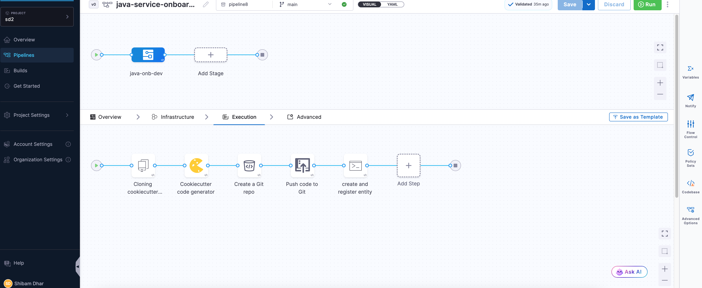
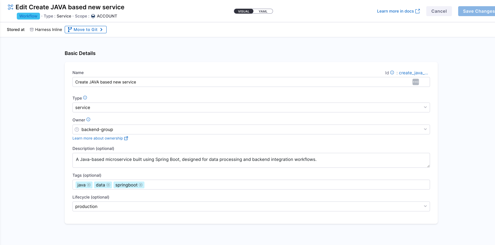
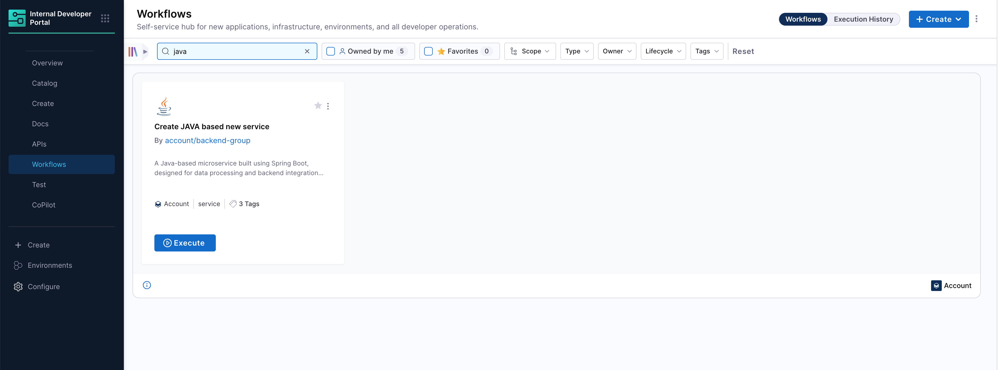
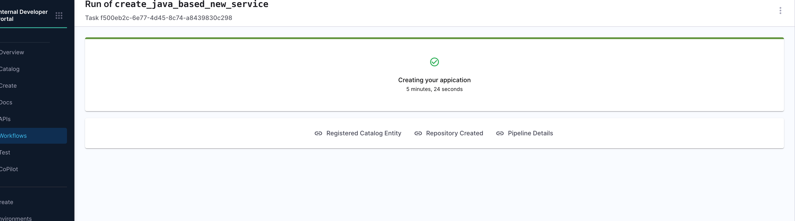

# Scaffold Services with Cookiecutter & Harness IDP

This tutorial explains how to implement a self-service onboarding workflow for Java-based microservices within the **Harness Internal Developer Portal (IDP)**. The goal is to provide developers with a simple, consistent, and fully automated way to create and register new services, without relying on manual setup or platform intervention.

As a **Platform Engineer**, you are responsible for building and maintaining this workflow. Developers will trigger it by submitting a short form in the IDP UI while executing workflow, supplying basic details like the service name, description, owner, and more. From there, the workflow takes over.

Behind the scenes, the following steps are automated:

* A Java microservice is scaffolded using a predefined **Cookiecutter** template, ensuring every service follows standard project structure and best practices.
* A new GitHub repository is created, and the generated code is pushed automatically.
* A YAML file is generated with metadata about the service and committed to the repository.
* The service is registered as a **Component** in the IDP Software Catalog, making it visible and manageable within the portal.

This setup ensures that all services are onboarded in a standardized way; improving consistency, reducing lead time, and enhancing visibility across engineering teams. It’s especially valuable for organizations adopting an internal developer portal model to streamline development workflows, enforce governance, and scale platform practices effectively.


## Prerequisites

Before you begin, ensure the following prerequisites are in place. These are required to implement and test the self-service onboarding workflow effectively.

### Platform Setup

- **Harness Account with IDP Enabled**  
  You should have access to a Harness project with **Internal Developer Portal (IDP)** enabled.

- **GitHub Connector Configured in Harness**  
  Since this onboarding workflow will create and push services to GitHub, a GitHub connector must be set up in Harness. You can use your Git provider connector or create a new one. In this tutorial we will use a GitHub connector with `Org` setup. We will integrate GitX experience with this setup.

- **Pipeline Execution Permissions**  
  Ensure you have permissions to create and run pipelines within your Harness project, especially with access to the **IDP stage**, which will be used to register services into the Software Catalog.

### Tools and Resources

- **Harness API Key**  
  A valid [Harness API Key](https://developer.harness.io/docs/platform/automation/api/api-quickstart/) is required to authenticate API calls made during the registration step. This key is securely passed through the workflow and used to trigger pipeline executions or interact with the Entities API. Make sure it's scoped appropriately and stored as a secret.


- **Cookiecutter Template for Java Services**  
  A prebuilt [cookiecutter](https://cookiecutter.readthedocs.io/en/latest/) template must be available in a public or private GitHub repository. This template defines the standard project structure for all Java services created through the onboarding workflow.


A working knowledge of Harness pipelines and their YAML-based configuration is recommended. In particular, it is useful to understand how to structure pipeline stages and steps, as well as how the [IDP APIs](https://apidocs.harness.io/tag/Entities) facilitate the creation as well as registration of catalog entities.
Even if you're not yet familiar with Harness pipelines or templates, this guide offers detailed, step-by-step instructions. It walks you through how each component fits into the overall onboarding workflow and how to configure them effectively to achieve a fully functional setup.


## System Components

This Java service onboarding workflow in Harness IDP 2.0 is built using a few core components. Each serves a distinct purpose and is required to enable a smooth, self-service experience for developers.


### IDP Workflow (UI Form)

The service onboarding begins with a developer submitting a form within the Harness IDP UI. This form, available under the Workflows section , you have to locate it and execute it. The IDP Workflow UI form will collect basic information such as the service name, owner, project name, and some git details. 


### Harness Pipeline (IDP Stage)

The IDP Stage in a Harness pipeline provides a curated set of steps designed to automate catalog-related actions and platform tasks—without custom scripting.
Within the IDP Stage, you can configure steps like creating a Git repository, running templating tools, pushing files directly to Git, sending Slack notifications, executing scripts, or registering components into the Software Catalog. These steps are purpose-built and composable, allowing platform engineers to define clean, end-to-end workflows that respond to developer inputs or scheduled triggers.
By using the IDP Stage, the pipeline becomes a structured, reusable automation layer for everything tied to service metadata, developer onboarding, and catalog lifecycle management.


### Service Metadata File

Every service must be described using a metadata file `file_name.yaml`. This YAML file defines the service as a catalog component and includes information such as the service name, owner, and associated project or organization. It is required for the service to appear in the Harness IDP Software Catalog.


## Creating the Java Service Onboarding Pipeline (IDP Stage)

In this section, you’ll set up a Harness pipeline that automates the onboarding of new Java services. This pipeline will take the inputs a developer submits through an IDP Workflow form, generate a service using a cookiecutter template, push it to GitHub, and register it in the IDP Software Catalog.

As a Platform Engineer, this is where you define the automation that powers the self-service experience for your developers.


### Get Started


1. In the Harness UI, navigate to your **project**.
2. From the left-hand menu, go to the **Pipelines** section.
3. Click on **+ Create a Pipeline**.
4. Give your pipeline a name, and optionally add a short description so others understand what it’s for.
5. Click **Start** to open the pipeline canvas.

### Add a Developer Portal Stage

Once you're inside the pipeline editor:

- Click **+ Add Stage**.
- Select **Developer Portal** as the stage type.  
  This opens a stage configuration screen with four tabs: **Overview**, **Infrastructure**, **Execution**, and **Advanced**.


Here’s what you’ll do in each tab:

#### Overview

Give your stage a name (for example, `Java Onboarding`).  
You can also add a brief description to explain what this stage handles — such as generating code and registering the service.

#### Infrastructure

Next, choose where the pipeline should run.

- If you want a simple setup, go with **Harness Cloud Infrastructure**.
- If you prefer running the scripts in your own environment (like Kubernetes or a Docker runner), choose a **custom delegate**.

#### Sample YAML

```yaml
pipeline:
  name: Java-Onboard-SD
  identifier: JavaOnboardSD
  tags: {}
  projectIdentifier: sd2
  orgIdentifier: default
  stages:
    - stage:
        name: java-onb-dev
        identifier: javaonbdev
        description: ""
        type: IDP
        spec:
          platform:
            os: Linux
            arch: Amd64
          runtime:
            type: Cloud
            spec: {}
```
Once selected, move on to the next tab.
#### Execution

This is where you’ll define the actual onboarding logic — like running the cookiecutter template, creating the GitHub repo, and generating the service metadata.


You don’t need to configure this yet — we’ll walk through each of these steps in the next section.

#### Advanced

You can leave this tab as-is unless you need to configure timeouts or failure handling. This is optional.


### Step 1: Define Pipeline Variables

Before configuring the execution logic, start by setting up the **pipeline-level variables**. These variables will serve as inputs to the onboarding pipeline — some will come from the developer via the form, while others are fixed or derived values used internally by the pipeline.

These variables are used across stages and steps to:

- Populate inputs for the cookiecutter template that scaffolds the Java service
- Define repository naming and structure
- Enable registration in the IDP catalog with appropriate metadata

You’ll configure these under **Pipeline → Variables**.

#### Variable value Types

In Harness pipelines, every variable is assigned one of the following types, based on how its value is provided or resolved during execution:

1. **Fixed** - These values are hardcoded in the pipeline definition and remain constant for every run.  
2. **Runtime Input** - These values are left as `<+input>` and are filled in by the developer through the IDP Workflow form when the onboarding process is triggered.  
3. **Expression** - These values are computed dynamically during pipeline execution using expressions. They may reference other variables, pipeline context, or system values.  

These variables will be referenced in your pipeline steps using the `<+pipeline.variables.variable_name>` syntax, and they ensure flexibility while keeping your pipeline reusable across multiple onboarding requests.


#### Required Variables


> Here the variable - `cookie_repo` is made fixed and pre-filled (e.g., `java-cookiecutter-template`)for this tutorial, but you can make it dynamic based on your use case.


#### Variable input types
You get to choose from multiple variable input types to handle different kinds of data securely and dynamically.
You can set the type as `Secret` to store sensitive values like API keys securely via Harness Secrets Manager.
Other common types include:

- String – for plain text values.
- Number – for numeric inputs used in logic or configurations.


#### Sample YAML

<details>
<summary>Example YAML</summary>

```yaml
  variables:
    - name: project_name
      type: String
      description: ""
      required: true
      value: <+input>
    - name: app_name
      type: String
      description: ""
      required: true
      value: <+input>
    - name: repo_name
      type: String
      description: ""
      required: true
      value: <+input>
    - name: organization
      type: String
      description: ""
      required: true
      value: <+input>
    - name: unique_identifier
      type: String
      description: ""
      required: true
      value: <+input>
    - name: owner
      type: String
      description: ""
      required: true
      value: <+input>
    - name: org_identifier
      type: String
      description: ""
      required: true
      value: <+input>
    - name: project_identifier
      type: String
      description: ""
      required: true
      value: <+input>
    - name: branch_name
      type: String
      description: ""
      required: true
      value: <+input>
    - name: harness_accID
      type: String
      description: ""
      required: false
      value: zEaak-FLS425IEO7OLzMUg
    - name: cookie_cutter_repo
      type: String
      description: ""
      required: false
      value: cookiecutter-spring-boot
    - name: connector_ref
      type: String
      description: ""
      required: true
      value: account.ShibamDhar
    - name: api_key
      type: Secret
      description: ""
      required: true
      value: sd-api-key-harness
```

</details>

### Step 2: Clone the Java Cookiecutter Template Repository

The first execution step in your pipeline is to **clone the Java cookiecutter template repository**. This repo contains the folder structure and `cookiecutter.json` file that defines how the new Java service will be scaffolded.

To do this, you’ll add a **Git Clone** step to your pipeline’s execution stage.

This step uses a **GitHub connector** (configured as a third-party Git provider) and pulls the repo defined by the pipeline variable.


#### Git Clone Step Configuration

| Field            | Description                                                                 |
|------------------|-----------------------------------------------------------------------------|
| Connector    | A GitHub connector scoped at the **account level**. It must have access (via PAT or OAuth) to the template repo. |
| Repository Name | You can use the pipeline variable `<+pipeline.variables.cookie_repo>` to point to the source template repository. |
| Git Provider Type | Set this to **Third-party Git provider** (GitHub). |
| Build Type   | Select **Git Branch**. This ensures you're always pulling from a stable reference. |
| Branch Name  | Enter `main`, assuming your cookiecutter template’s latest code is in the `main` branch. |
| Clone Directory | *(Optional)* Leave blank to use the default path (`/harness/<repo>`), or specify a custom directory if needed (e.g., `/template`). |


> For reference, you can use the sample template here: [github.com/Sdhar-ORG-Harness/cookiecutter-spring-boot](https://github.com/Sdhar-ORG-Harness/cookiecutter-spring-boot)

#### Sample YAML

```yaml
- step:
    type: GitClone
    name: Cloning cookiecutter template
    identifier: CloneCookieTemp
    spec:
      connectorRef: account.ShibamDhar
      repoName: <+pipeline.variables.cookie_cutter_repo>
      build:
        type: branch
        spec:
          branch: master
    description: Clone the Java cookiecutter template
    when:
      stageStatus: Success
```

### Step 3: Run Cookiecutter to Generate Java Code

Now that you’ve cloned the Java cookiecutter template, the next step is to generate the actual service code using that template.

- Add a **Cookiecutter** step right after your Git Clone step. Since the template was already pulled in the previous step, you’ll treat it as a **Private** repository here — meaning the pipeline will use the locally cloned version.

- In the **Path for Template**, reference the same pipeline variable you used earlier:  
`<+pipeline.variables.cookie_repo>`

Next, configure the inputs that the template expects. These inputs should exactly match the keys defined in the `cookiecutter.json` file inside your template repo.


For our Java service, you’ll pass values for:
- project_name - `<+pipeline.variables.project_name>`
- app_name - `<+pipeline.variables.app_name>`

All of these are already defined as pipeline variables, so just use the expression syntax like:  
`<+pipeline.variables.project_name>`,and `<+pipeline.variables.app_name>`.

#### Sample YAML

```yaml
- step:
    type: CookieCutter
    name: Cookiecutter code generator
    identifier: CookieCuttercodeStart
    spec:
      templateType: private
      pathForTemplate: <+pipeline.variables.cookie_cutter_repo>
      cookieCutterVariables:
        project_name: <+pipeline.variables.project_name>
        app_name: <+pipeline.variables.app_name>
      verbose: false
      overwriteIfExists: false
    when:
      stageStatus: Success
```

### Step 4: Create a GitHub Repository for the Service

It’s time to create a fresh GitHub repository to store the code you just scaffolded.

You’ll do this using the **CreateRepo** step in your pipeline. We will be creating the repo under the GitHub organization. 


| Field                   | Description                                                                 |
|-------------------------|-----------------------------------------------------------------------------|
| Git Provider        | We will use Third-party Git provider – GitHub                                           |
| Repository Type     | Choose `Public` or `Private` based on your needs                            |
| Connector           | A GitHub connector scoped at the **account level**. It must have access to commit to the repo.              |
| Organization        | `<+pipeline.variables.organization>` – the target GitHub org name where the repo will be created.              |
| Repository Name     | `<+pipeline.variables.repo_name>` – the name of the new repo, which you want to create.                   |
| Description (optional) | Short text describing the repository’s purpose                           |
| Default Branch      | `<+pipeline.variables.branch_name>` – the branch your organization prefers as default                 |
| Add Personal Account| Enable if you're not using an org and want to push under your GitHub user   |

:::note
In this tutorial, we're focusing on onboarding services within a GitHub organization account. All repository creation and push operations are scoped to the organization, and that your GitHub connector has the necessary permissions at the `account` level.
:::


#### Sample YAML

```yaml
- step:
    type: CreateRepo
    name: Create a Git repo
    identifier: Create_a_Git_repo
    spec:
      connectorType: Github
      connectorRef: account.ShibamDhar
      organization: <+pipeline.variables.organization>
      repository: <+pipeline.variables.repo_name>
      repoType: public
      defaultBranch: <+pipeline.variables.branch_name>
      personalAccount: false
```

### Step 5: Push the Service Code to GitHub


Once the Java service code is generated using the Cookiecutter template and the repository is successfully created, the next step is to push the code to GitHub using the **DirectPush** step. This step takes the contents from the generated service directory and commits them directly to the specified here :`main` branch of the newly created repository.

It’s important to ensure the organization and repository name provided in this step matches the name of the repository created in the previous step. 


| Field               | Description                                                                 |
|---------------------|-----------------------------------------------------------------------------|
| Git Provider     | We will use Third-party Git provider – GitHub                                |
| Connector        | A GitHub connector scoped at the **account level**. It must have access to commit to the repo.                                                 |
| Organization     | GitHub org under which the repo was created - `<+pipeline.variables.organization>`                                |
| Repository Name  | Name of the new repo, same as earlier - `<+pipeline.variables.repo_name>`                                       |
| Code Directory   | The directory where you want the generated service code to live - `<+pipeline.variables.project_name>`   |
| Branch Name      | `<+pipeline.variables.branch_name>`  - branch where the code will be pushed                                                     |
| Allow Force Push | Enable this to make sure the pipeline can push even if the branch already exists |

:::note
Force push is helpful when GitHub auto-initializes a repository with files like a README or `.gitignore`, which can cause normal pushes to fail. Enabling this ensures the pipeline can overwrite that content with the generated code.
:::

#### Sample YAML

```yaml
- step:
    type: DirectPush
    name: Push code to Git
    identifier: DirectPushToGit
    spec:
      connectorType: Github
      forcePush: true
      connectorRef: account.ShibamDhar
      organization: <+pipeline.variables.organization>
      repository: <+pipeline.variables.repo_name>
      codeDirectory: <+pipeline.variables.project_name>
      branch: <+pipeline.variables.branch_name>
    when:
      stageStatus: Success
```


### Step 6: Create and Register Component Entity 

The next essential step is to create the component entity and register it in the **GitHub Repository** as well as in the **Harness IDP Software Catalog**. This ensures that your service becomes visible in the catalog, is discoverable by teams, and is ready to adopt platform features like Scorecards, TechDocs, and more.

In this step, you are invoking the [Entities API](https://apidocs.harness.io/tag/Entities#operation/createEntity) to automate the registration process. The API request:

* Generates the component YAML (`kind: component`)
* Pushes it into the GitHub repo at a defined path
* Registers it directly into the catalog
* Porvides GitX experience to the entity


You are using a Python-based **Run** step here, but you are not restricted to Python. Any tool or script that can send an HTTP `POST` request with the appropriate payload and headers will work.

However, regardless of language or tool, there are certain key values that must be included in the request:

* A valid YAML definition (you can use runtime expressions to keep it dynamic)
* Git configuration details such as `repo_name`, `branch_name`, and `file_path`
* Properly scoped **connector reference**
* Secure API key and Harness account ID passed through headers

<details>
<summary>Python Snippet</summary>

```python
import requests
import json
import os

# Define Harness API endpoint with org and project identifiers
url = (
    "https://app.harness.io/v1/entities"
    "?convert=false"
    "&dry_run=false"
    "&orgIdentifier=<+pipeline.variables.org_identifier>"
    "&projectIdentifier=<+pipeline.variables.project_identifier>"
)

# Define the entity YAML
component_yaml = '''
apiVersion: harness.io/v1
kind: component
orgIdentifier: <+pipeline.variables.org_identifier>
projectIdentifier: <+pipeline.variables.project_identifier>
type: Service
identifier: <+pipeline.variables.unique_identifier>
name: <+pipeline.variables.app_name>
owner: <+pipeline.variables.owner>
spec:
  lifecycle: experimental
metadata:
  description: <+pipeline.variables.project_name>
  annotations:
    backstage.io/source-location: url:https://github.com/<+pipeline.variables.organization>/<+pipeline.variables.repo_name>
    backstage.io/techdocs-ref: dir:.
  links:
    - title: Website
      url: http://my-sample-website.com
  tags:
    - my-sample
'''

# Construct the JSON payload
payload = json.dumps({
    "yaml": component_yaml,
    "git_details": {
        "branch_name": "<+pipeline.variables.branch_name>",
        "file_path": ".harness/idp.yaml",
        "commit_message": "Created an entity file",
        "connector_ref": "<+pipeline.variables.connector_ref>",
        "store_type": "REMOTE",
        "repo_name": "<+pipeline.variables.repo_name>",
        "is_harness_code_repo": False
    }
})

# Define request headers
headers = {
    "Content-Type": "application/json",
    "Harness-Account": "<+pipeline.variables.harness_accID>",
    "x-api-key": "<+pipeline.variables.api_key>"
}

# Send the request and handle response
try:
    response = requests.post(url, headers=headers, data=payload)

    if response.status_code >= 200 and response.status_code < 300:
        print("Component registered successfully.")
    elif response.status_code >= 400 and response.status_code < 500:
        print(f"Client error ({response.status_code}): {response.json().get('message', response.text)}")
    elif response.status_code >= 500:
        print(f" Server error ({response.status_code}): {response.text}")
    else:
        print(f"Unexpected response ({response.status_code}): {response.text}")

    obj = response.json()
    catalog_url = (
    f"https://app.harness.io/ng/account/<+pipeline.variables.harness_accID>/module/idp/catalog/"
    f"account.{obj.get('orgIdentifier')}.{obj.get('projectIdentifier')}/"
    f"{obj.get('kind')}/{obj.get('identifier')}"
    )
    print(catalog_url)
    # Get the output file path from the environment
    output_file_path = os.environ.get("DRONE_OUTPUT")

    # Key to write
    url_key = "registeredCatalogEntity"

    # Write the key=value pair to the output file
    with open(output_file_path, "w") as f:
        f.write(f"{url_key}={catalog_url}\n")
    
except requests.exceptions.RequestException as e:
    print(f" Request failed: {e}")
```

</details>

####  Explanation

- **API Endpoint Construction**  The script targets the Harness `/v1/entities` endpoint with query parameters specifying the organization and project, making the entity scoped at the **project level**.

- **Entity Definition in YAML**  A complete component entity is defined using YAML. This includes metadata like `name`, `identifier`, `owner`, and annotations such.

- **Git Backed Storage**  The entity is stored in a remote Git repository under `.harness/idp.yaml`, using Git metadata.

- **HTTP Request to Harness API**  A `POST` request is sent with proper headers (`Content-Type`, `Harness-Account`, `x-api-key`) and payload. The response is handled based on status codes to ensure successful registration or to log meaningful errors.

- **Catalog URL Generation**  On successful creation, the entity’s catalog URL is constructed based on values returned from the API response. This URL can be used to directly access the registered entity in the IDP catalog UI.

- **Pipeline Output Handling**  The catalog URL is written to an output file defined by the `DRONE_OUTPUT` environment variable. This allows the catalog URL to be passed to downstream pipeline steps as an **Output Variable** using the key `registeredCatalogEntity`.

- **Error Handling**  Includes a `try-except` block to catch and log request exceptions, ensuring failures are gracefully handled.


This approach is recommended because it eases the onboarding flow. It removes the need for manual registration via the UI and enforces a consistent structure for all components being onboarded.

---

### Finalizing and Verifying the Onboarding Flow

Once you've added all the steps, your pipeline should now look like this in the **Pipeline Studio**:




- Save the Pipeline : Before moving on, make sure to hit **Save** on the top right. This locks in your configuration so you don’t lose anything.


- Run and Verify : To check if everything works, click **Run**. Harness will prompt you to enter the required pipeline inputs.

If all steps are correctly configured and your secrets/connectors are valid, the pipeline should execute like this:


> Every step will show a ✅ if successful. You can also switch to the **Execution Context** tab to inspect the resolved values of your pipeline variables — a great way to debug or confirm if the right data flowed through.

----

## Building the UI Workflow for Developer Self-Service

Now that your pipeline is ready and working end-to-end, it’s time to make it developer-facing.

You’ll now create a **Workflow** in the Harness Internal Developer Portal that acts as a simple form UI. This form will collect all the basic inputs — like service name, owner, ORG, etc. — and pass them to the pipeline you just built.

Think of this as the final piece of the self-service experience, where you can abstract away all the underlying automation logic and provide a simplified entry point for developers to create and register new services.

### Create a New Workflow in Developer Portal

Navigate to the **Workflows** section in the IDP and click **Create Workflow**. This will open a window where you can define the workflow's name, description, and other properties. This would be like the basic info for [workflow creation](https://developer.harness.io/docs/internal-developer-portal/flows/manage-workflow-2o#creating-workflows).



### Configure Workflow YAML

Once your workflow basic details are provided, the next step is to configure it using YAML. This is where you define the **input fields**, **output fields**, **steps**, and **triggers**.


### Workflow Overview for Input-Driven Pipeline Execution

This workflow enables developers to onboard a new Java-based microservice through a form-driven experience in the Harness Internal Developer Portal (IDP). It captures inputs from users, triggers a custom Harness pipeline, and returns meaningful outputs back to the UI

#### Developer Inputs

At the core of the workflow is the `parameters` section, which powers a dynamic form in the Developer Portal UI. Developers are prompted to enter key information such as:

- `service_name`: Becomes the app name, repo name, and base for the unique entity identifier.
- `organization`: GitHub org name for the target repo.
- `owner`: The responsible user or team (using `OwnerPicker`).
- `orgId` and `projectId`: To scope the entity under the correct Harness org/project.

These inputs drive both the logic and naming conventions across the onboarding flow.  
[More on Workflow Inputs](https://developer.harness.io/docs/internal-developer-portal/flows/flows-input)


#### Pipeline Execution via Custom Action

The workflow uses the `trigger:harness-custom-pipeline` action to invoke a Harness pipeline preconfigured to perform.

The `inputset` maps each workflow parameter to pipeline variables. 
Expressions like `repo_name: ${{ parameters.service_name | replace(" ", "") }}` are used to transform and normalize inputs dynamically — for example, to ensure naming constraints are met or to generate a compatible `unique_identifier` as per IDP requirements.

The pipeline is triggered using the full pipeline URL (copied from Pipeline Studio) and authenticated via the `token` parameter.  
[More on Custom Actions](https://developer.harness.io/docs/internal-developer-portal/flows/custom-actions)


#### Outputs and Result Visibility

Upon successful pipeline execution, the workflow surfaces a set of useful links to the developer via the `output.links` section:

- **Registered Catalog Entity**: Direct access to the newly created entity in the IDP Catalog.
- **Repository Created**: GitHub repo URL where the generated code has been pushed.
- **Pipeline Details**: A traceable link back to the actual pipeline execution.

[More on Flows Outputs](https://developer.harness.io/docs/internal-developer-portal/flows/outputs)


#### (EXTRA)Unique Identifier Logic

To maintain consistency and avoid collisions, a normalized `unique_identifier` is generated at runtime using string transformations:
```yaml
unique_identifier: ${{ parameters.service_name | replace(" ", "") | lower | replace("-", "_") }}
```

Overall, this workflow enables self-service onboarding of services through a seamless form → pipeline → entity creation loop, integrating deeply with Git, IDP catalog, and CI/CD—all driven by a developer-friendly experience in the Harness portal.


<details>
<summary>Sample YAML</summary>

```yaml
apiVersion: harness.io/v1
kind: Workflow
name: Create JAVA based new service
identifier: create_java_based_new_service
type: service
owner: backend-group
metadata:
  description: A Java-based microservice built using Spring Boot, designed for data processing and backend integration workflows.
  name: Java SpringBoot
  icon: java
  title: Java Sprigboot
  tags:
    - java
    - data
    - springboot
spec:
  output:
    links:
      - title: Registered Catalog Entity
        url: ${{ steps.trigger.output['pipeline.stages.javaonbdev.spec.execution.steps.create_and_register_entity.output.outputVariables.registeredCatalogEntity'] }}
      - title: Repository Created
        url: ${{ steps.trigger.output['pipeline.stages.javaonbdev.spec.execution.steps.Create_a_Git_repo.output.outputVariables.repositoryUrl'] }}
      - title: Pipeline Details
        url: ${{ steps.trigger.output.PipelineUrl }}
  lifecycle: production
  parameters:
    - title: Service Details
      required:
        - service_name
        - organization
        - owner
        - orgId
        - projectId
      properties:
        token:
          title: Harness Token
          type: string
          ui:widget: password
          ui:field: HarnessAuthToken
        service_name:
          title: Name of your new service
          type: string
          description: This will be used to create the application name, the repository, and finally registered as the unique IDP identifier.
          maxLength: 15
          pattern: ^([a-zA-Z][a-zA-Z0-9]*)([ -][a-zA-Z0-9]+)*$
        organization:
          title: GitHub Organization
          type: string
          description: Name of the GitHub organization
          default: Sdhar-ORG-Harness
        owner:
          title: Owner
          type: string
          description: Owner of the component
          ui:field: OwnerPicker
          ui:options:
            allowArbitraryValues: true
        projectId:
          title: Project Identifier
          description: Harness Project Identifier
          type: string
          ui:field: HarnessProjectPicker
        orgId:
          title: Org Identifier
          description: Harness org Identifier
          type: string
          ui:field: HarnessAutoOrgPicker
  steps:
    - id: trigger
      name: Creating your appication
      action: trigger:harness-custom-pipeline
      input:
        url: https://qa.harness.io/ng/account/zEaak-FLS425IEO7OLzMUg/all/orgs/default/projects/sd2/pipelines/JavaOnboardSD_Clone_Clone/pipeline-studio/?storeType=REMOTE&connectorRef=account.ShibamDhar&repoName=pipeline8&branch=main
        inputset:
          project_name: ${{ parameters.service_name }}
          app_name: ${{ parameters.service_name }}
          repo_name: ${{ parameters.service_name | replace(" ", "")  }}
          organization: ${{ parameters.organization }}
          unique_identifier: ${{parameters.service_name | replace(" ", "")  | lower | replace("-", "_")  }}
          owner: ${{ parameters.owner }}
          org_identifier: ${{ parameters.orgId }}
          project_identifier: ${{ parameters.projectId }}
        apikey: ${{ parameters.token }}
        showOutputVariables: true

```
</details>

### Running the Workflow from the UI

Once your workflow YAML is saved and configured, it becomes instantly available in the **Workflows** section of the Harness Developer Portal. Developers can now search, and execute onboarding in just a few clicks.

- Search and Launch the Workflow:
Developers can search for the published workflow by name (e.g., `Java-Onv`) from the **Workflows** tab.
Once found, simply click **Execute** to launch the workflow form.

<!--  -->


- Fill Inputs and Trigger Pipeline: 
When the workflow runs, it presents a UI form to the developer based on the parameters you defined earlier. After submission, it triggers the underlying onboarding pipeline, passing along all input values. You’ll be able to track progress in real time, and view exactly which variables were passed into the pipeline.


- Output View After Completion:
After the workflow runs successfully, developers are presented with a confirmation screen that summarizes key outcomes:
  - **Catalog Entry Registered**
  - **Repository Created**
  - **Pipeline Execution Link**

This view is especially useful for validating that the onboarding process executed correctly—ensuring the service was generated, cataloged, and deployed as expected.





