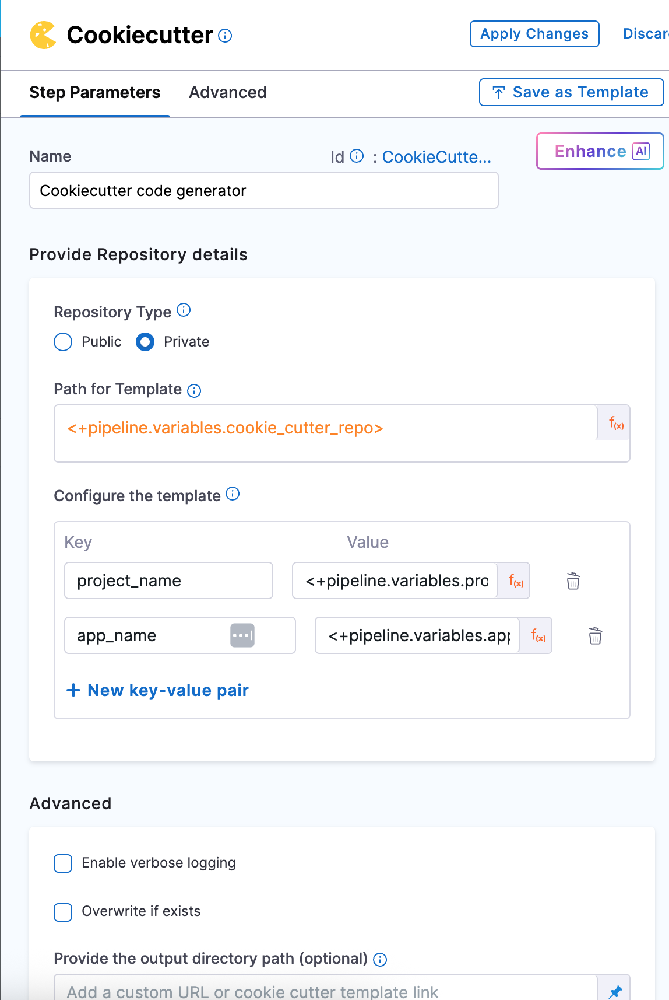
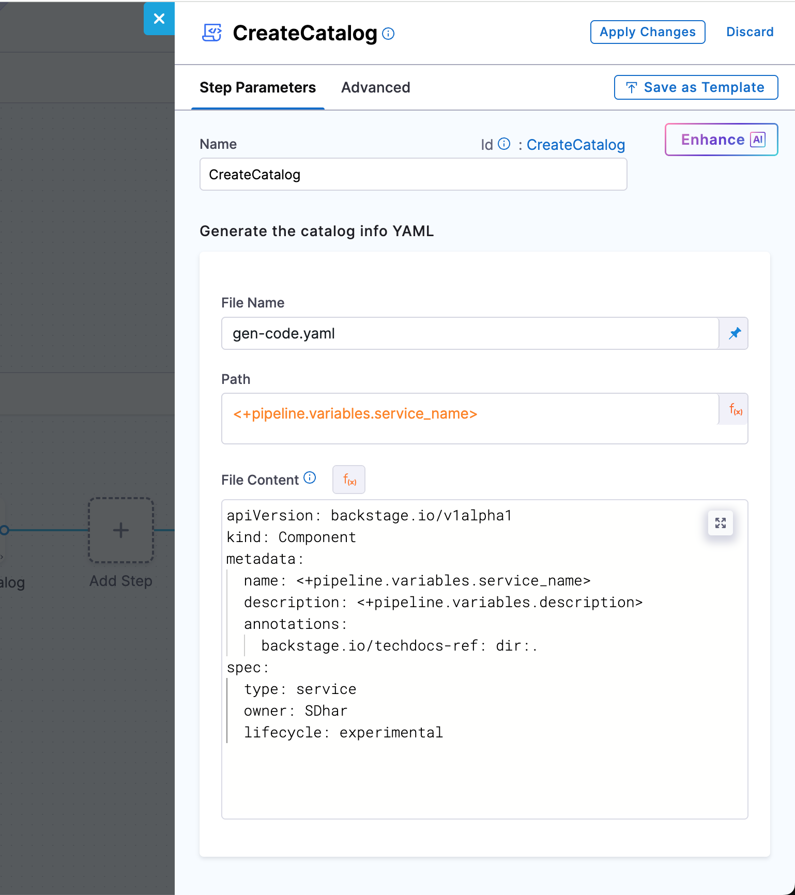

# End-to-End IDP Self-Service Workflow

This tutorial explains how to implement a self-service onboarding workflow for Java services in the Harness Internal Developer Portal (IDP). The goal is to enable developers to create and register new Java-based microservices in a consistent, repeatable, and fully automated way.

As a Platform Engineer, you will build and maintain the onboarding workflow. Developers will use this workflow through a simple form in the IDP interface to initiate the onboarding process, without needing to manually set up repositories or service metadata.

The workflow includes the following automated steps:

- A developer fills out a short form in the IDP UI with service details such as name, description, and owner.
- A Java-based microservice is generated using a predefined project scaffolding tool called **cookiecutter**. This ensures all services follow the same structure and conventions.
- A new GitHub repository is created, and the generated service code is pushed automatically.
- The service is registered in the IDP Software Catalog by generating and committing a metadata file (`catalog-info.yaml`). This makes the new service visible and manageable within the internal developer portal.

The Developer uses this workflow by submitting a form with basic service details. Once submitted, the pipeline executes the defined stages and automatically registers the service in the IDP Software Catalog as a Component.
This setup ensures consistency across services, reduces onboarding time, and improves visibility and governance across engineering teams.


This setup is especially useful for organizations adopting an internal developer portal approach to streamline software development, enforce standards, and reduce onboarding friction.

## Prerequisites

Before you begin, ensure the following prerequisites are in place. These are required to implement and test the self-service onboarding workflow effectively.

### Platform Setup

- **Harness Account with IDP Enabled**  
  You should have access to a Harness project with **Internal Developer Portal (IDP)** enabled.

- **GitHub Connector Configured in Harness**  
  Since this onboarding workflow will create and push services to GitHub, a GitHub connector must be set up in Harness. You can use your Git provider connector or create a new one.

- **Pipeline Execution Permissions**  
  Ensure you have permissions to create and run pipelines within your Harness project, especially with access to the **IDP stage**, which will be used to register services into the Software Catalog.

### Tools and Resources

- **Cookiecutter Template for Java Services**  
  A prebuilt [cookiecutter](https://cookiecutter.readthedocs.io/en/latest/) template must be available in a public or private GitHub repository. This template defines the standard project structure for all Java services created through the onboarding workflow.


A working knowledge of Harness pipelines and their YAML-based configuration is recommended. In particular, it is useful to understand how to structure pipeline stages and steps, as well as how the IDP stage facilitates the registration of catalog entities.
Even if you're not yet familiar with Harness pipelines or templates, this guide offers detailed, step-by-step instructions. It walks you through how each component fits into the overall onboarding workflow and how to configure them effectively to achieve a fully functional setup.


## System Components

This Java service onboarding workflow in Harness IDP 2.0 is built using a few core components. Each serves a distinct purpose and is required to enable a smooth, self-service experience for developers.

### IDP Workflow (UI Form)

This is the entry point for developers. It appears as a form in the Harness IDP UI where the developer provides basic service information such as the name, description, and owner. It simplifies the onboarding process by hiding complexity behind a single, guided action.

### Harness Pipeline (IDP Stage)

The pipeline handles the automation behind the scenes. It is configured in a Harness project and is triggered when the form is submitted. The pipeline contains logic to generate code, push it to GitHub, and register the service. The IDP Stage specifically enables catalog registration.

### Service Metadata File

Every service must be described using a metadata file `file_name.yaml`. This YAML file defines the service as a catalog component and includes information such as the service name, owner, and associated project or organization. It is required for the service to appear in the Harness IDP Software Catalog.


## Creating the Java Service Onboarding Pipeline (IDP Stage)

In this section, you’ll set up a Harness pipeline that automates the onboarding of new Java services. This pipeline will take the inputs a developer submits through an IDP Workflow form, generate a service using a cookiecutter template, push it to GitHub, and register it in the IDP Software Catalog.

As a Platform Engineer, this is where you define the automation that powers the self-service experience for your developers.


### Get Started


1. In the Harness UI, navigate to your **project**.
2. From the left-hand menu, go to the **Pipelines** section.
3. Click on **+ Create a Pipeline**.
4. Give your pipeline a name, such as `java-service-onboarding`, and optionally add a short description so others understand what it’s for.
5. Click **Start** to open the pipeline canvas.

### Add a Developer Portal Stage

Once you're inside the pipeline editor:

- Click **+ Add Stage**.
- Select **Developer Portal** as the stage type.  
  This opens a stage configuration screen with four tabs: **Overview**, **Infrastructure**, **Execution**, and **Advanced**.


Here’s what you’ll do in each tab:

#### Overview

Give your stage a name (for example, `Java Onboarding`).  
You can also add a brief description to explain what this stage handles — such as generating code and registering the service.

#### Infrastructure

Next, choose where the pipeline should run.

- If you want a simple setup, go with **Harness Cloud Infrastructure**.
- If you prefer running the scripts in your own environment (like Kubernetes or a Docker runner), choose a **custom delegate**.

Once selected, move on to the next tab.

#### Sample YAML

```yaml
pipeline:
  name: Java-Onboard-SD
  identifier: JavaOnboardSD
  tags: {}
  projectIdentifier: sd2
  orgIdentifier: default
  stages:
    - stage:
        name: java-onb-dev
        identifier: javaonbdev
        description: ""
        type: IDP
        spec:
          platform:
            os: Linux
            arch: Amd64
          runtime:
            type: Cloud
            spec: {}
```

#### Execution

This is where you’ll define the actual onboarding logic — like running the cookiecutter template, creating the GitHub repo, and generating the service metadata.


You don’t need to configure this yet — we’ll walk through each of these steps in the next section.

#### Advanced

You can leave this tab as-is unless you need to configure timeouts or failure handling. This is optional.


### Step 1: Define Pipeline Variables

Before configuring the execution logic, start by setting up the **pipeline-level variables**. These variables will serve as inputs to the onboarding workflow — some will come from the developer via the form, while others are fixed or derived values used internally by the pipeline.

These variables are used across stages and steps to:

- Populate inputs for the cookiecutter template that scaffolds the Java service
- Define repository naming and structure
- Enable registration in the IDP catalog with appropriate metadata

You’ll configure these under **Pipeline → Variables**.

#### Input Types

In Harness pipelines, every variable is assigned one of the following types, based on how its value is provided or resolved during execution:

1. **Fixed** - These values are hardcoded in the pipeline definition and remain constant for every run.  
2. **Runtime Input** - These values are left as `<+input>` and are filled in by the developer through the IDP Workflow form when the onboarding process is triggered.  
3. **Expression** - These values are computed dynamically during pipeline execution using expressions. They may reference other variables, pipeline context, or system values.  

These variables will be referenced in your pipeline steps using the `<+pipeline.variables.variable_name>` syntax, and they ensure flexibility while keeping your pipeline reusable across multiple onboarding requests.


#### Required Variables


> Here the variable - `cookie_repo` is made fixed and pre-filled (e.g., `java-cookiecutter-template`)for this tutorial, but you can make it dynamic based on your use case.

#### Sample YAML

```yaml
 variables:
    - name: service_name
      type: String
      description: ""
      required: true
      value: <+input>
    - name: java_package_name
      type: String
      description: ""
      required: true
      value: <+input>
    - name: description
      type: String
      description: ""
      required: true
      value: <+input>
    - name: owner
      type: String
      description: ""
      required: true
      value: <+input>
    - name: cookie_repo
      type: String
      description: ""
      required: false
      value: java-cookiecutter-template
```

### Step 2: Clone the Java Cookiecutter Template Repository

The first execution step in your pipeline is to **clone the Java cookiecutter template repository**. This repo contains the folder structure and `cookiecutter.json` file that defines how the new Java service will be scaffolded.

To do this, you’ll add a **Git Clone** step to your pipeline’s execution stage.

This step uses a **GitHub connector** (configured as a third-party provider) and pulls the repo defined by the pipeline variable.


#### Git Clone Step Configuration

| Field            | Description                                                                 |
|------------------|-----------------------------------------------------------------------------|
| Connector    | A GitHub connector scoped at the **account level**. It must have access (via PAT or OAuth) to the template repo. |
| Repository Name | Use the pipeline variable. This points to the source template repository. |
| Git Provider Type | Set this to **Third-party Git provider** (GitHub). |
| Build Type   | Select **Git Branch**. This ensures you're always pulling from a stable reference. |
| Branch Name  | Enter `main`, assuming your cookiecutter template’s latest code is in the `main` branch. |
| Clone Directory | *(Optional)* Leave blank to use the default path (`/harness/<repo>`), or specify a custom directory if needed (e.g., `/template`). |


> For reference, you can use the sample template here: [github.com/ShibamD/java-cookiecutter-template](https://github.com/ShibamD/java-cookiecutter-template)

#### Sample YAML

```yaml
- step:
    type: GitClone
    name: CloneCookieTemp
    identifier: CloneCookieTemp
    spec:
      connectorRef: account.ShibamDhar
      repoName: <+pipeline.variables.cookie_repo>
      build:
        type: branch
        spec:
          branch: main
    description: Clone the Java cookiecutter template
```

### Step 3: Run Cookiecutter to Generate Java Code

Now that you’ve cloned the Java cookiecutter template, the next step is to generate the actual service code using that template.

- Add a **Cookiecutter** step right after your Git Clone step. Since the template was already pulled in the previous step, you’ll treat it as a **Private** repository here — meaning the pipeline will use the locally cloned version.

- In the **Path for Template**, reference the same pipeline variable you used earlier:  
`<+pipeline.variables.cookie_repo>`

Next, configure the inputs that the template expects. These inputs should exactly match the keys defined in the `cookiecutter.json` file inside your template repo.



For our Java service, you’ll pass values for:
- `service_name` 
- `java_package_name` 
- `description` 
- `owner` 

All of these are already defined as pipeline variables, so just use the expression syntax like:  
`<+pipeline.variables.service_name>`, `<+pipeline.variables.owner>`, and so on.

#### Sample YAML

```yaml
- step:
    type: CookieCutter
    name: CookieCuttercodeStart
    identifier: CookieCuttercodeStart
    spec:
      templateType: private
      pathForTemplate: <+pipeline.variables.cookie_repo>
      cookieCutterVariables:
        service_name: <+pipeline.variables.service_name>
        java_package_name: <+pipeline.variables.java_package_name>
        description: <+pipeline.variables.description>
        owner: <+pipeline.variables.owner>
      verbose: false
      overwriteIfExists: false
```

### Step 4: Create a GitHub Repository for the Service

Now that your Java service has been generated, it’s time to create a fresh GitHub repository to store the code you just scaffolded.

You’ll do this using the **CreateRepo** step in your pipeline. You can choose to create the repo under your GitHub organization or your personal account — just make sure the GitHub connector you're using has the right permissions to do so. 


| Field                   | Description                                                                 |
|-------------------------|-----------------------------------------------------------------------------|
| Git Provider        | Third-party Git provider – GitHub                                           |
| Repository Type     | Choose `Public` or `Private` based on your needs                            |
| Connector           | GitHub connector with repo creation permissions (OAuth or PAT)              |
| Organization        | `<+pipeline.variables.organization>` – target GitHub org name               |
| Repository Name     | `<+pipeline.variables.repo_name>` – the repo to be created                  |
| Description (optional) | Short text describing the repository’s purpose                           |
| Default Branch      | `main` – or any branch your organization prefers as default                 |
| Add Personal Account| Enable if you're not using an org and want to push under your GitHub user   |

> If you're using an organization account, provide its name through the `organization` variable. If not, you can check the **Add Personal Account** box to push it under your personal GitHub username.


#### Sample YAML

```yaml
- step:
    type: CreateRepo
    name: CreateREPO
    identifier: CreateREPO
    spec:
      connectorType: Github
      connectorRef: account.name
      organization: <+pipeline.variables.organization>
      repository: <+pipeline.variables.repo_name>
      repoType: public
      defaultBranch: main
      personalAccount: false
```

### Step 5: Generate the catalog file

To get your Java service into the Software Catalog, you’ll need to generate a `file_name.yaml` file inside the name of the service’s folder provided as input. This is handled by the **CreateCatalog** step in your pipeline.

Just use the service name as the path — that way, the file lands right inside the folder you just created.
This YAML file holds important metadata about the service. Most of the values can be populated using pipeline variables so everything stays aligned with what the developer originally provided.



| Field            | Description                                                                 |
|------------------|-----------------------------------------------------------------------------|
| File Name     | Name of the file to be created; typically `catalog-info.yaml`              |
| Path          | Folder path where the file will be placed — usually the service directory  |
| File Content  | The actual YAML content that describes the service and enables catalog registration |

#### File content:

```yaml
apiVersion: backstage.io/v1alpha1
kind: Component
metadata:
  name: <+pipeline.variables.service_name>
  description: <+pipeline.variables.description>
  annotations:
    backstage.io/techdocs-ref: dir:.
spec:
  type: service
  lifecycle: production
  owner: <+pipeline.variables.owner>
```


#### Sample YAML

```yaml
- step:
    type: CreateCatalog
    name: CreateCatalog
    identifier: CreateCatalog
    spec:
      fileName: gen-code.yaml
      filePath: <+pipeline.variables.service_name>
      fileContent: |
        apiVersion: backstage.io/v1alpha1
        kind: Component
        metadata:
          name: <+pipeline.variables.service_name>
          description: <+pipeline.variables.description>
          annotations:
            backstage.io/techdocs-ref: dir:.
        spec:
          type: service
          owner: abc
          lifecycle: experimental
```


### Step 6: Push the service code to GitHub

After the Java code and catalog file are generated, you need to publish them to GitHub. Use the **DirectPush** step to push the contents from the service folder to the new GitHub repository.

Make sure you're using the same Git connector and GitHub organization you used during the CreateRepo step. This step requires the code directory path (usually the service name) and pushes the code to the `main` branch.


| Field               | Description                                                                 |
|---------------------|-----------------------------------------------------------------------------|
| Git Provider     | GitHub (via third-party Git provider option)                                |
| Connector        | GitHub connector with commit access                                         |
| Organization     | GitHub org under which the repo was created                                 |
| Repository Name  | Name of the new repo, same as earlier                                       |
| Code Directory   | The folder where the generated service code and `catalog-info.yaml` live   |
| Branch Name      | Use `main` as default                                                       |
| Allow Force Push | Enable this to make sure the pipeline can push even if the branch already exists |

:::note
Force push is helpful when GitHub auto-initializes a repository with files like a README or `.gitignore`, which can cause normal pushes to fail. Enabling this ensures the pipeline can overwrite that content with the generated code.
:::

#### Sample YAML

```yaml
- step:
    type: DirectPush
    name: DirectPushToGit
    identifier: DirectPushToGit
    spec:
      connectorType: Github
      forcePush: true
      connectorRef: account.ShibamDhar
      organization: <+pipeline.variables.organization>
      repository: <+pipeline.variables.repo_name>
      codeDirectory: <+pipeline.variables.service_name>
      branch: main
```


### Step 7: Register the service in the Software Catalog

This final step makes your new Java service show up in the Harness Software Catalog by registering the catalog YAML file you created earlier (`gen-code.yaml`). 

The **RegisterCatalog** step does exactly that — it uses your GitHub connector to reach the repo, locate the file, and create the Component in the catalog.

You just need to point it to the correct GitHub organization, repo name, and file path.

| Field               | Description                                                                 |
|---------------------|-----------------------------------------------------------------------------|
| Git Provider     | GitHub via third-party provider option                                      |
| Connector        | GitHub connector used throughout the pipeline                               |
| Organization     | GitHub org where the service repo lives                                     |
| Repository Name  | The name of the repository created earlier                                  |
| Branch Name      | `main`, or whichever branch holds your YAML file           |
| File Path        | The path of the YAML file generated earlier.                 |
| API Key (Optional) | If your catalog requires authentication for registration                  |

Once this step completes, your service will immediately show up as a new **Workflow** in the Harness IDP Software Catalog — fully registered with its metadata and ready to be used, documented, and governed.

:::caution
If the catalog file is not found at the specified path, the registration will fail. Make sure the filename and its location match what was set during the file generation step.
:::


---

### Previewing the Final Pipeline

Once you've added all the steps, your pipeline should now look like this in the **Pipeline Studio**:


- Save the Pipeline : Before moving on, make sure to hit **Save** on the top right. This locks in your configuration so you don’t lose anything.


- Run and Verify : To check if everything works, click **Run**. Harness will prompt you to enter the required pipeline inputs — such as `service_name`, `description`, and others you wired up earlier.

If all steps are correctly configured and your secrets/connectors are valid, the pipeline should execute like this:


> Every step will show a ✅ if successful. You can also switch to the **Execution Context** tab to inspect the resolved values of your pipeline variables — a great way to debug or confirm if the right data flowed through.

----