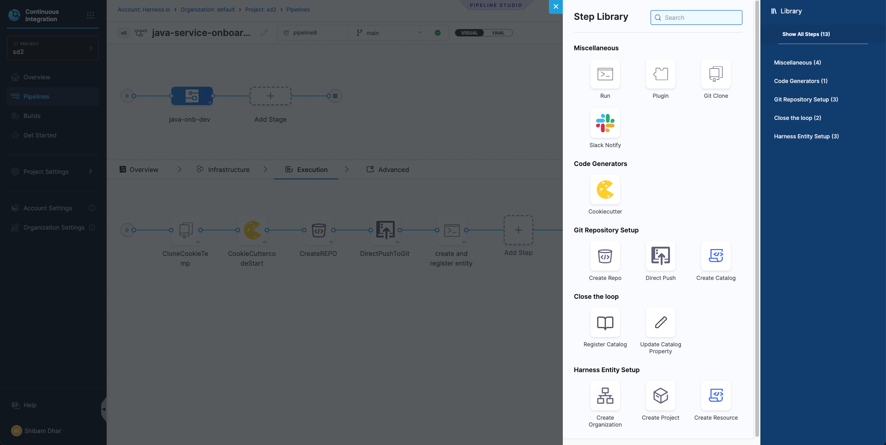

# End-to-End IDP Self-Service Workflow for Java Services

This tutorial explains how to implement a self-service onboarding workflow for Java-based microservices within the **Harness Internal Developer Portal (IDP)**. The goal is to provide developers with a simple, consistent, and fully automated way to create and register new services, without relying on manual setup or platform intervention.

As a **Platform Engineer**, you are responsible for building and maintaining this workflow. Developers will trigger it by submitting a short form in the IDP UI while executing workflow, supplying basic details like the service name, description, owner, and more. From there, the workflow takes over.

Behind the scenes, the following steps are automated:

* A Java microservice is scaffolded using a predefined **Cookiecutter** template, ensuring every service follows standard project structure and best practices.
* A new GitHub repository is created, and the generated code is pushed automatically.
* A YAML file is generated with metadata about the service and committed to the repository.
* The service is registered as a **Component** in the IDP Software Catalog, making it visible and manageable within the portal.

This setup ensures that all services are onboarded in a standardized way; improving consistency, reducing lead time, and enhancing visibility across engineering teams. It’s especially valuable for organizations adopting an internal developer portal model to streamline development workflows, enforce governance, and scale platform practices effectively.


## Prerequisites

Before you begin, ensure the following prerequisites are in place. These are required to implement and test the self-service onboarding workflow effectively.

### Platform Setup

- **Harness Account with IDP Enabled**  
  You should have access to a Harness project with **Internal Developer Portal (IDP)** enabled.

- **GitHub Connector Configured in Harness**  
  Since this onboarding workflow will create and push services to GitHub, a GitHub connector must be set up in Harness. You can use your Git provider connector or create a new one. In this tutorial we will use a GitHub connector with `Org` setup. We will have the best Git experience with this setup.

- **Pipeline Execution Permissions**  
  Ensure you have permissions to create and run pipelines within your Harness project, especially with access to the **IDP stage**, which will be used to register services into the Software Catalog.

### Tools and Resources

- 

- **Cookiecutter Template for Java Services**  
  A prebuilt [cookiecutter](https://cookiecutter.readthedocs.io/en/latest/) template must be available in a public or private GitHub repository. This template defines the standard project structure for all Java services created through the onboarding workflow.


A working knowledge of Harness pipelines and their YAML-based configuration is recommended. In particular, it is useful to understand how to structure pipeline stages and steps, as well as how the [IDP APIs](https://apidocs.harness.io/tag/Entities) facilitate the creation as well as registration of catalog entities.
Even if you're not yet familiar with Harness pipelines or templates, this guide offers detailed, step-by-step instructions. It walks you through how each component fits into the overall onboarding workflow and how to configure them effectively to achieve a fully functional setup.


## System Components

This Java service onboarding workflow in Harness IDP 2.0 is built using a few core components. Each serves a distinct purpose and is required to enable a smooth, self-service experience for developers.


### IDP Workflow (UI Form)

The onboarding begins with a developer submitting a form within the Harness IDP UI. This form, available under the Workflows section , you have to locate it and execute it. The workflow can be named `java-onboarding`, which will collect basic information such as the service name, description, owner and some git details. The workflow provides a simplified entry point, abstracting away all the underlying automation logic.


### Harness Pipeline (IDP Stage)

The IDP Stage in a Harness pipeline is built specifically to support Internal Developer Portal workflows. It provides a curated set of steps designed to automate catalog-related actions and platform tasks—without custom scripting.
Within the IDP Stage, you can configure steps like creating a Git repository, running templating tools, pushing files directly to Git, sending Slack notifications, executing scripts, or registering components into the Software Catalog. These steps are purpose-built and composable, allowing platform engineers to define clean, end-to-end workflows that respond to developer inputs or scheduled triggers.
By using the IDP Stage, the pipeline becomes a structured, reusable automation layer for everything tied to service metadata, developer onboarding, and catalog lifecycle management.


### Service Metadata File

Every service must be described using a metadata file `file_name.yaml`. This YAML file defines the service as a catalog component and includes information such as the service name, owner, and associated project or organization. It is required for the service to appear in the Harness IDP Software Catalog.


## Creating the Java Service Onboarding Pipeline (IDP Stage)

In this section, you’ll set up a Harness pipeline that automates the onboarding of new Java services. This pipeline will take the inputs a developer submits through an IDP Workflow form, generate a service using a cookiecutter template, push it to GitHub, and register it in the IDP Software Catalog.

As a Platform Engineer, this is where you define the automation that powers the self-service experience for your developers.


### Get Started


1. In the Harness UI, navigate to your **project**.
2. From the left-hand menu, go to the **Pipelines** section.
3. Click on **+ Create a Pipeline**.
4. Give your pipeline a name, such as `java-service-onboarding`, and optionally add a short description so others understand what it’s for.
5. Click **Start** to open the pipeline canvas.

### Add a Developer Portal Stage

Once you're inside the pipeline editor:

- Click **+ Add Stage**.
- Select **Developer Portal** as the stage type.  
  This opens a stage configuration screen with four tabs: **Overview**, **Infrastructure**, **Execution**, and **Advanced**.


Here’s what you’ll do in each tab:

#### Overview

Give your stage a name (for example, `Java Onboarding`).  
You can also add a brief description to explain what this stage handles — such as generating code and registering the service.

#### Infrastructure

Next, choose where the pipeline should run.

- If you want a simple setup, go with **Harness Cloud Infrastructure**.
- If you prefer running the scripts in your own environment (like Kubernetes or a Docker runner), choose a **custom delegate**.

Once selected, move on to the next tab.

#### Sample YAML

```yaml
pipeline:
  name: Java-Onboard-SD
  identifier: JavaOnboardSD
  tags: {}
  projectIdentifier: sd2
  orgIdentifier: default
  stages:
    - stage:
        name: java-onb-dev
        identifier: javaonbdev
        description: ""
        type: IDP
        spec:
          platform:
            os: Linux
            arch: Amd64
          runtime:
            type: Cloud
            spec: {}
```

#### Execution

This is where you’ll define the actual onboarding logic — like running the cookiecutter template, creating the GitHub repo, and generating the service metadata.



You don’t need to configure this yet — we’ll walk through each of these steps in the next section.

#### Advanced

You can leave this tab as-is unless you need to configure timeouts or failure handling. This is optional.


### Step 1: Define Pipeline Variables

Before configuring the execution logic, start by setting up the **pipeline-level variables**. These variables will serve as inputs to the onboarding workflow — some will come from the developer via the form, while others are fixed or derived values used internally by the pipeline.

These variables are used across stages and steps to:

- Populate inputs for the cookiecutter template that scaffolds the Java service
- Define repository naming and structure
- Enable registration in the IDP catalog with appropriate metadata

You’ll configure these under **Pipeline → Variables**.

#### Variable value Types

In Harness pipelines, every variable is assigned one of the following types, based on how its value is provided or resolved during execution:

1. **Fixed** - These values are hardcoded in the pipeline definition and remain constant for every run.  
2. **Runtime Input** - These values are left as `<+input>` and are filled in by the developer through the IDP Workflow form when the onboarding process is triggered.  
3. **Expression** - These values are computed dynamically during pipeline execution using expressions. They may reference other variables, pipeline context, or system values.  

These variables will be referenced in your pipeline steps using the `<+pipeline.variables.variable_name>` syntax, and they ensure flexibility while keeping your pipeline reusable across multiple onboarding requests.


#### Required Variables


> Here the variable - `cookie_repo` is made fixed and pre-filled (e.g., `java-cookiecutter-template`)for this tutorial, but you can make it dynamic based on your use case.


#### Variable input types
You get to choose from multiple variable input types to handle different kinds of data securely and dynamically.
You can set the type as `Secret` to store sensitive values like API keys securely via Harness Secrets Manager.
Other common types include:

- String – for plain text values.
- Number – for numeric inputs used in logic or configurations.


#### Sample YAML

<details>
<summary>Example YAML</summary>

```yaml
  variables:
    - name: service_name
      type: String
      description: ""
      required: true
      value: <+input>
    - name: java_package_name
      type: String
      description: ""
      required: true
      value: <+input>
    - name: description
      type: String
      description: ""
      required: true
      value: <+input>
    - name: owner
      type: String
      description: ""
      required: true
      value: <+input>
    - name: cookie_repo
      type: String
      description: ""
      required: false
      value: java-cookiecutter-template
    - name: organization
      type: String
      description: ""
      required: true
      value: <+input>
    - name: repo_name
      type: String
      description: ""
      required: true
      value: <+input>
    - name: unique_identifier
      type: String
      description: ""
      required: true
      value: <+input>
    - name: harness_accID
      type: String
      description: ""
      required: true
      value: harness_accID_value
    - name: api_key
      type: Secret
      description: ""
      required: true
      value: sd-api-key-harness
```

</details>

### Step 2: Clone the Java Cookiecutter Template Repository

The first execution step in your pipeline is to **clone the Java cookiecutter template repository**. This repo contains the folder structure and `cookiecutter.json` file that defines how the new Java service will be scaffolded.

To do this, you’ll add a **Git Clone** step to your pipeline’s execution stage.

This step uses a **GitHub connector** (configured as a third-party Git provider) and pulls the repo defined by the pipeline variable.


#### Git Clone Step Configuration

| Field            | Description                                                                 |
|------------------|-----------------------------------------------------------------------------|
| Connector    | A GitHub connector scoped at the **account level**. It must have access (via PAT or OAuth) to the template repo. |
| Repository Name | Use the pipeline variable. This points to the source template repository. |
| Git Provider Type | Set this to **Third-party Git provider** (GitHub). |
| Build Type   | Select **Git Branch**. This ensures you're always pulling from a stable reference. |
| Branch Name  | Enter `main`, assuming your cookiecutter template’s latest code is in the `main` branch. |
| Clone Directory | *(Optional)* Leave blank to use the default path (`/harness/<repo>`), or specify a custom directory if needed (e.g., `/template`). |


> For reference, you can use the sample template here: [github.com/ShibamD/java-cookiecutter-template](https://github.com/ShibamD/java-cookiecutter-template)

#### Sample YAML

```yaml
- step:
    type: GitClone
    name: CloneCookieTemp
    identifier: CloneCookieTemp
    spec:
      connectorRef: account.ShibamDhar
      repoName: <+pipeline.variables.cookie_repo>
      build:
        type: branch
        spec:
          branch: main
    description: Clone the Java cookiecutter template
    when:
      stageStatus: Success
```

### Step 3: Run Cookiecutter to Generate Java Code

Now that you’ve cloned the Java cookiecutter template, the next step is to generate the actual service code using that template.

- Add a **Cookiecutter** step right after your Git Clone step. Since the template was already pulled in the previous step, you’ll treat it as a **Private** repository here — meaning the pipeline will use the locally cloned version.

- In the **Path for Template**, reference the same pipeline variable you used earlier:  
`<+pipeline.variables.cookie_repo>`

Next, configure the inputs that the template expects. These inputs should exactly match the keys defined in the `cookiecutter.json` file inside your template repo.


For our Java service, you’ll pass values for:
- `service_name` 
- `java_package_name` 
- `description` 
- `owner` 

All of these are already defined as pipeline variables, so just use the expression syntax like:  
`<+pipeline.variables.service_name>`, `<+pipeline.variables.owner>`, and so on.

#### Sample YAML

```yaml
- step:
    type: CookieCutter
    name: CookieCuttercodeStart
    identifier: CookieCuttercodeStart
    spec:
      templateType: private
      pathForTemplate: <+pipeline.variables.cookie_repo>
      cookieCutterVariables:
        service_name: <+pipeline.variables.service_name>
        java_package_name: <+pipeline.variables.java_package_name>
        description: <+pipeline.variables.description>
        owner: <+pipeline.variables.owner>
      verbose: false
      overwriteIfExists: false
```

### Step 4: Create a GitHub Repository for the Service

Now that your Java service has been generated, it’s time to create a fresh GitHub repository to store the code you just scaffolded.

You’ll do this using the **CreateRepo** step in your pipeline. You can choose to create the repo under your GitHub organization or your personal account — just make sure the GitHub connector you're using has the right permissions to do so. 


| Field                   | Description                                                                 |
|-------------------------|-----------------------------------------------------------------------------|
| Git Provider        | Third-party Git provider – GitHub                                           |
| Repository Type     | Choose `Public` or `Private` based on your needs                            |
| Connector           | GitHub connector with repo creation permissions (OAuth or PAT)              |
| Organization        | `<+pipeline.variables.organization>` – target GitHub org name               |
| Repository Name     | `<+pipeline.variables.repo_name>` – the repo to be created                  |
| Description (optional) | Short text describing the repository’s purpose                           |
| Default Branch      | `main` – or any branch your organization prefers as default                 |
| Add Personal Account| Enable if you're not using an org and want to push under your GitHub user   |

> If you're using an organization account, provide its name through the `organization` variable. If not, you can check the **Add Personal Account** box to push it under your personal GitHub username.


#### Sample YAML

```yaml
- step:
    type: CreateRepo
    name: CreateREPO
    identifier: CreateREPO
    spec:
      connectorType: Github
      connectorRef: account.name
      organization: <+pipeline.variables.organization>
      repository: <+pipeline.variables.repo_name>
      repoType: public
      defaultBranch: main
      personalAccount: false
```

### Step 5: Push the service code to GitHub


Once the Java service is generated using the Cookiecutter template and the repository is successfully created, the next step is to push the code to GitHub using the **DirectPush** step. This step takes the contents from the generated service directory and commits them directly to the `main` branch of the newly created repository.

It’s important to ensure the directory path provided in this step matches the name of the generated folder (typically the service name). Also, make sure you’re using the same GitHub connector and organization as configured during the CreateRepo step.


| Field               | Description                                                                 |
|---------------------|-----------------------------------------------------------------------------|
| Git Provider     | GitHub (via third-party Git provider option)                                |
| Connector        | GitHub connector with commit access                                         |
| Organization     | GitHub org under which the repo was created                                 |
| Repository Name  | Name of the new repo, same as earlier                                       |
| Code Directory   | The folder where the generated service code and `catalog-info.yaml` live   |
| Branch Name      | Use `main` as default                                                       |
| Allow Force Push | Enable this to make sure the pipeline can push even if the branch already exists |

:::note
Force push is helpful when GitHub auto-initializes a repository with files like a README or `.gitignore`, which can cause normal pushes to fail. Enabling this ensures the pipeline can overwrite that content with the generated code.
:::

#### Sample YAML

```yaml
- step:
    type: DirectPush
    name: DirectPushToGit
    identifier: DirectPushToGit
    spec:
      connectorType: Github
      forcePush: true
      connectorRef: account.ShibamDhar
      organization: <+pipeline.variables.organization>
      repository: <+pipeline.variables.repo_name>
      codeDirectory: <+pipeline.variables.service_name>
      branch: main
```


### Step 6: Create and Register Component Entity 

After the Java service is generated and pushed to GitHub, the next essential step is to create and register the service entity in the **Harness IDP Software Catalog**. This ensures that your service becomes visible in the catalog, is discoverable by teams, and is ready to adopt platform features like Scorecards, TechDocs, and more.

In this step, you are invoking the [Entities API](https://apidocs.harness.io/tag/Entities#operation/createEntity) to automate the registration process. The API request:

* Generates the component YAML (`kind: component`)
* Pushes it into the GitHub repo at a defined path
* Registers it directly into the catalog


You are using a Python-based **Run** step here, but you are not restricted to Python. Any tool or script that can send an HTTP `POST` request with the appropriate payload and headers will work.

However, regardless of language or tool, there are certain key values that must be included in the request:

* A valid YAML definition (you can use runtime expressions to keep it dynamic)
* Git configuration details such as `repo_name`, `branch_name`, and `file_path`
* Properly scoped **connector reference**
* Secure API key and Harness account ID passed through headers

<details>
<summary>Python Snippet</summary>

```python
import requests
import json

url = "https://app.harness.io/v1/entities?convert=false&dry_run=false"

payload = json.dumps({
  "yaml": "apiVersion: harness.io/v1\nkind: component\ntype: Service\nidentifier: <+pipeline.variables.unique_identifier>\nname: <+pipeline.variables.service_name>\nowner: <+pipeline.variables.owner>\nspec:\n  lifecycle: experimental\n  ownedBy:\n    - group/sample-group\nmetadata:\n  description: <+pipeline.variables.description>\n  annotations:\n    backstage.io/source-location: url:https://github.com/<+pipeline.variables.organization>/<+pipeline.variables.repo_name>/blob/main/gen-code.yaml\n    backstage.io/techdocs-ref: dir:.\n  links:\n    - title: Website\n      url: http://my-sample-website.com\n  tags:\n    - my-sample\n",
  "git_details": {
    "branch_name": "main",
    "file_path": "harness_entity/<+pipeline.variables.service_name>.yaml",
    "commit_message": "Added Harness Git Experience",
    "connector_ref": "account.ShibamDhar",
    "store_type": "REMOTE",
    "repo_name": "<+pipeline.variables.repo_name>",
    "is_harness_code_repo": False
  }
})
headers = {
  'Content-Type': 'application/json',
  'Harness-Account': '<+pipeline.variables.harness_accID>',
  'x-api-key': '<+pipeline.variables.api_key>'
}

response = requests.request("POST", url, headers=headers, data=payload)

print(response.text)
```

</details>

This approach is recommended because it eases the onboarding flow. It removes the need for manual registration via the UI and enforces a consistent structure for all components being onboarded.

---

### Finalizing and Verifying the Onboarding Flow

Once you've added all the steps, your pipeline should now look like this in the **Pipeline Studio**:


- Save the Pipeline : Before moving on, make sure to hit **Save** on the top right. This locks in your configuration so you don’t lose anything.


- Run and Verify : To check if everything works, click **Run**. Harness will prompt you to enter the required pipeline inputs — such as `service_name`, `description`, and others you wired up earlier.

If all steps are correctly configured and your secrets/connectors are valid, the pipeline should execute like this:


> Every step will show a ✅ if successful. You can also switch to the **Execution Context** tab to inspect the resolved values of your pipeline variables — a great way to debug or confirm if the right data flowed through.

- Once the pipeline has completed successfully, the service entity will be automatically created and registered in the Harness Software Catalog. You can verify this by navigating to the Catalog section in the IDP.


----

## Building the UI Workflow for Developer Self-Service

Now that your pipeline is ready and working end-to-end, it’s time to make it developer-facing.

You’ll now create a **Workflow** in the Harness Internal Developer Portal that acts as a simple form UI. This form will collect all the required inputs — like service name, owner, description, etc. — and pass them to the pipeline you just built.

Think of this as the final piece of the self-service experience, where you can abstract away all the underlying automation logic and provide a simplified entry point for developers to create and register new services.

### Create a New Workflow in Developer Portal

Navigate to the **Workflows** section in the IDP and click **Create Workflow**. This will open a window where you can define the workflow's name, description, and other properties. This would be like the basic info for [workflow creation](https://developer.harness.io/docs/internal-developer-portal/flows/manage-workflow-2o#creating-workflows).

### Configure Workflow YAML

Once your workflow basic details are provided, the next step is to configure it using YAML. This is where you define the **input fields** developers will fill out, and how those values will be passed into your existing onboarding pipeline.


#### Parameters: Capturing Developer Inputs

Under the `parameters` section, you're declaring all the fields the developer needs to provide during execution; such as `service_name`, `repo_name`, `owner`, and more.

Each field has a `title`, `type`, and optionally a `description` or validation pattern. You can also mark some fields as `required`, which ensures the form can’t be submitted without them.

These parameters are rendered as a UI form in the Developer Portal when someone opens the workflow.

#### Triggering the Pipeline with Inputs

After defining the inputs, you configure a **step** to trigger the onboarding pipeline. That’s done using:

```yaml
action: trigger:harness-custom-pipeline
```

This action takes:

* A full **pipeline URL** — including your account, project, repo, and stage details
* An **inputset** — which maps each workflow input to a pipeline variable
* An **API key** — passed securely using the `token` field

This means: when a developer fills out the form and clicks “Run,” the workflow passes those values to the pipeline — which in turn runs all the steps: code generation, GitHub push, and entity registration.

You can find this pipeline URL directly in the **Pipeline Studio** of Harness. Just copy it from the browser when you’re inside the pipeline — make sure it includes the right connector, repo, and stage info.


<details>
<summary>Sample YAML</summary>

```yaml
spec:
  parameters:
    - title: Fill in the Java service details
      required:
        - service_name
        - java_package_name
        - owner
        - organization
        - repo_name
        - unique_identifier
      properties:
        service_name:
          title: Service Name
          type: string
          description: Name of the Java service

        java_package_name:
          title: Java Package Name
          type: string
          description: Java package name (e.g., com.example.myservice)
          pattern: ^[a-z][a-z0-9]*(\.[a-z][a-z0-9]*)*$

        description:
          title: Description
          type: string
          description: Description of the Java service
          default: Generated Java service from IDP template

        owner:
          title: Owner
          type: string
          description: Owner of the service

        organization:
          title: GitHub Organization
          type: string
          description: Name of the GitHub organization
          default: Sdhar-ORG-Harness

        repo_name:
          title: Repository Name
          type: string
          description: Name of the repository where the service will be stored

        unique_identifier:
          title: Unique Identifier
          type: string
          description: Unique identifier for the service (no spaces, lowercase)
          pattern: ^[a-z0-9_]+$

        token:
          title: Harness Token
          type: string
          ui:widget: password
          ui:field: HarnessAuthToken

  steps:
    - id: trigger
      name: Onboarding Java Service
      action: trigger:harness-custom-pipeline
      input:
        url: https://app.harness.io/ng/account/<...>/pipeline-studio/?<...>
        inputset:
          service_name: ${{ parameters.service_name }}
          java_package_name: ${{ parameters.java_package_name }}
          description: ${{ parameters.description }}
          owner: ${{ parameters.owner }}
          organization: ${{ parameters.organization }}
          repo_name: ${{ parameters.repo_name }}
          unique_identifier: ${{ parameters.unique_identifier }}
        apikey: ${{ parameters.token }}

  ownedBy:
    - user:account/timothy.davis@harness.io


```
</details>

### Running the Workflow from the UI

Once your workflow YAML is saved and configured, it becomes instantly available in the **Workflows** section of the Harness Developer Portal. Developers can now search, execute, and track onboarding in just a few clicks.

- Search and Launch the Workflow:
Developers can search for the published workflow by name (e.g., `Java-Onv`) from the **Workflows** tab.
Once found, simply click **Execute** to launch the workflow form.

<!--  -->


- Fill Inputs and Trigger Pipeline: 
When the workflow runs, it presents a UI form to the developer based on the parameters you defined earlier. After submission, it triggers the underlying onboarding pipeline, passing along all input values. You’ll be able to track progress in real time, and view exactly which variables were passed into the pipeline.


## Wrapping Up: Bringing Developer Self-Service to Life

Congratulations — you’ve just built a fully functional, end-to-end onboarding workflow for Java services in Harness IDP.

This is more than just a pipeline or form — it’s a platform capability. With this setup, developers can create a new service with all the necessary code, metadata, and governance simply by submitting a workflow in the Developer Portal. That’s the essence of platform engineering — enabling velocity without sacrificing control.

#### Here’s what you’ve delivered:

* A reusable Java onboarding pipeline that clones templates, generates code, creates GitHub repos, pushes files, and registers services into the IDP Catalog.
* A structured set of pipeline variables that turn developer input into dynamic, automated behavior.
* A UI-driven Workflow that hides complexity and gives developers a clean, guided experience.
* Verified execution — ensuring every component is created, pushed, and registered exactly as expected.

With this in place, developers now have a single, consistent entry point to spin up new services that are catalog-compliant and production-ready. As a platform engineer, you’ve established a foundation that’s easy to extend, maintain, and scale.


You’ve laid the groundwork for self-service at scale. And this is only the beginning of what’s possible with Harness IDP.


