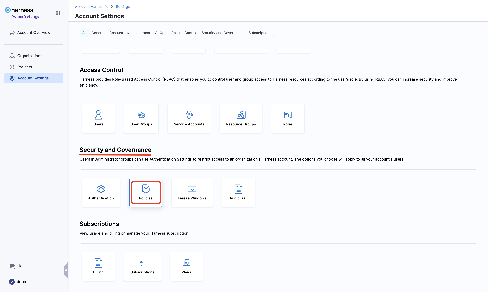

<DocsTag  backgroundColor= "#cbe2f9" text="Tutorial"  textColor="#0b5cad"  />

## Introduction

Harness provides governance using [Open Policy Agent (OPA)](https://www.openpolicyagent.org/), Policy Management, and Rego policies.

In this tutorial we will look into how you can create the policy and apply it to all Services in your Account. The policy is evaluated on Service-level based on the score fetched from scorecards and the conditions set by users, and applues on pipeline-event like On Save which occurs during Connector Creation and Updates. Go to [Harness Governance Quickstart](https://developer.harness.io/docs/platform/governance/policy-as-code/harness-governance-quickstart).

## Get Statred

1. Go to **Account Setting** under **Administrative Settings**.

2. Select **Policies** under **Security and Governance**.

3. Now go to the **Policies** tab and select **+New Policy**.

4. Add a name to your policy and then select **Apply**.

5. Now from the Library select **IDP Scorecard** and select **Use this Sample**. Presently we have two Policies available for IDP, read more about it in the [detailed docs](/docs/internal-developer-portal/scorecards/opa-implementation). 

6. Now test and save it.

## Create a Policy Set 

7. Now go to **Policy Sets** and create a **+New Policy Set**.
8. Add a Name and Entity it applies to followed by the event it should be evaluated. 

9. Now add the policy you have created above and change the type to **Warn & Continue** and **Apply**.

10. Now finish the step and an Policy Set would be created with Account Level Scope. 

## Conclusion

You have set-up a policy which can be used in your Deployment Pipeline. 

