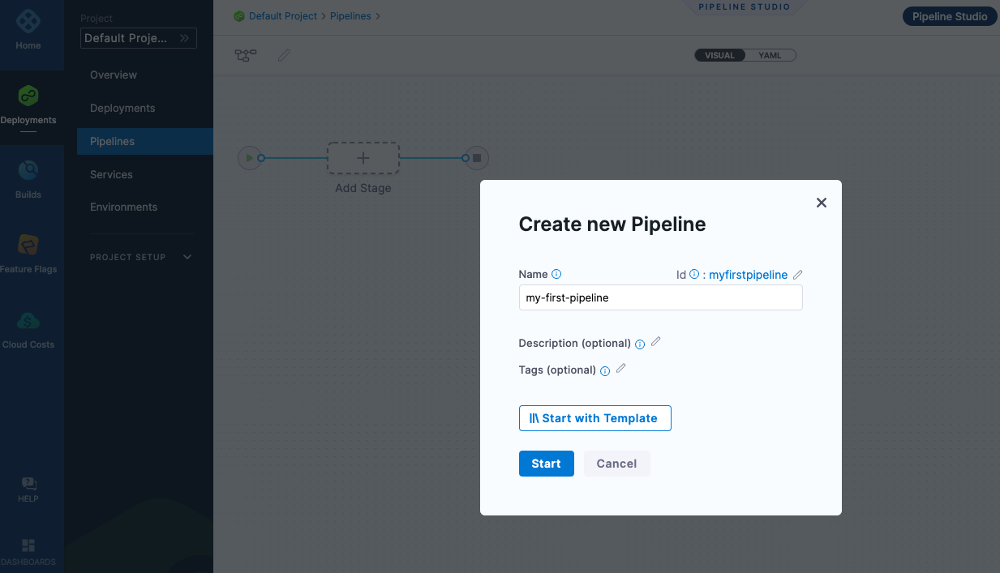
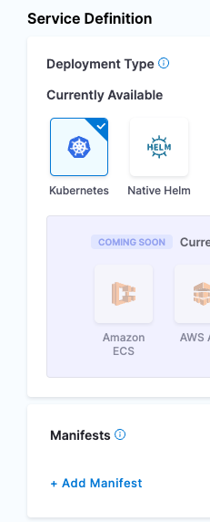
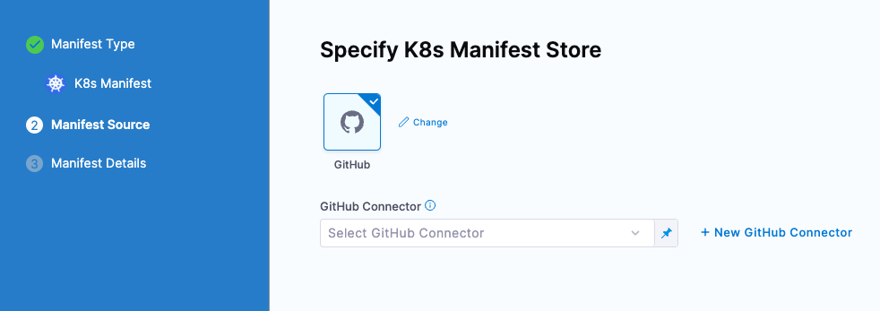
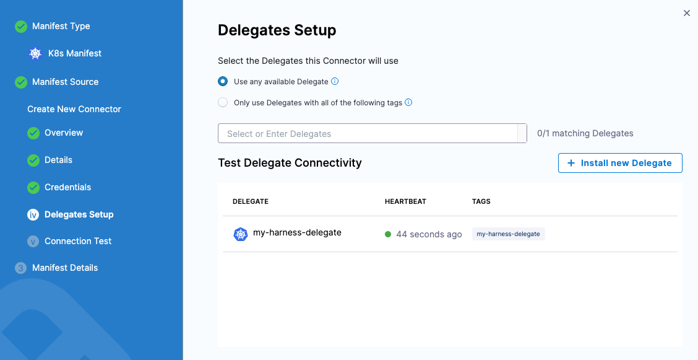
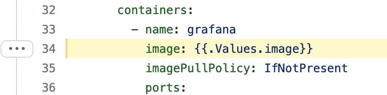
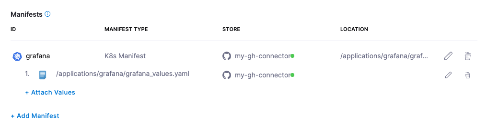

# Continuous Delivery Kubernetes Tutorial

## Background on Continuous Delivery
 
Releases that were once done on a quarterly basis seem asinine now, with the advent of [Agile Development](https://www.agilealliance.org/agile101/), getting incremental features out as fast as possible. Infrastructure and practices need to be in place to allow changes to propagate quickly. If we take a look at the definition of Continuous Delivery from Jez Humble’s book, Continuous Delivery:

*“Continuous Delivery is the ability to get changes of all types—including
new features, configuration changes, bug fixes and experiments—
into production, or into the hands of users, safely and quickly in a
sustainable way.*

Safely means pipelines enforce quality, testing and a mechanism to
deal with failure. Quickly implies pipelines promote code without human
intervention, in an automated fashion, and finally, sustainable means
pipelines can consistently achieve all this with low effort and resources.”

Simply put, good pipelines are fast and repeatable, great pipelines are
fast, safe, and repeatable. With Harness Continuous Delivery [Harness CD], you are on the path to creating great delivery pipelines in no time. This example will show you how to get up and started deploying a Kubernetes based workload with a Harness CD Pipeline. 

## Building Blocks to Continuous Delivery

Automating your deployments does require a few pieces. You do need something that can be deployed and infrastructure for your deployment to head to. This can be in the form of a binary distribution e.g an image and a Kubernetes cluster. Typically with modern applications, the deployment manifests will be stored in source control, [GitHub](https://github.com/) being a common SCM [source code management] solution. 

For this example, we will deploy [Grafana](https://grafana.com/oss/grafana/), an open source analytics tool, to a Kubernetes cluster with Harness CD. The needed Grafana Manifests will be stored on GitHub and you can deploy to a Kubernetes cluster of your choice.  

## Getting Started with Harness CD

Getting started with Harness CD is simple, first if you do not have a Harness Account, you can [sign up for free for Harness CD](https://app.harness.io/auth/#/signup/?module=cd).  

Once signed up, navigate to the Deployments icon on the left hand navigation and create your start your free forever CD Free Plan. 

Once you have clicked on “Start CD Free Plan”, a default [Harness Project](https://docs.harness.io/article/7fibxie636-projects-and-organizations) will be created for you automatically. Projects are logical groupings of resources. The generated default project is perfect for the first time deployment. 

When navigating back to Deployments, can set the project context to the Default Project by clicking on the blue chevrons >> and selecting Default Project. 

With the Default Project selected, clicking on Overview will bring up a wizard to create your first Pipeline/Deployment.

There are a few Harness entities that will need to be created in Harness. The needed objects are wirings to Docker Hub for public image access and GitHub for the Granfa manifest. These objects can be set up during the Pipeline creation or set up ahead of time so they can be reused in multiple Pipelines.  Your onramp and workhorse in the Harness Platform is the Harness Delegate which can run in several places. For this example, using the Harness Kubernetes Delegate is the easiest. 

## Harness Delegate
**ToDo**: Progresive Reveal to Delegate Page.

## Your First CD Pipeline with Harness - What To Deploy
With the Delegate install out of the way, you are now ready to create your first Pipeline. You will be deploying a Docker Image with a Kubernetes Manifest coming from Docker Hub and GitHub respectively. The following steps will walk you through how to create a Pipeline with those resources. 

* Deployments -> Pipelines + Create new Pipeline
* Name: my-first-pipeline

Click Start and add a Pipeline Stage by clicking the +Add Stage icon. 

Select Deploy as the Stage. 
Next, name the stage “Deploy Grafana” as a type Service. 

Then click Set Up Stage. 

The first step is to define the Service by clicking on + New Service

Can name the Service “my-grafana-instance”. 

Once Saved, the next step is to point to a Grafana Kubernetes Manifest. 
In the Service Definition section, select Kubernetes as the Deployment Type. Then you can add a Manifest from GitHub. 

By selecting +Add Manifest, in the Manifest Wizard, select K8s Manifest. 

Click continue and select GitHub as the Manifest Source/Store. 

Now you are ready to create a GitHub Connector. GitHub does require Personal Access Tokens [PATs] to access git operations. See below if you do not have one setup. 

### Wiring GitHub into Harness [Progressive]
Harness will also need access to where to grab the Kubernetes manifests from GitHub and pull an image down from Docker Hub. 

#### GitHub Wiring
GitHub as of 2021 [requires token authentication](https://github.blog/2020-12-15-token-authentication-requirements-for-git-operations/) e.g. no more passwords for git operations. Will need to create a GitHub Personal Access Token that can read in a public repository. 

If you have not created a Personal Access Token before.

* GitHub -> Settings -> Developer Settings -> Personal Access Tokens
* Name: *harnesscd*
* Scopes: repo -> public_repo
* Expiration: 30 days

Make sure to copy down the token that is generated.

**End Progressive**

In the GitHub Connector Wizard, there are a few steps to wire in your GitHub credentials. For the example authenticate against the repo which is housing the manifest. 

Manifest Name: my-gh-connector

Click Next. Now can set up authentication against the repository. 

* URL Type: Repository
* Connection Type: HTTP
* [TODO: Migrate to Harness Pubic]GitHub URL:  https://github.com/ravilach/harness-deployments

Click Next and provide your GitHub Username and Personal Access Token which can be stored securely in the Harness Secrets Manager. 

Click on the Personal Access Token to configure your PAT. 

* Secrets Manager: *Harness Built-in Secret Manager*
* Secret Name: *github_pat*

Once you hit Save then Continue, select a Harness Delegate to run the operation on. If you have more than one Harness Delegate, can narrow the scope down or for the example, can “Use any available delegate” since this is the only one. 

Click Save and Continue to validate the GitHub Connection. 

Next, you will need to wire in the Manifest Details which are being pulled from [https://github.com/ravilach/harness-deployments/tree/main/applications/grafana](https://github.com/ravilach/harness-deployments/tree/main/applications/grafana). 

Looking at the GitHub structure there are two files to leverage, the deployment manifest and a *values.yaml*:

Can wire those two manifests into Harness. 

* Manifest Name: grafana
* Branch: main
* File/Folder Path: /applications/grafana/grafana.yaml 
* Values.yaml: /applications/grafana/grafana_values.yaml

#### [Progressive]
Harness has the ability to read in input variables in your pipeline. In a deployment manifest, can wire in variables to be picked up by Harness. Later when executing the Pipeline, Harness can prompt you for which tag of the image to deploy with `{{.Values.image}}`.

#### [End Progressive]

Click Submit, and now your Grafana Manifests will be wired to the Pipeline. 

### Binary Artifact Registry Wiring

To select which version of Grafana to deploy, you can add an Artifact to the Pipeline for Deployment. 

Clicking + Add Primary Artifact, select Docker Registry as the Artifact Repository Type. 

Click Continue, the next step is to let Harness know how to connect to the Docker Registry. To head to Docker Hub, can create a new Docker Registry Connector. 

+New Docker Registry Connector

Can provide a name for the new Docker Connector.

* Name: `docker_hub_public`

Next can provide authentication as needed. Certain Docker Hub Registries limit unauthenticated pulls. If you do have Docker Hub credentials, can enter them here. If not, can use Anonymous. Though there might be a chance the public image has reached it’s public unauthenticated pull limit. 

* Docker Registry: https://registry.hub.docker.com/v2/
* Authentication: Anonymous

Click Next and select the Delegate to run the image pull. Can use any available Delegate. 

Click Save and Continue to test the connection. 
Clicking Continue will allow you to enter the artifact location e.g Artifact Details. The image that we will pull is located at [https://hub.docker.com/r/grafana/grafana](https://hub.docker.com/r/grafana/grafana) and has a Docker Pull command of `docker pull grafana/grafana`. 

* Image Path: grafana/grafana

Clicking Submit will wire the Artifact into the Harness Pipeline. 

Click Continue, and now you are ready to wire in where and how you want to deploy. 

## Where Your Pipeline Deploys To
The next step is to define the infrastructure or where your Pipeline will deploy to. The first step is to define the “where” as a [Harness Environment](https://docs.harness.io/article/n39w05njjv-environment-configuration). 

A Harness Environment is your deployment target. You can create a new Harness Environment via the wizard by clicking on + New Environment. 

* Name: my-k8s-environment
* Environment Type: Pre-Production

Click Save and now you are ready to wire in your Kubernetes cluster. Since your Delegate should be running in a Kubernetes cluster, you can create a reference to this cluster with a Cluster Connector. 

Select “Direct Connection” Kubernetes then can fill out the Cluster Details with a New Connector. 

Click on Select Connector and then + New Connector 

Once clicked on + New Connector, can give a name to your Kubernetes cluster. 

* Name: my-k8s-cluster

Click Continue and select “Use the credentials of a specific Harness Delegate” to connect. 

Click Continue and select the Harness Delegate you installed into your Kubernetes Cluster e.g *my-harness-delegate*.

 

Click Save and Continue and a connectivity test will occur. 

Click Finish and you can enter a namespace that is available on the Kubernetes cluster. 

* Namespace: default

Click Continue and now you are ready to configure how you want your deployment to execute. 

## How Your Pipeline Deploys
Clicking Continue, you are now ready to configure the Execution Strategy or the “how” your Pipeline executes. Harness can guide you through several deployment strategies such as a [Rolling Deployment](https://kubernetes.io/docs/tutorials/kubernetes-basics/update/update-intro/) or a [Canary Deployment](https://www.infoworld.com/article/3644449/how-canary-releases-enable-continuous-deployment.html). For the example, a Rolling Deployment is simplest. 

Select “Rolling Kubernetes” then click on Use Strategy. Now you are ready to save this Pipeline and execute the Pipeline to create a deployment. 

Click Save and now you are ready to deploy. 

## Running Your First Harness Pipeline
After the setup steps, you are on your way to a repeatable deployment process. Click run in the Pipeline Window.

Here you can select the Artifact Tag that you want to deploy. At the time of this tutorial, Grafana 9.x is out can search for “9.”.

Select a version of the Artifact you want to run e.g “9.1.1” and click Run Pipeline.

After a few moments, your Grafana Deployment is complete! 

Head back to your terminal and run a kubectl command to get the address [External IP] of what you just deployed. If you are using minikube, to expose a Kubernetes Service, you might have to run `minikube tunnel`.

`kubectl get services -A`

Head to the External-IP over port 3000 to see Grafana.
E.g `http://34.132.72.143:3000/login`
By default, the Grafana user and password is admin/admin. 

Congratulations on your first Continuous Delivery Pipeline! The objects that you created can be reused in future pipelines. You are well on your path to Continuous Delivery excellence. 

