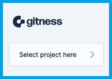

import Tabs from '@theme/Tabs';
import TabItem from '@theme/TabItem';

# Project Management

Harness Open Source projects contain your repositories and pipelines. They represent organizational divisions, such as products or teams, and you're provided with granular user access controls at the project level.

## Create a project

1. If this is your first project, select **New Project** from the home page.

   Otherwise, from the home page, select **Select project**, and then select **New Project**.

2. Enter a project **Name** and optional **Description**.
3. Select **Create Project**.

## Import a project

Harness Open Source supports importing projects from external sources such as GitLab groups and GitHub organizations.

1. If this is your first project, expand the dropdown next to **New Project** from the home page, then select **Import Project**.

   If you are adding a project, select **Select project** from the home page, expand the dropdown next to **New Project**, then select **Import Project**.

2. Select your **Git Provider** and optionally enter the **Host URL** if required.
3. Provide your authorization credentials to access your group or organization.

   For **Password/Token**, provide a token with permission to access the group or organization.

   <Tabs>
   <TabItem value="Bitbucket Server" label="Bitbucket Server">
     To import a Bitbucket Server project, your token must have project and repository "Read" permissions.
       
     For more information, refer to Bitbucket Server's <a href="https://confluence.atlassian.com/bitbucketserver072/personal-access-tokens-1005335924.html">Personal access tokens</a> documentation.
   </TabItem>

   <TabItem value="GitHub" label="GitHub">
     To import a GitHub organization, your token must have <tt>repo</tt> and <tt>read:org</tt> permissions.
       
     For more information, refer to GitHub's <a href="https://docs.github.com/en/authentication/keeping-your-account-and-data-secure/managing-your-personal-access-tokens#personal-access-tokens-classic">Creating classic personal access tokens</a> and <a href="https://docs.github.com/en/apps/oauth-apps/building-oauth-apps/scopes-for-oauth-apps#available-scopes">Available scopes</a> documentation.
   </TabItem>

   <TabItem value="GitLab" label="GitLab">
     To import a GitLab group, your token must have <tt>read_api</tt> and <tt>read_repository</tt> scopes.
       
     For more information, refer to GitLab's <a href="https://docs.gitlab.com/ee/user/profile/personal_access_tokens.html#create-a-personal-access-token">Create a personal access token</a> and <a href="https://docs.gitlab.com/ee/user/profile/personal_access_tokens.html#personal-access-token-scopes">Personal access token scopes</a> documentation.
   </TabItem>
   </Tabs>

4. Select **Next step**.
5. Enter the **Name** of the group or organization that you want to import.
6. For **What to import**, you can select **Pipelines** if you want Harness Open Source to import pipelines from your repositories.
7. Enter the **Project name** that you want the group or organization to have. The **Description** is optional.
8. Select **Import Project**.

## Edit or delete a project

You can delete projects and edit project names and descriptions from the **Settings** page in your project.

:::warning

Deleting a project **permanently** removes the project and all contents, **including repositories**.

**This can't be undone.**

:::

## Switch projects

To switch projects, you can either select a project from the project drawer on the navigation menu, or go to the home page and select **Select project**.

## Project members

Administrators and project owners can manage [users](./user-management.md) who are members of the project and their [roles](#project-roles).

1. In your project, select **Members**, and then select **Add Member**.
2. Select a user from the dropdown.
3. Assign a **Role** to the user.
4. Select **Add member to this Project**.

## Project roles

Each project member is assigned a particular role. The following table summarizes the roles and access levels.

| | Project | Members | Repositories | Webhooks | Pipelines |
| --- | --- | --- | --- | --- | --- |
| __Owner__ | Create, Edit, Delete | Add, Remove  | Create, Edit, Delete | Create, Edit, Delete  | Create, Edit, Execute, Delete  |
| __Contributor__ | View access | View access | Push access | View access | Edit YAML |
| __Executor__ | View access | View access | View status check report  | View access | Execute |
| __Reader__ | View access | View access | Read only | View access | Read only |
