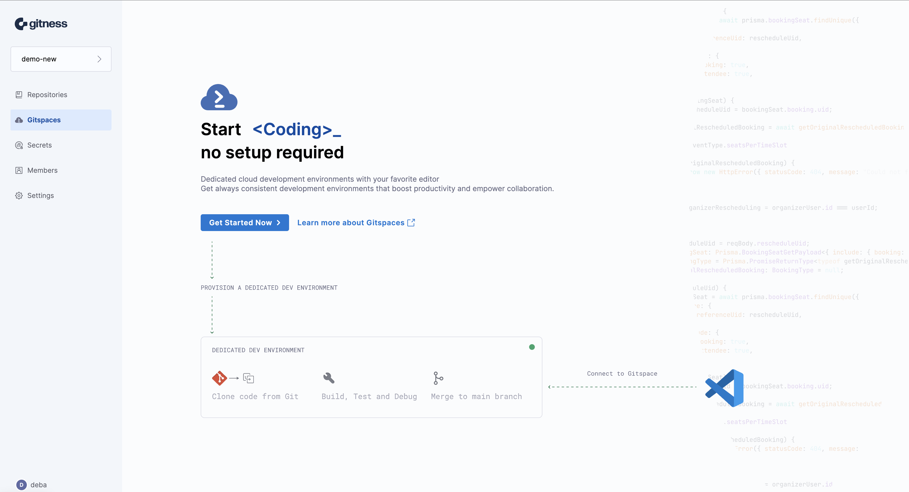
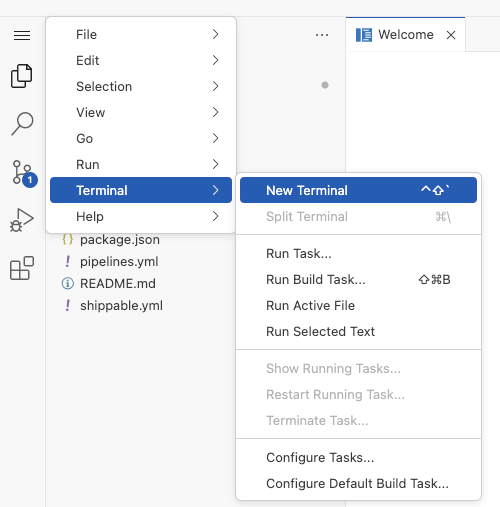
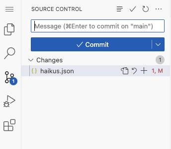

The Quickstart aims to provide users with an introduction to developing using Gitspaces. We will demonstrate all the features of Gitspaces using a Node.js app, helping developers write code, test changes, and publish those changes to their SCM tool.

## Pre-Requisite

### Installation

Gitspace is automatically available when you install Gitness. Installation instructions [here](https://docs.gitness.com/).

## Sample application

Let us go through the flow of creating a Gitspace for our sample application, which is available in our public GitHub repository at [demo node.js app](https://github.com/harness-community/demo-repo-nm). Fork the repository if you want to make changes to it as part of this exercise. 

## Create a Gitspace

1. **Sign up** for or **Login** to Gitness, and create a [new project](https://docs.gitness.com/#create-a-project). You will see Gitspace available in the sidenav. 



2. Click on **Get Started Now**. To create a Gitspace using the sample app: 

   * Choose the **Other Public Git Repositories** tab.

   * Repository URL is https://github.com/harness-community/demo-repo-nm (enter URL of your fork if you forked it). Make sure the URL exactly matches the clone URL for the repository since any extra characters can cause an error. 

   * Leave the default branch **main** selected.

   * Select the IDE and click on **Create Gitspace**. For this Quickstart, choose **VS Code Browser**, which will open up the Gitspace in a new browser tab

3. After clicking on **Create Gitspace**, you’ll be redirected to the **Gitspace Details** page, where you can view the events and logs as the Gitspace is being created. Once it is ready, you can open the Gitspace by clicking the **Open VS Code Online** button at the top right of the page.
3. In the new browser tab, click on **Yes, I trust the authors** and **Mark Done** to get started. You can then start coding in the IDE as you normally would.

## Developing in Gitspace

Now, let’s install dependencies for the sample app and run it. We will also make changes to it and commit back to the fork.

**Run sample app**

1. Open a new terminal.


2. All dependencies, packages, tools and libraries needed for this application were installed while provisioning the Gitspace based on the config in [devcontainer.json](https://github.com/harness-community/demo-repo-nm/blob/main/.devcontainer/devcontainer.json). To run the sample app, run the following command in the terminal:

```bash
npm run dev
```

Your application will be available at proxy host 3000. You will see a message at the bottom right of your IDE with a link to open the app in browser.


The application shows the Harness canary in a variety of fun situations and poses.

**Making changes to sample app**

To make changes to the application, you should  have forked it first and then created a Gitspace for the fork.

 Steps to make changes and commit to source control:

1. You can make some changes to `haiku.json` such as delete one of the canary sections below. Save the file.

```
    {        "text": "traffic in bangalore,\ncondiser fying to work",        
             "image": "canary-flying.png"            
    },
```

2. In the Terminal, configure your GitHub credentials

   - `git config --global user.email "you@example.com" `

   - `git config --global user.name "Your Name"`

- Now that you've made a few changes, you can use the integrated terminal or the source view to commit your work. We will use the **Source Control** view for this example.



- To stage your changes, click `+` next to the `haikus.json` file, or next to **Changes** if you've changed multiple files and you want to stage them all.
- To commit your staged changes, type a commit message describing the change you've made, then click **Commit**.
- Now **Sync Changes**, it will redirect you to login and authorize to your GitHub. After authorization, your changes will be committed to your fork.

**And that’s it! You have successfully used Gitness Gitspace for development**

