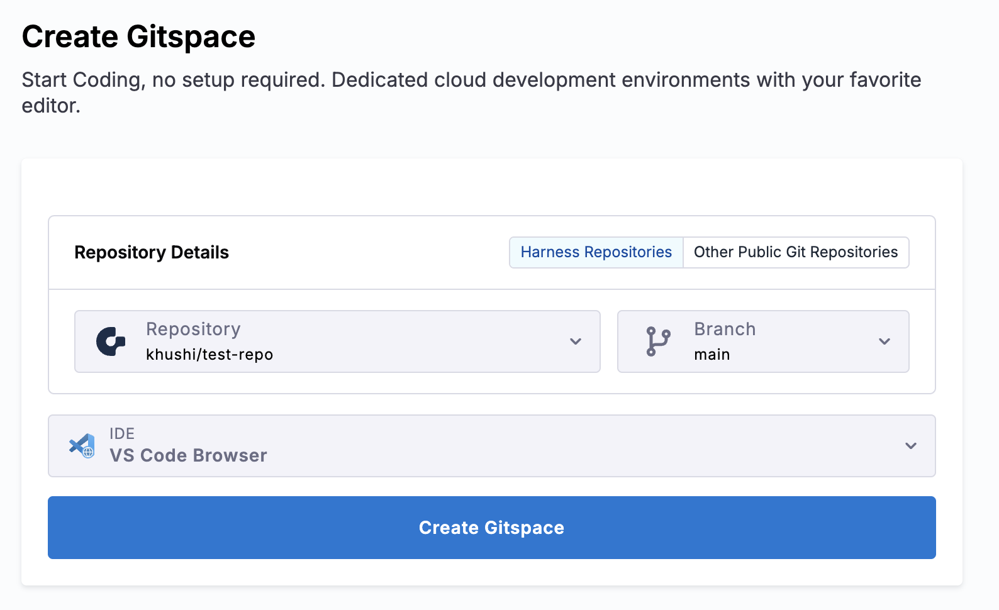
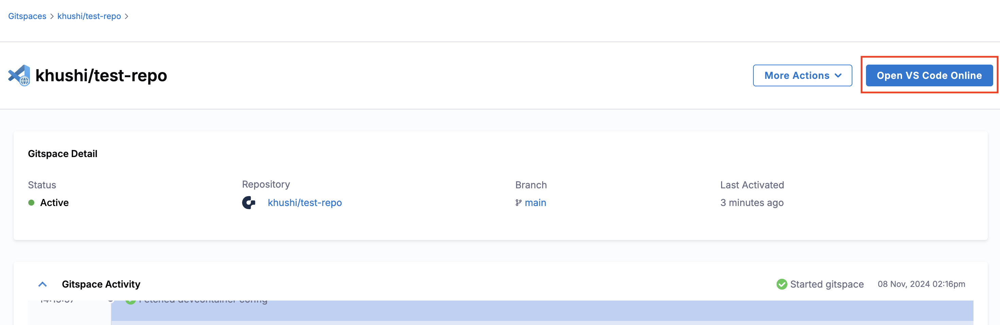

VS Code Browser can directly be started on your browser and doesn't require any pre-configuration.

This guide will take you through the steps required to access your Harness Open Source Gitspace in your VS Code Browser:
1. You can start by creating a new Gitspace from the Harness Open Source UI. (check the quickstart guide for more details) Please ensure that while creating one, you choose “VS Code Browser” as the selected IDE.

    

2. After the Gitspace is created, click “Open VS Code Onliner” from the Harness Open Source UI.

    

3. And, you’re all set. You have successfully established a remote connection with the Gitspace right within your browser.

    

