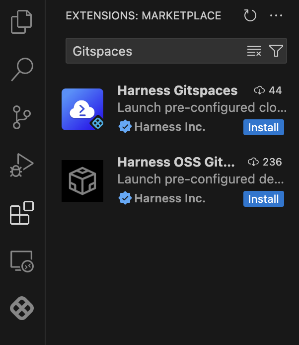
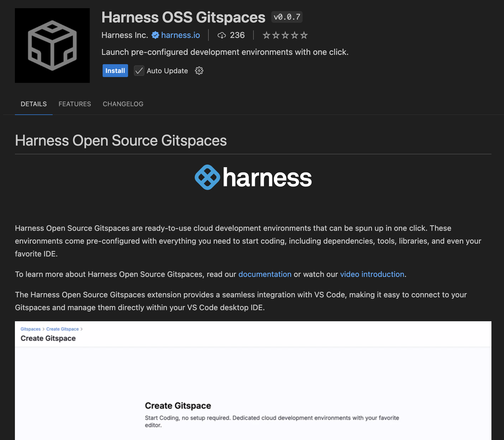
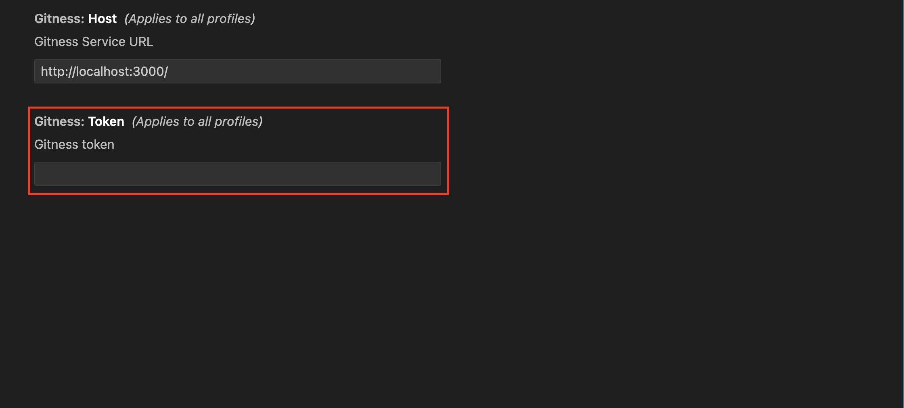
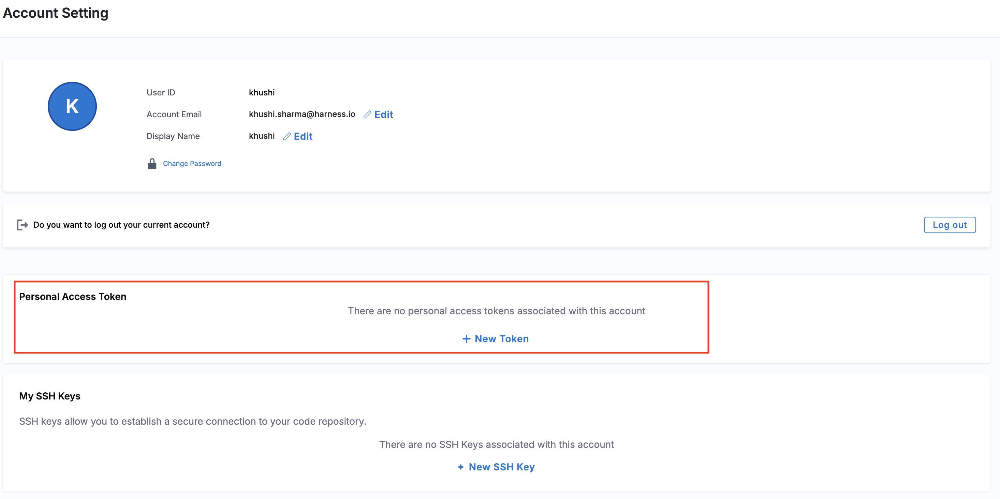
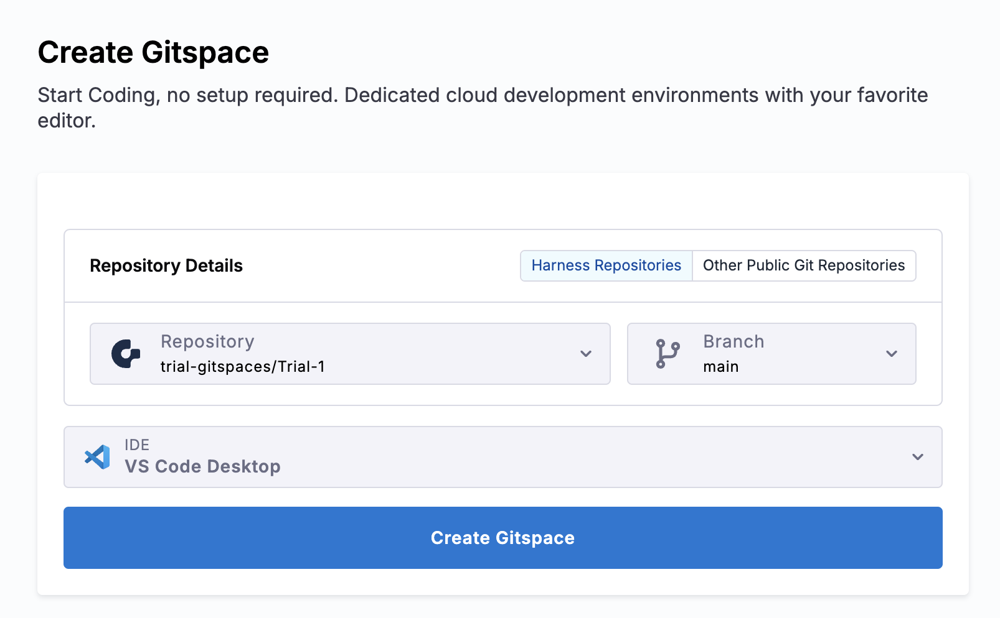
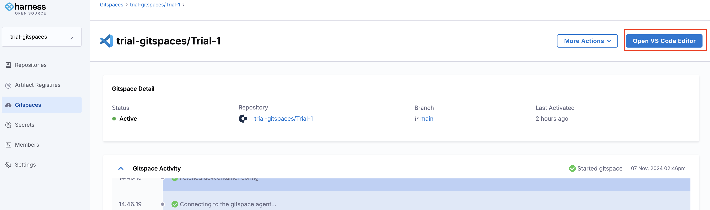
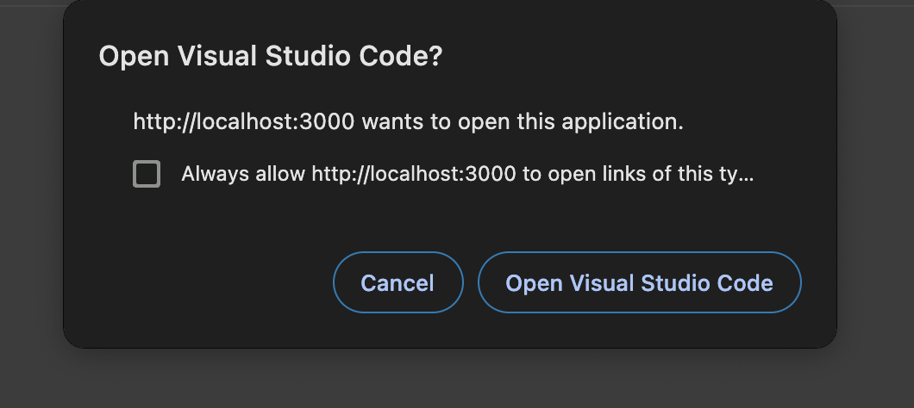
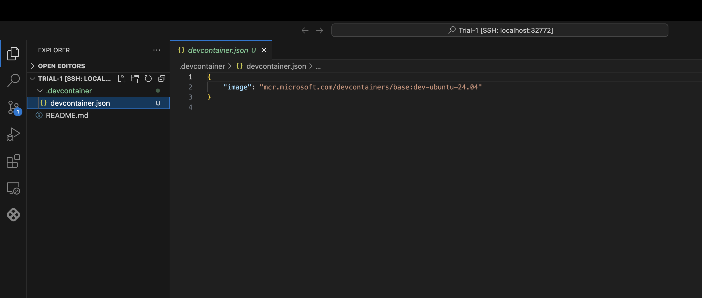

This guide will walk you through the steps to install, setup and start developing in your Gitspaces using this extension. 

### Pre-Requisites
Before starting out, ensure that you have the following:
- VS Code Desktop installed ([Install VS Code Desktop](https://code.visualstudio.com/download))
- Harness Open Source Gitspaces extension installed (Refer to the steps below)
- [Remote - SSH extension](https://marketplace.visualstudio.com/items?itemName=ms-vscode-remote.remote-ssh) must be installed and enabled in VS Code Desktop

### Installing the Harness open source Gitspaces extension
To install the “Harness Open Source Gitspaces” extension, here’s what you need to do:
1. Open VS Code and go to the Extensions marketplace.

2. Search for “Harness Open Source Gitspaces Extension”.

    

3. Once it appears, click “Install”.
    

### Setting up the extension
Here’s what you have to do to setup the extension in your VS Code Desktop:
1. Once you have installed the extension, you will see the “Harness Open Source Gitspaces” logo in your sidebar.

    

2. To set it up, navigate to the extension settings. You need to configure the extension with a “Gitness Token”.

    

    

3. To create a Gitness Token, go to the Harness Open Source UI and open your profile section. 

    

4. From there, create a new Gitness Token by giving it a name and setting its expiration. Once created, copy the token from the provided box. *Please ensure you store this token securely, as you will not be able to view it again.*

    
    

5. Go back to VS Code Desktop and paste the token into the extension's settings tab.

    

6. And that’s it, your extension is now set up.
7. To verify your account, check the Accounts icon in the activity bar; your Gitspace account should now be listed.

    

### Opening a Gitspace
Here’s how you can create and open a Gitspace in your VS Code Desktop via Harness Open Source:
1. Start by creating a Gitspace in your Harness Open Source UI.

    

2. After the Gitspace is created, click "Open VS Code Editor" from the Harness Open Source UI. 

    

3. You’ll be asked for permission to open VS Code Desktop. Click “Open.”

    

4. You’ll be prompted to open the Gitspace inside your VS Code IDE. Click “Open.”

    

5. To establish this remote connection, a temporary password will be generated automatically. After the Gitspace is created, you'll be prompted to copy the temporary password. Paste it and follow the prompts to establish the remote connection.

    

6. Once you have set it up, you’ll be able to access your Gitspace remotely inside your VS Code Desktop.

    

