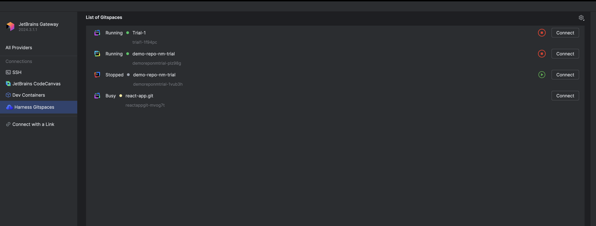
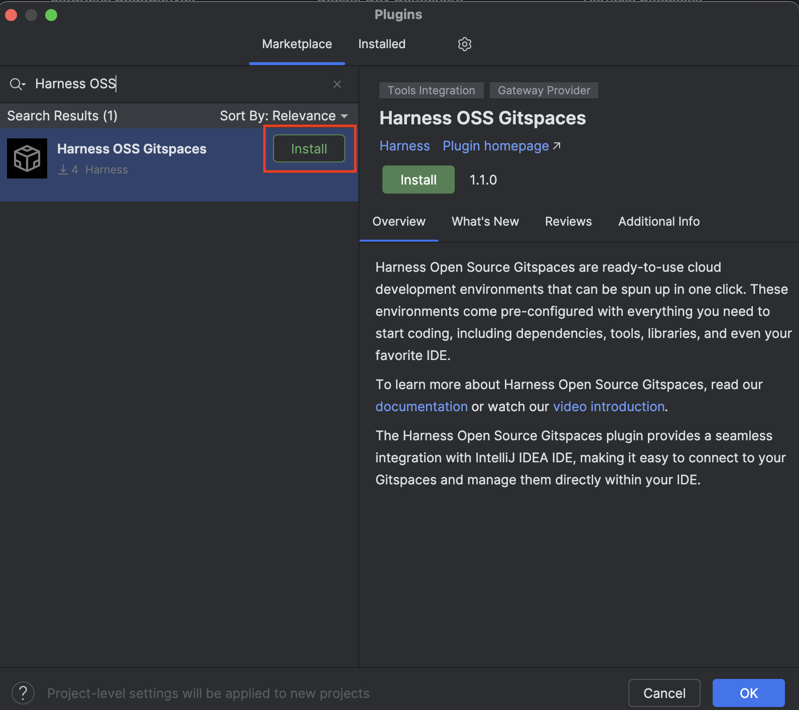
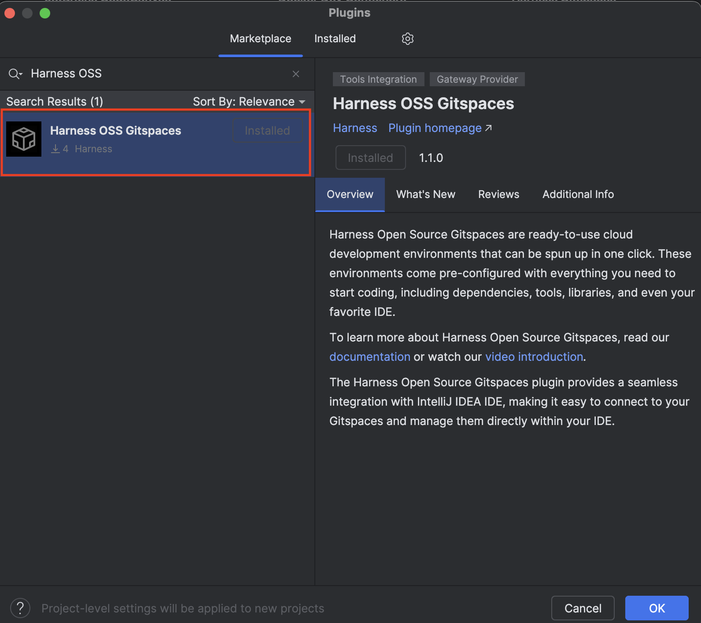
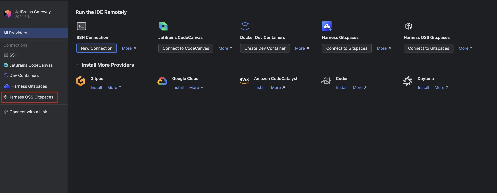
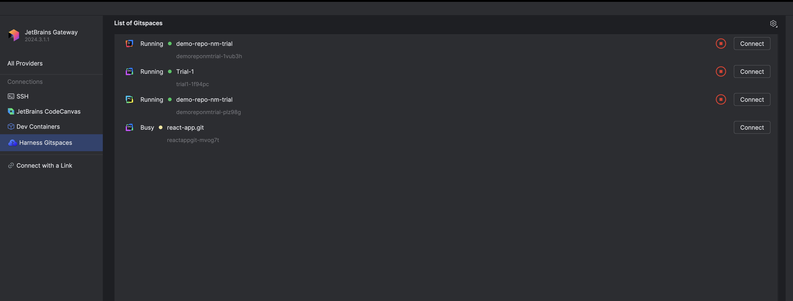
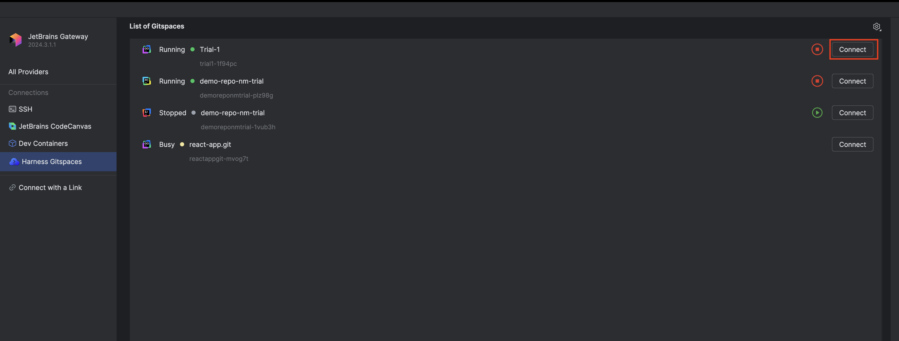
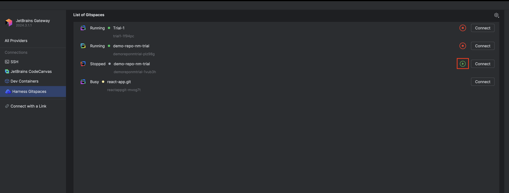
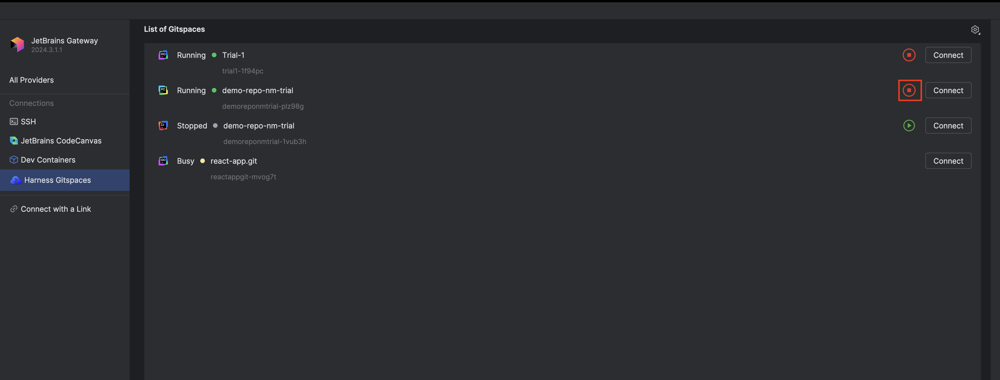

**Harness OSS Gitspaces** supports seamless and efficient remote development in **JetBrains IDEs** using **JetBrains Gateway**. 

[**JetBrains Gateway**](https://www.jetbrains.com/remote-development/gateway/) is a lightweight desktop application that allows you to work remotely with **JetBrains IDEs** without downloading the full IDE. It connects to a remote server, fetches the necessary backend components, and opens your project in a **JetBrains client**.  

With the [**Harness OSS Gitspaces Plugin**](https://plugins.jetbrains.com/plugin/26595-harness-oss-gitspaces), you can seamlessly access and manage your **Gitspaces** created in JetBrains IDEs. This plugin ensures smooth navigation and efficient development within your IDE. 

The following JetBrains IDEs are supported for remote development:
- IntelliJ IDEA
- PyCharm
- PhpStorm
- GoLand
- CLion
- Rider
- RubyMine
- Webstorm

## Pre-Requisites  

#### Install Harness OSS Gitspaces JetBrains Plugin Package 
Ensure that you have downloaded the latest version of the [**Harness OSS Gitspaces JetBrains Gateway Plugin**](https://plugins.jetbrains.com/plugin/26595-harness-oss-gitspaces) package. Follow [these steps](/docs/cloud-development-environments/ides/jetbrains-gateway#installing-the-plugin) to install and configure the plugin.

#### Install JetBrains Gateway  
Before proceeding, ensure that [JetBrains Gateway](https://www.jetbrains.com/remote-development/gateway/) is installed on your device.  

#### Recommended Gitspace Configuration  
Refer to [this section](/docs/cloud-development-environments/ides/intellij#recommended-gitspace-configuration) to understand the **recommended Gitspace requirements** for optimal performance when connecting to your Gitspace in JetBrains IDEs.  

## Installing the Plugin  

Follow these steps to install the **Harness OSS Gitspaces Plugin**:  

1. Once you've installed JetBrains Gateway, click the **settings icon** in the bottom-left corner of the application.  

2. Select **"Manage Providers."**  

3. From the **Plugins Marketplace**, search for **Harness OSS Gitspaces**. Click **Install**. 

4. Once you've installed the plugin, click **"OK"** in the bottom-corner page. 

5. That’s it! You will now see the plugin successfully installed in your **JetBrains Gateway connections.**  

 

## Configuring the Plugin
Now that you've successfully installed the plugin, you can configure it in **JetBrains Gateway** using the following steps:  

1. Click on **"Harness OSS Gitspaces"** from the sidebar connections.  
2. You will be prompted to enter a **Token** in JetBrains Gateway. Go to your Harness Open Source Account Settings and create a token from there.  

3. You will be redirected to the **Harness OSS platform** to sign in. Enter your credentials to log into your account.  

4. That’s it! Once configured, you can view all your **Gitspaces** created in JetBrains IDEs directly within the **JetBrains Gateway** application. 

## Managing Your Gitspaces  

You can access and manage your **Gitspaces** (only those created in JetBrains IDEs) directly within the **JetBrains Gateway** application.  

### Access Your Gitspaces  

You can connect to your **Gitspaces** directly from the **Gateway** application:  

1. **For an actively running Gitspace**, click on **"Connect."** This will connect you to your remote Gitspace within your selected IDE.  
2. **For a stopped Gitspace**, clicking on **"Connect"** will redirect you to the **Harness Gitspaces UI**, where you can check its details.  

:::info  
**Note:** While a Gitspace is transitioning between **started and stopped states**, its status in the application will be displayed as **"Busy."** This indicates that the Gitspace is undergoing the transition.  
:::  

### Start Your Gitspaces  

You can start your **stopped Gitspaces** directly from **JetBrains Gateway**:  
- Click the **Green Start** icon to start your Gitspace.  To open your Gitspace in your preferred IDE, refer to the IDE-specific documentation. For example, here’s how you can connect to your [Gitspace in IntelliJ IDEA](/docs/cloud-development-environments/ides/intellij#open-the-gitspace-in-intellij).

- This icon will be visible **only if your Gitspace is stopped**.  

### Stop Your Gitspaces  

You can stop your **active Gitspaces** directly from **JetBrains Gateway**:  
- Click the **Red Stop** icon to stop it from running.  

- This icon will be visible **only if your Gitspace is currently active**.  

