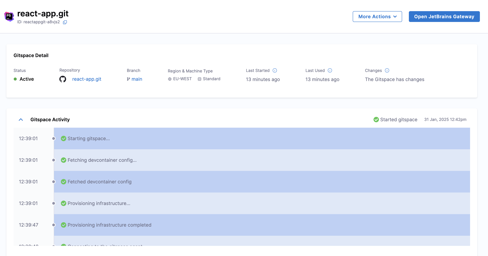
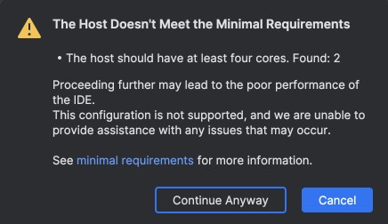
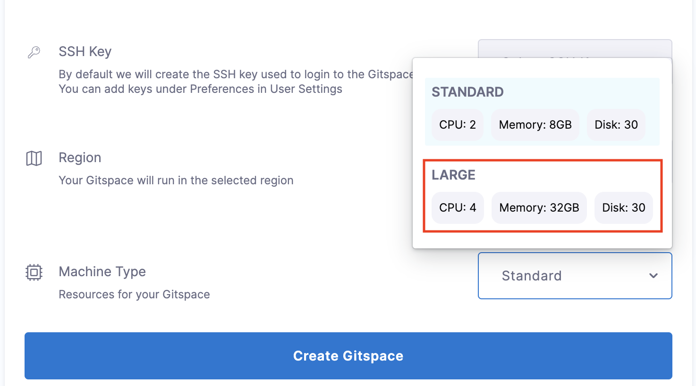
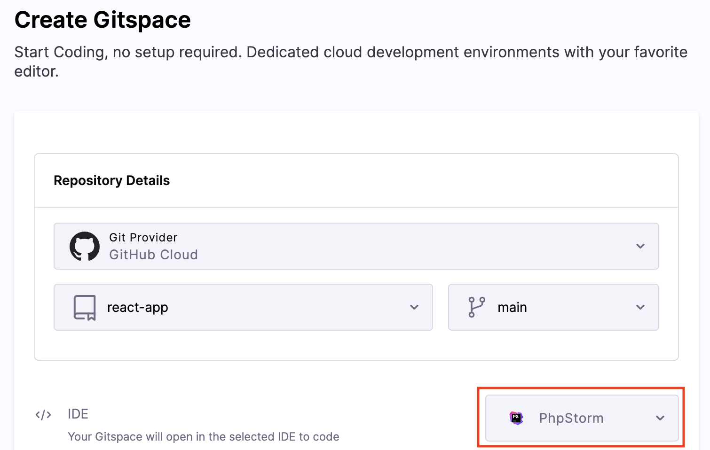
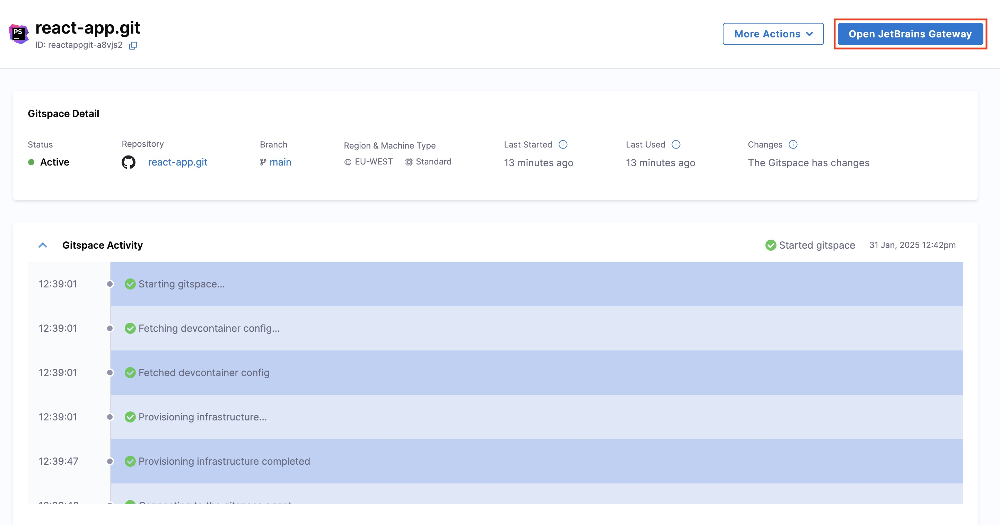
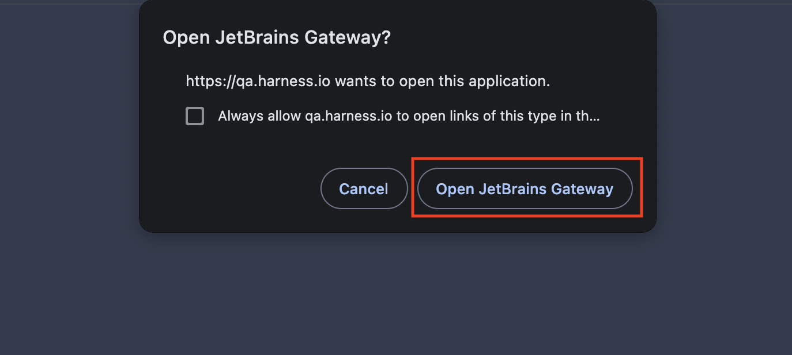
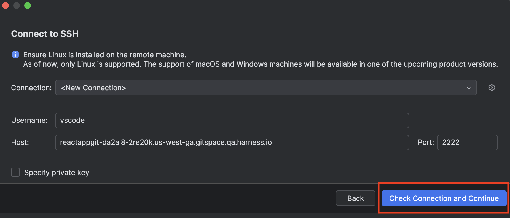

With **PhpStorm IDE** support, Harness CDE enables seamless and efficient remote development in your Gitspaces with your IDE. This integration leverages **[JetBrains Gateway](https://www.jetbrains.com/remote-development/gateway/)** to establish a direct remote connection with PhpStorm IDE, eliminating the need for any prior setup.

This guide provides a step-by-step walkthrough to help you use PhpStorm IDE with your Gitspaces. Let’s get started!

## Pre-Requisites
### Install JetBrains Gateway

Before starting out, ensure that [JetBrains Gateway](https://www.jetbrains.com/remote-development/gateway/) is installed on your device. 

JetBrains Gateway is a lightweight desktop application that enables you to work remotely with JetBrains IDEs (including PhpStorm IDE) without downloading the full IDE. It connects to a remote server, downloads necessary backend components, and opens your project in a JetBrains client.

### Recommended Gitspace Configuration
:::info
The following Gitspace requirements are optional but highly recommended for the best and most efficient experience when using Gitspaces in **PhpStorm**. You can refer to the [JetBrains guide](https://www.jetbrains.com/help/idea/prerequisites.html) here for detailed information on system requirements for remote development.  
:::

#### Recommended Requirements
To ensure optimal performance while connecting to your Gitspace in PhpStorm IDE, your Gitspace should meet the following specifications:
- **Processor**: Minimum of **4 cores** (vCPUs) with either x86_64 or arm64 architecture.
- **Memory**: At least **8 GB** RAM.
- **Storage**: At least **10 GB** of available disk space.

:::warning
If your Gitspace does not meet the recommended requirements, the following warning may appear during your PhpStorm setup. You can choose to create a new Gitspace that adheres to the recommended specifications or proceed with your existing configuration.
:::

#### Configuring your Gitspace
To meet the recommended specifications, select the **"Large"** machine type while configuring your Gitspace in the Harness UI. This option provides:  
- **Processor**: 4 cores (CPUs)  
- **Memory**: 32 GB RAM
- **Storage**: 30 GB Disk Size

## Getting started with PhpStorm IDE
Follow these steps to get started with integrating PhpStorm IDE into your Gitspaces workflow:  
### Create a Gitspace
1. Navigate to the **Harness UI** and [create a new Gitspace](/docs/open-source/gitspaces/get-started/quickstart#creating-a-gitspace) for your project repository.
2. Select **"PhpStorm"** as the IDE during Gitspace creation.

3. Add your SSH key and configure the required Gitspace specifications.

:::info
For optimal performance, it is recommended to use the **"Large"** Gitspace machine type. Refer to the "Recommended Gitspace Configuration" section for detailed requirements.
:::

4. Click **"Create Gitspace"**.

### Open the Gitspace in PhpStorm 
1. Once the Gitspace is created and running, click on the **"Open JetBrains Gateway"** button.

2. A prompt will appear requesting permission to open **JetBrains Gateway** and establish a connection with the remote server. Click **"Open JetBrains Gateway"**.

### Connect to the Remote Server
You will be redirected to **JetBrains Gateway**, where you will be prompted to connect and establish an SSH connection. Click **"Check Connection and Continue"** to begin the setup process. This setup process will download the necessary files and tools required for your PhpStorm environment.

:::warning
In case your Gitspace does not meet the recommended requirements, you may receive the following warning during the above setup. You can either create a new Gitspace to align with the recommended specifications or continue with your current configuration.
:::

### Setup Complete
Once the setup completes, your Gitspace will be successfully connected to PyCharm IDE. Congratulations! You are now ready to work on your Gitspace directly within PhpStorm IDE.

