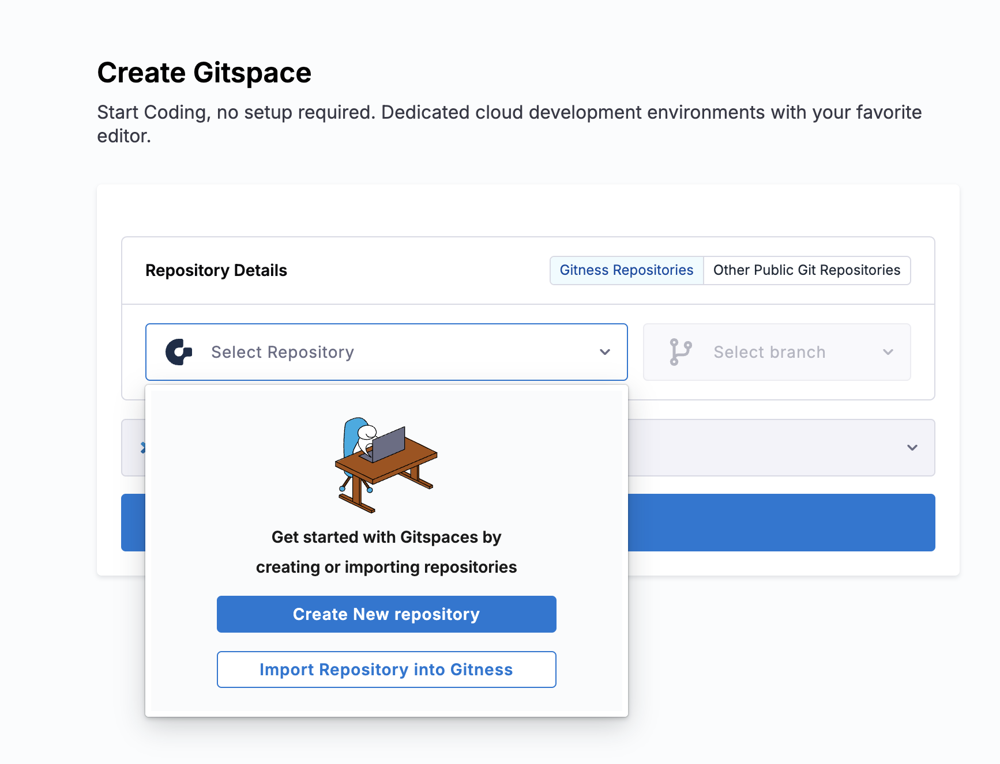
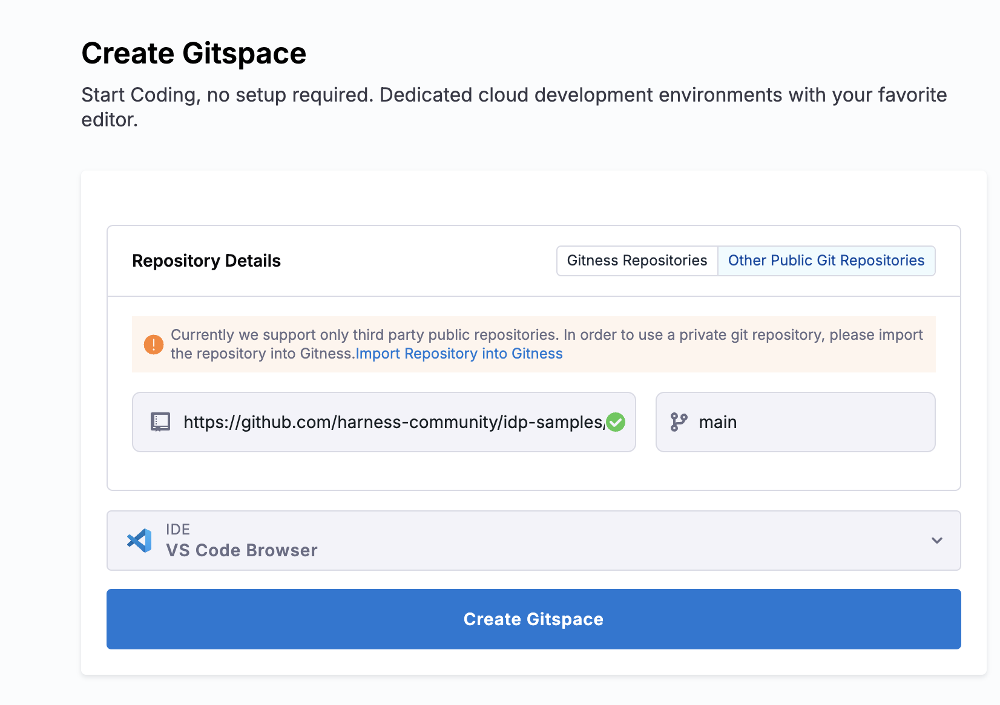
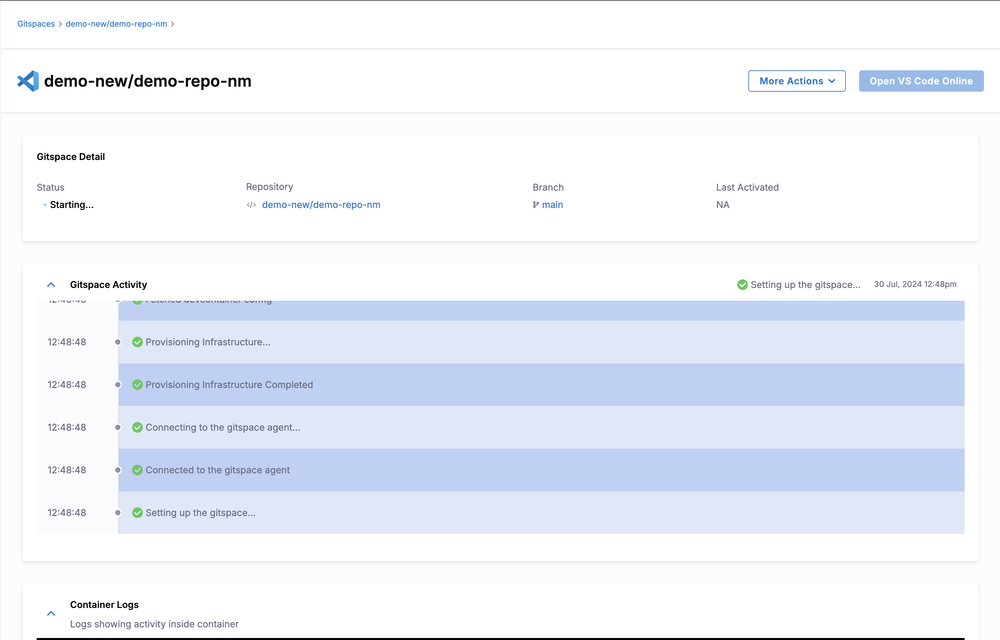
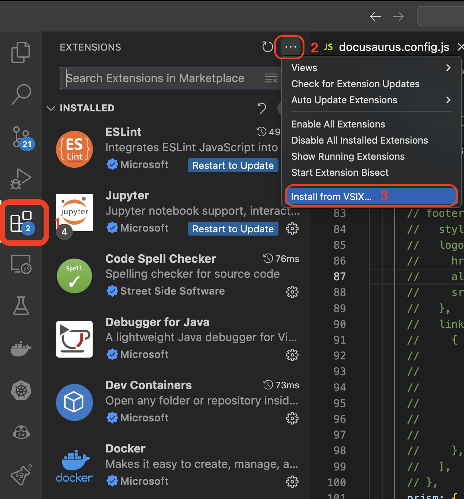
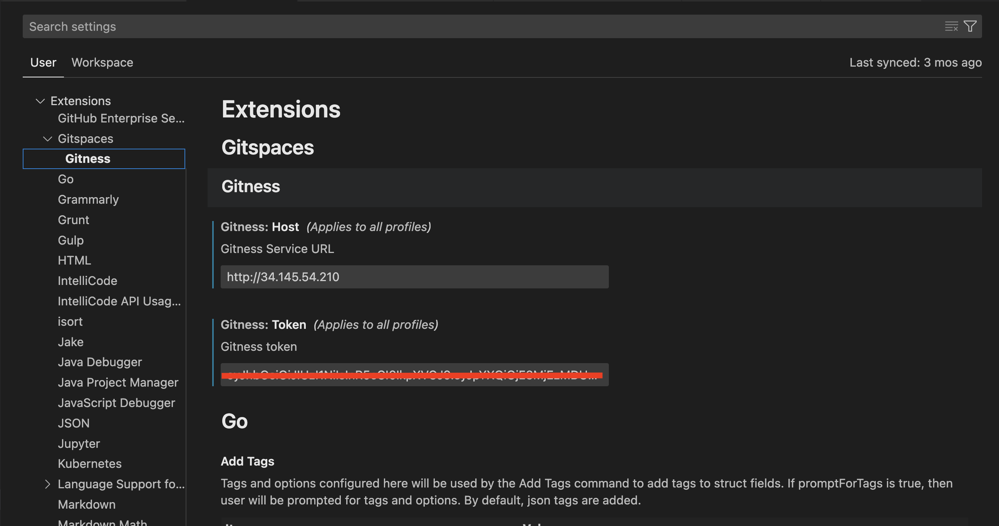
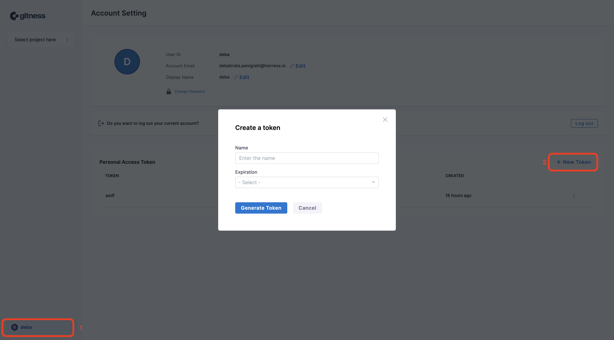

:::info

Make sure you have latest version of gitness installed that includes the Gitspace offering and it's `docker.io/harness/gitness:latest`.

:::

## How to Create a Gitspace

1. **Login** to Gitness, and create a [new project](https://docs.gitness.com/#create-a-project). You will see **Gitspace** available in the sidenav. 

2. Click on **+New Gitspace**. To create a **Gitspace** using the [sample app](https://github.com/harness-community/demo-repo-nm). You have two options to create Gitspace:

import Tabs from '@theme/Tabs';
import TabItem from '@theme/TabItem';

<Tabs queryString="Create Gitspace">
<TabItem value="using-gitness-repositories" label="Using Gitness Repositories">

1. If you don’t have a Gitness Repository, you’ll get an option to [create](https://docs.gitness.com/#create-a-repository) one or [import](https://docs.gitness.com/repositories/overview#import-a-repository) a new repository. 

2. Once the repository is available, you can select the **branch** and the **IDE** type (VSCode Browser and Desktop are supported)

3. Import the repository from third party git provider to Gitness, using the **organization** and the **repository** name. [Read](https://docs.gitness.com/repositories/overview#import-a-repository) for more details

4. Now **Create Gitspace**, by selecting the default **branch** as `main` and **IDE**.

</TabItem>
<TabItem value="other-public-git-repositories" label="Other Public Git Repositories">

1. Repository URL is `https://github.com/harness-community/demo-repo-nm` (enter URL of your fork if you forked it), make sure the URL is the clone URL strictly of the format `https://git-provider.com/organisation/repository` any extra string post this might cause an error.

2. Let the **branch** be default `main`, select the **IDE** and **Create Gitspace**.

</TabItem>
</Tabs>

<Tabs queryString="Select IDE">
<TabItem value="vs-code-online" label="VS Code Browser">

- VS Code Browser can directly be started on your browser and doesn't require any pre-configuration. 
- You can select the IDE type as VS Code Browser and you'll redirected to the IDE on a new tab once the Gitspace is created and you click on **Open VS Code Editor**. 

</TabItem>
<TabItem value="vs-code-desktop" label="VS Code Desktop">

## VS Code Desktop

1. You can install and configure the Gitspace VS Code extension to use it on your VS Code Desktop App.

2. Download the [Vsix file](https://drive.google.com/file/d/1o2qHyXkF7aMnD6kDiJmJWS1EWXl2L7pj/view?usp=sharing) for the Gitspace extension. 

3. Install the extension using vsix under the extensions tab in VS Code Desktop. 

4. The extension will appear on the left nav of your screen, click on continue for Sign-in.  

5. On the configuration page click on the Gitspace dropdown on the leftnav and select Gitness. 

6. Add the Gitness Service URL, which is the host where Gitness is running, for eg:, `http://34.145.58.210`. Make sure you do not have a `/` at the end of the URL. If you have installed Gitness on your local machine, the URL is `http://localhost:<port>`

7. For the Token,  go to your user profile on Gitness and generate one. 

8. Save the configuration.

</TabItem>
</Tabs>

5. It will take few minutes to provision the Gitspace and you could see all the steps and logs involved. 

6. Now you can **Open VS Code Editor**. 